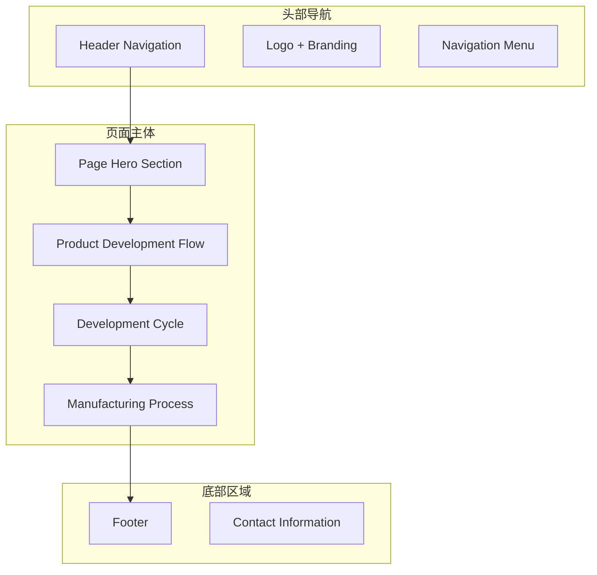
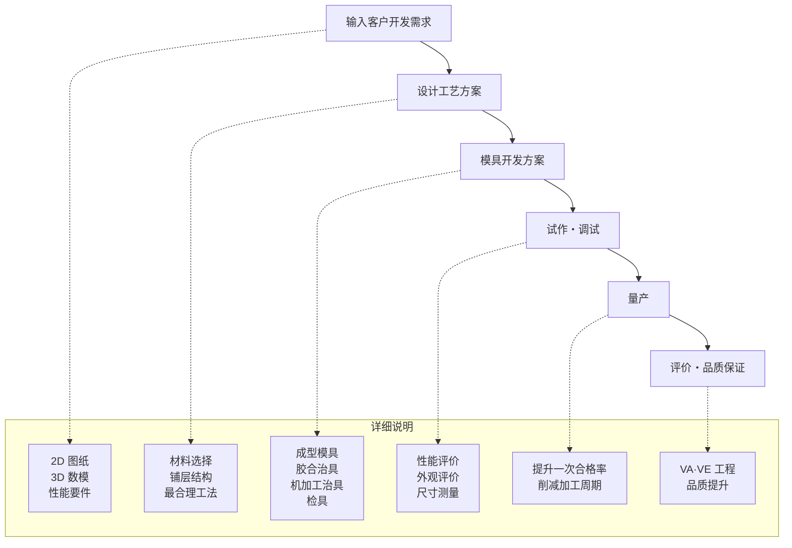
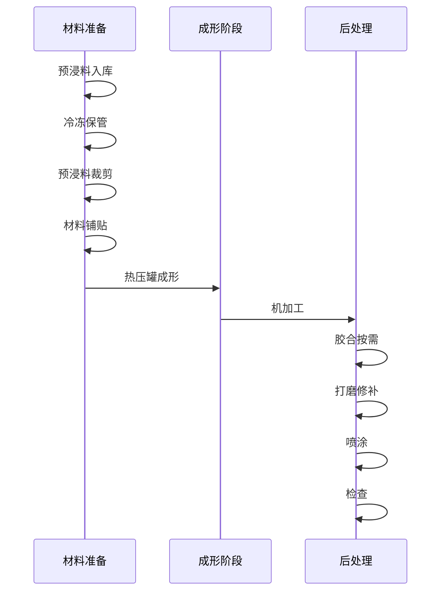
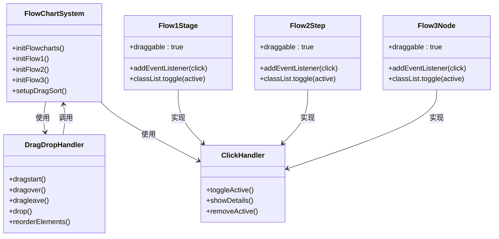
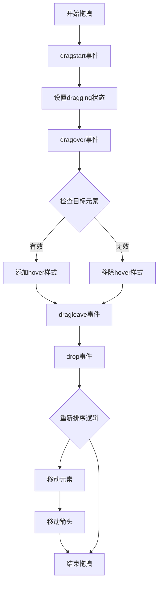
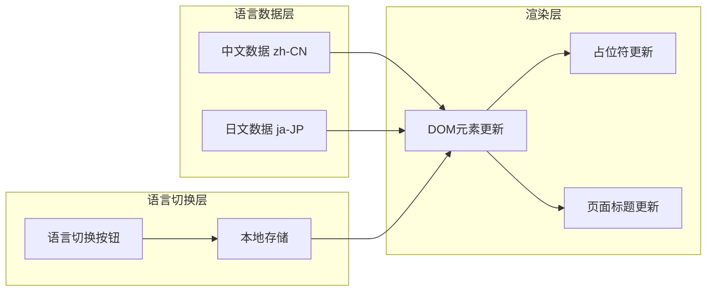
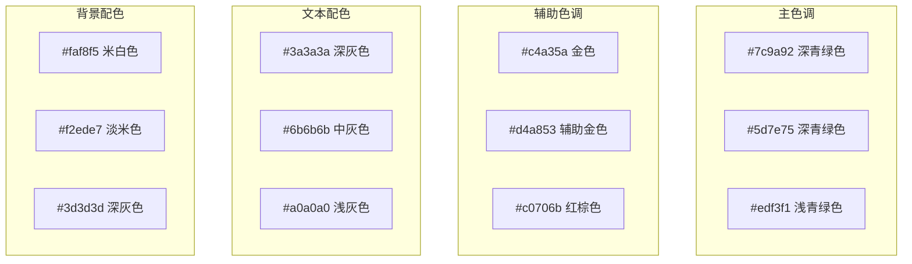
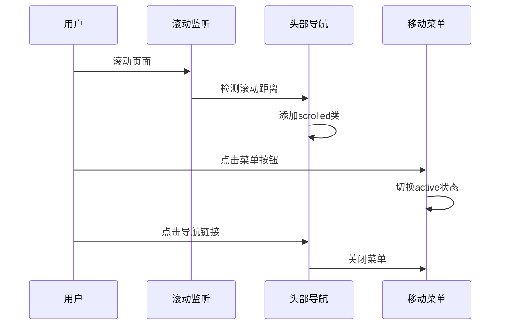
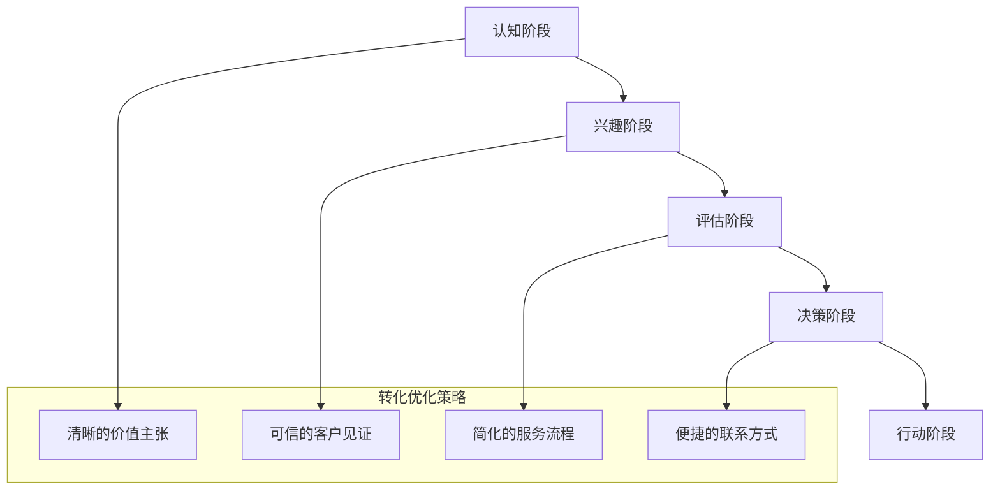

# ODM服务页面

<cite>
**本文档引用的文件**
- [cfrp-odm.html](file://cfrp-odm.html)
- [index.html](file://index.html)
- [css/style.css](file://css/style.css)
- [js/script.js](file://js/script.js)
- [js/lang.js](file://js/lang.js)
</cite>

## 目录
1. [项目概述](#项目概述)
2. [页面架构分析](#页面架构分析)
3. [核心功能组件](#核心功能组件)
4. [交互式流程图系统](#交互式流程图系统)
5. [多语言国际化支持](#多语言国际化支持)
6. [视觉设计系统](#视觉设计系统)
7. [用户体验优化](#用户体验优化)
8. [技术实现要点](#技术实现要点)
9. [最佳实践建议](#最佳实践建议)
10. [总结](#总结)

## 项目概述

ODM服务页面是和野贸易（广州）有限公司官方网站的重要组成部分，专门展示其产品开发ODM（Original Design Manufacturer）服务能力。该页面通过三个核心维度向客户展示公司的专业能力和价值主张：

- **服务流程可视化**：通过交互式流程图展示完整的ODM开发流程
- **技术能力展示**：详细说明复合材料选型、结构设计、工艺优化等核心技术
- **定制化解决方案**：提供从概念到量产的一站式服务模式

## 页面架构分析

### 整体布局结构

页面采用响应式设计，包含以下主要区域：

**图表来源**
- [cfrp-odm.html:10-191](file://cfrp-odm.html#L10-L191)

### 核心内容分区

页面分为三个主要功能区域，每个区域都有独特的交互特性：

1. **产品开发流程**（Flow1）：展示从需求输入到量产的完整流程
2. **产品开发周期**（Flow2）：强调时间管理和效率优化
3. **工艺流程**（Flow3）：详细说明复合材料制造的具体步骤

**章节来源**
- [cfrp-odm.html:29-177](file://cfrp-odm.html#L29-L177)

## 核心功能组件

### 交互式流程图系统

ODM页面的核心创新在于其完全交互式的流程图系统，允许用户拖拽调整流程顺序并查看详细信息。

#### 流程图1：产品开发流程

**图表来源**
- [cfrp-odm.html:40-112](file://cfrp-odm.html#L40-L112)

#### 流程图2：开发周期管理

该流程图特别强调了时间管理和效率优化：

- **工艺设计**：1周
- **模具设计**：1周  
- **模具制作**：2-6周
- **模具调试**：1-2周
- **试生产**：1-2周

**图表来源**
- [cfrp-odm.html:114-132](file://cfrp-odm.html#L114-L132)

#### 流程图3：制造工艺流程

**图表来源**
- [cfrp-odm.html:134-175](file://cfrp-odm.html#L134-L175)

**章节来源**
- [cfrp-odm.html:40-175](file://cfrp-odm.html#L40-L175)

## 交互式流程图系统

### 技术实现架构

**图表来源**
- [js/script.js:213-344](file://js/script.js#L213-L344)

### 拖拽排序算法

系统实现了智能的拖拽排序功能，能够自动处理箭头元素的重新排列：

**图表来源**
- [js/script.js:268-341](file://js/script.js#L268-L341)

**章节来源**
- [js/script.js:213-344](file://js/script.js#L213-L344)

## 多语言国际化支持

### 国际化架构设计

**图表来源**
- [js/lang.js:5-472](file://js/lang.js#L5-L472)

### 支持的语言版本

系统当前支持两种语言版本：

| 功能类别 | 中文 (zh-CN) | 日文 (ja-JP) |
|---------|-------------|-------------|
| 网站标题 | 和野贸易（广州）有限公司 - 基于复合材料的产品轻量化方案提供商 | 和野貿易（広州）有限公司 - 複合材料による製品軽量化ソリューションプロバイダー |
| 导航菜单 | 首页、关于我们、服务、客户及合作伙伴、案例、联系我们 | ホーム、会社概要、サービス、顧客・パートナー、事例、お問い合わせ |
| ODM页面内容 | 产品开发ODM、产品开发流程、产品开发周期、工艺流程 | 製品開発ODM、製品開発フロー、製品開発サイクル、製造工程 |

**章节来源**
- [js/lang.js:8-349](file://js/lang.js#L8-L349)

## 视觉设计系统

### 设计色彩体系

**图表来源**
- [css/style.css:10-30](file://css/style.css#L10-L30)

### 响应式设计策略

页面采用移动端优先的设计理念，确保在不同设备上的最佳体验：

- **桌面端**：最大宽度1200px，三列布局
- **平板端**：自适应网格，两列布局
- **手机端**：单列布局，触摸友好的交互元素

**章节来源**
- [css/style.css:46-50](file://css/style.css#L46-L50)

## 用户体验优化

### 导航增强功能

**图表来源**
- [js/script.js:1-53](file://js/script.js#L1-L53)

### 交互反馈机制

系统提供了多层次的用户交互反馈：

1. **拖拽状态反馈**：拖拽时元素高亮显示
2. **点击状态反馈**：点击激活元素的视觉变化
3. **表单验证反馈**：实时的错误提示和成功通知
4. **加载状态反馈**：异步操作的进度指示

**章节来源**
- [js/script.js:177-195](file://js/script.js#L177-L195)

## 技术实现要点

### 性能优化策略

1. **懒加载机制**：使用Intersection Observer API实现元素的延迟加载
2. **事件委托**：统一处理多个元素的事件绑定
3. **CSS变量缓存**：避免重复计算CSS变量值
4. **内存管理**：及时清理事件监听器和观察器

### 可访问性考虑

- **语义化HTML**：使用正确的HTML标签结构
- **键盘导航**：支持Tab键导航和键盘操作
- **屏幕阅读器支持**：提供适当的ARIA属性
- **颜色对比度**：确保足够的颜色对比度

**章节来源**
- [js/script.js:82-115](file://js/script.js#L82-L115)

## 最佳实践建议

### 内容策略优化

1. **价值主张明确化**：在页面首屏突出展示ODM服务的核心价值
2. **客户案例丰富化**：增加更多具体的成功案例和数据支撑
3. **技术细节深度化**：为技术人员提供更深入的技术规格说明
4. **定制化程度提升**：展示更多可定制的选项和服务组合

### 转化漏斗优化

### 客户沟通策略

1. **主动式沟通**：在关键节点提供引导性信息
2. **个性化服务**：根据客户需求提供定制化解决方案
3. **透明化报价**：提供清晰的成本估算和时间规划
4. **持续跟进**：建立完善的客户关系管理体系

## 总结

ODM服务页面展现了现代企业网站设计的最佳实践，通过以下关键要素实现了优秀的用户体验和商业价值：

### 核心优势

1. **高度交互性**：通过拖拽排序和点击查看详情的交互方式，让用户深度参与流程学习
2. **技术可视化**：将复杂的制造流程转化为直观的图形界面，降低理解门槛
3. **多语言支持**：完善的国际化功能，支持国内外市场的业务拓展
4. **响应式设计**：适配各种设备和屏幕尺寸，确保一致的用户体验

### 技术亮点

1. **智能拖拽系统**：实现了复杂元素的拖拽排序，包括箭头元素的同步移动
2. **性能优化**：使用现代Web技术实现流畅的用户体验
3. **可维护性**：模块化的代码结构便于后续功能扩展和维护
4. **可访问性**：遵循Web标准，确保良好的可访问性

### 改进建议

1. **数据分析集成**：添加用户行为追踪，优化页面转化率
2. **社交媒体整合**：增加社交分享功能，扩大传播效果
3. **移动端优化**：进一步优化移动端的触摸交互体验
4. **SEO优化**：完善搜索引擎优化策略，提高搜索排名

这个ODM服务页面不仅展示了和野贸易的专业能力，更为整个网站的用户体验树立了标杆，体现了现代企业数字化转型的成功实践。