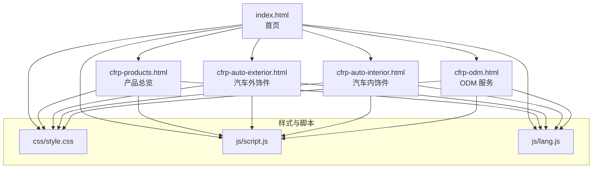
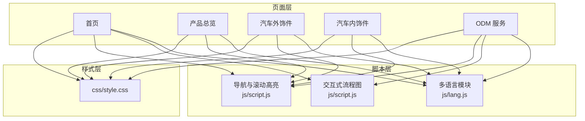
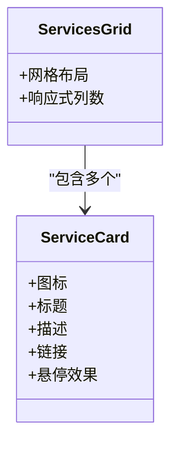
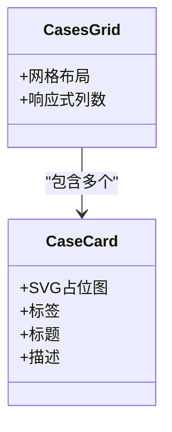
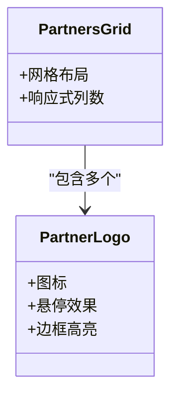
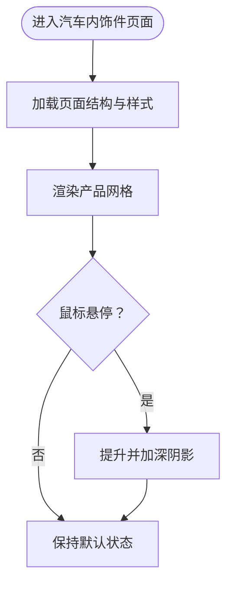
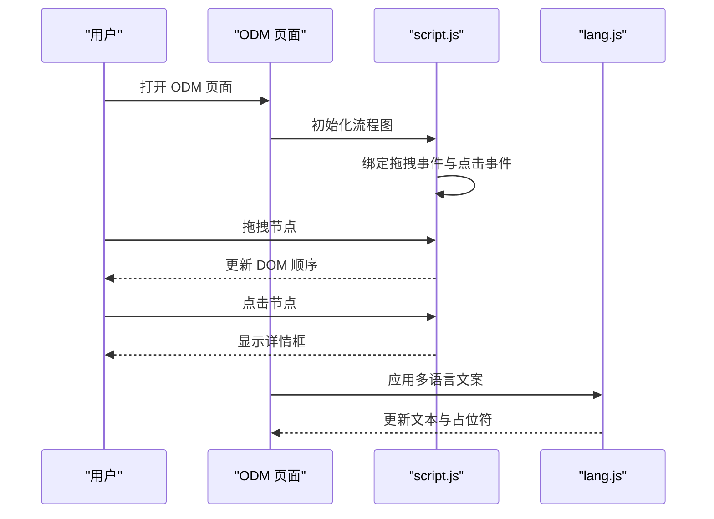
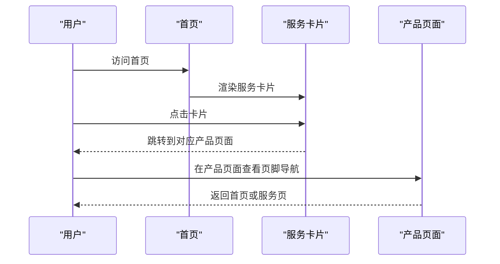
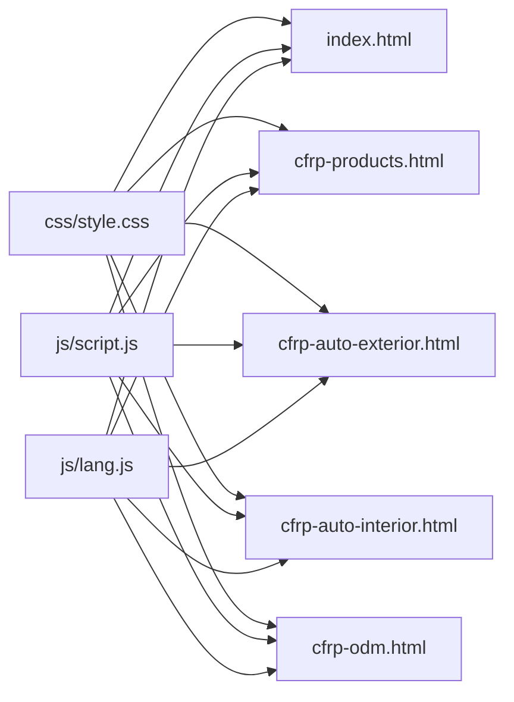

# 产品页面

<cite>
**本文引用的文件**
- [index.html](file://index.html)
- [cfrp-products.html](file://cfrp-products.html)
- [cfrp-auto-exterior.html](file://cfrp-auto-exterior.html)
- [cfrp-auto-interior.html](file://cfrp-auto-interior.html)
- [cfrp-odm.html](file://cfrp-odm.html)
- [css/style.css](file://css/style.css)
- [js/script.js](file://js/script.js)
- [js/lang.js](file://js/lang.js)
</cite>

## 目录
1. [简介](#简介)
2. [项目结构](#项目结构)
3. [核心组件](#核心组件)
4. [架构总览](#架构总览)
5. [详细组件分析](#详细组件分析)
6. [依赖关系分析](#依赖关系分析)
7. [性能考量](#性能考量)
8. [故障排查指南](#故障排查指南)
9. [结论](#结论)
10. [附录](#附录)

## 简介
本文件为 HYT 网站产品页面系统的设计与实现文档，聚焦于汽车外饰件、内饰件与 ODM 服务三大产品页面的差异化设计与实现要点，系统阐述服务卡片设计模式、案例展示技术、合作伙伴展示系统，以及页面间的导航关系与内容组织策略。同时提供扩展指南与内容管理最佳实践，帮助开发者与内容运营团队高效维护与迭代产品页面。

## 项目结构
该站点采用静态页面结构，包含首页与三条产品页面：
- 首页：包含导航、横幅、服务卡片、合作伙伴、案例、联系表单与页脚
- 产品总览页：集中展示碳纤维制品的整体信息
- 汽车外饰件页：当前为空白占位，预留扩展空间
- 汽车内饰件页：采用网格布局展示具体产品项
- ODM 服务页：提供交互式流程图，涵盖开发流程、周期与工艺流程

图表来源
- [index.html](file://index.html)
- [cfrp-products.html](file://cfrp-products.html)
- [cfrp-auto-exterior.html](file://cfrp-auto-exterior.html)
- [cfrp-auto-interior.html](file://cfrp-auto-interior.html)
- [cfrp-odm.html](file://cfrp-odm.html)
- [css/style.css](file://css/style.css)
- [js/script.js](file://js/script.js)
- [js/lang.js](file://js/lang.js)

章节来源
- [index.html](file://index.html)
- [cfrp-products.html](file://cfrp-products.html)
- [cfrp-auto-exterior.html](file://cfrp-auto-exterior.html)
- [cfrp-auto-interior.html](file://cfrp-auto-interior.html)
- [cfrp-odm.html](file://cfrp-odm.html)
- [css/style.css](file://css/style.css)
- [js/script.js](file://js/script.js)
- [js/lang.js](file://js/lang.js)

## 核心组件
- 导航与滚动高亮：固定导航栏随滚动变化，滚动时自动高亮对应区域
- 服务卡片设计模式：统一的服务卡片网格布局，支持悬停与链接跳转
- 案例展示技术：案例卡片采用 SVG 占位图与标签体系，突出行业分类
- 合作伙伴展示系统：合作伙伴图标网格，支持悬停放大与边框高亮
- 多语言支持：通过 I18N 模块动态更新页面文案与占位符
- ODM 交互式流程图：支持拖拽排序与点击激活的三层流程可视化

章节来源
- [index.html](file://index.html)
- [css/style.css](file://css/style.css)
- [js/script.js](file://js/script.js)
- [js/lang.js](file://js/lang.js)

## 架构总览
产品页面系统由“页面模板 + 统一样式 + 交互脚本 + 多语言模块”构成，页面间通过导航与页脚链接进行有机串联；ODM 页面引入独立的交互式流程图逻辑，增强用户体验与内容表达能力。

图表来源
- [index.html](file://index.html)
- [cfrp-products.html](file://cfrp-products.html)
- [cfrp-auto-exterior.html](file://cfrp-auto-exterior.html)
- [cfrp-auto-interior.html](file://cfrp-auto-interior.html)
- [cfrp-odm.html](file://cfrp-odm.html)
- [css/style.css](file://css/style.css)
- [js/script.js](file://js/script.js)
- [js/lang.js](file://js/lang.js)

## 详细组件分析

### 服务卡片设计模式
- 设计目标：统一的服务入口，突出三大产品方向（外饰件、内饰件、ODM）
- 结构组成：卡片容器、图标、标题、描述文本、链接到对应页面
- 交互行为：悬停提升、阴影加深、边框高亮，增强点击意图
- 响应式：桌面端三列布局，移动端按需调整

图表来源
- [index.html](file://index.html)
- [css/style.css](file://css/style.css)

章节来源
- [index.html](file://index.html)
- [css/style.css](file://css/style.css)

### 案例展示技术
- 展示形式：卡片容器 + SVG 占位图 + 标签 + 标题 + 描述
- 分类标签：用于标识行业领域（如汽车制造、无人机、体育器材）
- 响应式：桌面端三列，移动端单列，保持良好的阅读体验

图表来源
- [index.html](file://index.html)
- [css/style.css](file://css/style.css)

章节来源
- [index.html](file://index.html)
- [css/style.css](file://css/style.css)

### 合作伙伴展示系统
- 展示形式：合作伙伴图标网格，居中对齐，统一尺寸与间距
- 交互行为：悬停时缩放、阴影加深、边框高亮，提升视觉焦点
- 响应式：桌面端三列，移动端按列数自适应

图表来源
- [index.html](file://index.html)
- [css/style.css](file://css/style.css)

章节来源
- [index.html](file://index.html)
- [css/style.css](file://css/style.css)

### 汽车内饰件页面（产品展示）
- 展示形式：产品网格（3列/2列/1列，按屏幕宽度自适应），每个产品项包含图片与信息
- 交互行为：悬停提升、阴影加深，增强产品吸引力
- 文案与图片：通过数据属性与多语言模块实现本地化

图表来源
- [cfrp-auto-interior.html](file://cfrp-auto-interior.html)
- [css/style.css](file://css/style.css)

章节来源
- [cfrp-auto-interior.html](file://cfrp-auto-interior.html)
- [css/style.css](file://css/style.css)

### ODM 服务页面（交互式流程图）
- 三层流程图：
  - 产品开发流程（灰圆 + 蓝箭头 + 绿箭头 + 详情白框）
  - 产品开发周期（彩色箭头块）
  - 工艺流程（上排材料准备 + 中间成形 + 下排后处理 + 反馈弧线）
- 交互特性：支持拖拽排序与点击激活，点击节点显示详情，拖拽调整顺序
- 响应式：移动端适配，节点宽度与字体大小自适应

图表来源
- [cfrp-odm.html](file://cfrp-odm.html)
- [js/script.js](file://js/script.js)
- [js/lang.js](file://js/lang.js)

章节来源
- [cfrp-odm.html](file://cfrp-odm.html)
- [js/script.js](file://js/script.js)
- [js/lang.js](file://js/lang.js)

### 导航与页面联动
- 首页导航：固定导航栏，滚动时高亮当前区域；移动端汉堡菜单
- 服务页面导航：各产品页面均包含返回首页与服务页的导航链接
- 页脚导航：统一的服务项目链接，便于跨页面跳转

图表来源
- [index.html](file://index.html)
- [cfrp-products.html](file://cfrp-products.html)
- [cfrp-auto-exterior.html](file://cfrp-auto-exterior.html)
- [cfrp-auto-interior.html](file://cfrp-auto-interior.html)
- [cfrp-odm.html](file://cfrp-odm.html)

章节来源
- [index.html](file://index.html)
- [cfrp-products.html](file://cfrp-products.html)
- [cfrp-auto-exterior.html](file://cfrp-auto-exterior.html)
- [cfrp-auto-interior.html](file://cfrp-auto-interior.html)
- [cfrp-odm.html](file://cfrp-odm.html)

## 依赖关系分析
- 样式依赖：所有页面共享同一套 CSS 主题变量与组件样式，确保视觉一致性
- 脚本依赖：导航滚动、移动端菜单、平滑滚动、表单校验、Toast 提示、交互式流程图均在统一脚本中实现
- 多语言依赖：I18N 模块负责动态更新页面文案与占位符，支持中日切换

图表来源
- [css/style.css](file://css/style.css)
- [js/script.js](file://js/script.js)
- [js/lang.js](file://js/lang.js)
- [index.html](file://index.html)
- [cfrp-products.html](file://cfrp-products.html)
- [cfrp-auto-exterior.html](file://cfrp-auto-exterior.html)
- [cfrp-auto-interior.html](file://cfrp-auto-interior.html)
- [cfrp-odm.html](file://cfrp-odm.html)

章节来源
- [css/style.css](file://css/style.css)
- [js/script.js](file://js/script.js)
- [js/lang.js](file://js/lang.js)
- [index.html](file://index.html)
- [cfrp-products.html](file://cfrp-products.html)
- [cfrp-auto-exterior.html](file://cfrp-auto-exterior.html)
- [cfrp-auto-interior.html](file://cfrp-auto-interior.html)
- [cfrp-odm.html](file://cfrp-odm.html)

## 性能考量
- 样式复用：统一的主题变量与组件样式减少重复定义，降低维护成本
- 脚本合并：导航、滚动、表单、流程图等功能集中在单一脚本中，避免多次请求
- 图片与 SVG：案例卡片使用 SVG 占位图，减少外部资源依赖，提高加载速度
- 响应式优化：媒体查询针对不同屏幕尺寸优化布局与字体大小，避免不必要的重排
- 动画与过渡：使用 CSS 过渡与硬件加速友好的属性，减少 JavaScript 动画带来的卡顿

## 故障排查指南
- 导航高亮异常
  - 检查滚动监听是否生效，确认节距计算与 active 类添加逻辑
  - 章节 ID 与导航链接 href 是否一致
- 移动端菜单无法展开
  - 检查菜单切换按钮与导航列表的事件绑定
  - 确认 active 类切换与样式冲突
- 表单提交失败
  - 校验必填字段与邮箱格式
  - 查看 Toast 提示与表单重置逻辑
- ODM 流程图拖拽无效
  - 检查 dragstart/dragover/drop 事件绑定
  - 确认节点选择器与插入顺序逻辑
- 多语言文案未更新
  - 检查 I18N 初始化与 updatePage 调用
  - 确认 data-i18n 与 data-i18n-ph 属性是否存在

章节来源
- [js/script.js](file://js/script.js)
- [js/lang.js](file://js/lang.js)

## 结论
该产品页面系统以统一的视觉风格与交互体验为核心，围绕服务卡片、案例展示、合作伙伴与 ODM 流程图构建了清晰的信息架构。通过多语言模块与响应式设计，系统具备良好的国际化与跨设备兼容性。建议后续在汽车外饰件页面补充内容，完善产品页面的完整性与转化效果。

## 附录

### 扩展指南
- 新增产品页面
  - 复制现有页面模板，修改页面标题与内容区域
  - 在首页服务卡片中新增链接，保持导航一致性
  - 在页脚与首页页脚导航中增加对应链接
- 新增案例
  - 在案例网格中新增卡片，使用 SVG 占位图与行业标签
  - 通过多语言模块维护文案，确保中日双语一致
- 新增合作伙伴
  - 在合作伙伴网格中新增图标，保持尺寸与间距一致
  - 优化 hover 效果，确保在不同分辨率下的表现
- ODM 流程图扩展
  - 使用现有拖拽与激活机制，新增节点与说明
  - 调整响应式样式，确保移动端可读性

### 内容管理最佳实践
- 文案一致性：统一使用多语言模块管理文案，避免硬编码
- 图片与 SVG：优先使用 SVG 占位图，减少外部资源依赖
- 响应式测试：在多种设备与分辨率下测试布局与交互
- SEO 优化：为每页设置明确的标题与描述，使用语义化标签
- 性能监控：关注首屏加载时间与交互延迟，持续优化脚本与样式