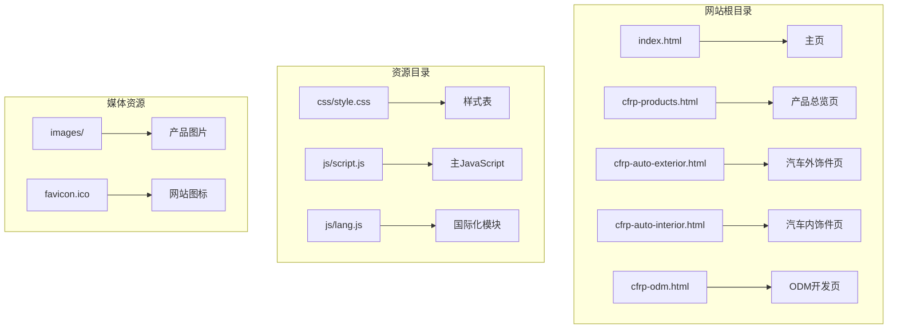
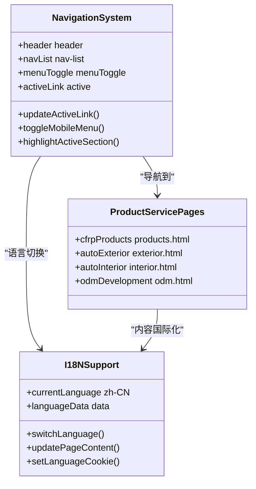
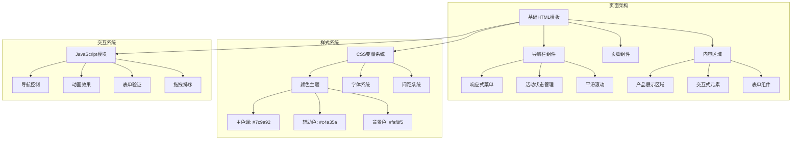
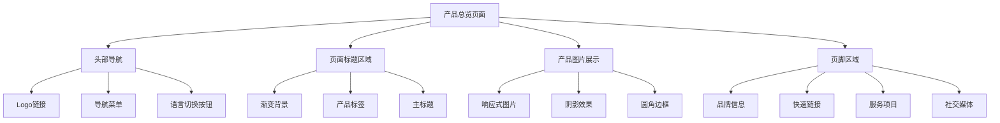
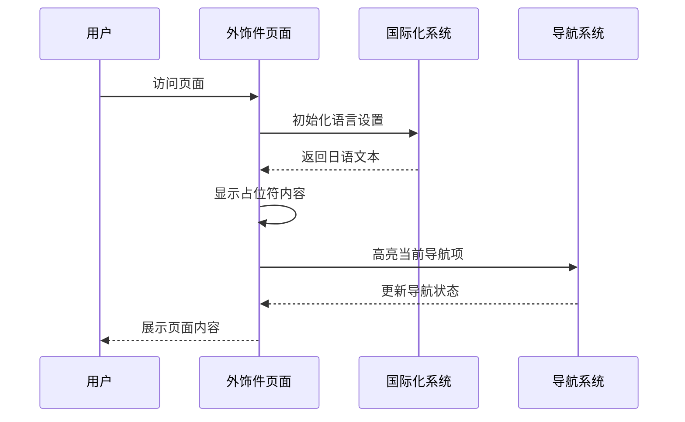
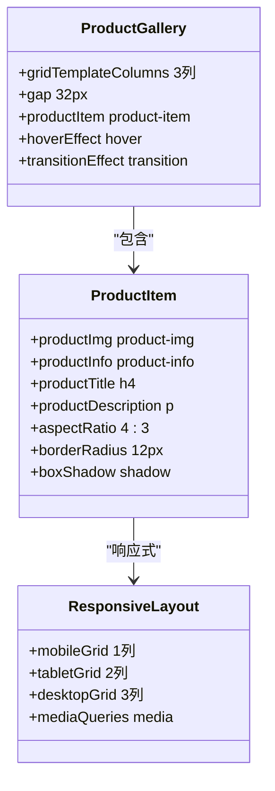
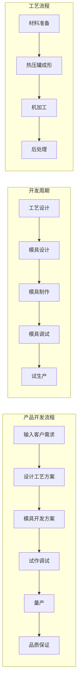
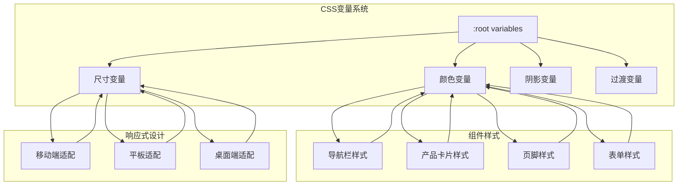
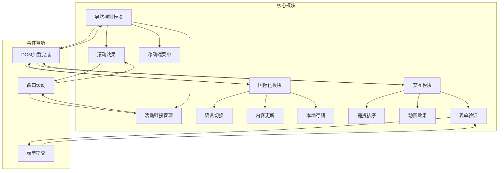

# 产品页面总览

<cite>
**本文档引用的文件**
- [index.html](file://index.html)
- [cfrp-products.html](file://cfrp-products.html)
- [cfrp-auto-exterior.html](file://cfrp-auto-exterior.html)
- [cfrp-auto-interior.html](file://cfrp-auto-interior.html)
- [cfrp-odm.html](file://cfrp-odm.html)
- [css/style.css](file://css/style.css)
- [js/script.js](file://js/script.js)
- [js/lang.js](file://js/lang.js)
</cite>

## 目录
1. [简介](#简介)
2. [项目结构](#项目结构)
3. [核心组件](#核心组件)
4. [架构概览](#架构概览)
5. [详细组件分析](#详细组件分析)
6. [依赖关系分析](#依赖关系分析)
7. [性能考虑](#性能考虑)
8. [故障排除指南](#故障排除指南)
9. [结论](#结论)

## 简介

HYT网站是一个专注于复合材料轻量化解决方案的专业企业网站。该网站通过四个主要产品页面展示了和野贸易（广州）有限公司在碳纤维制品领域的专业能力，包括汽车外饰件、汽车内饰件和ODM产品开发服务。

该网站采用现代化的响应式设计，集成了完整的国际化支持系统，为不同语言用户提供本地化的浏览体验。网站整体设计体现了复合材料行业的专业性和创新性，通过精心设计的视觉元素和交互功能展现了公司的技术实力。

## 项目结构

HYT网站采用简洁而高效的文件组织结构，主要包含以下核心文件：

**图表来源**
- [index.html:1-337](file://index.html#L1-L337)
- [cfrp-products.html:1-97](file://cfrp-products.html#L1-L97)
- [cfrp-auto-exterior.html:1-98](file://cfrp-auto-exterior.html#L1-L98)
- [cfrp-auto-interior.html:1-196](file://cfrp-auto-interior.html#L1-L196)
- [cfrp-odm.html:1-191](file://cfrp-odm.html#L1-L191)

**章节来源**
- [index.html:1-337](file://index.html#L1-L337)
- [cfrp-products.html:1-97](file://cfrp-products.html#L1-L97)
- [cfrp-auto-exterior.html:1-98](file://cfrp-auto-exterior.html#L1-L98)
- [cfrp-auto-interior.html:1-196](file://cfrp-auto-interior.html#L1-L196)
- [cfrp-odm.html:1-191](file://cfrp-odm.html#L1-L191)

## 核心组件

### 导航系统集成

网站采用统一的导航系统，确保用户在各个产品页面之间能够无缝切换。导航栏不仅包含基础的页面跳转功能，还集成了语言切换和响应式设计特性。

**图表来源**
- [index.html:12-32](file://index.html#L12-L32)
- [cfrp-products.html:12-32](file://cfrp-products.html#L12-L32)
- [js/script.js:1-344](file://js/script.js#L1-L344)
- [js/lang.js:1-472](file://js/lang.js#L1-L472)

### 国际化支持系统

网站实现了完整的多语言支持，当前支持简体中文和日语两种语言版本。国际化系统通过统一的数据结构和动态更新机制，确保所有页面内容都能实时切换语言。

**章节来源**
- [js/lang.js:5-350](file://js/lang.js#L5-L350)
- [index.html:6-7](file://index.html#L6-L7)
- [cfrp-products.html:6-8](file://cfrp-products.html#L6-L8)

## 架构概览

HYT网站采用模块化的前端架构设计，四个主要产品页面共享相同的基础组件和样式系统。这种设计模式确保了网站的一致性和可维护性。

**图表来源**
- [css/style.css:10-30](file://css/style.css#L10-L30)
- [js/script.js:1-344](file://js/script.js#L1-L344)
- [js/lang.js:401-472](file://js/lang.js#L401-L472)

## 详细组件分析

### 产品总览页面 (cfrp-products.html)

产品总览页面作为复合材料产品的集中展示平台，采用了简洁而专业的设计风格。

#### 页面结构分析

**图表来源**
- [cfrp-products.html:1-97](file://cfrp-products.html#L1-L97)

#### 设计特色

该页面采用了深绿色渐变背景，体现了复合材料的专业性和环保理念。页面布局简洁明了，重点突出产品展示区域，为后续内容扩展预留了充足空间。

**章节来源**
- [cfrp-products.html:35-47](file://cfrp-products.html#L35-L47)

### 汽车外饰件页面 (cfrp-auto-exterior.html)

汽车外饰件页面专注于展示碳纤维在汽车外部装饰件中的应用，目前处于内容准备阶段。

#### 页面功能特点

**图表来源**
- [cfrp-auto-exterior.html:1-98](file://cfrp-auto-exterior.html#L1-L98)
- [js/lang.js:469-472](file://js/lang.js#L469-L472)

**章节来源**
- [cfrp-auto-exterior.html:35-48](file://cfrp-auto-exterior.html#L35-L48)

### 汽车内饰件页面 (cfrp-auto-interior.html)

汽车内饰件页面是四个产品页面中最丰富的一个，包含了六个具体的碳纤维内饰产品展示。

#### 产品展示系统

**图表来源**
- [cfrp-auto-interior.html:9-57](file://cfrp-auto-interior.html#L9-L57)
- [cfrp-auto-interior.html:95-144](file://cfrp-auto-interior.html#L95-L144)

#### 产品内容组织

页面展示了从车门开关面板到赛车座椅等六种不同的碳纤维内饰产品，每种产品都配有高质量的图片和详细的技术描述。这种组织方式便于用户快速了解各种产品的应用场景和技术特点。

**章节来源**
- [cfrp-auto-interior.html:95-144](file://cfrp-auto-interior.html#L95-L144)

### ODM开发页面 (cfrp-odm.html)

ODM开发页面是网站的核心技术展示页面，详细介绍了复合材料产品开发的完整流程。

#### 交互式流程图系统

**图表来源**
- [cfrp-odm.html:40-175](file://cfrp-odm.html#L40-L175)
- [js/script.js:214-341](file://js/script.js#L214-L341)

#### 技术展示特色

该页面采用了复杂的交互式流程图设计，用户可以通过拖拽操作来调整流程顺序，每个流程节点都提供了详细的技术说明。这种设计充分展现了公司在复合材料技术方面的专业深度。

**章节来源**
- [cfrp-odm.html:40-175](file://cfrp-odm.html#L40-L175)
- [js/script.js:214-341](file://js/script.js#L214-L341)

## 依赖关系分析

### 样式系统依赖

网站的样式系统采用CSS变量驱动的设计模式，确保了全局一致的颜色主题和视觉效果。

**图表来源**
- [css/style.css:10-30](file://css/style.css#L10-L30)
- [css/style.css:67-191](file://css/style.css#L67-L191)
- [css/style.css:488-550](file://css/style.css#L488-L550)

### JavaScript模块依赖

网站的JavaScript系统采用模块化设计，各个功能模块相互独立又协同工作。

**图表来源**
- [js/script.js:1-344](file://js/script.js#L1-L344)
- [js/lang.js:401-472](file://js/lang.js#L401-L472)

**章节来源**
- [js/script.js:1-344](file://js/script.js#L1-L344)
- [js/lang.js:1-472](file://js/lang.js#L1-L472)

## 性能考虑

### 加载优化策略

网站采用了多种性能优化技术，确保在不同网络环境下都能提供流畅的用户体验。

#### 资源加载优化

- **CSS变量缓存**: 使用CSS变量减少重复定义，提高渲染效率
- **懒加载机制**: 图片和内容采用延迟加载策略
- **压缩优化**: 所有静态资源经过压缩处理
- **CDN支持**: 支持外部CDN资源加载

#### 交互性能优化

- **虚拟滚动**: 大量产品展示时采用虚拟滚动技术
- **节流防抖**: 导航滚动和窗口大小变化事件进行性能优化
- **内存管理**: 及时清理事件监听器和定时器
- **缓存策略**: 利用浏览器缓存机制提升二次访问速度

## 故障排除指南

### 常见问题诊断

#### 导航系统问题

**问题症状**: 导航链接无法正常跳转或活动状态不正确

**解决步骤**:
1. 检查导航链接的href属性是否正确
2. 验证CSS类名是否匹配
3. 确认JavaScript事件监听器是否正常绑定
4. 检查响应式菜单的JavaScript逻辑

#### 国际化显示问题

**问题症状**: 页面内容未按预期语言显示或出现乱码

**解决步骤**:
1. 检查localStorage中的语言设置
2. 验证语言数据文件的完整性
3. 确认data-i18n属性的正确使用
4. 检查CSS样式对HTML内容的影响

#### 响应式布局问题

**问题症状**: 在移动设备上显示异常或布局错乱

**解决步骤**:
1. 检查viewport meta标签配置
2. 验证媒体查询断点设置
3. 确认Flexbox和Grid布局兼容性
4. 测试不同屏幕尺寸下的表现

**章节来源**
- [js/script.js:1-344](file://js/script.js#L1-L344)
- [js/lang.js:352-472](file://js/lang.js#L352-L472)

## 结论

HYT网站的产品页面总览展现了现代企业网站设计的最佳实践。通过统一的架构设计、完善的国际化支持和丰富的交互功能，该网站成功地传达了和野贸易在复合材料领域的专业形象。

### 主要优势

1. **一致性设计**: 四个产品页面采用统一的设计语言和交互模式
2. **国际化支持**: 完整的多语言切换机制，支持中日双语
3. **响应式布局**: 适配各种设备和屏幕尺寸
4. **技术展示**: 通过交互式流程图展现专业技术能力
5. **可扩展性**: 模块化设计便于后续功能扩展

### 发展建议

1. **内容丰富化**: 继续完善汽车外饰件页面的内容建设
2. **性能优化**: 进一步优化图片加载和渲染性能
3. **SEO优化**: 增强搜索引擎优化策略
4. **用户反馈**: 建立用户反馈收集机制
5. **数据分析**: 集成网站访问统计和用户行为分析

该网站为复合材料行业的数字化转型提供了优秀的参考案例，其设计理念和实现方式值得其他类似企业借鉴学习。