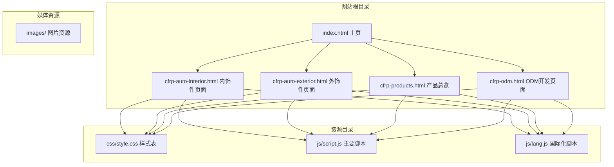
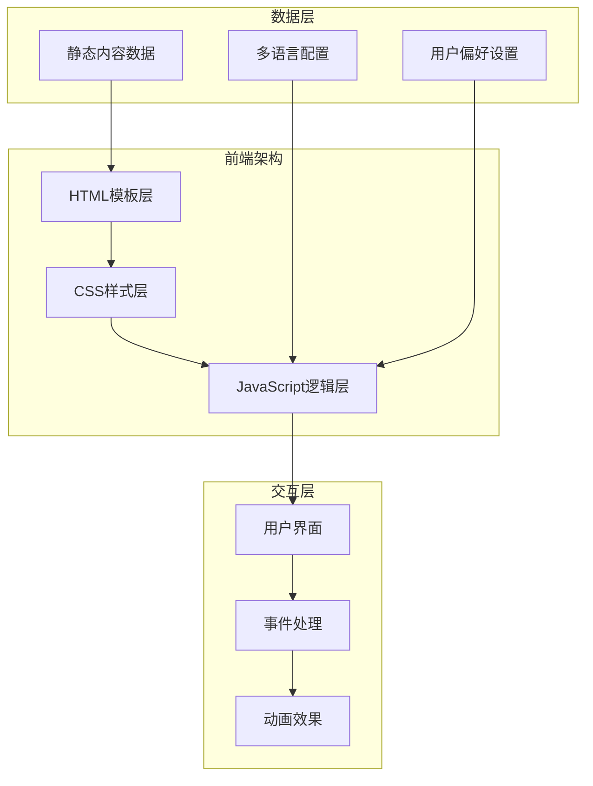
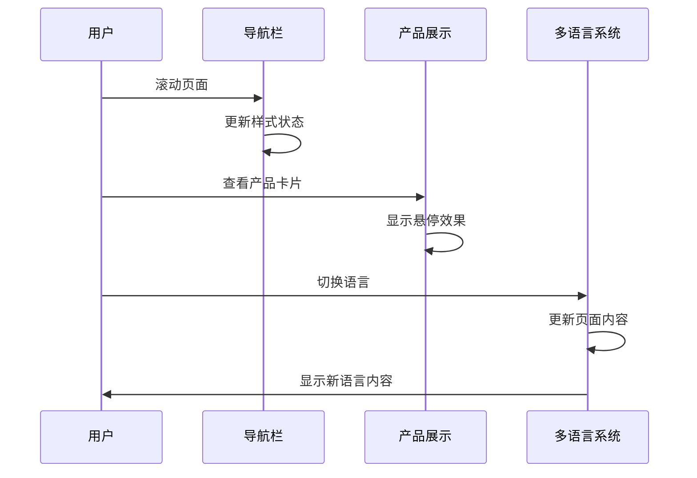
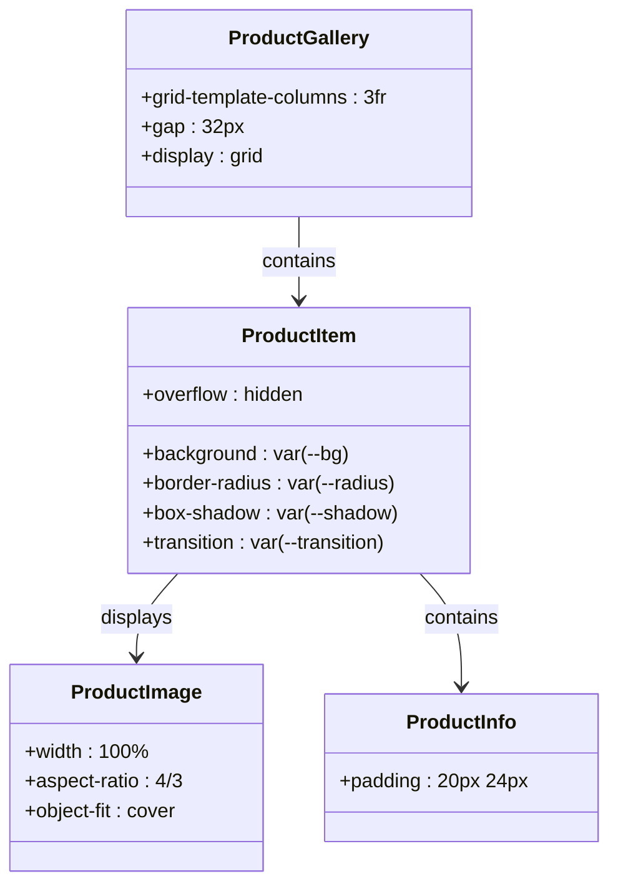
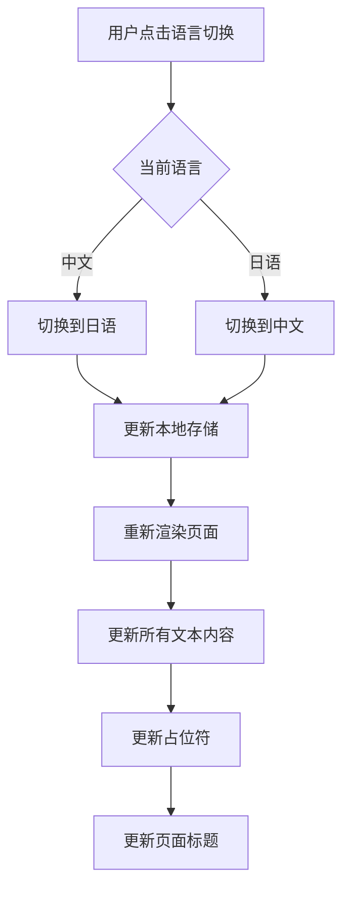
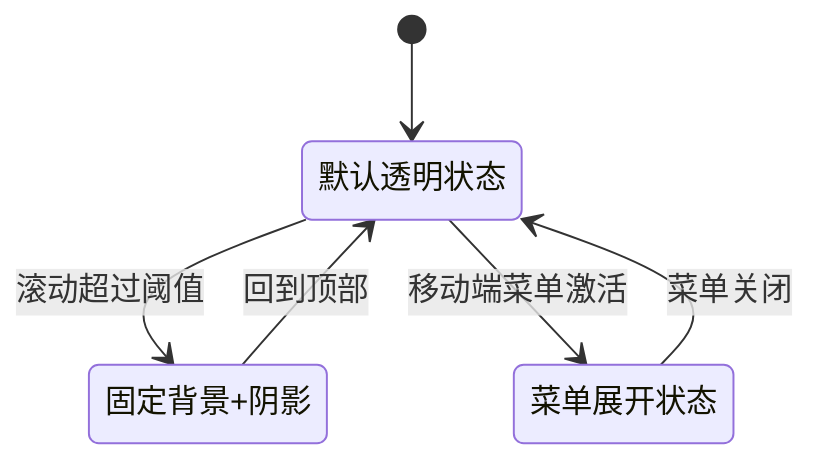
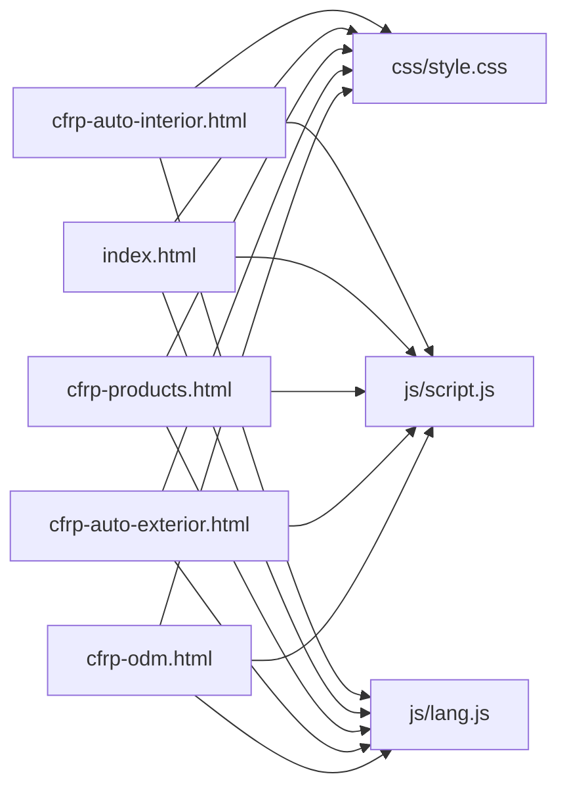

# 汽车内饰件页面

<cite>
**本文档引用的文件**
- [cfrp-auto-interior.html](file://cfrp-auto-interior.html)
- [css/style.css](file://css/style.css)
- [js/script.js](file://js/script.js)
- [js/lang.js](file://js/lang.js)
- [index.html](file://index.html)
- [cfrp-products.html](file://cfrp-products.html)
- [cfrp-auto-exterior.html](file://cfrp-auto-exterior.html)
- [cfrp-odm.html](file://cfrp-odm.html)
</cite>

## 目录
1. [简介](#简介)
2. [项目结构](#项目结构)
3. [核心组件](#核心组件)
4. [架构概览](#架构概览)
5. [详细组件分析](#详细组件分析)
6. [依赖关系分析](#依赖关系分析)
7. [性能考虑](#性能考虑)
8. [故障排除指南](#故障排除指南)
9. [结论](#结论)

## 简介

汽车内饰件页面是和野贸易（广州）有限公司官方网站的重要组成部分，专门展示碳纤维汽车内饰件产品。该页面采用现代化的响应式设计，结合多语言国际化支持，为用户提供沉浸式的汽车内饰件产品浏览体验。

页面主要包含以下核心功能：
- 碳纤维内饰件产品展示（车门开关面板、方向盘、换挡拨片等6种产品）
- 材质特性说明和工艺介绍
- 安装指南和使用建议
- 多语言界面支持（中日文）
- 响应式布局适配各种设备

## 项目结构

整个网站采用模块化架构设计，包含多个独立的功能页面：

**图表来源**
- [cfrp-auto-interior.html:1-196](file://cfrp-auto-interior.html#L1-L196)
- [css/style.css:1-800](file://css/style.css#L1-L800)
- [js/script.js:1-344](file://js/script.js#L1-L344)

**章节来源**
- [cfrp-auto-interior.html:1-196](file://cfrp-auto-interior.html#L1-L196)
- [css/style.css:1-800](file://css/style.css#L1-L800)
- [js/script.js:1-344](file://js/script.js#L1-L344)

## 核心组件

### 1. 导航系统
页面采用固定式导航栏设计，具有滚动效果和移动端适配功能：
- 响应式菜单切换（汉堡菜单）
- 滚动时自动调整样式
- 活动状态高亮显示
- 多语言切换按钮集成

### 2. 产品展示系统
采用网格布局展示6种碳纤维内饰件产品：
- 网格布局（桌面：3列，平板：2列，手机：1列）
- 卡片式产品展示
- 悬停动画效果
- 产品图片和描述信息

### 3. 多语言支持系统
完整的国际化解决方案：
- 支持简体中文和日语
- 动态语言切换
- 数据驱动的文本管理
- 本地存储语言偏好

### 4. 视觉设计系统
基于CSS变量的主题系统：
- 绿色系企业主色调
- 渐变背景设计
- 圆角和阴影效果
- 平滑过渡动画

**章节来源**
- [cfrp-auto-interior.html:60-146](file://cfrp-auto-interior.html#L60-L146)
- [css/style.css:10-30](file://css/style.css#L10-L30)
- [js/lang.js:5-472](file://js/lang.js#L5-L472)

## 架构概览

### 整体架构设计

**图表来源**
- [cfrp-auto-interior.html:1-196](file://cfrp-auto-interior.html#L1-L196)
- [js/script.js:1-344](file://js/script.js#L1-L344)
- [js/lang.js:1-472](file://js/lang.js#L1-L472)

### 组件交互流程

**图表来源**
- [js/script.js:1-115](file://js/script.js#L1-L115)
- [js/lang.js:401-472](file://js/lang.js#L401-L472)

## 详细组件分析

### 产品展示系统

#### 网格布局设计

**图表来源**
- [cfrp-auto-interior.html:95-144](file://cfrp-auto-interior.html#L95-L144)
- [css/style.css:9-57](file://css/style.css#L9-L57)

#### 响应式设计策略

| 设备类型 | 屏幕宽度 | 列数 | 间距 |
|---------|----------|------|------|
| 桌面端 | ≥900px | 3列 | 32px |
| 平板端 | 580px-899px | 2列 | 20px |
| 移动端 | <580px | 1列 | 自适应 |

#### 产品信息架构

每个产品包含以下信息元素：
- **产品图片**：高质量碳纤维纹理展示
- **产品名称**：明确的中文标识
- **产品描述**：详细的技术规格和特点
- **材质说明**：碳纤维材料优势
- **应用场景**：适用的车型和用途

**章节来源**
- [cfrp-auto-interior.html:96-143](file://cfrp-auto-interior.html#L96-L143)

### 多语言国际化系统

#### 语言切换机制

**图表来源**
- [js/lang.js:456-472](file://js/lang.js#L456-L472)
- [js/lang.js:364-399](file://js/lang.js#L364-L399)

#### 文本数据管理

语言数据采用键值对形式组织：
- **通用文本**：站点标题、导航链接
- **页面特定文本**：产品名称、描述信息
- **表单文本**：联系表单标签和提示
- **流程文本**：ODM开发流程说明

**章节来源**
- [js/lang.js:8-178](file://js/lang.js#L8-L178)
- [js/lang.js:352-400](file://js/lang.js#L352-L400)

### 导航系统

#### 滚动效果实现

**图表来源**
- [js/script.js:1-10](file://js/script.js#L1-L10)
- [css/style.css:78-83](file://css/style.css#L78-L83)

#### 移动端适配

- **汉堡菜单**：三线图标设计
- **动画效果**：旋转动画切换
- **触摸友好**：合适的点击区域
- **响应式布局**：自动隐藏显示

**章节来源**
- [cfrp-auto-interior.html:76-79](file://cfrp-auto-interior.html#L76-L79)
- [js/script.js:13-29](file://js/script.js#L13-L29)

## 依赖关系分析

### 文件依赖关系

**图表来源**
- [cfrp-auto-interior.html:7-8](file://cfrp-auto-interior.html#L7-L8)
- [index.html:7-8](file://index.html#L7-L8)

### 样式依赖分析

所有页面共享相同的CSS变量系统：
- **颜色系统**：企业主色调定义
- **字体系统**：中英文字体支持
- **布局系统**：容器和间距规范
- **动画系统**：过渡和变换效果

**章节来源**
- [css/style.css:10-30](file://css/style.css#L10-L30)
- [cfrp-auto-interior.html:9-14](file://cfrp-auto-interior.html#L9-L14)

## 性能考虑

### 加载优化策略

1. **CSS变量优化**
   - 使用CSS自定义属性减少重复定义
   - 支持动态主题切换
   - 减少CSS文件大小

2. **图片优化**
   - 使用适当的图片格式
   - 响应式图片适配
   - 渐进式加载策略

3. **JavaScript优化**
   - 按需加载功能模块
   - 事件委托减少监听器数量
   - 防抖和节流优化滚动性能

### 响应式性能

- **媒体查询优化**：避免过度使用复杂查询
- **CSS Grid优化**：现代浏览器更好的性能
- **动画性能**：使用transform和opacity属性

## 故障排除指南

### 常见问题诊断

#### 多语言显示问题
**症状**：页面文本未正确切换
**解决步骤**：
1. 检查本地存储中的语言设置
2. 验证语言数据完整性
3. 确认DOM元素的data-i18n属性

#### 导航栏显示异常
**症状**：滚动效果失效或样式错误
**解决步骤**：
1. 检查CSS变量定义
2. 验证JavaScript事件绑定
3. 确认媒体查询匹配

#### 产品展示布局问题
**症状**：网格布局错乱或响应式失效
**解决步骤**：
1. 检查CSS Grid属性
2. 验证媒体查询断点
3. 确认图片加载状态

**章节来源**
- [js/lang.js:178-195](file://js/lang.js#L178-L195)
- [js/script.js:142-175](file://js/script.js#L142-L175)

## 结论

汽车内饰件页面展现了现代企业网站的最佳实践，通过精心设计的用户体验和强大的技术架构，成功地展示了碳纤维汽车内饰件产品。页面的主要优势包括：

### 技术优势
- **模块化设计**：清晰的组件分离和职责划分
- **响应式架构**：全面的跨设备适配
- **国际化支持**：完整的多语言解决方案
- **性能优化**：合理的资源管理和加载策略

### 用户体验优势
- **直观的信息架构**：产品分类清晰明确
- **视觉吸引力**：专业的设计风格和动画效果
- **交互友好**：流畅的用户操作体验
- **内容丰富**：详细的产品信息和技术规格

### 改进建议
1. **内容扩展**：增加更多产品细节和应用场景
2. **交互增强**：添加产品对比和筛选功能
3. **SEO优化**：改进搜索引擎可见性
4. **性能监控**：建立性能指标跟踪系统

该页面为汽车内饰件产品的数字化展示提供了优秀的参考模板，其设计理念和实现方案值得其他类似项目借鉴和学习。