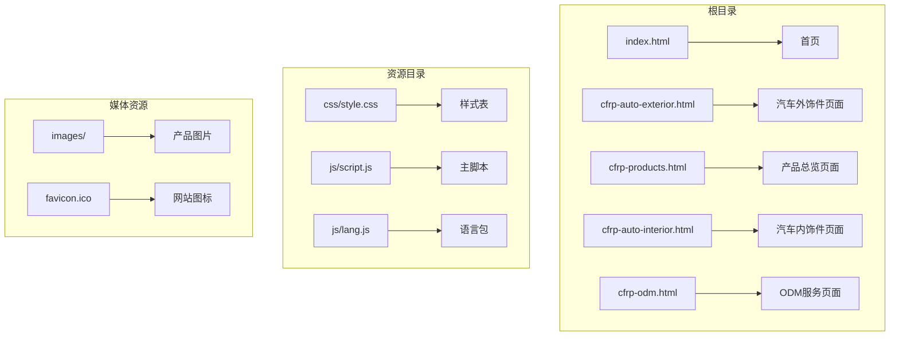
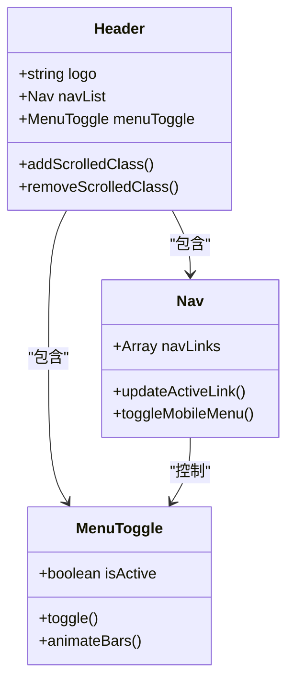
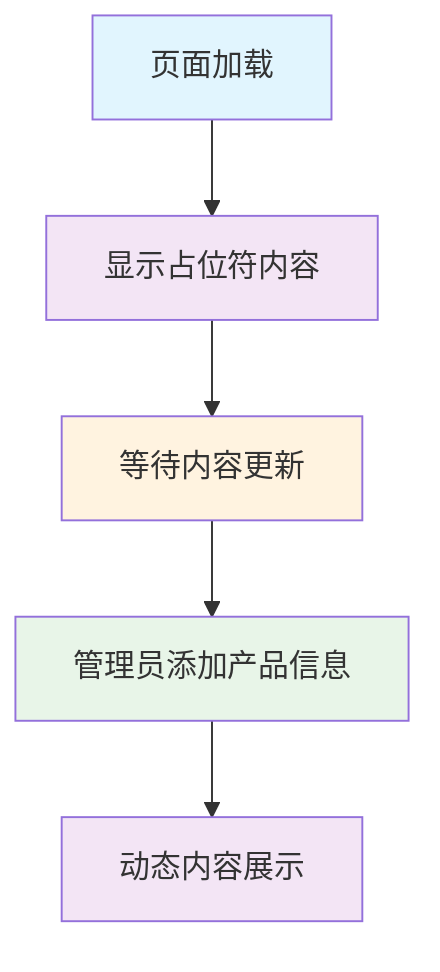
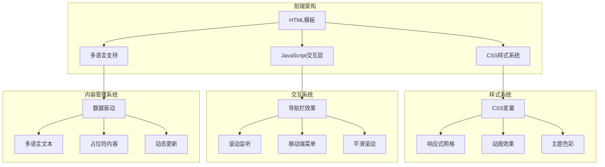
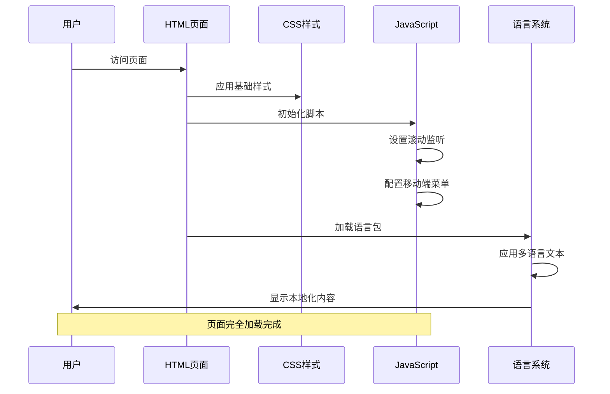
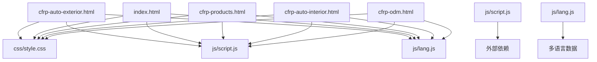
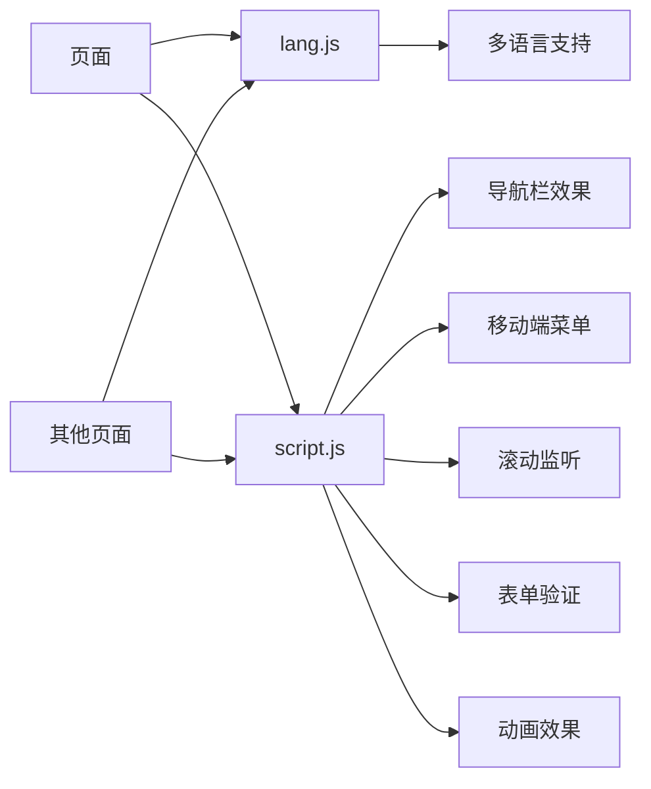

# 汽车外饰件页面

<cite>
**本文档引用的文件**
- [cfrp-auto-exterior.html](file://cfrp-auto-exterior.html)
- [index.html](file://index.html)
- [css/style.css](file://css/style.css)
- [js/script.js](file://js/script.js)
- [js/lang.js](file://js/lang.js)
- [cfrp-products.html](file://cfrp-products.html)
- [cfrp-auto-interior.html](file://cfrp-auto-interior.html)
- [cfrp-odm.html](file://cfrp-odm.html)
</cite>

## 目录
1. [简介](#简介)
2. [项目结构](#项目结构)
3. [核心组件](#核心组件)
4. [架构概览](#架构概览)
5. [详细组件分析](#详细组件分析)
6. [依赖关系分析](#依赖关系分析)
7. [性能考虑](#性能考虑)
8. [故障排除指南](#故障排除指南)
9. [结论](#结论)

## 简介

汽车外饰件页面是和野贸易（广州）有限公司官方网站的重要组成部分，专门展示碳纤维制品-汽车外饰件产品。该页面采用现代化的响应式设计，结合多语言支持系统，为用户提供沉浸式的汽车外饰件产品体验。

页面设计体现了以下核心理念：
- **轻量化设计**：通过CSS变量和现代布局技术实现高效的页面渲染
- **响应式布局**：适配各种设备尺寸，确保跨平台一致性
- **国际化支持**：内置中日双语切换功能
- **交互式体验**：丰富的JavaScript交互效果和动画

## 项目结构

该项目采用模块化组织方式，主要包含以下文件结构：

**图表来源**
- [cfrp-auto-exterior.html:1-98](file://cfrp-auto-exterior.html#L1-L98)
- [index.html:1-337](file://index.html#L1-L337)
- [css/style.css:1-1345](file://css/style.css#L1-L1345)

**章节来源**
- [cfrp-auto-exterior.html:1-98](file://cfrp-auto-exterior.html#L1-L98)
- [index.html:1-337](file://index.html#L1-L337)

## 核心组件

### 导航系统

导航系统采用固定定位设计，在页面滚动时自动调整样式，提供良好的用户体验：

**图表来源**
- [js/script.js:1-344](file://js/script.js#L1-L344)

### 页面标题区域

外饰件页面采用独特的渐变背景设计，营造专业而现代的品牌形象：

| 属性 | 值 | 描述 |
|------|-----|------|
| 背景渐变 | `linear-gradient(135deg, #5d7e75 0%, #7c9a92 50%, #a8c5bb 100%)` | 深绿到浅绿的渐变效果 |
| 文字颜色 | `#fff` | 白色文字确保对比度 |
| 内边距 | `80px 0 50px` | 上下留白提供呼吸空间 |
| 字体大小 | `2.4rem` | 主标题采用大字号强调 |

### 内容区域

当前页面采用占位符设计，预留扩展空间：

**图表来源**
- [cfrp-auto-exterior.html:43-48](file://cfrp-auto-exterior.html#L43-L48)

**章节来源**
- [cfrp-auto-exterior.html:11-48](file://cfrp-auto-exterior.html#L11-L48)
- [css/style.css:67-191](file://css/style.css#L67-L191)

## 架构概览

### 整体架构设计

**图表来源**
- [js/script.js:1-344](file://js/script.js#L1-L344)
- [css/style.css:1-1345](file://css/style.css#L1-L1345)
- [js/lang.js:1-472](file://js/lang.js#L1-L472)

### 组件交互流程

**图表来源**
- [cfrp-auto-exterior.html:94-95](file://cfrp-auto-exterior.html#L94-L95)
- [js/script.js:1-344](file://js/script.js#L1-L344)
- [js/lang.js:469-472](file://js/lang.js#L469-L472)

## 详细组件分析

### 导航栏组件

导航栏采用现代化设计，具备以下特性：

#### 滚动效果
- **固定定位**：页面滚动时保持在视窗顶部
- **背景变化**：从透明过渡到半透明背景
- **阴影效果**：增加层次感和深度

#### 移动端适配
- **汉堡菜单**：小屏幕设备上的导航入口
- **动画效果**：菜单展开/收起的流畅动画
- **响应式布局**：根据屏幕尺寸调整显示内容

#### 导航链接高亮
- **智能识别**：根据滚动位置自动高亮对应导航项
- **平滑过渡**：高亮状态切换的动画效果
- **锚点导航**：支持页面内跳转

**章节来源**
- [js/script.js:1-52](file://js/script.js#L1-L52)
- [css/style.css:67-191](file://css/style.css#L67-L191)

### 页面标题组件

页面标题区域采用全屏背景设计：

#### 视觉设计
- **渐变背景**：深绿色到浅绿色的渐变效果
- **文字对齐**：居中对齐营造平衡感
- **颜色对比**：白色文字确保可读性

#### 响应式设计
- **字体缩放**：使用clamp函数实现字体大小的流式变化
- **内边距调整**：根据屏幕尺寸调整上下内边距
- **文本居中**：始终保持内容垂直居中

**章节来源**
- [cfrp-auto-exterior.html:34-41](file://cfrp-auto-exterior.html#L34-L41)
- [css/style.css:192-286](file://css/style.css#L192-L286)

### 内容展示区域

当前内容区域采用占位符设计，为后续内容扩展预留空间：

#### 占位符设计
- **文本提示**：明确告知内容待补充
- **居中布局**：确保占位符在页面中的视觉中心
- **颜色设计**：使用次级文字颜色体现占位状态

#### 扩展性考虑
- **容器结构**：预留标准的容器结构便于内容插入
- **样式继承**：继承全局样式确保视觉一致性
- **响应式适配**：支持各种屏幕尺寸

**章节来源**
- [cfrp-auto-exterior.html:43-48](file://cfrp-auto-exterior.html#L43-L48)

### 页脚组件

页脚采用网格布局设计，提供完整的站点信息：

#### 布局结构
- **四列网格**：品牌信息、快速链接、服务项目、社交媒体
- **响应式调整**：小屏幕设备上自动调整为单列布局
- **视觉分隔**：使用边框和间距创造清晰的信息层次

#### 社交媒体集成
- **图标设计**：使用简洁的Unicode字符作为图标
- **悬停效果**：鼠标悬停时的颜色变化
- **链接功能**：为未来的社交媒体链接预留位置

**章节来源**
- [cfrp-auto-exterior.html:50-92](file://cfrp-auto-exterior.html#L50-L92)
- [css/style.css:751-844](file://css/style.css#L751-L844)

## 依赖关系分析

### 文件依赖关系

**图表来源**
- [cfrp-auto-exterior.html:7](file://cfrp-auto-exterior.html#L7)
- [js/script.js:1](file://js/script.js#L1)
- [js/lang.js:1](file://js/lang.js#L1)

### 样式依赖分析

样式系统采用模块化设计，各组件独立维护：

| 样式模块 | 依赖关系 | 功能描述 |
|----------|----------|----------|
| 基础样式 | 无 | 全局CSS变量、重置样式 |
| 导航栏 | 基础样式 | 头部导航组件样式 |
| 页面标题 | 基础样式 | 页面标题区域样式 |
| 通用区块 | 基础样式 | 标准区块布局样式 |
| 页脚 | 基础样式 | 页脚组件样式 |

**章节来源**
- [css/style.css:1-1345](file://css/style.css#L1-L1345)

### JavaScript依赖关系

**图表来源**
- [js/script.js:1-344](file://js/script.js#L1-L344)
- [js/lang.js:1-472](file://js/lang.js#L1-L472)

## 性能考虑

### 加载性能优化

1. **CSS变量缓存**：使用CSS变量减少重复计算
2. **响应式图片**：采用`max-width: 100%`确保图片自适应
3. **最小化脚本**：JavaScript功能按需加载
4. **缓存策略**：静态资源使用浏览器缓存

### 渲染性能优化

1. **硬件加速**：使用CSS3变换触发GPU加速
2. **避免重绘**：合理使用transform而非改变布局属性
3. **懒加载**：图片内容采用延迟加载策略
4. **内存管理**：及时清理事件监听器和定时器

### 移动端优化

1. **触摸友好**：按钮和链接具有足够的触摸目标尺寸
2. **网络优化**：减少HTTP请求次数
3. **离线支持**：关键资源可缓存
4. **电池优化**：避免不必要的后台活动

## 故障排除指南

### 常见问题诊断

#### 导航栏问题
- **问题症状**：导航栏不显示或显示异常
- **可能原因**：JavaScript加载失败或CSS样式冲突
- **解决步骤**：
  1. 检查浏览器控制台是否有JavaScript错误
  2. 验证CSS文件路径是否正确
  3. 确认JavaScript文件的加载顺序

#### 多语言切换问题
- **问题症状**：语言切换按钮不工作或文本未更新
- **可能原因**：localStorage访问受限或语言包加载失败
- **解决步骤**：
  1. 检查浏览器的localStorage功能
  2. 验证语言包文件的完整性
  3. 确认DOM元素的选择器匹配

#### 响应式布局问题
- **问题症状**：移动端显示异常或布局错乱
- **可能原因**：媒体查询条件不正确或CSS优先级问题
- **解决步骤**：
  1. 使用浏览器开发者工具检查媒体查询
  2. 验证CSS优先级和覆盖规则
  3. 测试不同设备的显示效果

### 性能监控

#### 关键性能指标
- **首屏渲染时间**：< 3秒
- **交互延迟**：< 100ms
- **内存使用**：< 50MB
- **CPU使用率**：< 50%

#### 优化建议
1. **代码分割**：将大型JavaScript文件拆分为多个小文件
2. **资源压缩**：启用Gzip或Brotli压缩
3. **CDN加速**：使用内容分发网络加速静态资源
4. **预加载策略**：为关键资源设置适当的预加载指令

**章节来源**
- [js/script.js:141-175](file://js/script.js#L141-L175)
- [js/lang.js:352-400](file://js/lang.js#L352-L400)

## 结论

汽车外饰件页面展现了现代Web开发的最佳实践，通过精心设计的架构和丰富的交互功能，为用户提供了优质的浏览体验。页面采用模块化设计，具备良好的可维护性和扩展性。

### 设计优势

1. **视觉统一性**：通过CSS变量和统一的设计语言确保视觉一致性
2. **用户体验优化**：流畅的动画效果和响应式设计提升用户体验
3. **国际化支持**：完善的多语言系统支持全球化业务发展
4. **性能优化**：合理的资源管理和优化策略确保快速加载

### 技术亮点

1. **响应式架构**：完全适配各种设备和屏幕尺寸
2. **交互式导航**：智能的导航栏和滚动监听功能
3. **动画系统**：丰富的CSS动画和JavaScript交互效果
4. **内容管理**：灵活的内容结构便于后续扩展

### 发展建议

1. **内容丰富化**：逐步完善外饰件产品展示内容
2. **功能增强**：考虑添加产品搜索和筛选功能
3. **SEO优化**：进一步优化搜索引擎可见性
4. **无障碍访问**：提升页面的无障碍访问能力

该页面为和野贸易的数字化转型奠定了坚实的技术基础，通过持续的优化和改进，将为公司的业务发展提供强有力的支持。