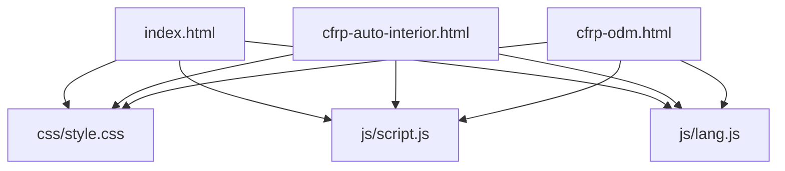
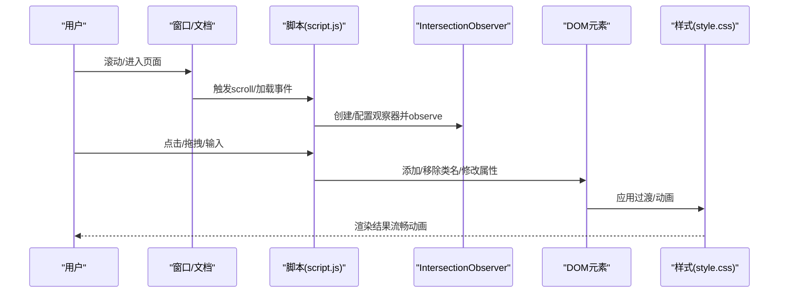
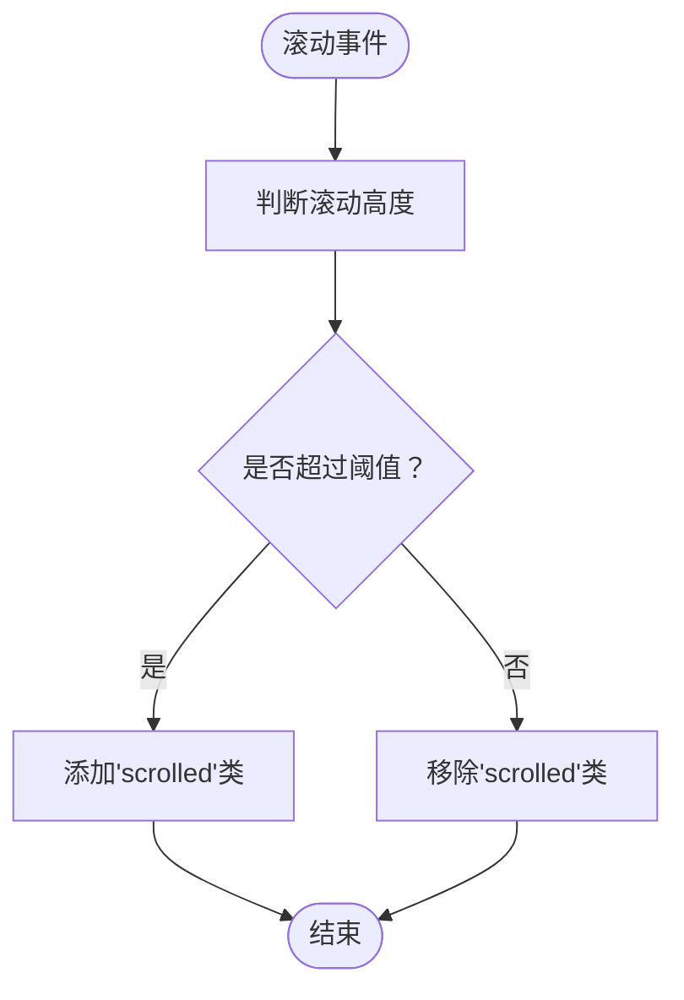
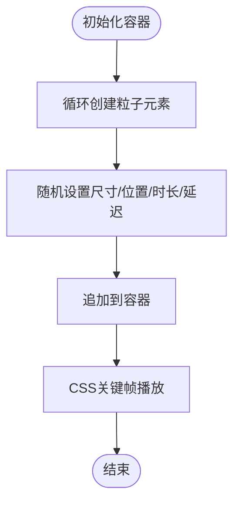
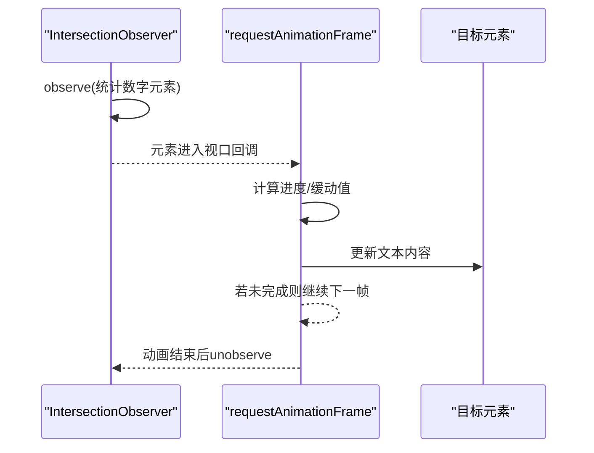
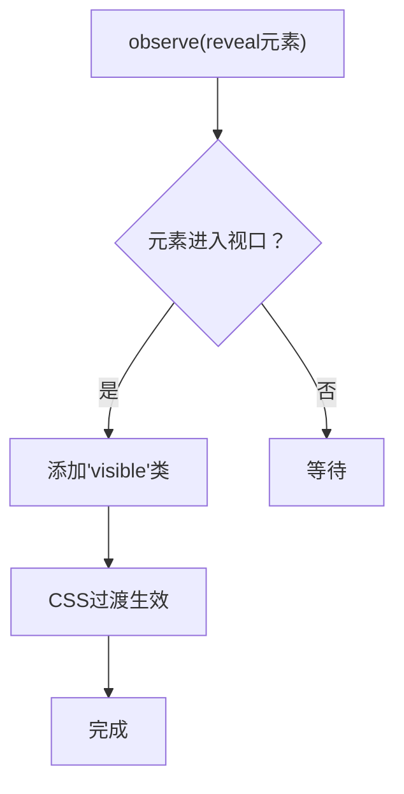
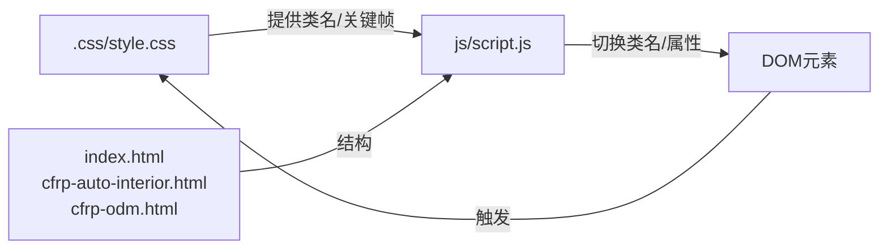

# 动画性能优化

<cite>
**本文引用的文件**
- [index.html](file://index.html)
- [cfrp-auto-interior.html](file://cfrp-auto-interior.html)
- [cfrp-odm.html](file://cfrp-odm.html)
- [css/style.css](file://css/style.css)
- [js/script.js](file://js/script.js)
- [js/lang.js](file://js/lang.js)
</cite>

## 目录
1. [简介](#简介)
2. [项目结构](#项目结构)
3. [核心组件](#核心组件)
4. [架构总览](#架构总览)
5. [详细组件分析](#详细组件分析)
6. [依赖关系分析](#依赖关系分析)
7. [性能考量](#性能考量)
8. [故障排查指南](#故障排查指南)
9. [结论](#结论)
10. [附录](#附录)

## 简介
本指南聚焦于HYT网站的动画性能优化，结合现有代码实现，系统阐述以下主题：
- requestAnimationFrame与setTimeout在动画中的区别与性能影响
- Intersection Observer API相较传统滚动监听的优势
- CSS硬件加速与GPU优化技巧
- 动画合成层的创建与管理策略
- 内存泄漏预防、垃圾回收优化与长列表动画处理
- 性能监控工具与调试技巧

目标是在不破坏既有视觉体验的前提下，显著提升动画流畅度与资源占用表现。

## 项目结构
HYT网站采用静态HTML/CSS/JS结构，核心文件分布如下：
- 页面入口与多语言：index.html、cfrp-auto-interior.html、cfrp-odm.html
- 样式：css/style.css（含动画与交互式流程图）
- 脚本：js/script.js（滚动、粒子、数字递增、滚动渐显、表单、拖拽排序等）、js/lang.js（多语言）

图表来源
- [index.html](file://index.html)
- [cfrp-auto-interior.html](file://cfrp-auto-interior.html)
- [cfrp-odm.html](file://cfrp-odm.html)
- [css/style.css](file://css/style.css)
- [js/script.js](file://js/script.js)
- [js/lang.js](file://js/lang.js)

章节来源
- [index.html](file://index.html)
- [css/style.css](file://css/style.css)
- [js/script.js](file://js/script.js)
- [js/lang.js](file://js/lang.js)

## 核心组件
- 导航栏滚动效果与高亮：通过监听滚动事件动态切换类名，实现视觉过渡与导航高亮。
- 粒子背景：动态生成粒子元素并应用CSS动画，形成上升漂浮效果。
- 数字递增动画：使用Intersection Observer触发，配合requestAnimationFrame实现平滑计数。
- 滚动渐显：通过Intersection Observer观察可见性，添加CSS过渡类实现“reveal”动画。
- 表单提交与Toast提示：使用setTimeout进行状态反馈延迟，避免阻塞主线程。
- 交互式流程图：拖拽排序逻辑，涉及DOM移动与事件绑定。

章节来源
- [js/script.js](file://js/script.js)
- [css/style.css](file://css/style.css)

## 架构总览
从动画视角看，页面由“样式驱动的CSS动画 + JS驱动的交互动画”构成。核心路径如下：
- 用户交互或滚动触发 -> JS回调（如scroll、Intersection Observer回调）-> 更新DOM类名或属性 -> 触发CSS过渡/动画
- 或者：JS使用requestAnimationFrame驱动逐帧更新 -> 修改样式属性 -> 触发合成层渲染

图表来源
- [js/script.js](file://js/script.js)
- [css/style.css](file://css/style.css)

## 详细组件分析

### 组件A：滚动监听与导航高亮
- 实现要点
  - 监听scroll事件，根据滚动高度切换header类名，实现视觉过渡
  - 使用updateActiveLink函数计算当前section并设置导航active状态
- 性能影响
  - scroll事件回调频繁，建议节流或使用requestAnimationFrame包装
  - 当前实现直接操作类名，开销较低；但需避免在回调中执行重计算
- 优化建议
  - 将updateActiveLink放入requestAnimationFrame中，减少布局抖动
  - 对scroll事件加节流（如200ms），降低回调频率

图表来源
- [js/script.js](file://js/script.js)

章节来源
- [js/script.js](file://js/script.js)

### 组件B：粒子背景动画
- 实现要点
  - 在容器内动态创建多个粒子元素，随机设置大小、位置、动画时长与延迟
  - CSS定义floatUp关键帧，实现上升与淡入淡出
- 性能影响
  - 动态创建大量DOM节点，可能造成布局/绘制压力
  - CSS动画在GPU上运行，通常较友好；但过多元素仍会带来成本
- 优化建议
  - 控制粒子数量上限，按需生成
  - 使用will-change或transform属性提示合成层
  - 避免在动画期间频繁读取布局信息

图表来源
- [js/script.js](file://js/script.js)
- [css/style.css](file://css/style.css)

章节来源
- [js/script.js](file://js/script.js)
- [css/style.css](file://css/style.css)

### 组件C：数字递增动画（Intersection Observer + requestAnimationFrame）
- 实现要点
  - 使用Intersection Observer监听目标元素进入视口
  - 进入后启动requestAnimationFrame循环，按缓动函数更新数值
  - 动画完成后停止并取消观察
- 性能优势
  - 仅在元素可见时启动动画，节省CPU/GPU
  - requestAnimationFrame与浏览器刷新节拍对齐，避免丢帧
- 优化建议
  - 缓动函数可复用常量，避免重复计算
  - 对长列表场景，建议懒加载与虚拟化，减少一次性观察目标数量

图表来源
- [js/script.js](file://js/script.js)

章节来源
- [js/script.js](file://js/script.js)

### 组件D：滚动渐显（reveal）
- 实现要点
  - 为多个元素预先添加“reveal”类，设置初始透明与位移
  - Intersection Observer在元素进入视口时添加“visible”，触发CSS过渡
- 性能优势
  - 利用CSS过渡，避免JS逐帧计算
  - 仅在元素可见时触发，减少不必要的渲染
- 优化建议
  - 合理设置threshold与rootMargin，平衡首屏加载与滚动体验
  - 对密集列表，考虑分批观察或延迟初始化

图表来源
- [js/script.js](file://js/script.js)
- [css/style.css](file://css/style.css)

章节来源
- [js/script.js](file://js/script.js)
- [css/style.css](file://css/style.css)

### 组件E：表单提交与Toast提示
- 实现要点
  - 表单提交使用setTimeout模拟异步过程，结束后显示Toast
  - Toast使用setTimeout控制出现/消失时机，配合CSS过渡
- 性能影响
  - setTimeout用于UI反馈，不会阻塞主线程
  - 注意避免在同一时间段内多次创建Toast，防止DOM堆积
- 优化建议
  - Toast统一管理，避免重复创建
  - 使用requestAnimationFrame进行微小的布局读取，减少强制同步布局

章节来源
- [js/script.js](file://js/script.js)

### 组件F：交互式流程图（拖拽排序）
- 实现要点
  - 使用dragstart/dragover/drop等事件实现节点拖拽
  - 通过insertBefore移动DOM节点，维持箭头与节点的相对关系
- 性能影响
  - 频繁DOM插入/删除可能引发布局与绘制
  - 建议在拖拽过程中最小化样式计算
- 优化建议
  - 使用transform替代真实位置变更，减少布局抖动
  - 对拖拽区域使用will-change提示，启用合成层

章节来源
- [js/script.js](file://js/script.js)
- [css/style.css](file://css/style.css)

## 依赖关系分析
- 样式依赖
  - 动画类（如.reveal、.visible、.slideInRight、floatUp等）被JS通过类名切换间接驱动
  - 流程图样式独立于通用动画类，但共享过渡与变换属性
- 脚本依赖
  - script.js依赖DOM结构与CSS类名，确保命名一致
  - lang.js负责多语言文本注入，不影响动画性能，但需注意更新时机

图表来源
- [css/style.css](file://css/style.css)
- [js/script.js](file://js/script.js)
- [index.html](file://index.html)
- [cfrp-auto-interior.html](file://cfrp-auto-interior.html)
- [cfrp-odm.html](file://cfrp-odm.html)

章节来源
- [css/style.css](file://css/style.css)
- [js/script.js](file://js/script.js)
- [index.html](file://index.html)
- [cfrp-auto-interior.html](file://cfrp-auto-interior.html)
- [cfrp-odm.html](file://cfrp-odm.html)

## 性能考量

### requestAnimationFrame vs setTimeout
- requestAnimationFrame
  - 与浏览器刷新节拍对齐，避免丢帧
  - 在动画循环中调用，适合逐帧更新样式属性
  - 与Intersection Observer结合，仅在可见时执行
- setTimeout
  - 不保证与刷新节拍同步，可能导致掉帧
  - 适用于UI反馈（如Toast显示/隐藏）等非连续动画
- 建议
  - 所有需要逐帧变化的动画（如数字递增、进度条）使用requestAnimationFrame
  - Toast等短暂反馈使用setTimeout，避免阻塞

章节来源
- [js/script.js](file://js/script.js)

### Intersection Observer API 与传统滚动监听
- 优势
  - 基于异步回调，不阻塞主线程
  - 支持阈值与根边距，便于精确控制触发时机
  - 自动处理元素可见性检测，减少手动计算
- 现状
  - 数字递增与滚动渐显均采用Intersection Observer，已具备良好性能
- 建议
  - 对长列表场景，优先使用虚拟滚动或分页，减少一次性观察目标数量
  - 合理设置threshold与rootMargin，兼顾首屏与滚动体验

章节来源
- [js/script.js](file://js/script.js)

### CSS硬件加速与GPU优化
- 启用方式
  - 使用transform与opacity等属性，避免触发布局与重绘
  - 通过will-change或transform属性提示浏览器启用合成层
- 现状
  - 多处使用transform与opacity，符合硬件加速原则
  - 流程图节点与卡片hover使用transform，利于GPU加速
- 建议
  - 对复杂动画（如粒子、拖拽）谨慎使用will-change，避免过度合成层导致内存压力
  - 避免在动画期间频繁读取布局信息（如offsetWidth/scrollHeight），改用requestAnimationFrame

章节来源
- [css/style.css](file://css/style.css)
- [js/script.js](file://js/script.js)

### 动画合成层的创建与管理
- 创建策略
  - 将频繁变化的元素置于独立合成层，减少对父级布局的影响
  - 使用transform与opacity变化，避免触发布局
- 管理策略
  - 合理控制合成层数量，避免内存与GPU资源浪费
  - 在动画结束时及时释放合成层，避免残留
- 建议
  - 对长列表与高频动画，优先使用transform而非top/left
  - 对粒子背景，限制数量并使用will-change提示

章节来源
- [css/style.css](file://css/style.css)
- [js/script.js](file://js/script.js)

### 内存泄漏预防与垃圾回收优化
- 风险点
  - 事件监听器未解绑（如scroll、Intersection Observer）
  - 动态创建的DOM未清理（如Toast、粒子）
  - 长列表动画中未释放观察器或回调引用
- 预防措施
  - 在组件卸载或页面切换时，移除事件监听器
  - 对动态创建的元素，在合适时机调用remove()或替换为虚拟DOM
  - 对长列表，使用分批观察与unobserve，避免累积引用
- 建议
  - 使用WeakMap/WeakSet存储回调引用，便于自动回收
  - 对Toast统一管理，避免重复创建

章节来源
- [js/script.js](file://js/script.js)

### 长列表动画的性能处理
- 现状
  - 使用Intersection Observer与CSS过渡，避免一次性渲染全部元素
- 处理方案
  - 虚拟滚动：仅渲染可视区域元素
  - 分页/懒加载：分批加载与观察
  - 合理阈值：减少观察器数量与回调次数
- 建议
  - 对密集网格（如产品列表），优先采用虚拟滚动
  - 对流程图节点，保持拖拽过程中的最小化DOM变更

章节来源
- [js/script.js](file://js/script.js)
- [css/style.css](file://css/style.css)

### 性能监控工具与调试技巧
- 工具
  - Chrome DevTools Performance面板：录制动画帧，查看FPS与耗时
  - Lighthouse：评估动画性能与可访问性
  - Chrome DevTools Memory面板：监控内存增长与泄漏
- 调试技巧
  - 使用Paint Profiler定位重绘热点
  - 使用Layers面板检查合成层数量与状态
  - 使用Rendering面板开启“显示绘制边框”与“强制合成层”
- 建议
  - 在开发环境开启性能分析，持续监控关键路径
  - 对动画密集区域，定期进行内存快照对比

[本节为通用指导，无需特定文件来源]

## 故障排查指南
- 动画卡顿
  - 检查是否存在频繁布局读取（如在动画循环中读取offsetWidth）
  - 确认是否使用requestAnimationFrame而非setTimeout
  - 查看是否有过多合成层导致GPU压力
- 滚动高亮异常
  - 确认scroll事件回调是否被节流
  - 检查updateActiveLink逻辑是否正确计算当前section
- 数字递增不触发
  - 确认目标元素是否在视口范围内
  - 检查threshold/rootMargin设置是否合理
- Toast不消失
  - 确认setTimeout是否被重复触发
  - 检查样式过渡是否被覆盖或禁用
- 拖拽排序卡顿
  - 减少DOM插入/删除次数，尽量使用transform
  - 合理使用will-change，避免过度合成层

章节来源
- [js/script.js](file://js/script.js)
- [css/style.css](file://css/style.css)

## 结论
HYT网站的动画体系已较好地利用了CSS过渡与Intersection Observer，结合少量requestAnimationFrame实现了流畅的用户体验。为进一步提升性能，建议：
- 对所有逐帧动画统一使用requestAnimationFrame
- 对长列表与密集动画采用虚拟滚动与分批观察
- 合理使用will-change与合成层，避免过度消耗资源
- 加强事件监听与DOM清理，预防内存泄漏
- 使用性能工具持续监控与优化

[本节为总结，无需特定文件来源]

## 附录
- 相关实现参考路径
  - 导航滚动与高亮：[js/script.js](file://js/script.js)
  - 粒子背景：[js/script.js](file://js/script.js)，[css/style.css](file://css/style.css)
  - 数字递增动画：[js/script.js](file://js/script.js)
  - 滚动渐显：[js/script.js](file://js/script.js)，[css/style.css](file://css/style.css)
  - 表单与Toast：[js/script.js](file://js/script.js)
  - 交互式流程图：[js/script.js](file://js/script.js)，[css/style.css](file://css/style.css)

[本节为补充说明，无需特定文件来源]