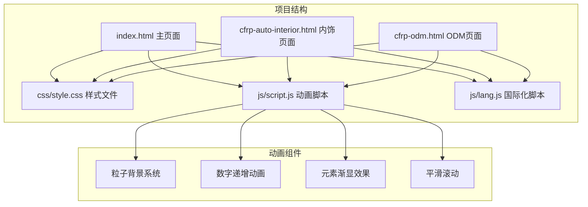
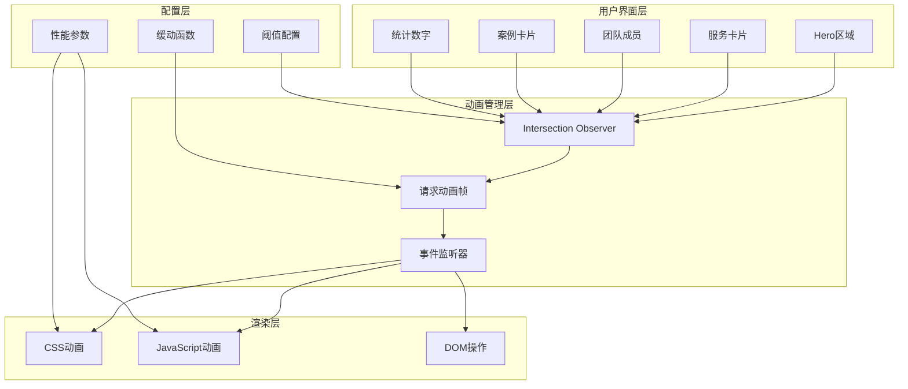
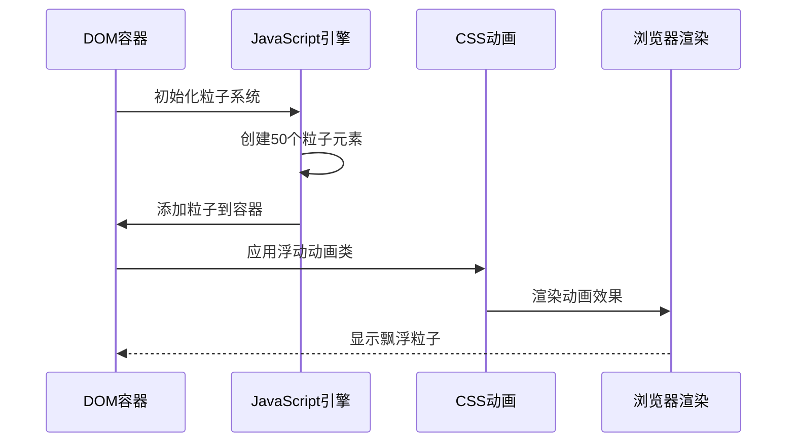
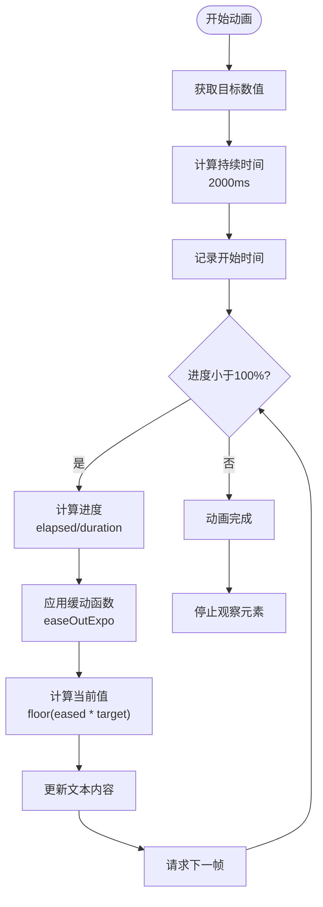
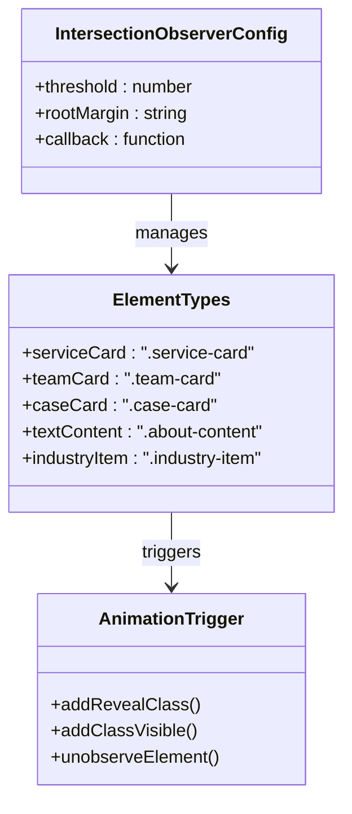
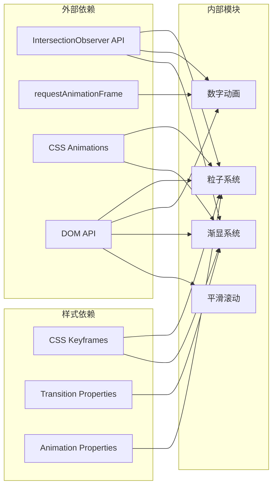

# 动画效果

<cite>
**本文档引用的文件**
- [index.html](file://index.html)
- [script.js](file://js/script.js)
- [style.css](file://css/style.css)
- [lang.js](file://js/lang.js)
- [cfrp-auto-interior.html](file://cfrp-auto-interior.html)
- [cfrp-odm.html](file://cfrp-odm.html)
</cite>

## 目录
1. [简介](#简介)
2. [项目结构](#项目结构)
3. [核心组件](#核心组件)
4. [架构概览](#架构概览)
5. [详细组件分析](#详细组件分析)
6. [依赖关系分析](#依赖关系分析)
7. [性能考虑](#性能考虑)
8. [故障排除指南](#故障排除指南)
9. [结论](#结论)

## 简介

HYT网站动画效果系统是一个集成了多种现代Web动画技术的综合解决方案。该系统通过CSS动画、JavaScript动画框架和Intersection Observer API实现了流畅的用户体验，包括粒子背景动画、数字递增动画和元素渐显效果。

本指南将深入解析动画系统的实现原理，提供性能优化建议和自定义动画开发指南，帮助开发者理解和扩展现有的动画功能。

## 项目结构

项目采用模块化架构，将动画相关的代码分离到独立的JavaScript文件中，便于维护和扩展：

**图表来源**
- [index.html:1-337](file://index.html#L1-L337)
- [script.js:1-344](file://js/script.js#L1-L344)

**章节来源**
- [index.html:1-337](file://index.html#L1-L337)
- [script.js:1-344](file://js/script.js#L1-L344)

## 核心组件

### 粒子背景动画系统

粒子背景系统是网站的核心视觉效果之一，通过Canvas技术实现动态的粒子飘浮效果。系统包含以下关键特性：

- **随机化参数**：粒子大小、位置、动画时长和延迟都是随机生成的
- **无限循环**：每个粒子都设置为无限重复的动画
- **性能优化**：使用CSS动画而非JavaScript动画，减少CPU负载

### 数字递增动画

数字递增动画通过Intersection Observer API触发，使用缓动函数实现平滑的数值增长效果：

- **阈值触发**：当元素进入视口50%时开始动画
- **缓动函数**：采用指数缓出函数(easeOutExpo)提供自然的视觉效果
- **精度控制**：使用Math.floor确保整数显示

### 元素渐显效果

元素渐显系统使用Intersection Observer API实现滚动触发的元素显示效果：

- **多元素支持**：同时管理多个不同类型的元素
- **阈值配置**：不同的元素类型使用不同的触发阈值
- **一次性观察**：动画完成后自动停止观察

**章节来源**
- [script.js:54-115](file://js/script.js#L54-L115)
- [script.js:117-139](file://js/script.js#L117-L139)

## 架构概览

动画系统采用分层架构设计，各组件职责明确且相互独立：

**图表来源**
- [script.js:81-115](file://js/script.js#L81-L115)
- [script.js:117-139](file://js/script.js#L117-L139)

## 详细组件分析

### 粒子背景动画系统

#### 实现原理

粒子系统通过JavaScript动态创建DOM元素并应用CSS动画：

**图表来源**
- [script.js:55-79](file://js/script.js#L55-L79)
- [style.css:210-237](file://css/style.css#L210-L237)

#### 粒子属性配置

每个粒子都具有独特的属性配置：

| 属性 | 范围 | 作用 |
|------|------|------|
| 大小 | 2-6px | 控制粒子视觉密度 |
| 位置 | 0-100% | 随机分布位置 |
| 动画时长 | 8-18秒 | 控制飘浮速度 |
| 动画延迟 | 0-10秒 | 避免同步效应 |

**章节来源**
- [script.js:55-79](file://js/script.js#L55-L79)
- [style.css:215-237](file://css/style.css#L215-L237)

### 数字递增动画系统

#### 缓动函数实现

数字递增动画使用指数缓出函数实现自然的视觉效果：

**图表来源**
- [script.js:82-115](file://js/script.js#L82-L115)

#### 性能优化策略

数字递增动画采用了多项性能优化措施：

- **requestAnimationFrame**：使用浏览器优化的动画帧调度
- **缓动函数**：避免复杂的数学计算开销
- **一次性观察**：动画完成后自动停止观察器
- **阈值优化**：50%阈值平衡性能和用户体验

**章节来源**
- [script.js:82-115](file://js/script.js#L82-L115)

### 元素渐显效果系统

#### 观察器配置

元素渐显系统针对不同类型元素设置了专门的配置：

**图表来源**
- [script.js:117-139](file://js/script.js#L117-L139)

#### 触发机制

不同元素类型使用不同的触发阈值：

| 元素类型 | 阈值 | 根边距 | 触发时机 |
|----------|------|--------|----------|
| 服务卡片 | 0.15 | 0px 0px -50px 0px | 卡片顶部进入视口 |
| 团队卡片 | 0.15 | 0px 0px -50px 0px | 卡片顶部进入视口 |
| 案例卡片 | 0.15 | 0px 0px -50px 0px | 卡片顶部进入视口 |
| 文本内容 | 0.15 | 0px 0px -50px 0px | 文本顶部进入视口 |
| 行业图标 | 0.15 | 0px 0px -50px 0px | 图标顶部进入视口 |

**章节来源**
- [script.js:117-139](file://js/script.js#L117-L139)

## 依赖关系分析

动画系统与其他组件的依赖关系如下：

**图表来源**
- [script.js:85-115](file://js/script.js#L85-L115)
- [script.js:127-139](file://js/script.js#L127-L139)

**章节来源**
- [script.js:1-344](file://js/script.js#L1-L344)
- [style.css:1-800](file://css/style.css#L1-L800)

## 性能考虑

### 优化策略

1. **硬件加速**：所有动画都使用transform和opacity属性，这些属性可以触发GPU加速
2. **内存管理**：动画完成后及时释放观察器和事件监听器
3. **计算优化**：使用简单的数学运算和缓动函数
4. **DOM操作最小化**：尽量减少DOM查询和修改次数

### 性能监控

建议使用以下方法监控动画性能：

- **Chrome DevTools**：使用Performance面板分析动画帧率
- **FPS Meter**：监控实际帧率表现
- **Memory Profiler**：检查内存泄漏情况
- **Network Tab**：监控资源加载对动画的影响

### 最佳实践

1. **避免强制同步布局**：不要在动画过程中读取布局信息
2. **使用will-change属性**：为频繁变化的元素添加will-change提示
3. **控制动画数量**：限制同时运行的动画数量
4. **优化缓动函数**：选择适合场景的缓动函数

## 故障排除指南

### 常见问题及解决方案

#### 粒子动画不显示

**症状**：页面空白或只有静态背景
**原因**：
- DOM元素未找到
- CSS样式未正确加载
- JavaScript执行错误

**解决方案**：
1. 检查particles容器是否存在
2. 确认CSS动画类已正确应用
3. 查看浏览器控制台错误信息

#### 数字动画不触发

**症状**：数字保持不变
**原因**：
- Intersection Observer不支持
- 阈值设置不当
- 元素不在视口范围内

**解决方案**：
1. 检查浏览器兼容性
2. 调整阈值参数
3. 确认元素可见性

#### 渐显动画延迟

**症状**：元素出现明显延迟
**原因**：
- 观察器配置不当
- 元素高度计算问题
- CSS过渡动画冲突

**解决方案**：
1. 调整rootMargin参数
2. 检查CSS z-index层级
3. 简化CSS过渡动画

**章节来源**
- [script.js:177-195](file://js/script.js#L177-L195)

## 结论

HYT网站动画效果系统展现了现代Web动画技术的最佳实践。通过合理的架构设计和性能优化，系统实现了流畅的用户体验，同时保持了良好的可维护性和扩展性。

### 系统优势

1. **模块化设计**：动画功能独立封装，便于维护和测试
2. **性能优化**：采用硬件加速和优化的动画策略
3. **跨浏览器兼容**：使用标准API确保广泛的兼容性
4. **可扩展性**：清晰的接口设计支持功能扩展

### 改进建议

1. **动画状态管理**：可以考虑引入更完善的动画状态管理系统
2. **性能监控**：集成实时性能监控和自动降级机制
3. **动画预加载**：对于重要的动画效果，可以考虑预加载策略
4. **无障碍支持**：增强动画的无障碍访问支持

该动画系统为类似项目的开发提供了优秀的参考模板，展示了如何在保持高性能的同时实现丰富的视觉效果。