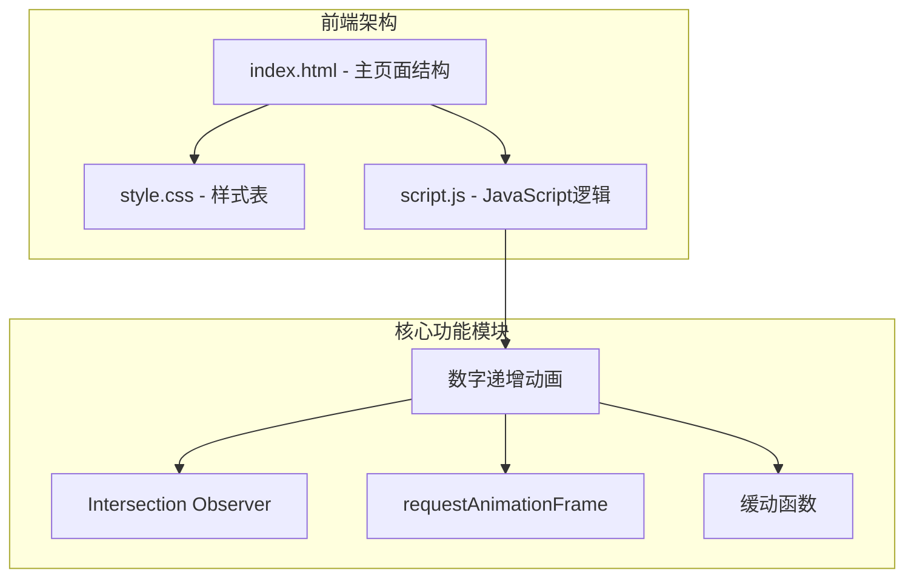
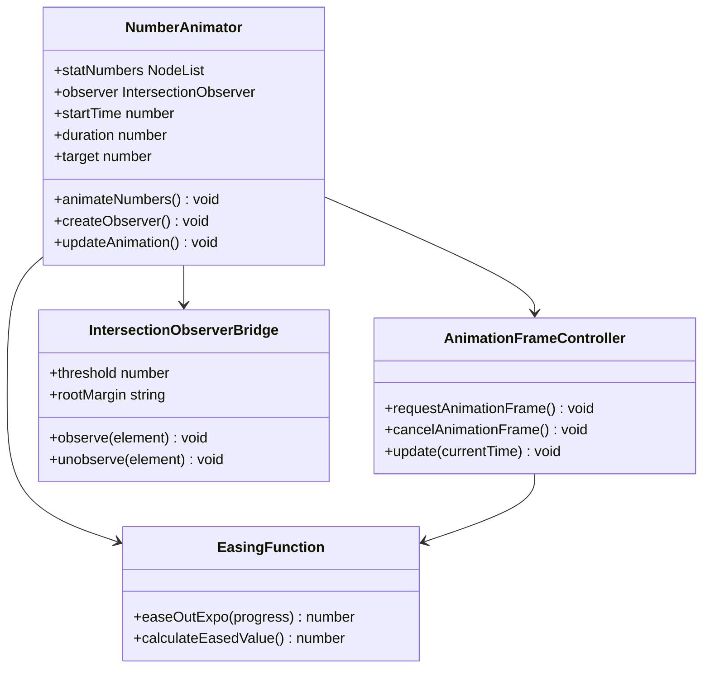
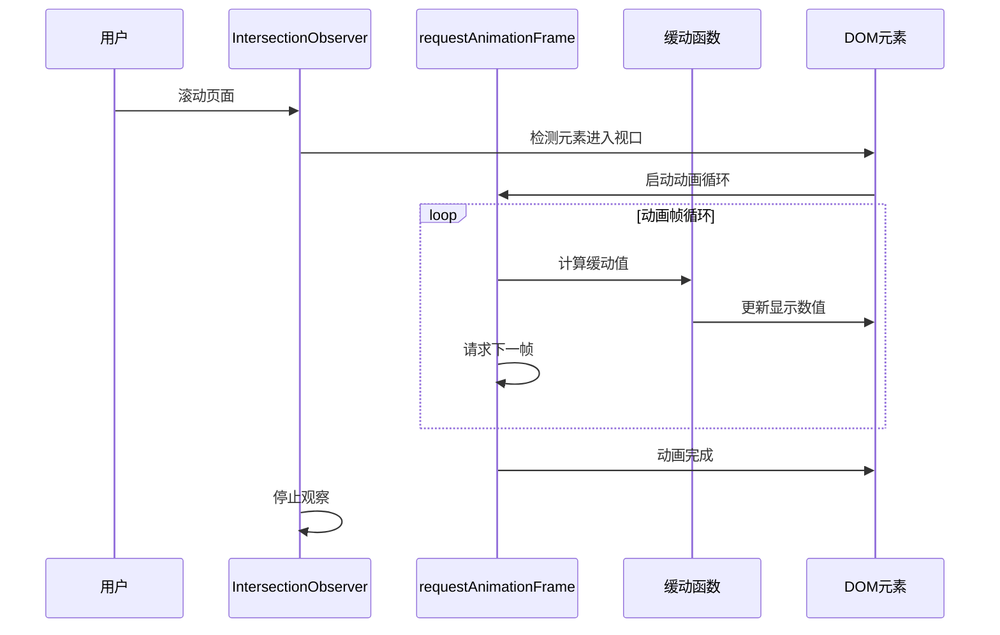
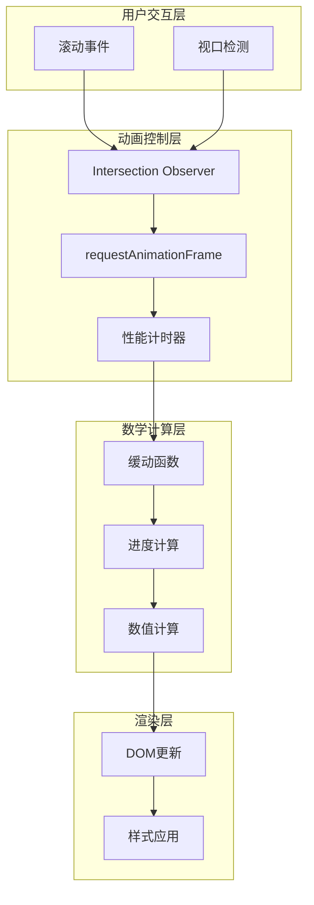
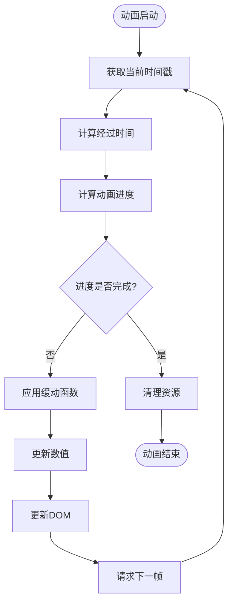
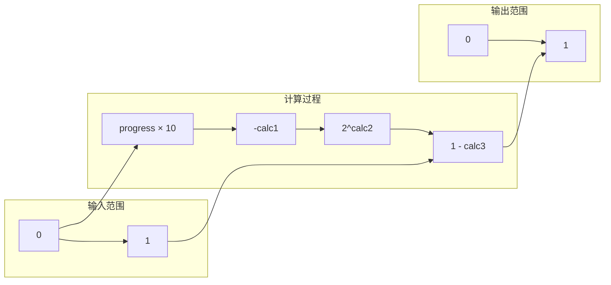
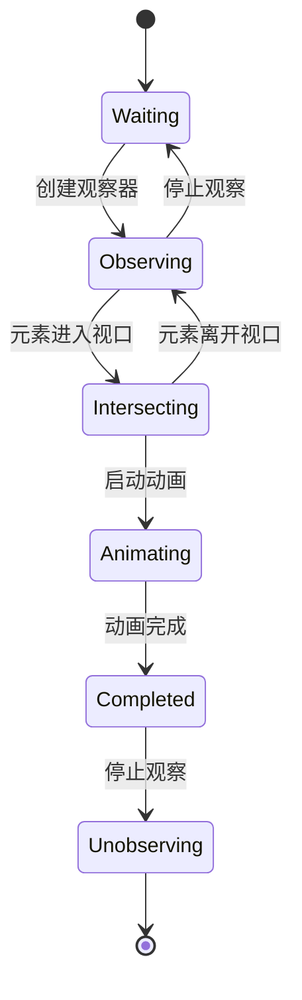
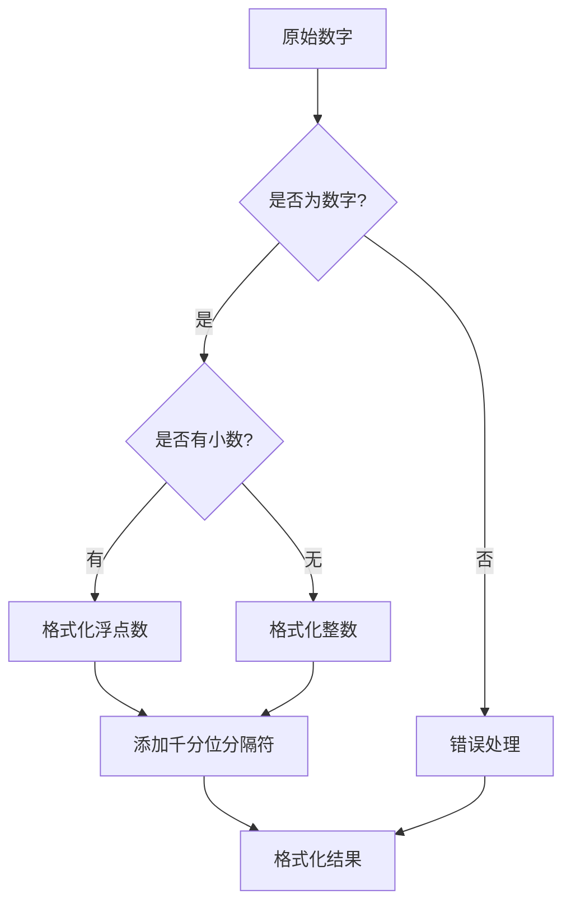
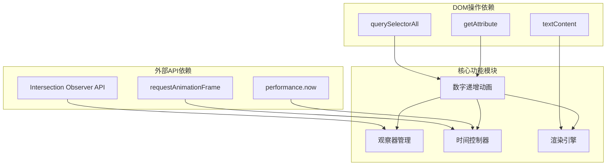
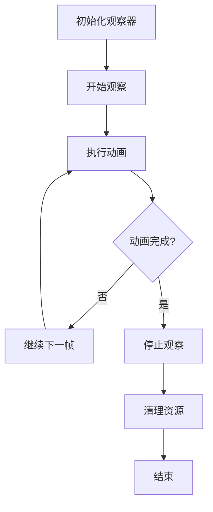

# 数字递增动画

<cite>
**本文档引用的文件**
- [index.html](file://index.html)
- [script.js](file://js/script.js)
- [style.css](file://css/style.css)
</cite>

## 目录
1. [简介](#简介)
2. [项目结构](#项目结构)
3. [核心组件](#核心组件)
4. [架构概览](#架构概览)
5. [详细组件分析](#详细组件分析)
6. [依赖关系分析](#依赖关系分析)
7. [性能考虑](#性能考虑)
8. [故障排除指南](#故障排除指南)
9. [结论](#结论)

## 简介

本文档为HYT网站数字递增动画创建详细的技术实现指南。深入解析requestAnimationFrame的使用原理和动画帧控制机制，详细说明缓动函数easeOutExpo的数学公式和实现过程，解释Intersection Observer API在触发动画中的应用和阈值配置。提供数字格式化和千分位分隔符的实现方案，并包含动画性能优化技巧和浏览器兼容性处理方法。

## 项目结构

HYT网站采用简洁的三层架构设计：



**图表来源**
- [index.html:1-337](file://index.html#L1-L337)
- [script.js:81-115](file://js/script.js#L81-L115)

项目采用模块化设计，JavaScript文件包含多个独立的功能模块，每个模块负责特定的交互功能。

**章节来源**
- [index.html:1-337](file://index.html#L1-L337)
- [script.js:1-344](file://js/script.js#L1-L344)

## 核心组件

### 数字递增动画系统

数字递增动画系统是本项目的核心视觉效果组件，实现了平滑的数值增长动画效果。

#### 组件架构



**图表来源**
- [script.js:81-115](file://js/script.js#L81-L115)
- [script.js:93-104](file://js/script.js#L93-L104)

#### 数据流分析



**图表来源**
- [script.js:85-110](file://js/script.js#L85-L110)
- [script.js:93-104](file://js/script.js#L93-L104)

**章节来源**
- [script.js:81-115](file://js/script.js#L81-L115)

## 架构概览

### 整体架构设计

数字递增动画系统采用事件驱动的架构模式，结合现代Web API实现高性能的动画效果。



**图表来源**
- [script.js:82-115](file://js/script.js#L82-L115)
- [script.js:93-104](file://js/script.js#L93-L104)

### 性能架构

系统采用多层性能优化策略：

1. **懒加载触发**：使用Intersection Observer延迟初始化动画
2. **帧率优化**：通过requestAnimationFrame确保60fps
3. **内存管理**：动画完成后自动停止观察
4. **计算优化**：最小化DOM操作次数

**章节来源**
- [script.js:85-110](file://js/script.js#L85-L110)

## 详细组件分析

### requestAnimationFrame 实现详解

#### 帧控制机制

requestAnimationFrame是现代Web动画的核心API，提供了高效的帧调度机制。



**图表来源**
- [script.js:93-104](file://js/script.js#L93-L104)

#### 时间管理策略

系统使用performance.now()进行高精度时间测量：

- **时间基准**：以毫秒为单位的高精度时间戳
- **帧间隔**：浏览器自动管理的最佳帧间隔
- **同步机制**：与浏览器刷新率同步，避免丢帧

**章节来源**
- [script.js:91-102](file://js/script.js#L91-L102)

### 缓动函数 easeOutExpo 数学分析

#### 数学公式实现

easeOutExpo（指数缓出）函数提供了自然的加速-减速动画效果：

**数学表达式**：
```
easeOutExpo(t) = {
    1,                    if t = 1
    1 - 2^(-10t),         if t < 1
}
```

其中 t ∈ [0, 1] 表示动画进度。

#### 实现细节



**图表来源**
- [script.js:96-98](file://js/script.js#L96-L98)

#### 缓动特性分析

| 进度阶段 | 数学特性 | 视觉效果 |
|---------|---------|---------|
| 0% | f(0) = 0 | 立即开始，无延迟 |
| 25% | f(0.25) ≈ 0.06 | 缓慢起步 |
| 50% | f(0.5) ≈ 0.25 | 中速推进 |
| 75% | f(0.75) ≈ 0.5 | 快速接近目标 |
| 100% | f(1) = 1 | 精确到达目标 |

**章节来源**
- [script.js:96-98](file://js/script.js#L96-L98)

### Intersection Observer API 应用

#### 触发机制设计

Intersection Observer API提供了高效的元素可见性检测机制：



**图表来源**
- [script.js:85-110](file://js/script.js#L85-L110)

#### 阈值配置策略

系统采用以下配置参数：

| 参数 | 值 | 作用 | 优势 |
|------|-----|------|------|
| threshold | 0.5 | 半数像素可见时触发 | 提前触发，避免空白等待 |
| rootMargin | 默认 | 根容器边距调整 | 精确控制触发时机 |
| root | null | 根容器 | 使用视窗作为参考 |

**章节来源**
- [script.js:110](file://js/script.js#L110)

### 数字格式化实现方案

#### 千分位分隔符方案

虽然当前实现使用整数格式，但可扩展为支持千分位分隔符：



#### 格式化选项配置

| 选项 | 默认值 | 说明 |
|------|--------|------|
| minimumIntegerDigits | 1 | 最少整数位数 |
| minimumFractionDigits | 0 | 最少小数位数 |
| maximumFractionDigits | 0 | 最多小数位数 |
| useGrouping | true | 是否使用分组分隔符 |

**章节来源**
- [script.js:98](file://js/script.js#L98)

## 依赖关系分析

### 组件间依赖关系



**图表来源**
- [script.js:82-115](file://js/script.js#L82-L115)

### 外部依赖分析

系统对外部依赖保持最小化：

1. **现代浏览器API**：依赖现代Web标准
2. **DOM选择器**：使用标准查询接口
3. **CSS类名**：遵循约定式命名
4. **数据属性**：使用HTML5数据属性

**章节来源**
- [script.js:83-112](file://js/script.js#L83-L112)

## 性能考虑

### 性能优化策略

#### 帧率优化

1. **requestAnimationFrame集成**：确保60fps动画
2. **最小化DOM操作**：减少重排重绘
3. **内存泄漏防护**：及时清理观察器

#### 内存管理



**图表来源**
- [script.js:107](file://js/script.js#L107)

#### 浏览器兼容性

| 特性 | 支持情况 | 兼容性方案 |
|------|----------|-----------|
| Intersection Observer | 现代浏览器 | polyfill或降级方案 |
| requestAnimationFrame | 现代浏览器 | 兼容性回退 |
| performance.now | 现代浏览器 | Date.now降级 |
| CSS3动画 | 现代浏览器 | 渐进增强 |

**章节来源**
- [script.js:85-110](file://js/script.js#L85-L110)

## 故障排除指南

### 常见问题诊断

#### 动画不触发

**可能原因**：
1. 元素不在视口中
2. Intersection Observer不支持
3. CSS样式阻止元素显示

**排查步骤**：
1. 检查元素是否具有正确的类名
2. 验证CSS样式是否影响元素可见性
3. 确认浏览器支持相关API

#### 动画卡顿

**可能原因**：
1. 过多DOM操作
2. 复杂的CSS动画冲突
3. 页面滚动性能问题

**解决方案**：
1. 减少DOM查询频率
2. 优化CSS动画
3. 使用will-change属性

#### 数值显示异常

**可能原因**：
1. data-target属性值无效
2. 数字过大导致精度丢失
3. 格式化错误

**修复方法**：
1. 验证data-target属性值
2. 使用BigInt处理大数字
3. 实施适当的格式化逻辑

**章节来源**
- [script.js:88-108](file://js/script.js#L88-L108)

## 结论

HYT网站的数字递增动画系统展现了现代Web动画技术的最佳实践。通过巧妙结合Intersection Observer API、requestAnimationFrame和缓动函数，实现了高性能、流畅的用户体验。

### 技术亮点

1. **性能优化**：采用懒加载和帧率优化策略
2. **用户体验**：提供自然的动画过渡效果
3. **可维护性**：模块化设计便于扩展和维护
4. **兼容性**：平衡新特性和向后兼容

### 改进建议

1. **增强格式化**：添加千分位分隔符支持
2. **扩展缓动**：提供更多缓动函数选项
3. **国际化**：支持多语言数字格式
4. **监控**：添加性能监控和错误报告

该系统为类似项目提供了优秀的参考实现，展示了如何在现代Web环境中构建高质量的动画效果。