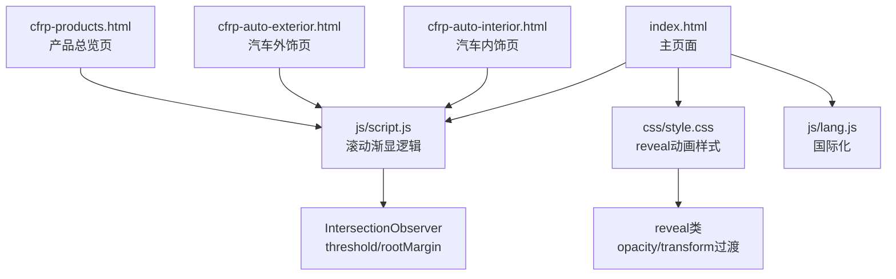
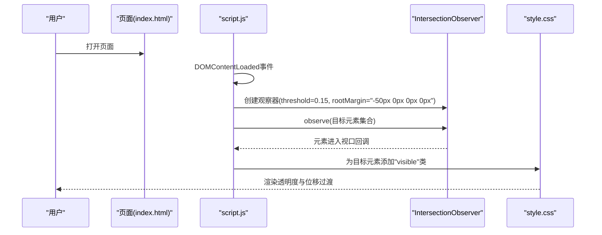
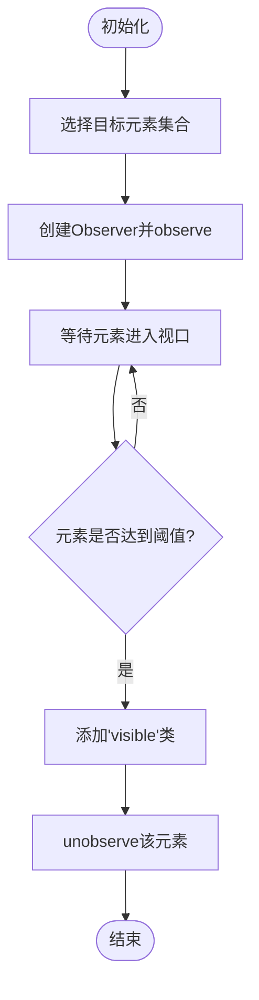
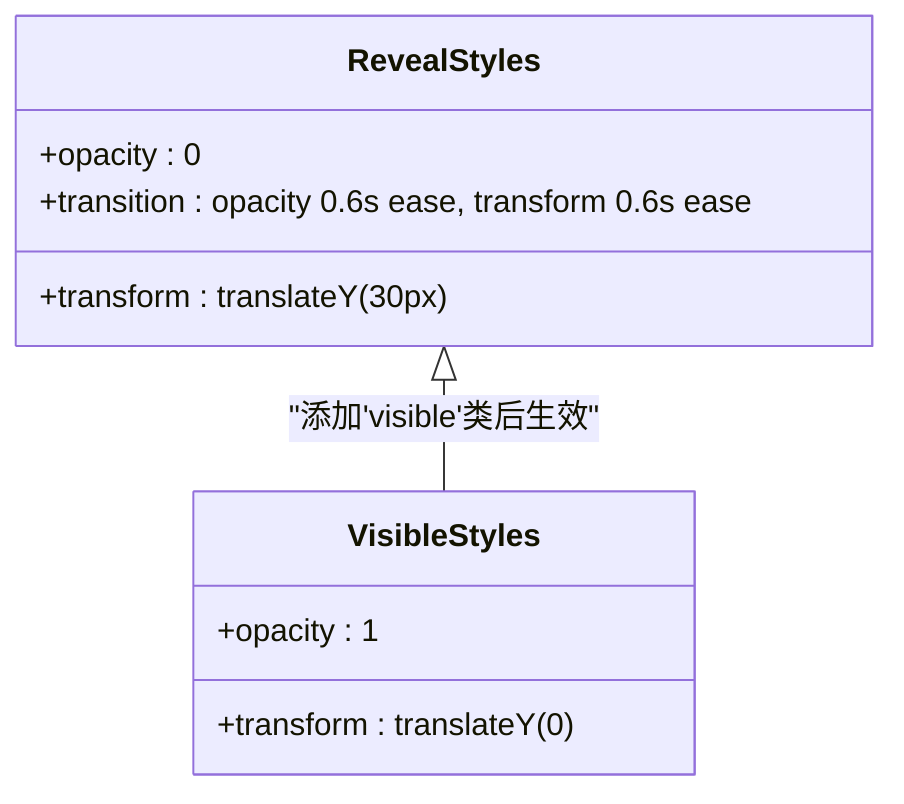
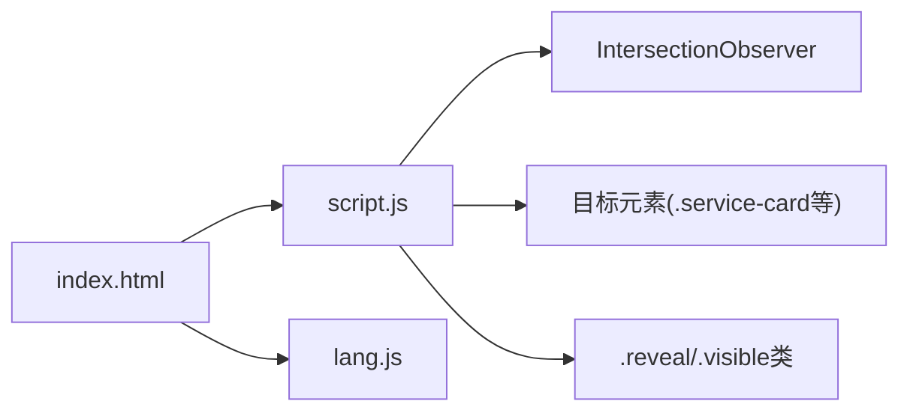

# 滚动渐显动画

<cite>
**本文引用的文件**
- [index.html](file://index.html)
- [script.js](file://js/script.js)
- [style.css](file://css/style.css)
- [lang.js](file://js/lang.js)
- [cfrp-auto-interior.html](file://cfrp-auto-interior.html)
- [cfrp-auto-exterior.html](file://cfrp-auto-exterior.html)
- [cfrp-products.html](file://cfrp-products.html)
</cite>

## 目录
1. [简介](#简介)
2. [项目结构](#项目结构)
3. [核心组件](#核心组件)
4. [架构总览](#架构总览)
5. [详细组件分析](#详细组件分析)
6. [依赖关系分析](#依赖关系分析)
7. [性能考量](#性能考量)
8. [故障排查指南](#故障排查指南)
9. [结论](#结论)
10. [附录](#附录)

## 简介
本技术文档围绕HYT网站的“滚动渐显动画”实现进行系统化梳理，重点解析以下方面：
- Intersection Observer API的配置参数与回调处理机制
- CSS transition与transform属性的协同使用
- rootMargin与threshold对触发时机的影响
- 不同元素类型的动画配置方案与性能优化策略
- 移动端触摸设备的特殊处理与浏览器兼容性方案

该实现通过Intersection Observer监听目标元素进入视口时触发CSS类切换，从而驱动平滑的淡入与位移动画，兼顾跨设备体验与性能表现。

## 项目结构
项目采用多页面结构，主站为index.html，配套产品与服务页面（如汽车内饰、外饰、产品总览）。核心逻辑集中在js/script.js中，样式定义在css/style.css中，国际化文案在js/lang.js中。

图表来源
- [index.html](file://index.html)
- [script.js](file://js/script.js)
- [style.css](file://css/style.css)
- [cfrp-auto-interior.html](file://cfrp-auto-interior.html)
- [cfrp-auto-exterior.html](file://cfrp-auto-exterior.html)
- [cfrp-products.html](file://cfrp-products.html)

章节来源
- [index.html](file://index.html)
- [script.js](file://js/script.js)
- [style.css](file://css/style.css)

## 核心组件
- Intersection Observer配置与回调
  - 观察目标：服务卡片、团队卡片、案例卡片、关于内容、行业图标等
  - 触发条件：阈值threshold为0.15；根边距rootMargin设置为“0px 0px -50px 0px”
  - 回调行为：元素进入视口时添加“visible”类，停止对该元素的观察
- CSS动画样式
  - .reveal初始状态：透明度0、向下偏移30px
  - .reveal.visible：透明度1、无偏移，配合过渡属性实现平滑动画
- JavaScript初始化
  - 在DOM加载完成后执行滚动渐显初始化

章节来源
- [script.js:117-139](file://js/script.js#L117-L139)
- [style.css:995-1005](file://css/style.css#L995-L1005)

## 架构总览
滚动渐显的整体流程如下：页面加载后，脚本收集目标元素，创建IntersectionObserver实例并设置阈值与根边距，当元素进入视口时，为元素添加“visible”类，CSS过渡负责渲染透明度与位移变化。

图表来源
- [script.js:117-139](file://js/script.js#L117-L139)
- [style.css:995-1005](file://css/style.css#L995-L1005)

## 详细组件分析

### Intersection Observer配置与回调
- 观察目标选择
  - 选择器：'.service-card, .team-card, .case-card, .about-content, .industry-item'
  - 目标：页面中多个区块的容器元素，用于在滚动时逐个显示
- 观察器参数
  - threshold: 0.15，表示元素15%可见时即触发回调
  - rootMargin: '0px 0px -50px 0px'，将触发区域上移50px，使元素在接近屏幕顶部时提前触发，增强流畅感
- 回调处理
  - 当元素进入视口时，为其添加“visible”类，随后停止对该元素的观察，避免重复触发
- 初始化时机
  - 在DOM加载完成后执行，确保目标元素已渲染

图表来源
- [script.js:117-139](file://js/script.js#L117-L139)

章节来源
- [script.js:117-139](file://js/script.js#L117-L139)

### CSS transition与transform配合
- 初始状态(.reveal)
  - opacity: 0
  - transform: translateY(30px)
  - transition: opacity 0.6s ease, transform 0.6s ease
- 可见状态(.reveal.visible)
  - opacity: 1
  - transform: translateY(0)
- 效果说明
  - 通过透明度与垂直位移的组合，形成“从模糊到清晰、从下方弹入”的自然入场动画
  - 过渡时长与缓动函数统一，保证视觉节奏一致

图表来源
- [style.css:995-1005](file://css/style.css#L995-L1005)

章节来源
- [style.css:995-1005](file://css/style.css#L995-L1005)

### rootMargin与threshold对触发时机的影响
- threshold=0.15
  - 元素仅15%可见时即触发，适合在用户即将滚动到元素位置时提前显示，减少等待感
- rootMargin='-50px 0px 0px 0px'
  - 将触发区域上移50px，使元素在接近屏幕顶部时触发，进一步优化首屏体验
- 组合效果
  - 提前触发+靠近顶部触发，使动画在用户视线即将到达元素时出现，增强连贯性

章节来源
- [script.js](file://js/script.js#L134)

### 不同元素类型的动画配置方案
- 卡片类（服务卡、案例卡、团队卡）
  - 使用.reveal + .reveal.visible即可实现统一的淡入与上移效果
  - 适用于网格布局中的卡片，保持视觉一致性
- 文本内容（关于内容、行业图标）
  - 同样适用.reveal.visible，但可根据内容密度调整过渡时长或缓动函数
- 多页面复用
  - 主页index.html与产品页（如cfrp-auto-interior.html）均引入script.js，因此无需重复配置即可获得相同动画效果

章节来源
- [script.js:117-139](file://js/script.js#L117-L139)
- [style.css:995-1005](file://css/style.css#L995-L1005)
- [cfrp-auto-interior.html](file://cfrp-auto-interior.html)

### 性能优化建议
- 观察器去重与解绑
  - 元素进入视口后立即unobserve，避免后续滚动重复触发
- 合理的阈值与根边距
  - 阈值与根边距需结合页面滚动速度与动画时长权衡，避免过度触发导致抖动
- 减少重绘与重排
  - 使用transform与opacity而非改变布局属性，有利于GPU加速
- 懒加载与分批观察
  - 对长列表可考虑分批观察或延迟初始化，降低首屏压力
- 响应式适配
  - 在小屏设备上适当增大rootMargin，确保在滚动时有足够提前触发空间

章节来源
- [script.js:127-136](file://js/script.js#L127-L136)
- [style.css:995-1005](file://css/style.css#L995-L1005)

### 移动端触摸设备的特殊处理
- 触摸滚动的流畅性
  - Intersection Observer在移动端同样有效，但需注意滚动事件频率与动画帧率
- 根边距调整
  - 可在移动端适当增加rootMargin，确保在手指快速滚动时仍能提前触发
- 触摸反馈
  - 结合页面滚动高亮与导航联动，提升整体交互体验

章节来源
- [script.js](file://js/script.js#L134)

### 浏览器兼容性方案
- Intersection Observer支持现状
  - 现代浏览器普遍支持；对于旧版浏览器，可通过polyfill实现降级
- polyfill引入方式
  - 在页面头部引入polyfill脚本，确保Observer可用后再执行初始化逻辑
- 回退策略
  - 若Observer不可用，可改用传统的scroll事件监听，但需自行处理节流与性能问题
- 建议
  - 在构建流程中按需注入polyfill，避免对现代浏览器造成额外负担

[本节为通用指导，不直接分析具体文件，故无章节来源]

## 依赖关系分析
- 脚本依赖
  - script.js依赖DOM结构中的目标元素类名（如.service-card等），若HTML结构调整需同步更新选择器
- 样式依赖
  - .reveal与.reveal.visible类由CSS控制动画，JS仅负责添加类名
- 国际化影响
  - lang.js负责动态更新文案，不影响滚动渐显逻辑，但需确保页面加载顺序正确

图表来源
- [index.html](file://index.html)
- [script.js](file://js/script.js)
- [style.css](file://css/style.css)
- [lang.js](file://js/lang.js)

章节来源
- [index.html](file://index.html)
- [script.js](file://js/script.js)
- [style.css](file://css/style.css)
- [lang.js](file://js/lang.js)

## 性能考量
- 观察器粒度
  - 将目标元素分组观察，避免一次性observe过多元素
- 动画参数
  - 适度的过渡时长与缓动函数，避免过长导致感知延迟
- 设备差异
  - 移动端可适当放宽阈值与根边距，减少频繁触发
- 资源占用
  - 避免在动画期间执行昂贵操作（如大量DOM查询）

[本节提供一般性建议，不直接分析具体文件，故无章节来源]

## 故障排查指南
- 动画未触发
  - 检查目标元素是否存在且类名匹配
  - 确认script.js已正确加载并在DOMContentLoaded后执行
  - 查看浏览器控制台是否有错误
- 动画过早或过晚触发
  - 调整threshold与rootMargin参数
  - 在移动端验证触发边界是否合适
- 动画卡顿
  - 检查是否使用transform与opacity
  - 避免在同一帧内修改大量布局属性
- 国际化影响
  - 确保lang.js在script.js之前加载，避免DOM尚未就绪导致的选择器失效

章节来源
- [script.js:117-139](file://js/script.js#L117-L139)
- [style.css:995-1005](file://css/style.css#L995-L1005)
- [lang.js](file://js/lang.js)

## 结论
HYT网站的滚动渐显动画通过Intersection Observer与CSS过渡的有机结合，实现了简洁高效的入场动画。合理的threshold与rootMargin配置提升了用户体验，而transform与opacity的使用则保证了良好的性能表现。在多页面场景下，该方案具备良好的复用性与扩展性，适合在类似项目中推广使用。

[本节为总结性内容，不直接分析具体文件，故无章节来源]

## 附录
- 相关页面
  - 主页：index.html
  - 汽车内饰页：cfrp-auto-interior.html
  - 汽车外饰页：cfrp-auto-exterior.html
  - 产品总览页：cfrp-products.html
- 关键实现位置
  - 观察器与回调：[script.js:117-139](file://js/script.js#L117-L139)
  - 动画样式：[style.css:995-1005](file://css/style.css#L995-L1005)
  - 国际化支持：[lang.js](file://js/lang.js)

[本节为辅助信息，不直接分析具体文件，故无章节来源]