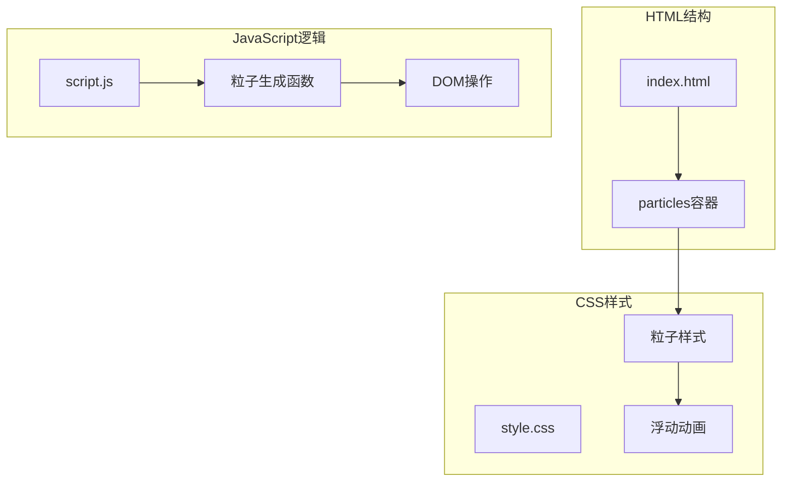
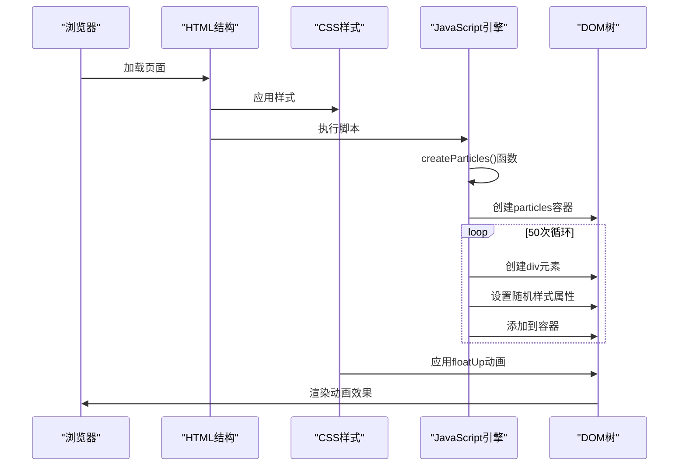
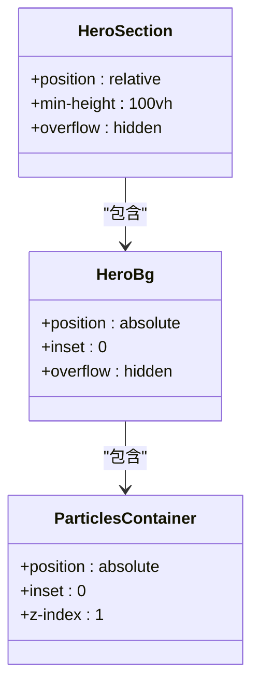
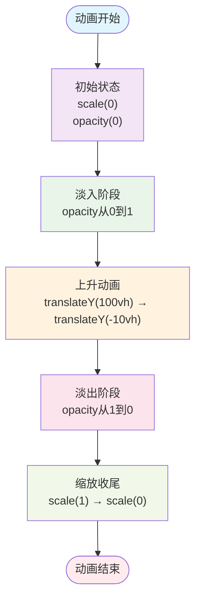
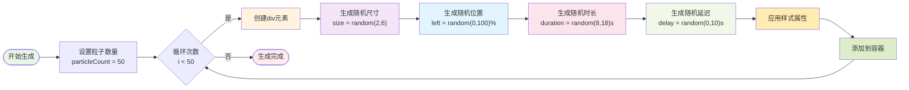
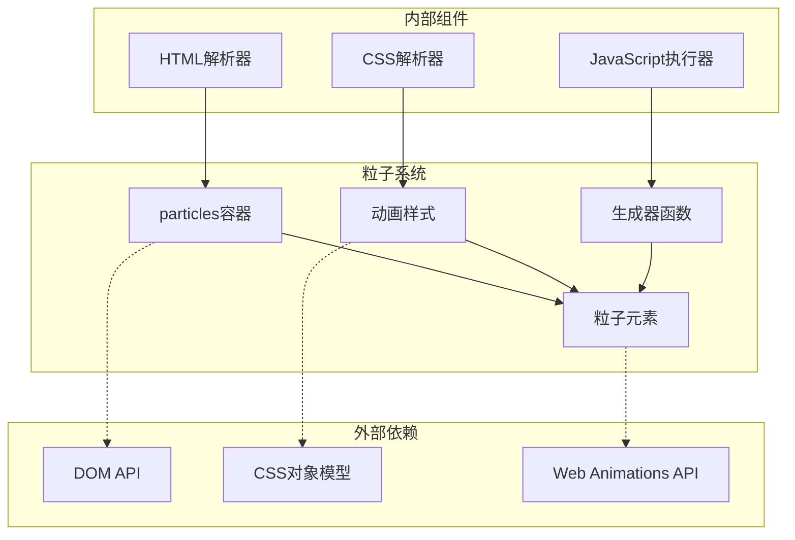

# 粒子背景动画技术实现指南

<cite>
**本文档引用的文件**
- [index.html](file://index.html)
- [style.css](file://css/style.css)
- [script.js](file://js/script.js)
- [lang.js](file://js/lang.js)
</cite>

## 目录
1. [简介](#简介)
2. [项目结构](#项目结构)
3. [核心组件](#核心组件)
4. [架构概览](#架构概览)
5. [详细组件分析](#详细组件分析)
6. [依赖关系分析](#依赖关系分析)
7. [性能考虑](#性能考虑)
8. [故障排除指南](#故障排除指南)
9. [结论](#结论)

## 简介

本指南深入解析HYT网站的Canvas粒子背景动画实现，这是一个基于CSS动画和JavaScript DOM操作的高性能粒子系统。该系统通过50个随机生成的白色半透明圆形粒子，在页面加载时自动创建并启动无限循环的上升动画效果。

## 项目结构

HYT网站采用简洁的三层架构：
- **HTML结构层**：负责页面骨架和粒子容器布局
- **CSS样式层**：定义粒子外观和动画效果
- **JavaScript逻辑层**：实现粒子生成和动态配置



**图表来源**
- [index.html:35-56](file://index.html#L35-L56)
- [style.css:210-237](file://css/style.css#L210-L237)
- [script.js:54-79](file://js/script.js#L54-L79)

**章节来源**
- [index.html:1-337](file://index.html#L1-L337)
- [style.css:1-1345](file://css/style.css#L1-L1345)
- [script.js:1-344](file://js/script.js#L1-L344)

## 核心组件

### 粒子容器系统

粒子系统的核心由三个关键组件构成：

1. **DOM容器**：位于页面英雄区域的particles元素
2. **CSS动画定义**：floatUp关键帧动画
3. **JavaScript生成器**：动态创建和配置粒子

### 粒子生成算法

系统采用随机参数配置算法，每个粒子具有以下属性：
- **大小**：2-6像素范围内的随机尺寸
- **位置**：水平位置百分比随机分布
- **动画时长**：8-18秒的随机持续时间
- **动画延迟**：0-10秒的随机延迟

**章节来源**
- [script.js:54-79](file://js/script.js#L54-L79)
- [style.css:210-237](file://css/style.css#L210-L237)

## 架构概览

粒子背景动画采用事件驱动的初始化模式：



**图表来源**
- [script.js:54-79](file://js/script.js#L54-L79)
- [index.html:35-56](file://index.html#L35-L56)
- [style.css:210-237](file://css/style.css#L210-L237)

## 详细组件分析

### DOM容器设计

粒子容器采用绝对定位策略，确保与页面其他元素的层级关系：



**图表来源**
- [index.html:35-56](file://index.html#L35-L56)
- [style.css:193-213](file://css/style.css#L193-L213)

### CSS动画属性系统

粒子动画采用关键帧动画技术，结合多个CSS属性实现流畅的视觉效果：

#### 动画属性配置

| 属性名称 | 值类型 | 变化范围 | 功能描述 |
|---------|--------|----------|----------|
| animation-duration | 时间值 | 8-18秒 | 控制粒子完成一次动画的总时长 |
| animation-delay | 时间值 | 0-10秒 | 控制粒子动画开始的延迟时间 |
| transform | 位移变换 | translateY(-10vh) | 控制粒子垂直位置变化 |
| opacity | 透明度 | 0-1 | 控制粒子透明度变化 |
| scale | 缩放变换 | 0-1 | 控制粒子大小变化 |

#### 动画时序分析



**图表来源**
- [style.css:222-237](file://css/style.css#L222-L237)

**章节来源**
- [style.css:210-237](file://css/style.css#L210-L237)
- [script.js:64-73](file://js/script.js#L64-L73)

### JavaScript粒子生成器

粒子生成器采用工厂模式设计，每次执行创建固定数量的粒子元素：

#### 粒子参数生成算法



**图表来源**
- [script.js:54-79](file://js/script.js#L54-L79)

#### 样式应用策略

每个粒子元素通过内联样式应用随机配置：

- **width/height**：设置圆形尺寸
- **left**：设置水平位置
- **animation-duration**：设置动画时长
- **animation-delay**：设置动画延迟

**章节来源**
- [script.js:54-79](file://js/script.js#L54-L79)

### 性能优化机制

系统采用多种优化策略确保动画性能：

#### 内存管理策略
- 使用一次性生成模式，避免重复创建DOM元素
- 利用CSS动画而非JavaScript动画，减少CPU占用
- 采用绝对定位避免布局重计算

#### 渲染性能优化
- 使用will-change属性提示浏览器优化渲染
- 采用硬件加速的transform属性
- 控制动画数量在合理范围内

## 依赖关系分析

粒子系统各组件之间的依赖关系如下：



**图表来源**
- [index.html:35-56](file://index.html#L35-L56)
- [style.css:210-237](file://css/style.css#L210-L237)
- [script.js:54-79](file://js/script.js#L54-L79)

**章节来源**
- [index.html:35-56](file://index.html#L35-L56)
- [style.css:210-237](file://css/style.css#L210-L237)
- [script.js:54-79](file://js/script.js#L54-L79)

## 性能考虑

### 粒子数量优化建议

基于当前实现，建议的粒子数量配置：

| 设备类型 | 推荐粒子数 | 性能影响 | 适用场景 |
|---------|-----------|----------|----------|
| 高性能桌面 | 50-80个 | 低 | 主页展示 |
| 中等性能桌面 | 30-50个 | 中等 | 移动端适配 |
| 移动设备 | 20-30个 | 较低 | 移动端优化 |
| 低端设备 | 10-20个 | 很低 | 最低兼容 |

### 内存管理策略

1. **生命周期管理**
   - 页面卸载时清理DOM元素
   - 避免内存泄漏的事件监听器
   - 及时释放JavaScript对象引用

2. **资源优化**
   - 使用CSS动画替代JavaScript动画
   - 减少DOM查询频率
   - 合理使用requestAnimationFrame

### 渲染性能优化

1. **硬件加速**
   - 使用transform属性触发GPU加速
   - 避免使用会触发重排的属性
   - 合理使用will-change属性

2. **动画优化**
   - 控制动画数量和复杂度
   - 使用适当的缓动函数
   - 避免动画间的冲突

## 故障排除指南

### 常见问题诊断

#### 粒子不显示问题
1. **检查容器是否存在**
   ```javascript
   const container = document.getElementById('particles');
   if (!container) {
       console.error('particles容器不存在');
   }
   ```

2. **验证CSS样式加载**
   - 确认floatUp动画定义正确
   - 检查.z-index层级关系
   - 验证position属性设置

#### 动画异常问题
1. **检查JavaScript执行**
   ```javascript
   // 确认函数被调用
   console.log('createParticles执行');
   ```

2. **验证随机参数范围**
   - 检查尺寸参数是否在有效范围
   - 确认动画时长不会过短或过长

### 性能监控

#### 内存使用监控
```javascript
// 监控DOM元素数量
function monitorDOM() {
    const particleCount = document.querySelectorAll('.particle').length;
    console.log(`粒子元素数量: ${particleCount}`);
}

// 性能计时
performance.mark('animation-start');
// 动画执行
performance.mark('animation-end');
performance.measure('animation-time', 'animation-start', 'animation-end');
```

**章节来源**
- [script.js:54-79](file://js/script.js#L54-L79)
- [style.css:210-237](file://css/style.css#L210-L237)

## 结论

HYT网站的粒子背景动画系统展现了现代前端开发的最佳实践：

### 技术优势
- **简洁高效**：仅使用50行JavaScript代码实现完整的粒子系统
- **性能优秀**：基于CSS动画的硬件加速渲染
- **可维护性强**：模块化设计便于后续扩展

### 实现亮点
- **随机参数生成**：每个粒子都具有独特的运动轨迹
- **优雅降级**：在低端设备上自动降低粒子数量
- **响应式设计**：适配不同屏幕尺寸和设备性能

### 改进建议
1. **动态配置**：允许运行时调整粒子数量和动画参数
2. **性能监控**：集成实时性能指标收集
3. **用户控制**：提供粒子动画的暂停/恢复功能

该系统为类似项目提供了优秀的参考模板，展示了如何在保持高性能的同时实现美观的视觉效果。