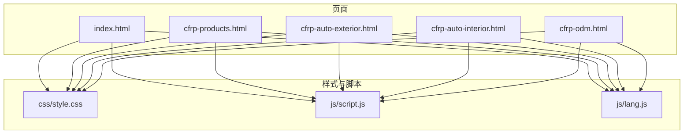
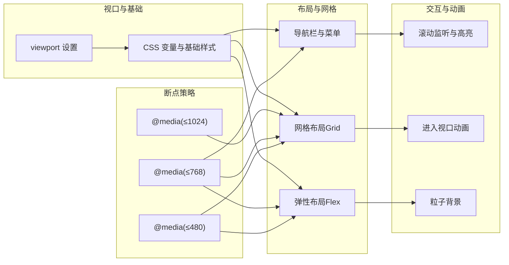
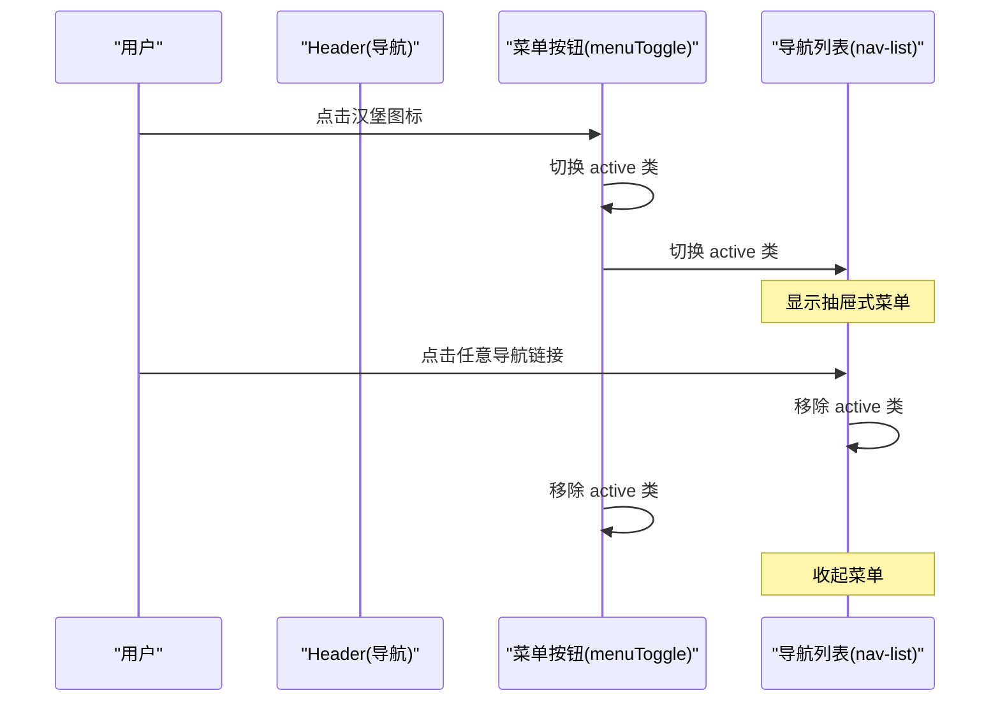
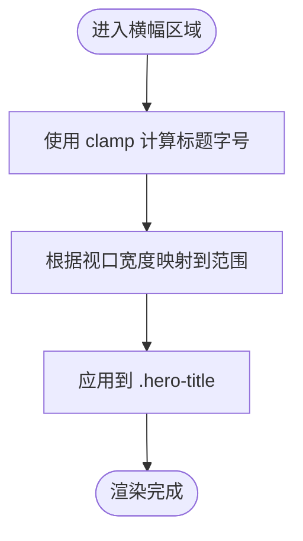
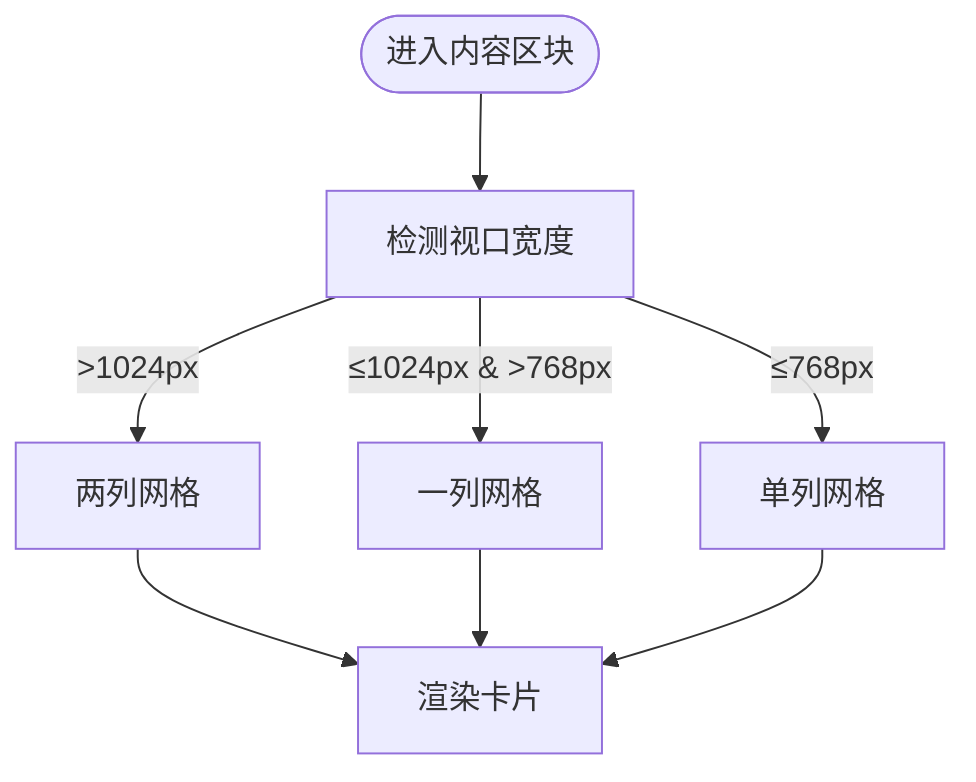
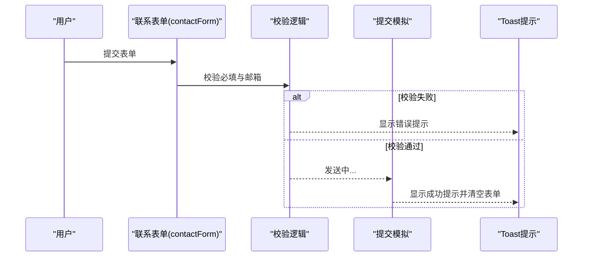
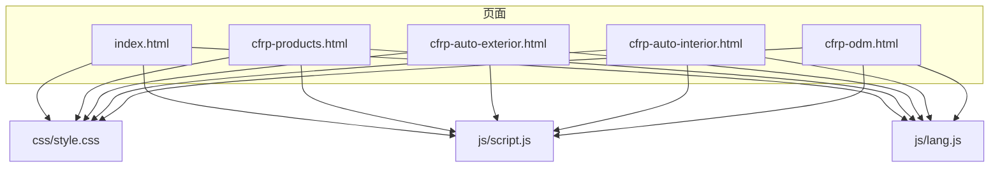

# 响应式设计

<cite>
**本文引用的文件**
- [index.html](file://index.html)
- [cfrp-products.html](file://cfrp-products.html)
- [cfrp-auto-exterior.html](file://cfrp-auto-exterior.html)
- [cfrp-auto-interior.html](file://cfrp-auto-interior.html)
- [cfrp-odm.html](file://cfrp-odm.html)
- [css/style.css](file://css/style.css)
- [js/script.js](file://js/script.js)
- [js/lang.js](file://js/lang.js)
</cite>

## 目录
1. [简介](#简介)
2. [项目结构](#项目结构)
3. [核心组件](#核心组件)
4. [架构总览](#架构总览)
5. [详细组件分析](#详细组件分析)
6. [依赖关系分析](#依赖关系分析)
7. [性能考量](#性能考量)
8. [故障排查指南](#故障排查指南)
9. [结论](#结论)
10. [附录](#附录)

## 简介
本指南围绕 HYT 网站的响应式设计实践，系统梳理移动端优先策略、媒体查询断点设计、触摸设备优化、布局与内容优先级策略、测试方法与性能优化建议。文档以实际源码为依据，结合可视化图表帮助读者理解从桌面到移动端的完整适配路径。

## 项目结构
该站点采用多页面结构，包含主页与若干专题页，统一通过共享样式与脚本实现一致的响应式行为：
- 主页：index.html
- 产品总览：cfrp-products.html
- 汽车外饰件：cfrp-auto-exterior.html
- 汽车内饰件：cfrp-auto-interior.html
- ODM 服务流程：cfrp-odm.html
- 样式：css/style.css
- 脚本：js/script.js、js/lang.js

**图表来源**
- [index.html](file://index.html)
- [cfrp-products.html](file://cfrp-products.html)
- [cfrp-auto-exterior.html](file://cfrp-auto-exterior.html)
- [cfrp-auto-interior.html](file://cfrp-auto-interior.html)
- [cfrp-odm.html](file://cfrp-odm.html)
- [css/style.css](file://css/style.css)
- [js/script.js](file://js/script.js)
- [js/lang.js](file://js/lang.js)

**章节来源**
- [index.html](file://index.html)
- [css/style.css](file://css/style.css)

## 核心组件
- 视口配置与基础样式
  - 在各页面 head 中设置 viewport，确保移动端缩放与布局视口一致。
  - 使用 CSS 自定义属性统一主题色与间距，便于在不同断点下复用。
- 导航栏与移动端菜单
  - 固定头部在滚动时启用毛玻璃与阴影，提升可读性。
  - 移动端菜单采用抽屉式布局，点击汉堡图标切换显示状态。
- 主页横幅与粒子背景
  - 使用相对单位与 clamp 实现标题在小屏到大屏的平滑缩放。
  - 粒子动画在容器内随机生成，避免阻塞主线程。
- 卡片网格与内容区块
  - 服务、案例、合作伙伴等采用 CSS Grid，断点下自动减少列数或转为单列。
- 表单与交互
  - 联系表单具备基础校验与 Toast 提示；平滑滚动兼容旧版浏览器。
- 多语言与断点样式
  - 语言模块动态注入按钮与样式，配合媒体查询在小屏隐藏或定位固定。

**章节来源**
- [index.html](file://index.html)
- [css/style.css](file://css/style.css)
- [js/script.js](file://js/script.js)
- [js/lang.js](file://js/lang.js)

## 架构总览
站点采用“移动优先”的响应式架构，通过媒体查询在关键断点处调整布局密度与元素尺寸，结合 JavaScript 实现导航、滚动与交互增强。

**图表来源**
- [css/style.css](file://css/style.css)
- [js/script.js](file://js/script.js)

## 详细组件分析

### 导航栏与移动端菜单
- 设计要点
  - 固定定位与过渡动画，滚动时增加背景与阴影，提升对比度。
  - 汉堡菜单在小屏显示，点击切换 active 类，控制侧边栏出现与消失。
  - 点击导航项自动收起菜单，改善移动端操作体验。
- 响应式断点
  - 在 768px 以下显示汉堡菜单，隐藏原生导航列表。
  - 在 768px 以下导航链接字号增大，提高可点击区域。
- 交互细节
  - 使用 IntersectionObserver 控制“进入视口”动画，降低滚动开销。
  - 平滑滚动兼容旧浏览器，避免现代特性缺失导致的异常。

**图表来源**
- [js/script.js](file://js/script.js)
- [css/style.css](file://css/style.css)

**章节来源**
- [js/script.js](file://js/script.js)
- [css/style.css](file://css/style.css)

### 主页横幅与标题流式缩放
- 设计要点
  - 使用 clamp 实现标题在 40px 到 72px 之间的流式缩放，兼顾小屏可读性与大屏冲击力。
  - 粒子背景通过随机大小、速度与延迟生成，避免重复与卡顿。
- 响应式断点
  - 在 768px 以下适当降低标题字号，确保在窄屏上仍有良好阅读体验。
- 性能建议
  - 粒子数量与动画频率需与设备性能平衡，避免在低端设备上造成掉帧。

**图表来源**
- [css/style.css](file://css/style.css)

**章节来源**
- [css/style.css](file://css/style.css)

### 卡片网格与内容优先级
- 设计要点
  - 服务、案例、合作伙伴等区块均采用 CSS Grid，列数随断点变化。
  - 在 1024px 以下减少列数，在 768px 以下进一步降为单列。
  - 内容优先级：重要信息（标题、描述）优先，次要信息（图标、标签）在小屏可折叠或隐藏。
- 响应式断点
  - 1024px：服务/团队/页脚网格两列。
  - 768px：服务/案例/联系表单网格单列；合作伙伴网格两列。
  - 480px：按钮垂直堆叠；合作伙伴图标尺寸缩小。

**图表来源**
- [css/style.css](file://css/style.css)

**章节来源**
- [css/style.css](file://css/style.css)

### 表单与交互增强
- 设计要点
  - 联系表单具备必填字段校验与邮箱格式校验，提交时提供 Toast 反馈。
  - 平滑滚动兼容旧版浏览器，避免行为属性不被支持导致的跳变。
  - 数字递增动画与“进入视口”动画使用 IntersectionObserver，减少不必要的计算。
- 性能建议
  - 观察器阈值与根边距需根据设备性能调优，避免频繁触发。
  - 表单提交模拟耗时应与真实网络请求保持一致的反馈节奏。

**图表来源**
- [js/script.js](file://js/script.js)

**章节来源**
- [js/script.js](file://js/script.js)

### 多语言与断点样式
- 设计要点
  - 语言模块动态注入语言切换按钮，按钮样式在不同断点下调整。
  - 小屏时按钮固定定位，避免遮挡主要内容。
- 响应式断点
  - 在 768px 以下按钮尺寸与位置调整，确保在滚动场景下仍可点击。

**章节来源**
- [js/lang.js](file://js/lang.js)
- [css/style.css](file://css/style.css)

### ODM 服务流程图（拖拽排序）
- 设计要点
  - 三个流程图均支持拖拽排序，使用 HTML5 Drag and Drop API。
  - 通过事件链控制拖拽开始、悬停、放置与后续箭头同步移动。
- 响应式断点
  - 在 768px 以下对节点宽度、字体与箭头尺寸进行缩放，保证可读性与可触达性。

**章节来源**
- [js/script.js](file://js/script.js)
- [css/style.css](file://css/style.css)

## 依赖关系分析
- 文件依赖
  - 所有页面均引入 css/style.css，确保样式一致性。
  - 主页与专题页均引入 js/script.js 与 js/lang.js，实现导航、滚动、动画与国际化。
- 组件耦合
  - 导航栏与滚动高亮相互依赖，滚动事件驱动导航链接状态更新。
  - 粒子背景与网格布局相互独立，但都受视口宽度影响。
- 外部依赖
  - 无外部框架依赖，纯原生 HTML/CSS/JavaScript 实现，利于维护与迁移。

**图表来源**
- [index.html](file://index.html)
- [cfrp-products.html](file://cfrp-products.html)
- [cfrp-auto-exterior.html](file://cfrp-auto-exterior.html)
- [cfrp-auto-interior.html](file://cfrp-auto-interior.html)
- [cfrp-odm.html](file://cfrp-odm.html)
- [css/style.css](file://css/style.css)
- [js/script.js](file://js/script.js)
- [js/lang.js](file://js/lang.js)

**章节来源**
- [index.html](file://index.html)
- [css/style.css](file://css/style.css)
- [js/script.js](file://js/script.js)
- [js/lang.js](file://js/lang.js)

## 性能考量
- 渲染性能
  - 使用 CSS 变量与 clamp 减少重复计算，避免在 JS 中频繁读写样式。
  - 粒子动画与观察器阈值需与设备性能匹配，避免主线程阻塞。
- 交互性能
  - 平滑滚动与导航高亮使用节流/去抖策略，减少高频事件带来的卡顿。
  - 拖拽排序仅在小屏有意义，建议在大屏禁用或限制交互复杂度。
- 资源加载
  - 图片采用自适应宽高与 object-fit，避免布局抖动。
  - 多语言文本通过 data-i18n 注入，减少重复 DOM 结构。

[本节为通用指导，无需特定文件引用]

## 故障排查指南
- 导航菜单无法展开
  - 检查是否正确引入 js/script.js，确认 menuToggle 与 nav-list 的类名与事件绑定。
  - 确认 CSS 中 .nav-list.active 是否生效。
- 标题在小屏显示异常
  - 检查 clamp 的最小/最大值与中间值是否符合预期。
  - 确认媒体查询断点是否覆盖目标设备。
- 卡片网格错位
  - 检查断点下的 grid-template-columns 是否按预期变化。
  - 确认容器宽度与 padding 不会超出视口。
- 表单提交无反馈
  - 检查 Toast 样式与脚本是否正确加载。
  - 确认邮箱正则表达式与必填字段校验逻辑。
- 多语言按钮不显示
  - 检查 js/lang.js 是否在 DOMContentLoaded 后初始化。
  - 确认语言数据键值是否存在，以及注入的按钮是否被断点样式隐藏。

**章节来源**
- [js/script.js](file://js/script.js)
- [css/style.css](file://css/style.css)
- [js/lang.js](file://js/lang.js)

## 结论
HYT 网站在移动端优先的理念下，通过合理的断点设计、流式缩放与网格布局，实现了从桌面到移动端的顺畅过渡。配合平滑滚动、进入视口动画与多语言支持，整体用户体验在不同设备上保持一致且高效。建议在后续迭代中持续监控性能指标，优化动画与交互细节，确保在低端设备上的流畅体验。

[本节为总结性内容，无需特定文件引用]

## 附录

### 媒体查询断点设计原理
- 断点选择
  - 1024px：平板横向与小屏桌面，用于减少网格列数。
  - 768px：移动端横屏与大屏手机，用于启用抽屉式导航与单列布局。
  - 480px：小屏手机，用于微调按钮、表单与图片尺寸。
- 设计原则
  - 以内容优先：优先保证核心信息在小屏可读与可触。
  - 以交互优先：导航与表单在小屏提供更大点击区域。
  - 以性能优先：避免在小屏执行昂贵动画与复杂布局。

**章节来源**
- [css/style.css](file://css/style.css)

### 响应式测试方法
- 设备与浏览器
  - 使用 Chrome DevTools 的设备模式进行断点验证。
  - 在真机上测试触摸手势与滚动性能。
- 关键测试点
  - 导航抽屉在 768px 以下的显示与隐藏。
  - 标题在不同断点下的字号与行高。
  - 卡片网格在 1024px、768px、480px 的列数变化。
  - 表单在小屏的布局与可点击区域。
  - 多语言按钮在滚动场景下的可访问性。

[本节为通用指导，无需特定文件引用]