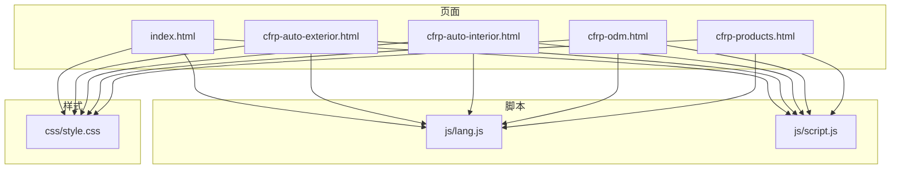
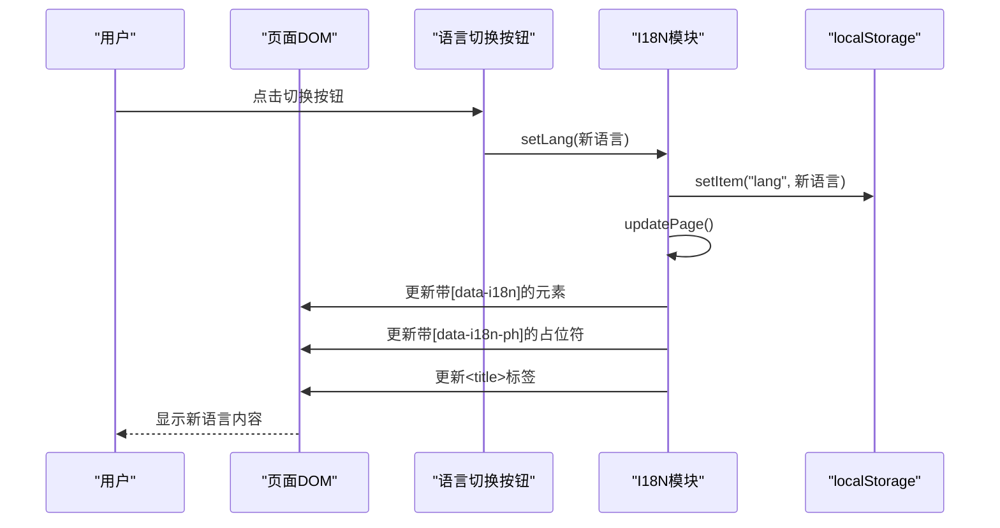
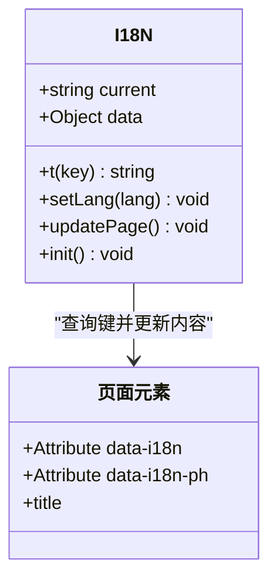
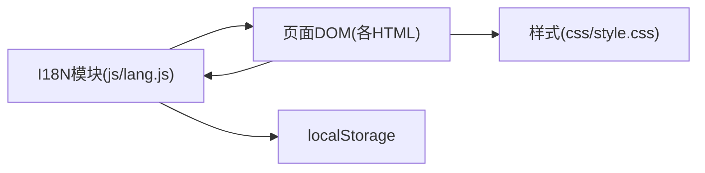

# 国际化系统

<cite>
**本文引用的文件**
- [lang.js](file://js/lang.js)
- [script.js](file://js/script.js)
- [index.html](file://index.html)
- [cfrp-auto-exterior.html](file://cfrp-auto-exterior.html)
- [cfrp-auto-interior.html](file://cfrp-auto-interior.html)
- [cfrp-odm.html](file://cfrp-odm.html)
- [cfrp-products.html](file://cfrp-products.html)
- [style.css](file://css/style.css)
</cite>

## 目录
1. [简介](#简介)
2. [项目结构](#项目结构)
3. [核心组件](#核心组件)
4. [架构总览](#架构总览)
5. [详细组件分析](#详细组件分析)
6. [依赖关系分析](#依赖关系分析)
7. [性能考量](#性能考量)
8. [故障排查指南](#故障排查指南)
9. [结论](#结论)
10. [附录](#附录)

## 简介
本文件为HYT网站国际化系统的全面技术文档，聚焦于双语（简体中文与日语）系统的设计与实现。文档从架构视角解析翻译数据组织、语言切换机制、动态内容更新与本地存储持久化策略，并深入说明占位符系统与运行时语言切换的技术细节，最后提供国际化扩展指南，帮助开发者添加新语言与管理翻译内容。

## 项目结构
该站点采用静态HTML页面与纯前端JavaScript实现国际化，核心文件分布如下：
- 国际化核心：js/lang.js
- 通用功能脚本：js/script.js
- 页面模板：index.html、cfrp-auto-exterior.html、cfrp-auto-interior.html、cfrp-odm.html、cfrp-products.html
- 样式表：css/style.css

图表来源
- [index.html](file://index.html)
- [cfrp-auto-exterior.html](file://cfrp-auto-exterior.html)
- [cfrp-auto-interior.html](file://cfrp-auto-interior.html)
- [cfrp-odm.html](file://cfrp-odm.html)
- [cfrp-products.html](file://cfrp-products.html)
- [lang.js](file://js/lang.js)
- [script.js](file://js/script.js)
- [style.css](file://css/style.css)

章节来源
- [index.html](file://index.html)
- [cfrp-auto-exterior.html](file://cfrp-auto-exterior.html)
- [cfrp-auto-interior.html](file://cfrp-auto-interior.html)
- [cfrp-odm.html](file://cfrp-odm.html)
- [cfrp-products.html](file://cfrp-products.html)
- [lang.js](file://js/lang.js)
- [script.js](file://js/script.js)
- [style.css](file://css/style.css)

## 核心组件
- 国际化模块I18N：负责当前语言状态、翻译数据存储、键值查询、语言切换、页面元素动态更新与本地存储持久化。
- 通用脚本模块：负责导航栏滚动效果、移动端菜单、数字递增动画、滚动渐显、表单校验与提示、平滑滚动、交互式流程图与拖拽排序。
- 页面模板：通过data-i18n与data-i18n-ph属性标记可翻译文本与占位符，由I18N统一驱动更新。

章节来源
- [lang.js](file://js/lang.js)
- [script.js](file://js/script.js)
- [index.html](file://index.html)

## 架构总览
I18N模块作为中心枢纽，通过DOM查询与属性标记实现“声明式翻译”。页面加载完成后初始化语言切换按钮并执行首次页面更新；用户点击切换按钮时，I18N更新当前语言、持久化到localStorage并触发页面元素批量刷新。

图表来源
- [lang.js](file://js/lang.js)
- [index.html](file://index.html)

## 详细组件分析

### I18N国际化模块
- 数据结构
  - current：当前语言标识，默认从localStorage读取，否则默认为'zh-CN'
  - data：多语言键值映射，按语言代码分组，键为点分路径（如'hero.title'）
- 查询与切换
  - t(key)：根据当前语言查找翻译，未命中则回退为键本身
  - setLang(lang)：设置当前语言、写入localStorage并调用updatePage
- 动态更新
  - updatePage：遍历带[data-i18n]的元素，区分HTML与纯文本进行innerHTML或textContent更新；遍历带[data-i18n-ph]的表单元素，更新placeholder；更新<title>标签
- 初始化
  - init：注入语言切换按钮样式，为每个<header>.nav-list追加切换按钮，绑定点击事件（在'zh-CN'与'ja-JP'之间切换），最后执行updatePage

图表来源
- [lang.js](file://js/lang.js)

章节来源
- [lang.js](file://js/lang.js)

### 页面模板与占位符系统
- 标记方式
  - data-i18n：用于替换元素文本或HTML内容
  - data-i18n-ph：用于替换表单类元素的placeholder
  - title元素上使用data-i18n="site.title"以动态更新页面标题
- 占位符更新逻辑
  - 在updatePage中，遍历所有带data-i18n-ph的元素，读取对应键值并设置placeholder属性
- 示例页面
  - 主页、内外饰页、ODM页、产品总览页均采用相同标记模式，确保一致的翻译覆盖范围

章节来源
- [index.html](file://index.html)
- [cfrp-auto-exterior.html](file://cfrp-auto-exterior.html)
- [cfrp-auto-interior.html](file://cfrp-auto-interior.html)
- [cfrp-odm.html](file://cfrp-odm.html)
- [cfrp-products.html](file://cfrp-products.html)

### 语言切换机制与持久化
- 切换触发
  - 初始化时为每个导航列表追加一个按钮，点击事件在'zh-CN'与'ja-JP'之间轮转
- 持久化策略
  - setLang(lang)调用localStorage.setItem('lang', lang)，确保刷新后仍保持所选语言
- 运行时更新
  - updatePage统一扫描并更新页面所有可翻译元素，避免逐个元素硬编码更新

章节来源
- [lang.js](file://js/lang.js)

### 通用脚本与国际化协同
- 导航栏滚动效果、移动端菜单、数字递增动画、滚动渐显、平滑滚动、表单校验与提示、交互式流程图与拖拽排序等功能与国际化模块并行运行，互不干扰
- 由于I18N在DOMContentLoaded后初始化，通用脚本在页面加载时即执行，两者通过DOM查询与更新互不影响

章节来源
- [script.js](file://js/script.js)
- [index.html](file://index.html)

## 依赖关系分析
- I18N依赖
  - DOM属性标记（data-i18n、data-i18n-ph、title）
  - localStorage（语言状态持久化）
- 页面依赖
  - 所有页面均引入lang.js并在末尾加载，确保I18N在DOM完全构建后初始化
- 样式依赖
  - 样式文件提供基础布局与主题变量，国际化仅影响文本内容，不影响布局

图表来源
- [lang.js](file://js/lang.js)
- [index.html](file://index.html)
- [style.css](file://css/style.css)

章节来源
- [lang.js](file://js/lang.js)
- [index.html](file://index.html)
- [style.css](file://css/style.css)

## 性能考量
- DOM查询与更新
  - updatePage对带[data-i18n]与[data-i18n-ph]的元素进行一次性遍历更新，复杂度O(N)，其中N为可翻译元素数量
- 事件绑定
  - 语言切换按钮仅在初始化时创建并绑定一次点击事件，避免重复绑定导致的性能问题
- 样式注入
  - 语言切换按钮样式在初始化时注入<head>，避免重复插入
- 建议
  - 若页面元素数量增长，可考虑缓存常见元素集合或延迟更新策略
  - 对大量动态生成的可翻译元素，建议在生成时直接赋予data-i18n属性，减少后续查询成本

## 故障排查指南
- 切换无效
  - 检查是否正确引入lang.js且在DOMContentLoaded后初始化
  - 确认localStorage未被禁用或清理
- 文本未更新
  - 确认元素是否带有data-i18n或data-i18n-ph属性
  - 确认键名与data-i18n值一致，且在对应语言的数据中存在
- 标题未更新
  - 确认<title>元素包含data-i18n="site.title"
- 占位符未更新
  - 确认表单元素包含data-i18n-ph属性且键名正确
- 样式异常
  - 检查样式文件是否正确加载，语言切换按钮样式是否被覆盖

章节来源
- [lang.js](file://js/lang.js)
- [index.html](file://index.html)

## 结论
HYT网站国际化系统采用声明式标记与集中式I18N模块相结合的方式，实现了简洁高效的双语支持。通过localStorage持久化与统一的updatePage机制，系统在用户体验与维护成本之间取得良好平衡。现有实现已覆盖主要页面与表单占位符，具备良好的扩展性，便于后续添加更多语言与翻译内容。

## 附录

### 国际化扩展指南
- 添加新语言步骤
  1. 在I18N.data中新增语言代码分组（如'xx-XX'），复制现有语言的键结构，填充翻译内容
  2. 在语言切换按钮文案键'lang.switch'中添加新语言的切换显示文本
  3. 在页面中为新增语言对应的元素添加data-i18n与data-i18n-ph属性，确保覆盖所有可翻译文本
  4. 如需新增页面，参考现有页面模板，统一使用data-i18n与data-i18n-ph标记
- 键命名规范
  - 使用层级化点分路径（如'hero.title'），便于分类与维护
  - 保持键名在各语言中一致，避免重复或遗漏
- 维护建议
  - 建立翻译清单与变更记录，确保新增/修改内容同步到所有语言
  - 对HTML片段与占位符进行版本化管理，避免跨语言不一致
  - 在CI中加入键名一致性检查，防止遗漏或拼写错误

章节来源
- [lang.js](file://js/lang.js)
- [index.html](file://index.html)
- [cfrp-auto-exterior.html](file://cfrp-auto-exterior.html)
- [cfrp-auto-interior.html](file://cfrp-auto-interior.html)
- [cfrp-odm.html](file://cfrp-odm.html)
- [cfrp-products.html](file://cfrp-products.html)