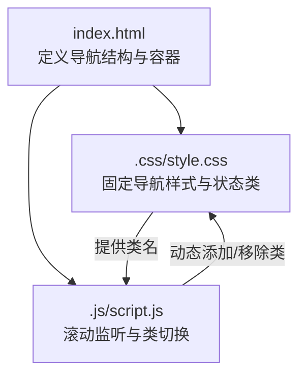
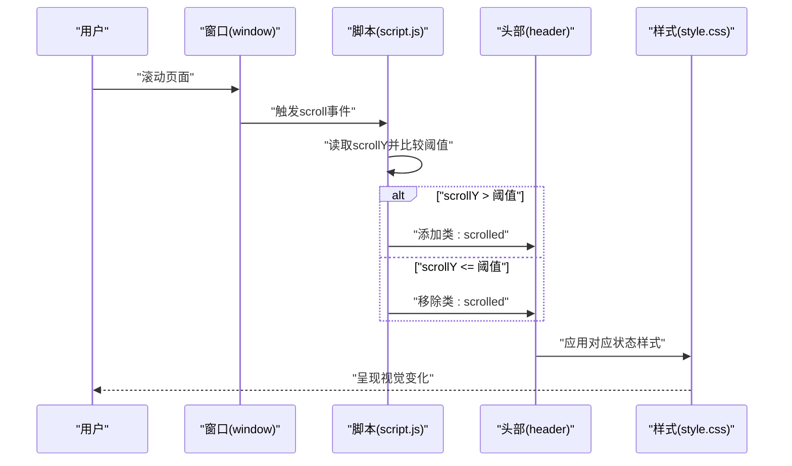
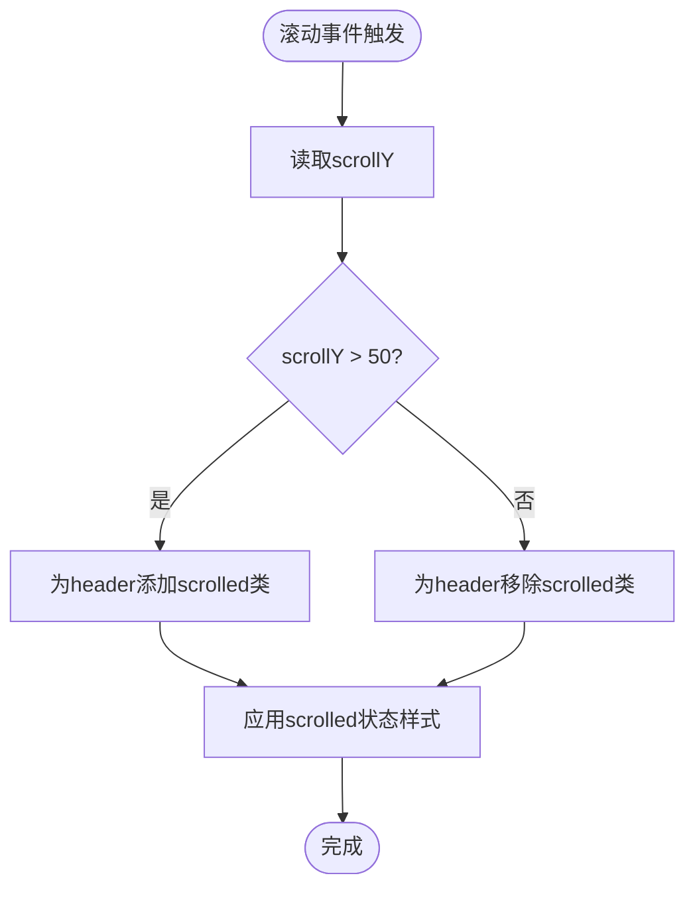
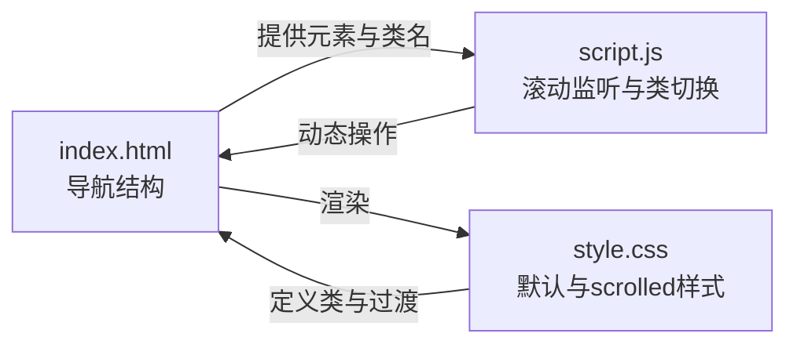

# 固定导航栏

<cite>
**本文引用的文件**
- [index.html](file://index.html)
- [style.css](file://css/style.css)
- [script.js](file://js/script.js)
</cite>

## 目录
1. [简介](#简介)
2. [项目结构](#项目结构)
3. [核心组件](#核心组件)
4. [架构总览](#架构总览)
5. [详细组件分析](#详细组件分析)
6. [依赖关系分析](#依赖关系分析)
7. [性能考量](#性能考量)
8. [故障排查指南](#故障排查指南)
9. [结论](#结论)
10. [附录](#附录)

## 简介
本文件聚焦于HYT网站的固定导航栏实现，系统性解析其滚动效果的实现原理，包括CSS类切换机制、滚动阈值设置、视觉样式变化，以及在不同滚动状态下的样式表现。同时提供通过JavaScript监听滚动事件动态添加/移除CSS类的方法，并给出样式自定义指南与响应式设计注意事项，帮助开发者在不破坏现有体验的前提下进行扩展与优化。

## 项目结构
导航栏位于页面头部区域，采用固定定位并在滚动时根据阈值切换CSS类，从而改变背景、阴影、内边距与文字颜色等视觉属性。其样式与交互逻辑分别由CSS与JavaScript负责。

图表来源
- [index.html:11-32](file://index.html#L11-L32)
- [style.css:67-83](file://css/style.css#L67-L83)
- [script.js:1-10](file://js/script.js#L1-L10)

章节来源
- [index.html:11-32](file://index.html#L11-L32)
- [style.css:67-83](file://css/style.css#L67-L83)
- [script.js:1-10](file://js/script.js#L1-L10)

## 核心组件
- 导航容器与结构
  - 头部容器使用固定定位，确保在页面滚动时保持在视口顶部。
  - 导航列表包含多个导航链接，其中首页链接初始处于激活态。
- 滚动效果实现
  - JavaScript监听窗口滚动事件，当滚动距离超过阈值时为导航容器添加“scrolled”类；否则移除该类。
  - CSS中定义“.header.scrolled”类，用于在滚动状态下改变背景、模糊、阴影、内边距与文字颜色等视觉属性。
- 响应式行为
  - 在移动端断点下，导航栏的视觉样式与交互方式会相应调整，例如在小屏设备上隐藏导航链接并提供汉堡菜单。

章节来源
- [index.html:11-32](file://index.html#L11-L32)
- [style.css:67-83](file://css/style.css#L67-L83)
- [script.js:1-10](file://js/script.js#L1-L10)
- [style.css:901-968](file://css/style.css#L901-L968)

## 架构总览
固定导航栏的实现遵循“结构HTML + 样式CSS + 交互JS”的分层设计：
- 结构层：HTML定义导航容器与导航项。
- 样式层：CSS定义默认状态与滚动后的状态类，提供过渡动画与视觉反馈。
- 交互层：JS监听滚动事件，按阈值切换状态类，驱动样式变化。

图表来源
- [script.js:4-10](file://js/script.js#L4-L10)
- [style.css:78-83](file://css/style.css#L78-L83)

章节来源
- [script.js:4-10](file://js/script.js#L4-L10)
- [style.css:78-83](file://css/style.css#L78-L83)

## 详细组件分析

### 滚动阈值与类切换机制
- 阈值设定
  - 当窗口滚动距离超过50像素时，导航栏进入“scrolled”状态；否则回到默认状态。
- 类切换逻辑
  - 使用classList.add/remove在满足条件时动态添加或移除“scrolled”类，从而触发布局与样式的更新。
- 视觉样式变化
  - 背景从透明变为半透明可逆背景，配合模糊滤镜与阴影增强层次感。
  - 内边距减少，使导航在滚动后更紧凑。
  - 文字颜色在滚动后从白色调整为深色，提升可读性。

图表来源
- [script.js:4-10](file://js/script.js#L4-L10)
- [style.css:78-83](file://css/style.css#L78-L83)

章节来源
- [script.js:4-10](file://js/script.js#L4-L10)
- [style.css:78-83](file://css/style.css#L78-L83)

### 不同滚动状态下的样式表现
- 默认状态（未滚动或scrollY ≤ 50）
  - 背景透明，适合首页横幅背景展示。
  - 文字颜色为浅色，便于在深色背景上显示。
  - 内边距较大，保证在顶部时有充足的留白。
- 滚动状态（scrollY > 50）
  - 背景变为半透明浅色背景，模糊滤镜与阴影增强层级感。
  - 文字颜色调整为深色，提升在浅色背景上的可读性。
  - 内边距减少，使导航更紧凑，节省顶部空间。

章节来源
- [style.css:78-83](file://css/style.css#L78-L83)
- [style.css:115-117](file://css/style.css#L115-L117)
- [style.css:133-135](file://css/style.css#L133-L135)

### JavaScript监听滚动事件的实现要点
- 事件绑定
  - 通过window.addEventListener('scroll', ...)注册滚动处理函数。
- 条件判断
  - 使用window.scrollY与阈值比较，决定是否添加或移除“scrolled”类。
- 性能建议
  - 可结合节流/防抖策略降低频繁计算带来的开销（当前实现直接在滚动事件中切换类，简单直接但需注意滚动频率）。

章节来源
- [script.js:4-10](file://js/script.js#L4-L10)

### 导航链接高亮联动（额外功能）
- 功能概述
  - 页面滚动时根据当前可视区域内的section，自动为对应的导航链接添加“active”类，实现导航与内容的联动高亮。
- 实现要点
  - 通过遍历所有带id的section，结合offsetTop与滚动位置计算当前section。
  - 将“active”类在导航链接间切换，确保同一时刻仅有一个链接处于激活态。
- 注意事项
  - 计算时对sectionTop进行了偏移修正，避免滚动到边界时误判。

章节来源
- [script.js:31-52](file://js/script.js#L31-L52)

### 响应式设计考虑
- 移动端断点
  - 在768px以下断点，导航栏的视觉样式与交互方式发生变化：
    - 汉堡菜单按钮显示，导航列表变为固定侧边抽屉式布局。
    - 导航链接在移动端使用更深色，提升对比度。
- 其他断点
  - 在1024px与480px断点下，页面其他模块也做了网格与布局的适配，确保整体视觉一致性。

章节来源
- [style.css:901-968](file://css/style.css#L901-L968)

## 依赖关系分析
固定导航栏的实现涉及HTML结构、CSS样式与JavaScript交互之间的紧密协作，形成如下依赖关系：

图表来源
- [index.html:11-32](file://index.html#L11-L32)
- [style.css:67-83](file://css/style.css#L67-L83)
- [script.js:1-10](file://js/script.js#L1-L10)

章节来源
- [index.html:11-32](file://index.html#L11-L32)
- [style.css:67-83](file://css/style.css#L67-L83)
- [script.js:1-10](file://js/script.js#L1-L10)

## 性能考量
- 滚动事件频率
  - 滚动事件触发频率较高，直接在事件回调中执行DOM操作可能带来性能压力。建议在实际项目中引入节流/防抖策略，限制单位时间内类切换次数。
- 过渡动画
  - CSS中的过渡时长与缓动函数已统一配置，确保在类切换时视觉流畅。如需进一步优化，可在滚动节流后再触发类切换，减少不必要的重绘与回流。
- 视觉复杂度
  - “scrolled”状态引入了背景模糊与阴影，属于较重的视觉效果。在低端设备上建议谨慎使用或提供降级方案。

[本节为通用性能建议，不直接分析具体文件]

## 故障排查指南
- 症状：滚动后导航无任何变化
  - 排查要点
    - 确认HTML中存在id为“header”的导航容器。
    - 确认脚本已加载且未被浏览器阻止。
    - 检查控制台是否存在语法错误或运行时异常。
- 症状：滚动阈值不符合预期
  - 排查要点
    - 检查脚本中阈值是否被修改（默认为50）。
    - 确认页面初始滚动位置是否影响首次判定。
- 症状：移动端导航无法展开
  - 排查要点
    - 确认汉堡菜单按钮与导航列表的类名与脚本一致。
    - 检查CSS断点是否生效，以及导航列表的固定定位与z-index是否正确。
- 症状：导航链接高亮不准确
  - 排查要点
    - 确认各section的id与导航链接的href匹配。
    - 检查offsetTop计算与滚动位置的偏移修正是否合理。

章节来源
- [script.js:1-10](file://js/script.js#L1-L10)
- [script.js:31-52](file://js/script.js#L31-L52)
- [style.css:901-968](file://css/style.css#L901-L968)

## 结论
HYT网站的固定导航栏通过“结构 + 样式 + 交互”的清晰分工实现了平滑的滚动效果：HTML提供容器与链接，CSS定义默认与滚动状态样式，JS在滚动时按阈值切换类，从而驱动视觉变化。该实现简洁可靠，易于扩展。若需进一步优化，可在滚动事件中加入节流/防抖策略，并在移动端提供更丰富的交互细节。

[本节为总结性内容，不直接分析具体文件]

## 附录

### 自定义指南：如何修改滚动阈值与视觉样式
- 修改滚动阈值
  - 打开脚本文件，找到滚动事件处理函数中的阈值判断，将其修改为你期望的像素值。
  - 示例路径参考：[script.js:5](file://js/script.js#L5)
- 自定义“scrolled”状态样式
  - 在样式文件中修改“.header.scrolled”类的背景、模糊、阴影、内边距与文字颜色等属性。
  - 示例路径参考：[style.css:78-83](file://css/style.css#L78-L83)
- 自定义导航链接颜色
  - 在“.header.scrolled .nav-link”选择器下调整链接颜色，确保在浅色背景下具备良好可读性。
  - 示例路径参考：[style.css:133-135](file://css/style.css#L133-L135)

章节来源
- [script.js:5](file://js/script.js#L5)
- [style.css:78-83](file://css/style.css#L78-L83)
- [style.css:133-135](file://css/style.css#L133-L135)