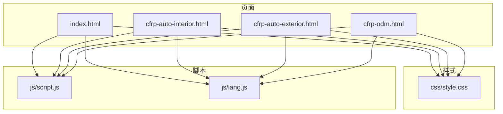
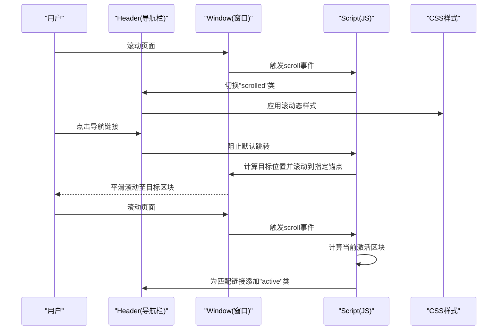
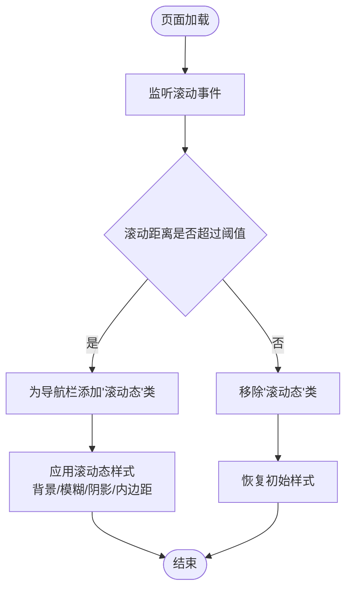
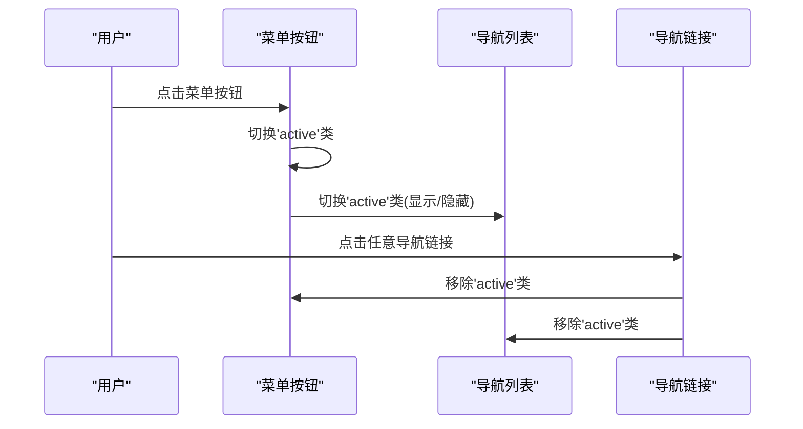
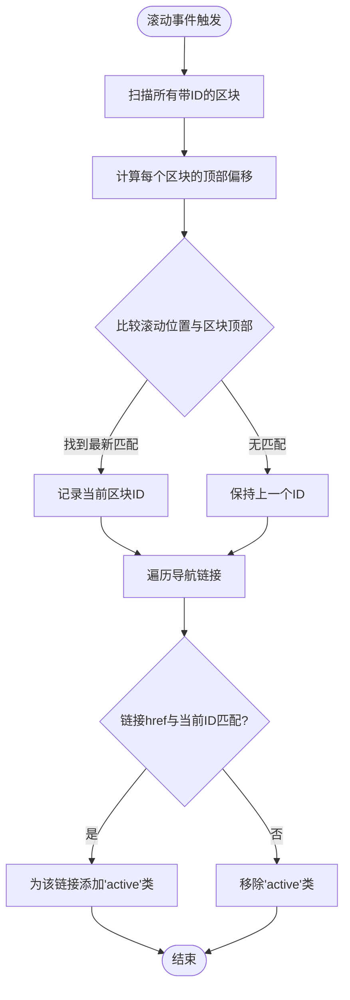
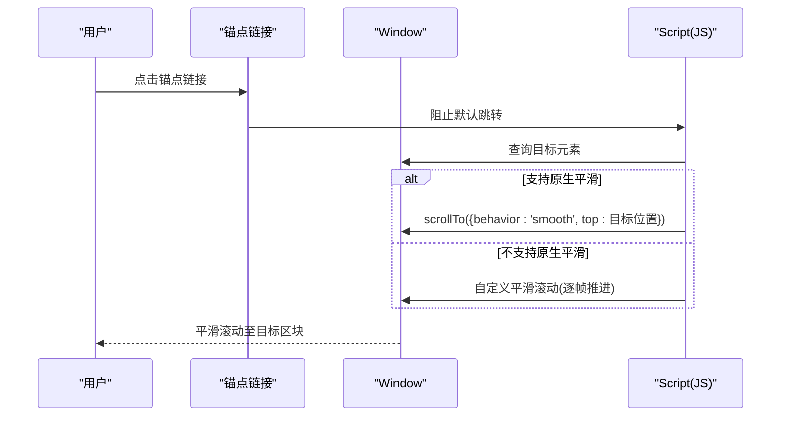
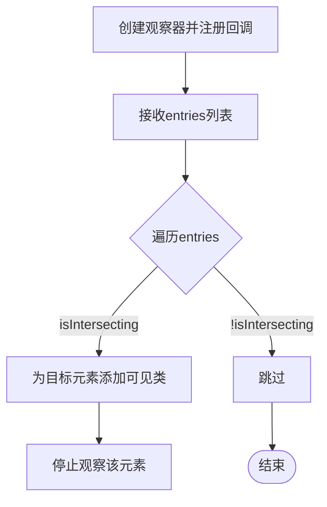
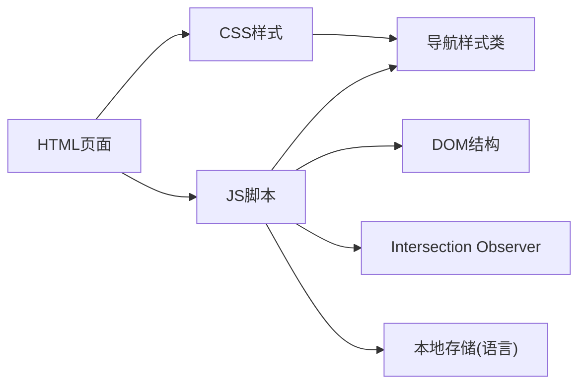

# 导航系统

<cite>
**本文引用的文件列表**
- [index.html](file://index.html)
- [cfrp-auto-interior.html](file://cfrp-auto-interior.html)
- [cfrp-auto-exterior.html](file://cfrp-auto-exterior.html)
- [cfrp-odm.html](file://cfrp-odm.html)
- [css/style.css](file://css/style.css)
- [js/script.js](file://js/script.js)
- [js/lang.js](file://js/lang.js)
</cite>

## 目录
1. [简介](#简介)
2. [项目结构](#项目结构)
3. [核心组件](#核心组件)
4. [架构总览](#架构总览)
5. [详细组件分析](#详细组件分析)
6. [依赖关系分析](#依赖关系分析)
7. [性能考量](#性能考量)
8. [故障排查指南](#故障排查指南)
9. [结论](#结论)
10. [附录](#附录)

## 简介
本技术文档聚焦于HYT网站导航系统的实现，围绕固定导航栏的设计与交互展开，涵盖以下关键点：
- 固定导航栏的滚动效果与视觉状态切换
- 移动端菜单的展开/收起与点击联动
- 导航链接的高亮逻辑与滚动定位
- 平滑滚动的跨浏览器兼容实现
- 使用 Intersection Observer API 实现导航高亮与页面元素的可见性检测
- 导航系统的扩展与自定义建议

## 项目结构
导航系统由HTML骨架、CSS样式与JavaScript逻辑三部分组成，配合多语言模块协同工作。核心文件如下：
- HTML页面包含导航栏结构与各功能区块
- CSS定义导航栏的固定定位、滚动态样式、移动端菜单样式与链接高亮样式
- JS负责滚动监听、移动端菜单交互、导航链接高亮、平滑滚动与观察器初始化
- 多语言模块提供导航文案国际化与语言切换按钮

图表来源
- [index.html:11-32](file://index.html#L11-L32)
- [css/style.css:66-191](file://css/style.css#L66-L191)
- [js/script.js:1-344](file://js/script.js#L1-L344)
- [js/lang.js:1-472](file://js/lang.js#L1-L472)

章节来源
- [index.html:1-337](file://index.html#L1-L337)
- [css/style.css:1-1332](file://css/style.css#L1-L1332)
- [js/script.js:1-344](file://js/script.js#L1-L344)
- [js/lang.js:1-472](file://js/lang.js#L1-L472)

## 核心组件
- 固定导航栏容器与Logo、导航列表、移动端菜单按钮
- 导航链接集合与对应的目标区块（通过锚点定位）
- 平滑滚动机制（原生smooth与降级实现）
- Intersection Observer 观察器用于导航高亮与页面元素可见性检测
- 多语言模块负责导航文案与语言切换按钮注入

章节来源
- [index.html:11-32](file://index.html#L11-L32)
- [css/style.css:66-191](file://css/style.css#L66-L191)
- [js/script.js:1-344](file://js/script.js#L1-L344)
- [js/lang.js:1-472](file://js/lang.js#L1-L472)

## 架构总览
导航系统采用“结构-样式-行为”的分层设计：
- 结构层：HTML定义导航栏与目标区块的锚点ID
- 样式层：CSS控制固定定位、滚动态背景与高亮样式
- 行为层：JS处理滚动事件、移动端菜单、导航高亮、平滑滚动与观察器

图表来源
- [js/script.js:4-10](file://js/script.js#L4-L10)
- [js/script.js:197-211](file://js/script.js#L197-L211)
- [js/script.js:31-52](file://js/script.js#L31-L52)
- [css/style.css:78-83](file://css/style.css#L78-L83)
- [css/style.css:149-162](file://css/style.css#L149-L162)

## 详细组件分析

### 固定导航栏与滚动效果
- 固定定位：导航栏使用固定定位，确保在页面滚动时始终显示
- 滚动态样式：当滚动超过阈值时，为导航栏添加滚动态类，改变背景、模糊与阴影，提升可读性
- 文案颜色适配：滚动态下导航链接颜色从白色过渡到深色，增强对比度

图表来源
- [js/script.js:4-10](file://js/script.js#L4-L10)
- [css/style.css:78-83](file://css/style.css#L78-L83)

章节来源
- [js/script.js:1-10](file://js/script.js#L1-L10)
- [css/style.css:66-83](file://css/style.css#L66-L83)

### 移动端菜单与交互
- 菜单按钮：三段式汉堡菜单，点击切换激活状态
- 导航列表：移动端隐藏，点击菜单按钮显示；点击任意导航链接后自动收起菜单
- 响应式布局：菜单按钮在桌面端隐藏，在移动端显示

图表来源
- [js/script.js:16-29](file://js/script.js#L16-L29)
- [css/style.css:164-191](file://css/style.css#L164-L191)

章节来源
- [js/script.js:12-29](file://js/script.js#L12-L29)
- [css/style.css:164-191](file://css/style.css#L164-L191)

### 导航链接高亮逻辑
- 目标区块识别：遍历所有带ID的区块，计算每个区块顶部距离视口的距离
- 当前激活区块：根据滚动位置确定当前处于可视范围内的区块
- 链接高亮：为与当前区块ID匹配的导航链接添加高亮类，移除其他链接的高亮类

图表来源
- [js/script.js:31-52](file://js/script.js#L31-L52)
- [css/style.css:149-162](file://css/style.css#L149-L162)

章节来源
- [js/script.js:31-52](file://js/script.js#L31-L52)
- [css/style.css:149-162](file://css/style.css#L149-L162)

### 平滑滚动的跨浏览器兼容实现
- 原生平滑滚动：全局启用原生平滑滚动，提升现代浏览器体验
- 降级处理：对不支持原生平滑滚动的浏览器，通过事件拦截与滚动API实现平滑滚动
- 锚点定位：计算目标区块的顶部位置并减去固定导航栏高度，避免被遮挡

图表来源
- [css/style.css:32-35](file://css/style.css#L32-L35)
- [js/script.js:197-211](file://js/script.js#L197-L211)

章节来源
- [css/style.css:32-35](file://css/style.css#L32-L35)
- [js/script.js:197-211](file://js/script.js#L197-L211)

### Intersection Observer API 在导航高亮与页面元素可见性中的应用
- 导航高亮：通过观察器监听区块进入视口的时机，结合滚动事件更新当前激活链接
- 页面元素可见性：对卡片、内容块等元素设置阈值与根边距，实现进入视口时的渐显动画

图表来源
- [js/script.js:84-113](file://js/script.js#L84-L113)
- [js/script.js:126-139](file://js/script.js#L126-L139)

章节来源
- [js/script.js:84-113](file://js/script.js#L84-L113)
- [js/script.js:126-139](file://js/script.js#L126-L139)

### 多语言导航文案与语言切换
- 导航文案：导航链接使用数据属性承载国际化键值，由多语言模块统一替换
- 语言切换：动态注入语言切换按钮，点击在中日文之间切换，持久化到本地存储

章节来源
- [js/lang.js:1-472](file://js/lang.js#L1-L472)
- [index.html:20-25](file://index.html#L20-L25)
- [cfrp-auto-interior.html:68-75](file://cfrp-auto-interior.html#L68-L75)
- [cfrp-auto-exterior.html:18-26](file://cfrp-auto-exterior.html#L18-L26)
- [cfrp-odm.html:16-24](file://cfrp-odm.html#L16-L24)

## 依赖关系分析
- HTML依赖CSS样式与JS脚本
- JS脚本依赖DOM结构与CSS类名约定
- 多语言模块依赖导航链接的数据属性键值
- 平滑滚动与导航高亮依赖滚动事件与区块ID一致性

图表来源
- [index.html:11-32](file://index.html#L11-L32)
- [css/style.css:66-191](file://css/style.css#L66-L191)
- [js/script.js:1-344](file://js/script.js#L1-L344)
- [js/lang.js:1-472](file://js/lang.js#L1-L472)

章节来源
- [index.html:1-337](file://index.html#L1-L337)
- [css/style.css:1-1332](file://css/style.css#L1-L1332)
- [js/script.js:1-344](file://js/script.js#L1-L344)
- [js/lang.js:1-472](file://js/lang.js#L1-L472)

## 性能考量
- 滚动事件节流：当前实现直接绑定滚动事件，建议在高频率滚动场景下增加节流或防抖，减少重排与重绘
- 观察器配置：导航高亮与页面元素可见性均使用观察器，建议根据实际需求调整阈值与根边距，平衡性能与体验
- 平滑滚动降级：降级实现使用逐帧推进，建议在长列表或复杂页面中评估动画性能
- 样式切换：滚动态样式包含模糊与阴影，注意在低端设备上的渲染开销

## 故障排查指南
- 导航链接未高亮
  - 检查目标区块是否具有唯一ID且与链接href一致
  - 确认滚动事件是否正常触发，是否存在阻止滚动的父级容器
- 移动端菜单无法收起
  - 检查导航链接点击事件是否正确移除激活类
  - 确认CSS中菜单列表的显示/隐藏样式是否生效
- 平滑滚动异常
  - 确认原生平滑滚动是否可用；若不可用，检查降级逻辑是否执行
  - 检查目标元素是否存在且可见
- 多语言文案未更新
  - 检查数据属性键值是否存在于多语言模块
  - 确认语言切换按钮是否成功注入与点击事件绑定

章节来源
- [js/script.js:31-52](file://js/script.js#L31-L52)
- [js/script.js:16-29](file://js/script.js#L16-L29)
- [js/script.js:197-211](file://js/script.js#L197-L211)
- [js/lang.js:352-399](file://js/lang.js#L352-L399)

## 结论
HYT导航系统通过固定定位、滚动态样式、移动端菜单与导航高亮的组合，提供了良好的用户体验。平滑滚动与 Intersection Observer API 的引入进一步提升了交互流畅度与性能。建议在后续迭代中加入滚动事件节流、观察器阈值优化与更完善的错误提示，以增强稳定性与可维护性。

## 附录
- 扩展与自定义建议
  - 动画与过渡：可调整滚动态样式的过渡时长与缓动函数，提升视觉体验
  - 导航高亮策略：可引入更精细的阈值与根边距配置，适配不同布局
  - 移动端交互：可增加手势滑动关闭菜单、点击外部区域关闭等交互
  - 多语言：可扩展更多语言，或支持按页面独立切换语言
  - 可访问性：为导航链接添加键盘导航与屏幕阅读器友好的标签