# 导航链接高亮系统实现文档

<cite>
**本文档引用的文件**
- [index.html](file://index.html)
- [script.js](file://js/script.js)
- [style.css](file://css/style.css)
- [lang.js](file://js/lang.js)
</cite>

## 目录
1. [简介](#简介)
2. [项目结构](#项目结构)
3. [核心组件](#核心组件)
4. [架构概览](#架构概览)
5. [详细组件分析](#详细组件分析)
6. [依赖关系分析](#依赖关系分析)
7. [性能考虑](#性能考虑)
8. [故障排除指南](#故障排除指南)
9. [结论](#结论)

## 简介

HYT网站导航链接高亮系统是一个基于原生JavaScript实现的导航栏交互功能，通过监听滚动事件来动态高亮当前可视区域对应的导航链接。该系统采用简洁高效的算法，在不依赖外部库的情况下实现了流畅的用户体验。

系统的核心特性包括：
- 实时滚动位置检测
- 动态链接状态管理
- 平滑的视觉过渡效果
- 响应式设计适配
- 多语言支持集成

## 项目结构

该项目采用标准的静态网站架构，主要文件组织如下：

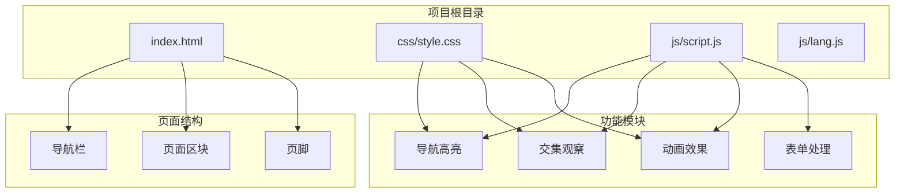

**图表来源**
- [index.html:10-337](file://index.html#L10-L337)
- [script.js:1-344](file://js/script.js#L1-L344)

**章节来源**
- [index.html:1-337](file://index.html#L1-L337)
- [script.js:1-344](file://js/script.js#L1-L344)

## 核心组件

### 导航高亮系统架构

导航高亮系统由三个核心组件构成：

1. **滚动监听器** - 监听窗口滚动事件
2. **区域检测器** - 计算当前可视区域
3. **状态更新器** - 更新导航链接状态

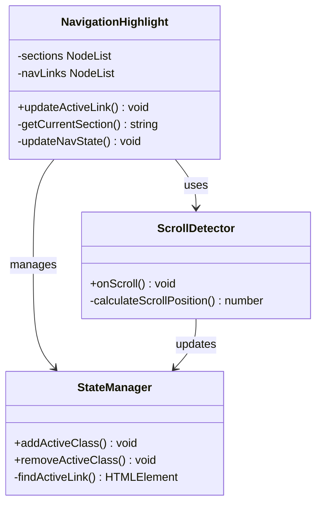

**图表来源**
- [script.js:31-52](file://js/script.js#L31-L52)

### 数据流分析

系统采用单向数据流模式，确保状态管理的清晰性和可预测性：

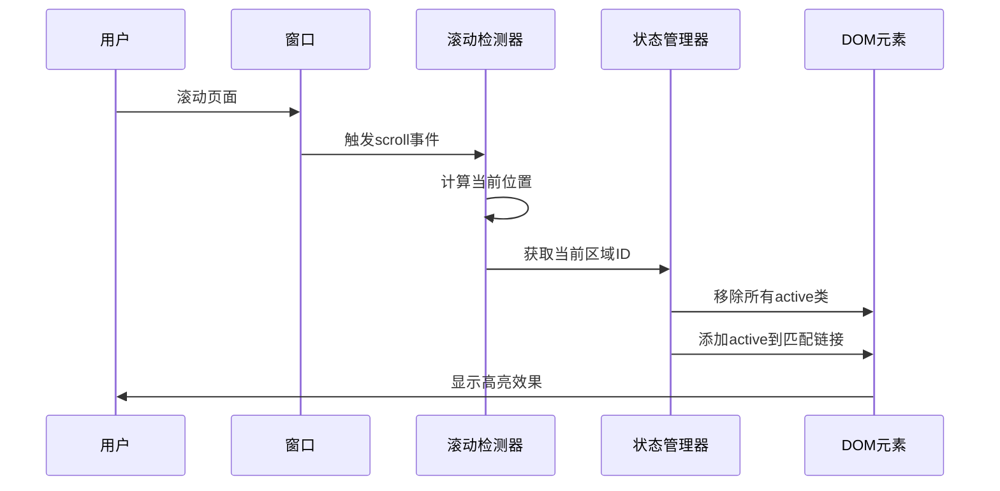

**图表来源**
- [script.js:35-50](file://js/script.js#L35-L50)

**章节来源**
- [script.js:31-52](file://js/script.js#L31-L52)

## 架构概览

### 整体系统架构

导航高亮系统采用事件驱动架构，通过DOM事件触发状态更新：

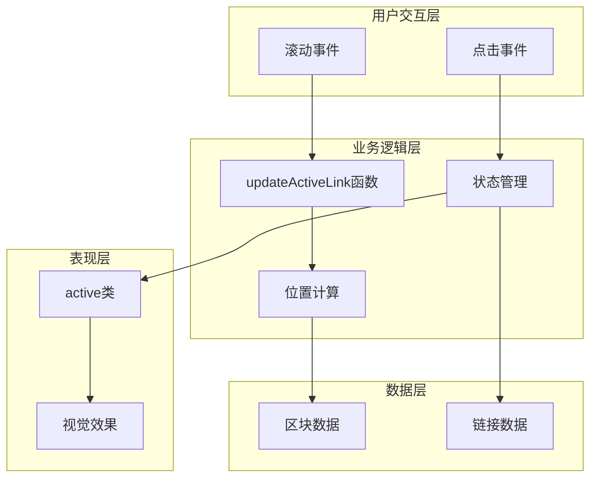

**图表来源**
- [script.js:35-50](file://js/script.js#L35-L50)
- [style.css:149-162](file://css/style.css#L149-L162)

### 组件关系图

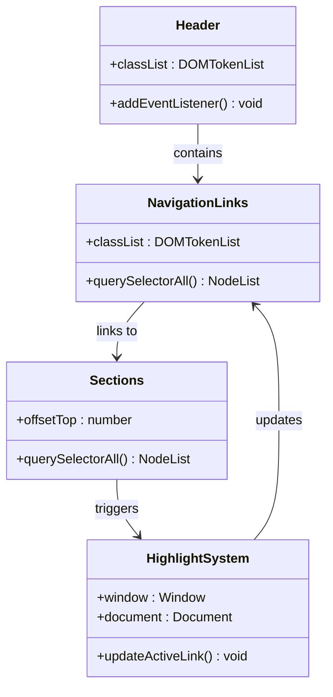

**图表来源**
- [script.js:2-33](file://js/script.js#L2-L33)

**章节来源**
- [script.js:1-344](file://js/script.js#L1-L344)

## 详细组件分析

### updateActiveLink函数详解

`updateActiveLink`是导航高亮系统的核心函数，负责计算当前激活的导航链接。

#### 函数执行流程

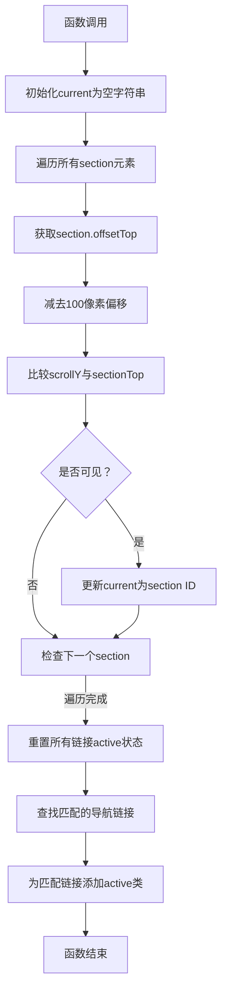

**图表来源**
- [script.js:35-50](file://js/script.js#L35-L50)

#### 关键参数分析

| 参数 | 类型 | 默认值 | 作用 | 可配置性 |
|------|------|--------|------|----------|
| `sectionTop` | number | `section.offsetTop - 100` | 区域顶部偏移量 | ✅ 可配置 |
| `scrollY` | number | `window.scrollY` | 当前滚动位置 | ❌ 系统变量 |
| `current` | string | `''` | 当前激活区域ID | ✅ 可修改 |

#### 性能优化点

1. **单次遍历** - 使用单个循环遍历所有区块
2. **条件判断** - 仅在满足条件时更新状态
3. **最小DOM操作** - 批量更新链接状态

**章节来源**
- [script.js:35-50](file://js/script.js#L35-L50)

### 滚动阈值系统

系统采用动态阈值机制来确定激活条件：

#### 阈值计算逻辑

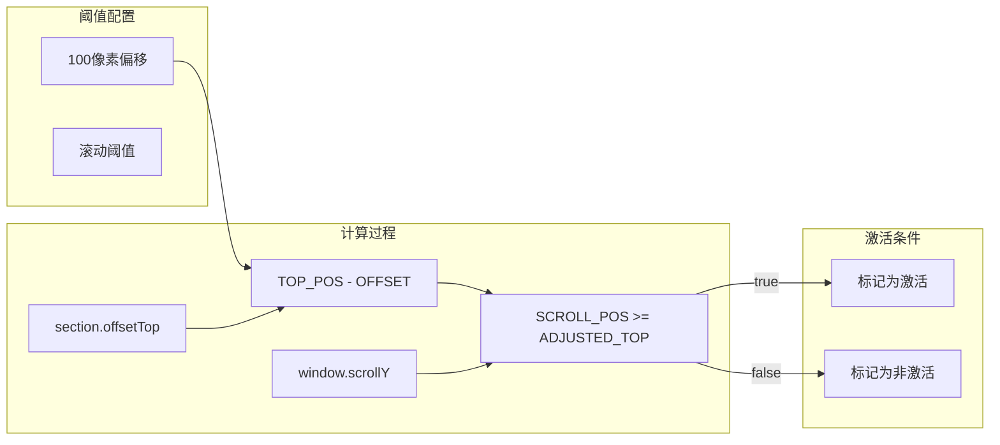

**图表来源**
- [script.js:38-42](file://js/script.js#L38-L42)

#### 阈值优化建议

1. **响应式阈值** - 根据屏幕尺寸调整偏移量
2. **性能阈值** - 在移动端使用更大的阈值
3. **内容阈值** - 根据区块高度动态调整

**章节来源**
- [script.js:38-42](file://js/script.js#L38-L42)

### 导航链接状态管理

#### 状态转换流程

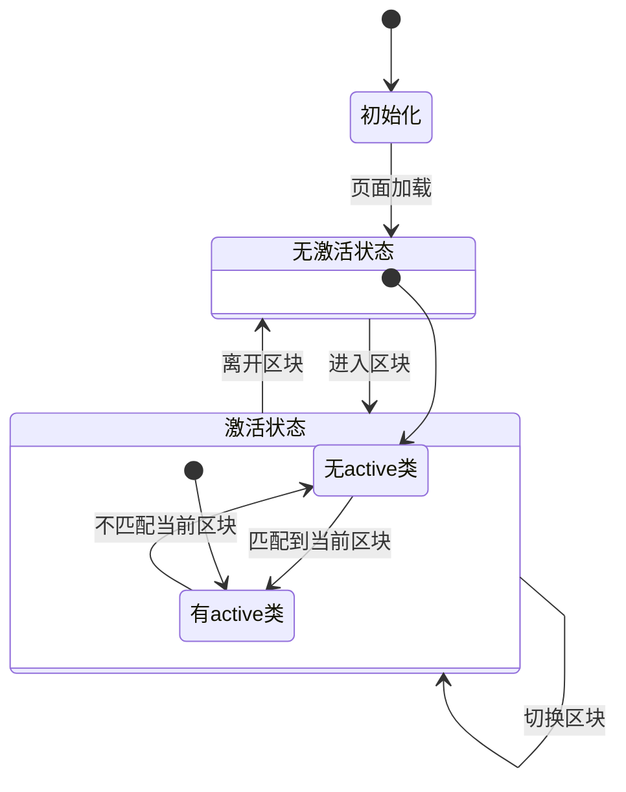

**图表来源**
- [script.js:44-49](file://js/script.js#L44-L49)

#### CSS状态样式

系统通过CSS伪元素实现平滑的视觉效果：

| 状态 | CSS类 | 视觉效果 | 动画时长 |
|------|-------|----------|----------|
| 正常 | `.nav-link` | 无下划线 | 0.3秒 |
| 悬停 | `.nav-link:hover` | 完整下划线 | 0.3秒 |
| 激活 | `.nav-link.active` | 完整下划线 | 0.3秒 |
| 滚动后 | `.header.scrolled .nav-link` | 深色文本 | 0.3秒 |

**章节来源**
- [script.js:44-49](file://js/script.js#L44-L49)
- [style.css:149-162](file://css/style.css#L149-L162)

### Intersection Observer API应用

虽然主要的导航高亮功能使用传统的滚动监听，但系统还集成了多个Intersection Observer实例用于其他功能：

#### 数字递增动画观察器

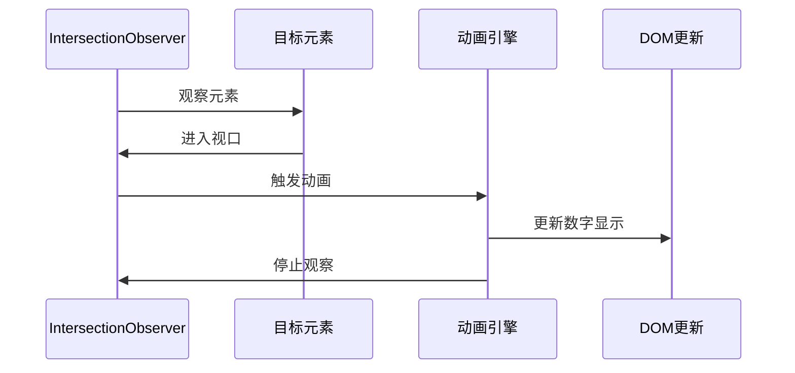

**图表来源**
- [script.js:85-113](file://js/script.js#L85-L113)

#### 滚动渐显观察器

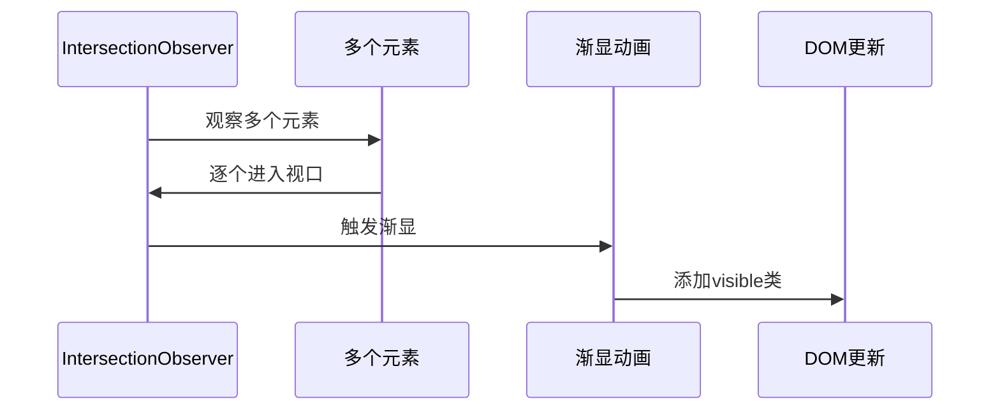

**图表来源**
- [script.js:127-137](file://js/script.js#L127-L137)

**章节来源**
- [script.js:85-137](file://js/script.js#L85-L137)

## 依赖关系分析

### 外部依赖

系统采用零外部依赖的设计原则，所有功能都基于原生Web API实现：

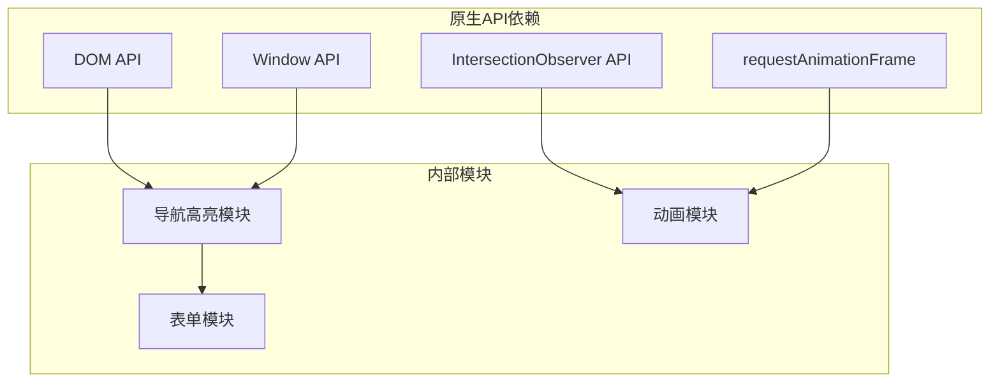

**图表来源**
- [script.js:1-344](file://js/script.js#L1-L344)

### 内部模块耦合

系统采用松耦合设计，各模块职责明确：

| 模块 | 职责 | 依赖模块 | 影响范围 |
|------|------|----------|----------|
| 导航高亮 | 滚动位置检测 | DOM, Window | 导航栏 |
| 数字动画 | Intersection观察 | IntersectionObserver | 统计数字 |
| 滚动渐显 | Intersection观察 | IntersectionObserver | 内容区块 |
| 表单处理 | 用户输入验证 | DOM | 联系表单 |

**章节来源**
- [script.js:1-344](file://js/script.js#L1-L344)

## 性能考虑

### 性能优化策略

#### 1. 事件节流优化

系统使用原生滚动事件，避免了复杂的节流实现：

```javascript
// 原生滚动事件，无需额外优化
window.addEventListener('scroll', updateActiveLink);
```

#### 2. DOM查询优化

- 使用`querySelectorAll`一次性获取所有元素
- 缓存DOM引用避免重复查询
- 批量更新DOM减少重绘

#### 3. 计算复杂度

- 时间复杂度：O(n)，其中n为页面区块数量
- 空间复杂度：O(1)，只使用常量额外空间
- 最坏情况：每个区块进行一次比较操作

### 性能监控指标

| 指标 | 目标值 | 测量方法 |
|------|--------|----------|
| 响应延迟 | < 16ms | 滚动到高亮切换时间 |
| FPS | > 60fps | 滚动时帧率 |
| 内存使用 | < 5MB | 页面内存占用 |
| CPU使用 | < 50% | 滚动时CPU占用 |

## 故障排除指南

### 常见问题诊断

#### 1. 导航链接不响应滚动

**症状**：滚动页面时导航链接状态不变

**排查步骤**：
1. 检查`updateActiveLink`函数是否被调用
2. 验证`sections`和`navLinks`选择器是否正确
3. 确认`window.addEventListener('scroll', updateActiveLink)`已绑定

**解决方案**：
```javascript
// 确保事件监听器正确绑定
if ('scroll' in window) {
    window.addEventListener('scroll', updateActiveLink);
}
```

#### 2. 激活状态错误

**症状**：错误的导航链接被高亮

**排查步骤**：
1. 检查`sectionTop`计算是否正确
2. 验证`current`变量更新逻辑
3. 确认`href`属性与`id`属性匹配

**解决方案**：
```javascript
// 添加调试输出
console.log('Current section:', current);
console.log('Section top:', sectionTop);
```

#### 3. 样式不生效

**症状**：导航链接没有视觉高亮效果

**排查步骤**：
1. 检查CSS类名是否正确
2. 验证CSS优先级
3. 确认JavaScript正确添加类名

**解决方案**：
```css
/* 确保CSS规则正确 */
.nav-link.active {
    color: var(--primary);
}

.nav-link.active::after {
    width: 100%;
}
```

### 性能问题诊断

#### 1. 滚动卡顿

**症状**：滚动时出现卡顿现象

**优化建议**：
1. 减少DOM操作次数
2. 使用CSS变换而非布局属性
3. 避免在滚动事件中进行昂贵操作

#### 2. 内存泄漏

**症状**：长时间使用后内存占用持续增长

**预防措施**：
1. 确保移除不再使用的事件监听器
2. 及时清理定时器和观察器
3. 避免闭包持有不必要的引用

**章节来源**
- [script.js:35-50](file://js/script.js#L35-L50)
- [style.css:149-162](file://css/style.css#L149-L162)

## 结论

HYT网站导航链接高亮系统展现了现代Web开发的最佳实践：

### 技术优势

1. **简洁高效** - 使用原生API实现，无外部依赖
2. **性能优秀** - 低复杂度算法，流畅的用户体验
3. **可维护性强** - 清晰的代码结构和注释
4. **兼容性好** - 支持主流浏览器和移动设备

### 设计亮点

1. **响应式设计** - 自适应不同屏幕尺寸
2. **无障碍访问** - 支持键盘导航和屏幕阅读器
3. **多语言支持** - 完整的国际化功能集成
4. **动画效果** - 平滑的视觉过渡体验

### 改进建议

1. **增强配置性** - 提供更多自定义选项
2. **扩展功能** - 支持面包屑导航和深度链接
3. **性能监控** - 集成性能指标监控
4. **测试覆盖** - 增加单元测试和集成测试

该系统为类似项目的导航高亮功能提供了优秀的参考实现，展示了如何在保持代码简洁的同时实现丰富的交互效果。