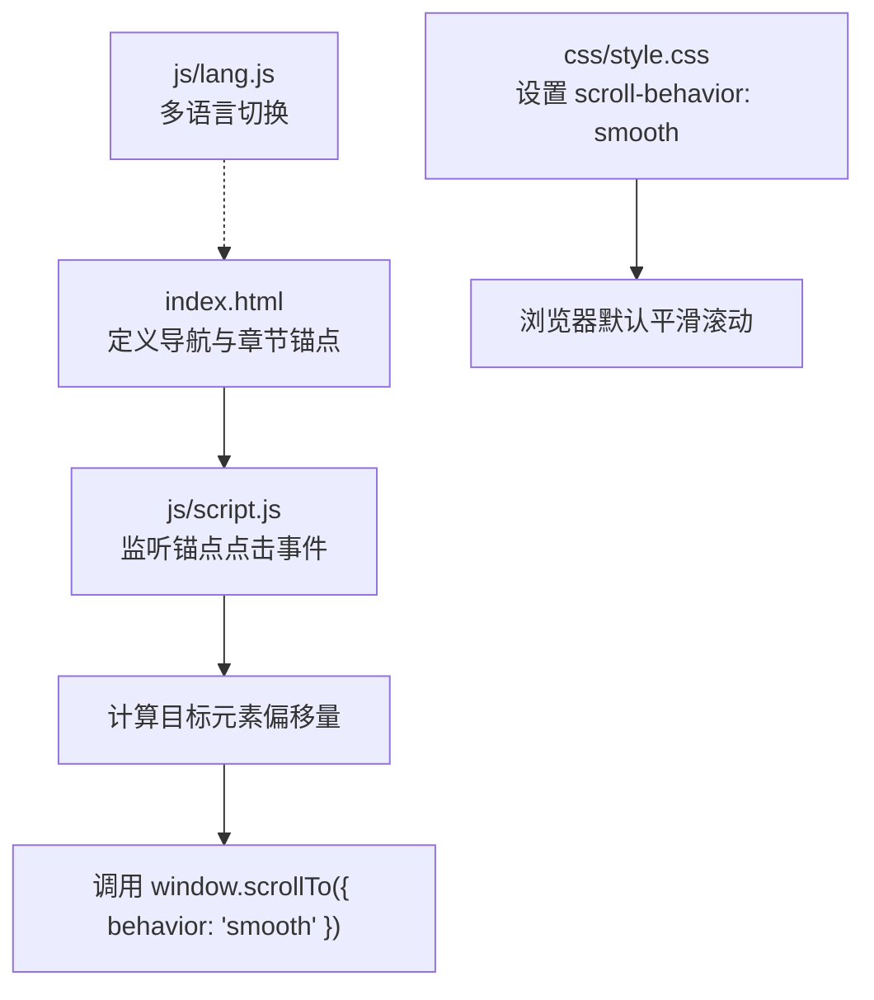
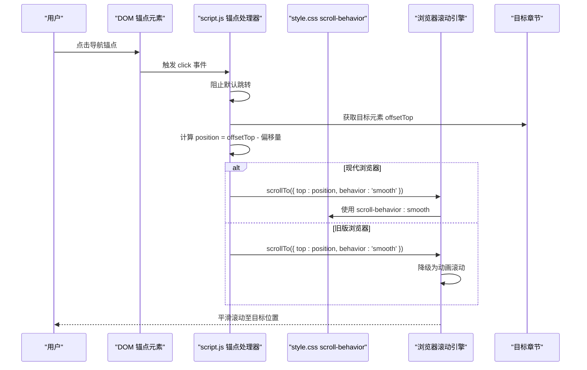
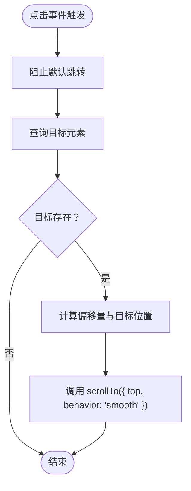
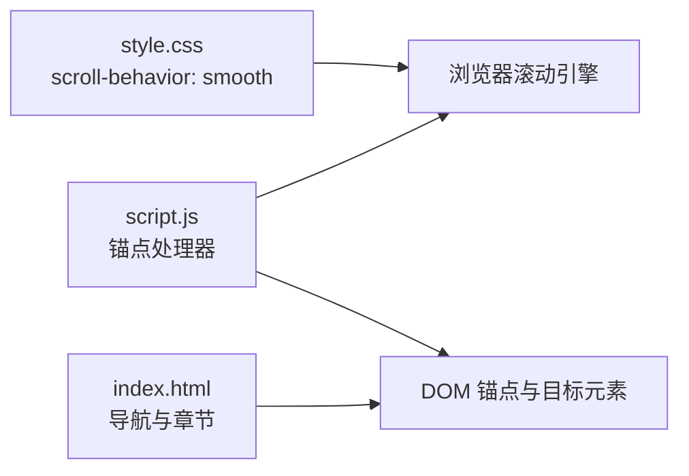

# 平滑滚动

<cite>
**本文引用的文件**
- [index.html](file://index.html)
- [script.js](file://js/script.js)
- [style.css](file://css/style.css)
- [lang.js](file://js/lang.js)
</cite>

## 目录
1. [简介](#简介)
2. [项目结构](#项目结构)
3. [核心组件](#核心组件)
4. [架构总览](#架构总览)
5. [详细组件分析](#详细组件分析)
6. [依赖关系分析](#依赖关系分析)
7. [性能考量](#性能考量)
8. [故障排查指南](#故障排查指南)
9. [结论](#结论)

## 简介
本文件围绕 HYT 网站的“平滑滚动”功能进行系统化技术文档整理，重点解析以下方面：
- 跨浏览器兼容策略：现代浏览器通过 CSS 属性启用平滑滚动；旧版浏览器通过 JavaScript 提供降级方案
- 滚动偏移量计算与目标元素定位机制
- 滚动动画实现方式与性能优化建议
- 自定义滚动行为的配置方法与最佳实践

该实现位于主页 index.html 及其配套脚本与样式中，确保在主流浏览器上具备一致的用户体验。

## 项目结构
与平滑滚动直接相关的文件与职责如下：
- index.html：包含导航与各章节锚点，为平滑滚动提供目标元素
- js/script.js：注册锚点点击事件监听器，执行平滑滚动逻辑
- css/style.css：全局启用平滑滚动行为，作为现代浏览器的默认策略
- js/lang.js：多语言切换不影响滚动行为，但会影响页面标题与文案更新

图表来源
- [index.html](file://index.html)
- [script.js](file://js/script.js)
- [style.css](file://css/style.css)
- [lang.js](file://js/lang.js)

章节来源
- [index.html](file://index.html)
- [script.js](file://js/script.js)
- [style.css](file://css/style.css)
- [lang.js](file://js/lang.js)

## 核心组件
- 全局平滑滚动策略：通过 CSS 将根元素的滚动行为设为平滑，使浏览器默认支持平滑滚动
- 锚点点击处理器：捕获以 # 开头的链接点击，阻止默认跳转，计算目标位置并触发平滑滚动
- 偏移量与定位：为固定头部留出空间，避免滚动后目标元素被遮挡

章节来源
- [style.css](file://css/style.css)
- [script.js](file://js/script.js)

## 架构总览
下图展示从用户点击到滚动完成的整体流程，涵盖现代浏览器与旧版浏览器两条路径：

图表来源
- [script.js](file://js/script.js)
- [style.css](file://css/style.css)

## 详细组件分析

### 组件一：全局平滑滚动策略（CSS）
- 实现要点
  - 在根元素上设置滚动行为为平滑，使浏览器默认支持平滑滚动
  - 该策略对现代浏览器有效，无需额外 JavaScript 即可获得平滑体验
- 配置位置
  - 根元素选择器对应文件与行号
- 影响范围
  - 对整个页面的所有滚动场景生效，包括键盘、触摸板、滚轮等触发的滚动

章节来源
- [style.css](file://css/style.css)

### 组件二：锚点点击处理器（JavaScript）
- 实现要点
  - 选择所有以 # 开头的锚点链接，绑定点击事件
  - 阻止默认跳转，查询目标元素，计算带偏移量的位置
  - 调用 window.scrollTo 并指定 behavior 为 smooth
- 关键参数
  - 偏移量：用于避开固定头部遮挡
  - 目标位置：目标元素的 offsetTop 减去偏移量
- 适用范围
  - 适用于现代浏览器与旧版浏览器，旧版浏览器会自动降级为动画滚动

图表来源
- [script.js](file://js/script.js)

章节来源
- [script.js](file://js/script.js)

### 组件三：目标元素定位与偏移量计算
- 定位机制
  - 使用目标元素的 offsetTop 获取其在页面中的垂直偏移
  - 通过减去一个固定偏移值，确保目标元素出现在视口合适位置（避开固定头部）
- 偏移量来源
  - 偏移量在脚本中以常量形式定义，便于统一管理与修改
- 适配性
  - 若页面布局发生变化（如头部高度变化），需同步调整偏移量

章节来源
- [script.js](file://js/script.js)

### 组件四：跨浏览器兼容性
- 现代浏览器
  - 由于设置了 scroll-behavior: smooth，浏览器默认平滑滚动
- 旧版浏览器
  - 通过 JavaScript 显式传入 behavior: 'smooth'，由浏览器内部实现降级动画
- 一致性保障
  - 无论哪种路径，最终都呈现一致的平滑滚动体验

章节来源
- [style.css](file://css/style.css)
- [script.js](file://js/script.js)

### 组件五：自定义滚动行为配置
- 偏移量调整
  - 在脚本中修改偏移量常量即可调整滚动后目标元素的可视位置
- 动画时长与缓动
  - 当前实现依赖浏览器默认行为，若需自定义动画曲线或时长，可在脚本中引入自定义动画函数替代 scrollTo
- 多语言影响
  - 多语言模块负责文案与标题更新，不影响滚动行为本身

章节来源
- [script.js](file://js/script.js)
- [lang.js](file://js/lang.js)

## 依赖关系分析
- 脚本依赖
  - script.js 依赖 DOM 中的锚点与目标章节元素
  - 依赖浏览器的 window.scrollTo 与 offsetTop 计算
- 样式依赖
  - style.css 的 scroll-behavior: smooth 为现代浏览器提供默认平滑滚动
- 页面结构依赖
  - index.html 中的导航与章节必须包含正确的 id 与 href，以便锚点处理器正确匹配

图表来源
- [style.css](file://css/style.css)
- [script.js](file://js/script.js)
- [index.html](file://index.html)

章节来源
- [style.css](file://css/style.css)
- [script.js](file://js/script.js)
- [index.html](file://index.html)

## 性能考量
- 偏移量计算成本低：offsetTop 与常量运算开销极小
- 事件绑定数量可控：仅对以 # 开头的锚点进行监听，避免对整页链接重复绑定
- 现代浏览器优先：通过 CSS 默认平滑滚动减少 JavaScript 干预，降低主线程压力
- 动画降级：旧版浏览器的降级滚动由浏览器内部实现，通常具备良好性能
- 建议
  - 如需进一步优化，可考虑节流滚动事件、延迟初始化锚点处理器，或在长列表场景中按需绑定监听

## 故障排查指南
- 现象：点击锚点无反应
  - 排查：确认目标元素是否存在且具有正确的 id
  - 参考：锚点处理器对不存在的目标元素会直接结束
- 现象：滚动后目标元素被固定头部遮挡
  - 排查：检查偏移量是否过小或页面头部高度变化
  - 参考：偏移量在脚本中以常量形式定义，便于统一调整
- 现象：旧版浏览器滚动不平滑
  - 排查：确认浏览器支持 behavior: 'smooth' 或已启用降级
  - 参考：当前实现会在旧版浏览器中自动降级为动画滚动
- 现象：多语言切换后滚动异常
  - 排查：确认多语言模块未破坏页面结构或样式
  - 参考：多语言模块仅更新文案与标题，不影响滚动行为

章节来源
- [script.js](file://js/script.js)
- [lang.js](file://js/lang.js)

## 结论
HYT 网站的平滑滚动实现采用“CSS 默认 + JavaScript 降级”的双轨策略，既保证现代浏览器的最佳体验，又确保旧版浏览器的可用性。通过合理的偏移量计算与目标元素定位，滚动体验稳定可靠。建议在后续维护中保持偏移量配置的集中化管理，并在页面布局变更时同步校验滚动行为。