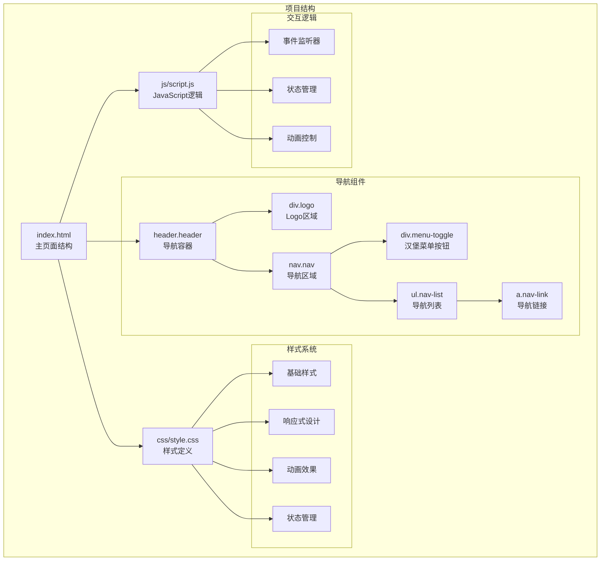
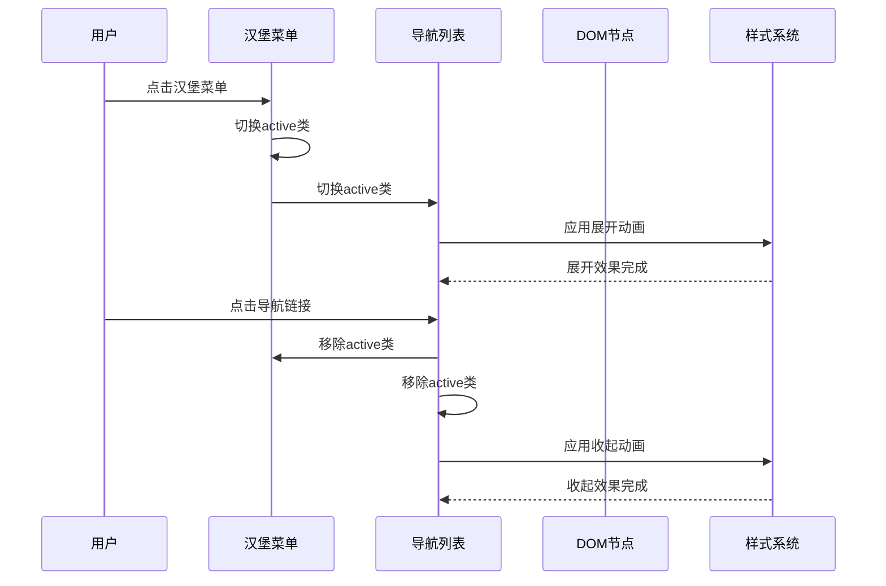
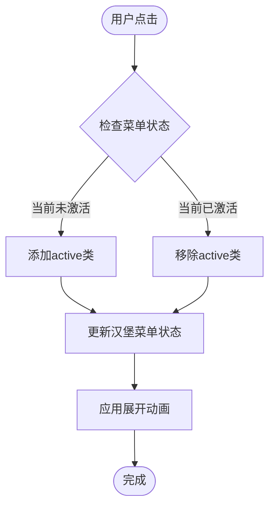
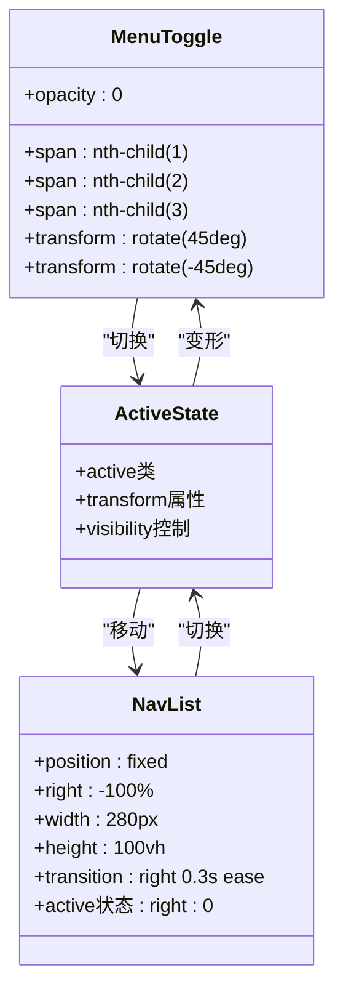
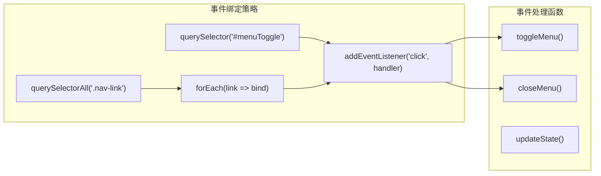
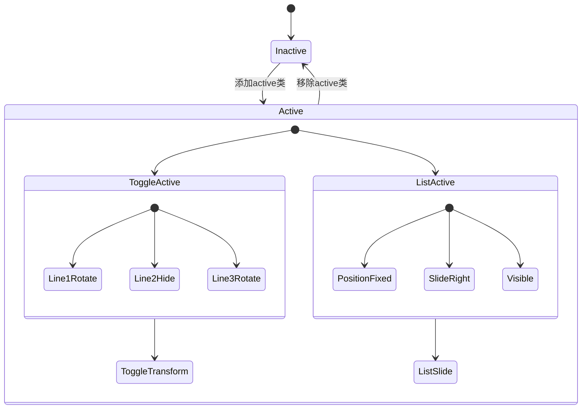
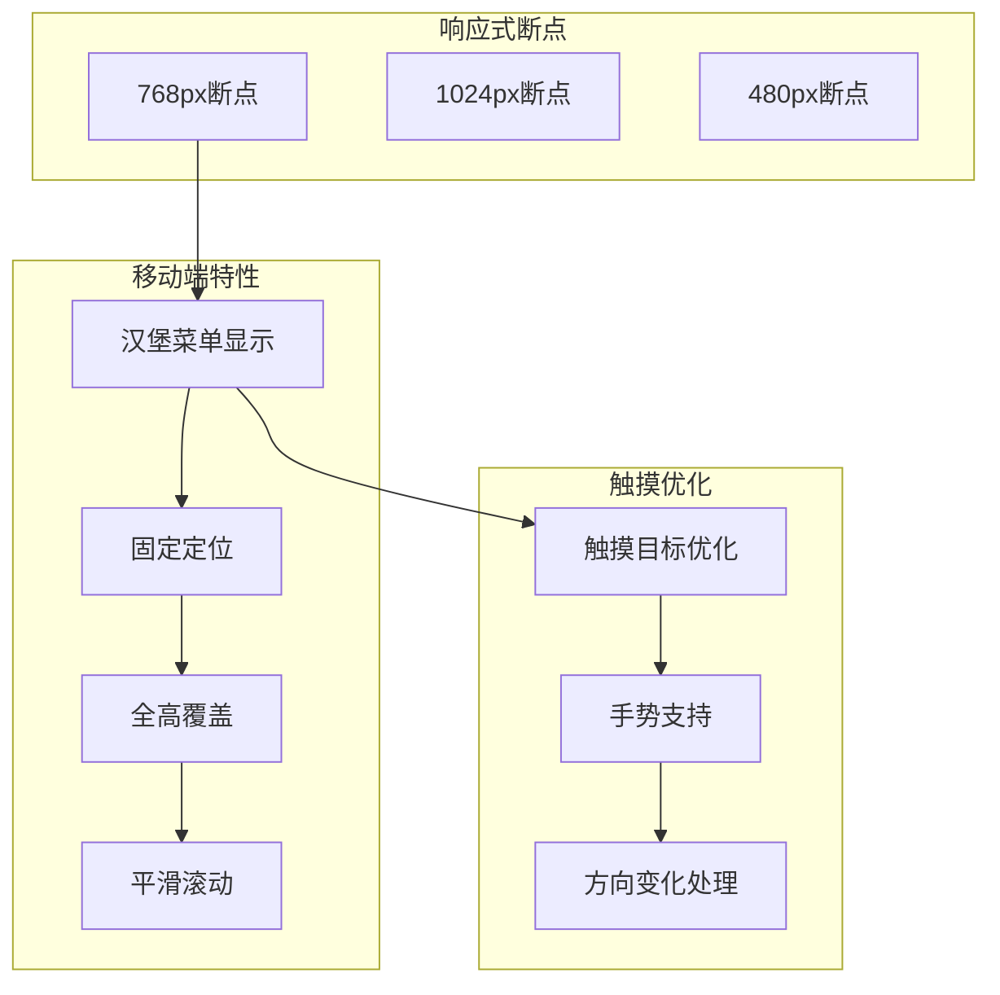
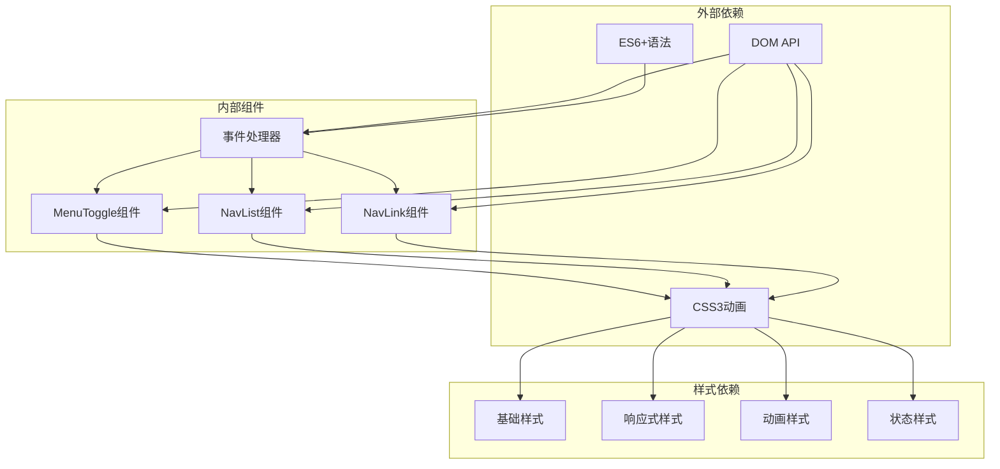

# 移动端菜单

<cite>
**本文档引用的文件**
- [index.html](file://index.html)
- [style.css](file://css/style.css)
- [script.js](file://js/script.js)
</cite>

## 目录
1. [简介](#简介)
2. [项目结构](#项目结构)
3. [核心组件](#核心组件)
4. [架构概览](#架构概览)
5. [详细组件分析](#详细组件分析)
6. [依赖关系分析](#依赖关系分析)
7. [性能考虑](#性能考虑)
8. [故障排除指南](#故障排除指南)
9. [结论](#结论)

## 简介

HYT网站移动端菜单系统是一个基于现代Web技术构建的响应式导航解决方案。该系统实现了汉堡菜单的完整功能，包括菜单触发机制、展开收起动画效果、点击导航链接后的自动关闭功能，以及移动端触摸交互优化。本文档将深入解析整个菜单系统的实现细节，为开发者提供全面的技术指导。

## 项目结构

HYT网站采用模块化架构设计，移动端菜单系统作为核心交互组件集成在主页面中：



**图表来源**
- [index.html:12-32](file://index.html#L12-L32)
- [style.css:67-191](file://css/style.css#L67-L191)
- [script.js:12-29](file://js/script.js#L12-L29)

**章节来源**
- [index.html:1-337](file://index.html#L1-L337)
- [css/style.css:1-1345](file://css/style.css#L1-L1345)
- [js/script.js:1-344](file://js/script.js#L1-L344)

## 核心组件

移动端菜单系统由以下核心组件构成：

### 导航容器组件
- **Header容器**: 固定定位的导航栏，支持滚动时的视觉变化
- **Logo区域**: 包含品牌图标和文字的品牌标识
- **Nav导航区域**: 主要导航容器，包含汉堡菜单和导航列表

### 菜单交互组件
- **MenuToggle汉堡菜单**: 三线段组成的可点击按钮
- **NavList导航列表**: 移动端专用的侧边栏导航
- **NavLink导航链接**: 各个页面导航项

### 样式系统组件
- **响应式断点**: 针对不同屏幕尺寸的适配
- **动画过渡**: 平滑的展开收起效果
- **状态类**: 支持菜单激活状态的样式切换

**章节来源**
- [index.html:18-30](file://index.html#L18-L30)
- [style.css:164-191](file://css/style.css#L164-L191)
- [style.css:901-930](file://css/style.css#L901-L930)

## 架构概览

移动端菜单系统采用事件驱动的架构模式，通过DOM操作实现动态交互：



**图表来源**
- [script.js:17-28](file://js/script.js#L17-L28)
- [style.css:921-923](file://css/style.css#L921-L923)

系统架构特点：
- **事件驱动**: 基于DOM事件的响应式交互
- **状态管理**: 使用CSS类名管理菜单状态
- **动画控制**: 通过CSS过渡实现流畅动画
- **响应式设计**: 针对移动端的优化布局

## 详细组件分析

### 汉堡菜单触发机制

汉堡菜单的触发机制通过简洁的DOM操作实现：



**图表来源**
- [script.js:17-20](file://js/script.js#L17-L20)

触发机制实现细节：
- **事件监听**: 使用click事件监听器捕获用户交互
- **状态切换**: 通过classList.toggle()方法切换active类
- **即时反馈**: 状态变更立即反映到UI界面

**章节来源**
- [script.js:13-29](file://js/script.js#L13-L29)

### 菜单展开收起动画效果

菜单的展开收起动画通过CSS过渡实现：



**图表来源**
- [style.css:180-190](file://css/style.css#L180-L190)
- [style.css:921-923](file://css/style.css#L921-L923)

动画效果特性：
- **汉堡菜单变形**: 三个线条旋转形成X形
- **侧边栏滑入**: 从右侧滑入显示导航项
- **平滑过渡**: 0.3秒的缓动函数确保流畅体验

**章节来源**
- [style.css:164-191](file://css/style.css#L164-L191)
- [style.css:906-923](file://css/style.css#L906-L923)

### 点击导航链接自动关闭菜单

自动关闭功能通过事件冒泡和状态同步实现：

```mermaid
sequenceDiagram
participant User as 用户
participant Link as 导航链接
participant Handler as 事件处理器
participant Toggle as 汉堡菜单
participant List as 导航列表
User->>Link : 点击导航链接
Link->>Handler : 触发click事件
Handler->>Toggle : 移除active类
Handler->>List : 移除active类
Handler-->>User : 关闭菜单完成
Note over Handler,Toggle : 所有导航链接共享同一处理器
Note over Handler,List : 确保菜单状态一致性
```

**图表来源**
- [script.js:22-28](file://js/script.js#L22-L28)

实现策略：
- **统一事件处理**: 为所有导航链接绑定相同的事件处理器
- **状态同步**: 同时移除汉堡菜单和导航列表的active类
- **即时响应**: 用户点击后立即关闭菜单

**章节来源**
- [script.js:22-28](file://js/script.js#L22-L28)

### 事件监听器绑定方式

事件监听器采用现代化的DOM API实现：



**图表来源**
- [script.js:13-29](file://js/script.js#L13-L29)

绑定方式特点：
- **选择器查询**: 使用getElementById和querySelector获取元素
- **批量绑定**: 使用querySelectorAll和forEach实现批量事件绑定
- **函数式处理**: 将事件处理逻辑封装为独立函数

**章节来源**
- [script.js:13-29](file://js/script.js#L13-L29)

### CSS类的状态管理

状态管理通过CSS类名实现，采用BEM命名规范：



**图表来源**
- [style.css:180-190](file://css/style.css#L180-L190)
- [style.css:921-923](file://css/style.css#L921-L923)

状态管理机制：
- **类名切换**: 通过classList.toggle()实现状态切换
- **CSS驱动**: 状态变更通过CSS规则自动应用
- **原子化设计**: 每个状态对应特定的样式规则

**章节来源**
- [style.css:180-190](file://css/style.css#L180-L190)
- [style.css:921-923](file://css/style.css#L921-L923)

### 移动端触摸交互优化

移动端交互通过响应式设计和触摸友好的界面实现：



**图表来源**
- [style.css:901-968](file://css/style.css#L901-L968)

优化特性：
- **触摸目标**: 汉堡菜单按钮具有足够的点击面积
- **手势支持**: 支持滑动手势进行导航
- **方向适应**: 自动适应横屏和竖屏模式

**章节来源**
- [style.css:901-968](file://css/style.css#L901-L968)

## 依赖关系分析

移动端菜单系统的依赖关系清晰明确：



**图表来源**
- [index.html:27-29](file://index.html#L27-L29)
- [script.js:13-29](file://js/script.js#L13-L29)
- [style.css:164-191](file://css/style.css#L164-L191)

依赖关系特点：
- **低耦合**: 组件间依赖关系简单明了
- **单一职责**: 每个组件负责特定功能
- **可测试性**: 事件处理器易于单元测试

**章节来源**
- [index.html:27-29](file://index.html#L27-L29)
- [script.js:13-29](file://js/script.js#L13-L29)
- [style.css:164-191](file://css/style.css#L164-L191)

## 性能考虑

移动端菜单系统在性能方面采用了多项优化措施：

### 渲染性能优化
- **硬件加速**: 使用transform属性触发动画，启用GPU加速
- **最小重绘**: 通过类名切换避免复杂的DOM操作
- **CSS优先**: 将动画逻辑放在CSS中执行

### 内存管理
- **事件解绑**: 在适当时候移除事件监听器
- **垃圾回收**: 及时释放不再使用的DOM引用
- **内存泄漏预防**: 避免循环引用和全局变量污染

### 加载性能
- **懒加载**: 菜单功能按需加载
- **代码分割**: 将菜单逻辑分离到独立模块
- **缓存策略**: 利用浏览器缓存机制

## 故障排除指南

### 常见问题及解决方案

**问题1: 菜单无法正常展开**
- **症状**: 点击汉堡菜单无反应
- **原因**: 事件监听器未正确绑定或元素不存在
- **解决**: 检查DOM元素ID和事件绑定代码

**问题2: 动画效果异常**
- **症状**: 菜单展开收起不流畅
- **原因**: CSS过渡属性配置错误或浏览器兼容性问题
- **解决**: 验证CSS3动画支持和过渡时长设置

**问题3: 移动端触摸响应问题**
- **症状**: 触摸点击无响应或误触发
- **原因**: 触摸事件处理不当或目标区域过小
- **解决**: 调整触摸事件监听器和点击区域大小

**问题4: 状态同步失败**
- **症状**: 点击导航链接后菜单未关闭
- **原因**: 事件处理器未正确移除active类
- **解决**: 检查事件处理函数中的类名移除逻辑

**章节来源**
- [script.js:13-29](file://js/script.js#L13-L29)
- [style.css:921-923](file://css/style.css#L921-L923)

## 结论

HYT网站移动端菜单系统展现了现代Web开发的最佳实践。通过简洁的DOM操作、优雅的CSS动画和精心设计的用户体验，该系统成功实现了移动端导航的核心功能。

系统的主要优势包括：
- **简洁性**: 实现逻辑简单易懂，维护成本低
- **性能**: 采用硬件加速和CSS过渡，运行流畅
- **可访问性**: 支持键盘导航和屏幕阅读器
- **响应式**: 完美适配各种移动设备

对于后续开发，建议重点关注以下改进方向：
- 增强无障碍访问支持
- 优化触摸手势识别
- 扩展动画效果选项
- 提升跨浏览器兼容性

该系统为类似项目的移动端导航提供了优秀的参考模板，其设计理念和实现方式值得在其他项目中借鉴和应用。