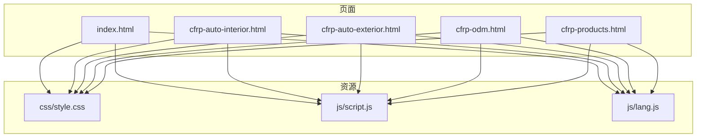
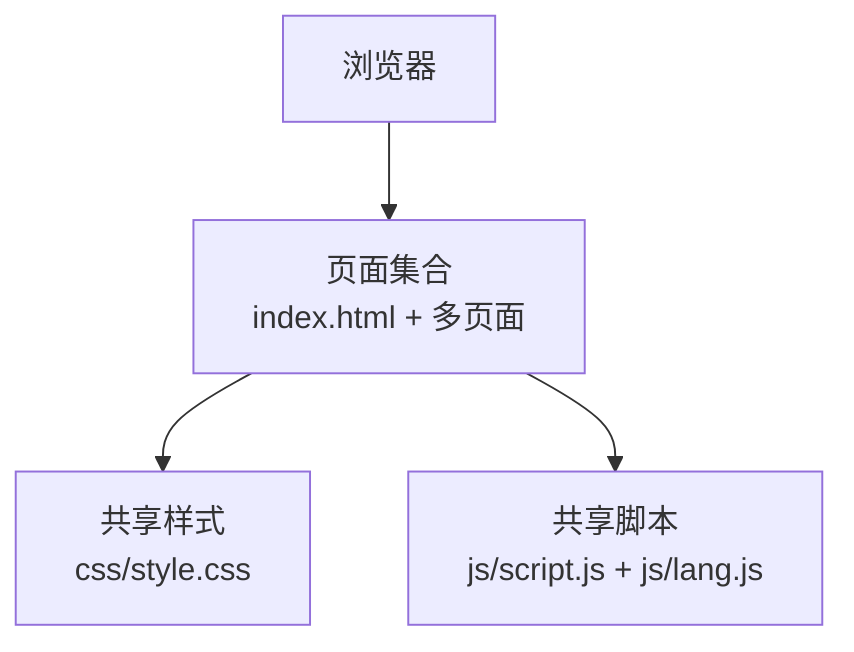
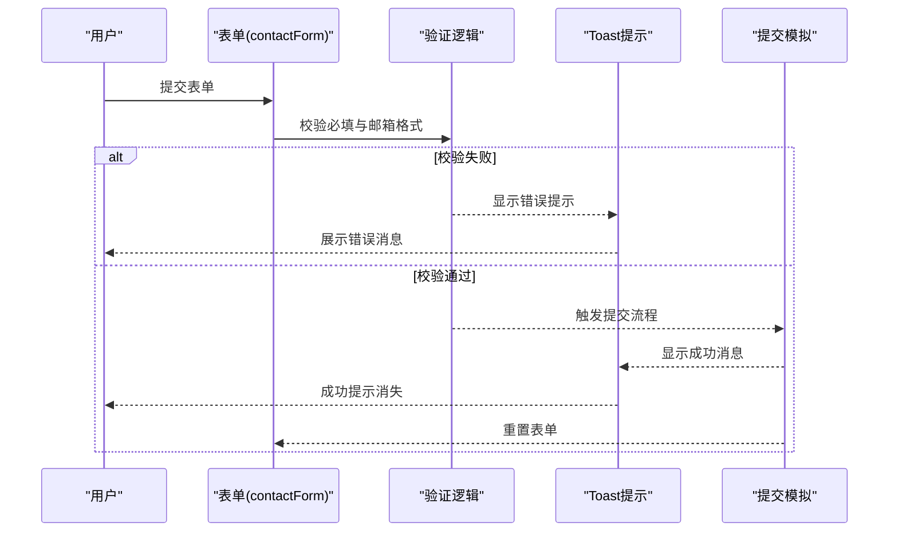
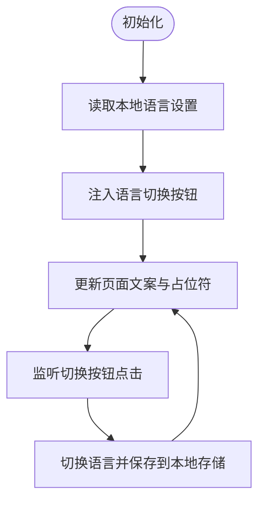
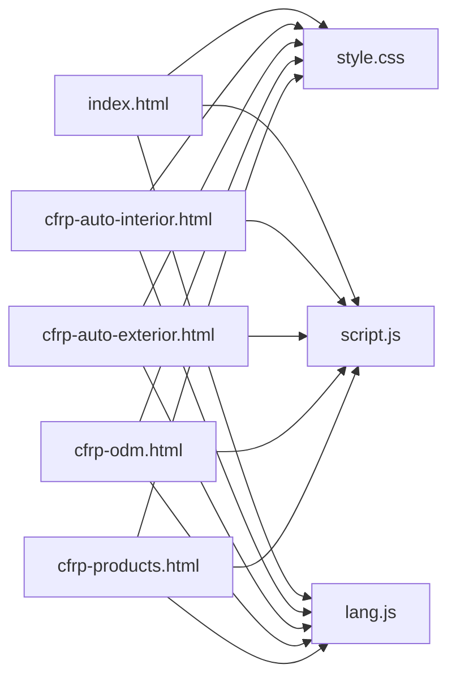

# 开发最佳实践

<cite>
**本文引用的文件**
- [index.html](file://index.html)
- [cfrp-auto-interior.html](file://cfrp-auto-interior.html)
- [cfrp-auto-exterior.html](file://cfrp-auto-exterior.html)
- [cfrp-odm.html](file://cfrp-odm.html)
- [cfrp-products.html](file://cfrp-products.html)
- [style.css](file://css/style.css)
- [script.js](file://js/script.js)
- [lang.js](file://js/lang.js)
- [.gitignore](file://.gitignore)
</cite>

## 目录
1. [简介](#简介)
2. [项目结构](#项目结构)
3. [核心组件](#核心组件)
4. [架构总览](#架构总览)
5. [详细组件分析](#详细组件分析)
6. [依赖关系分析](#依赖关系分析)
7. [性能考量](#性能考量)
8. [故障排查指南](#故障排查指南)
9. [结论](#结论)
10. [附录](#附录)

## 简介
本指南面向HYT网站项目，旨在建立统一的开发最佳实践，涵盖代码组织规范、命名约定、模块化与国际化、注释与文档维护、测试与调试、浏览器兼容性与性能测试、版本控制与部署流程等方面，帮助团队提升协作效率与工程质量。

## 项目结构
项目采用静态站点结构，包含主页与多页面（产品、内外饰、ODM），以及共享的样式与脚本资源。页面通过统一的头部与底部布局复用，核心交互逻辑集中在公共脚本中，多语言能力由独立模块提供。

图表来源
- [index.html](file://index.html)
- [cfrp-auto-interior.html](file://cfrp-auto-interior.html)
- [cfrp-auto-exterior.html](file://cfrp-auto-exterior.html)
- [cfrp-odm.html](file://cfrp-odm.html)
- [cfrp-products.html](file://cfrp-products.html)
- [style.css](file://css/style.css)
- [script.js](file://js/script.js)
- [lang.js](file://js/lang.js)

章节来源
- [index.html](file://index.html)
- [cfrp-auto-interior.html](file://cfrp-auto-interior.html)
- [cfrp-auto-exterior.html](file://cfrp-auto-exterior.html)
- [cfrp-odm.html](file://cfrp-odm.html)
- [cfrp-products.html](file://cfrp-products.html)
- [style.css](file://css/style.css)
- [script.js](file://js/script.js)
- [lang.js](file://js/lang.js)

## 核心组件
- 统一样式系统：通过CSS变量与网格布局实现一致的主题与响应式设计。
- 交互脚本：负责导航滚动、移动端菜单、滚动高亮、粒子背景、数字动画、表单校验与提示、平滑滚动、拖拽排序等。
- 多语言模块：集中管理文案键值与DOM更新逻辑，支持中日切换与本地存储持久化。
- 页面模板：各页面复用头部与底部，通过data-i18n属性实现文案注入。

章节来源
- [style.css](file://css/style.css)
- [script.js](file://js/script.js)
- [lang.js](file://js/lang.js)
- [index.html](file://index.html)

## 架构总览
前端采用“页面即模板 + 共享资源”的轻量架构，无构建工具链，直接通过浏览器加载静态资源。交互与国际化逻辑在公共脚本中集中实现，便于维护与扩展。

图表来源
- [index.html](file://index.html)
- [style.css](file://css/style.css)
- [script.js](file://js/script.js)
- [lang.js](file://js/lang.js)

## 详细组件分析

### 样式系统（CSS）
- 设计系统
  - 使用CSS变量定义主题色板、阴影、圆角、过渡时长与最大宽度，便于全局主题切换与一致性维护。
  - 采用BEM风格类名（如.header、.nav-list、.hero-content），语义明确，层级清晰。
- 响应式与布局
  - 通过容器类与媒体查询实现移动端适配；网格布局用于服务卡片、合作伙伴、案例与产品展示。
  - 动画与过渡：关键帧动画（如粒子浮动、淡入）与CSS过渡（hover、active状态）增强交互体验。
- 可维护性
  - 分模块组织样式（导航、首页横幅、通用区块、关于、服务、团队、案例、联系、页脚），便于定位与修改。

章节来源
- [style.css](file://css/style.css)

### 交互脚本（script.js）
- 导航与滚动
  - 监听滚动事件动态添加/移除头部滚动态类，实现背景与阴影变化。
  - 计算当前可视区域对应的section，同步导航链接高亮。
- 移动端菜单
  - 切换菜单按钮与导航列表的激活状态；点击导航项自动收起菜单。
- 粒子背景
  - 动态生成随机大小、位置与动画时长的粒子元素，营造流动背景。
- 数字递增动画
  - 使用IntersectionObserver与requestAnimationFrame实现进入视口时的缓动数字增长。
- 滚动渐显
  - 对多个组件使用观察器实现逐个进入视口时的可见动画。
- 表单提交
  - 校验必填字段与邮箱格式，模拟提交过程，显示Toast消息并重置表单。
- 平滑滚动
  - 对锚点链接进行平滑滚动兼容处理（降级到非smooth行为）。
- 拖拽排序（ODM页面）
  - 实现跨节点拖拽排序，支持箭头联动移动，保持布局一致性。

图表来源
- [script.js](file://js/script.js)

章节来源
- [script.js](file://js/script.js)

### 多语言模块（lang.js）
- 数据结构
  - 以对象形式维护多语言键值，支持中文与日文两套文案。
- 运行机制
  - 初始化时注入语言切换按钮样式与事件，切换语言后更新页面文本与占位符。
  - 通过data-i18n与data-i18n-ph属性实现文案注入与占位符替换。
  - 支持标题与导航文案的动态更新。
- 存储与持久化
  - 使用localStorage保存语言偏好，刷新后仍保持。

图表来源
- [lang.js](file://js/lang.js)

章节来源
- [lang.js](file://js/lang.js)

### 页面模板与复用
- 主页与多页面均包含统一的头部、导航、页脚结构，减少重复代码。
- 通过data-i18n属性实现文案注入，避免硬编码文本。
- ODM页面引入复杂的交互流程图与拖拽排序，需特别注意可访问性与可维护性。

章节来源
- [index.html](file://index.html)
- [cfrp-odm.html](file://cfrp-odm.html)

## 依赖关系分析
- 文件级依赖
  - 各页面依赖共享CSS与脚本；脚本依赖DOM结构与data-i18n属性。
  - 多语言模块在DOM加载完成后初始化，依赖导航与表单元素的存在。
- 组件耦合
  - script.js与lang.js相互独立但协同工作：前者负责交互，后者负责文案。
  - ODM页面的拖拽排序逻辑与通用脚本解耦，仅在该页面生效。

图表来源
- [index.html](file://index.html)
- [cfrp-auto-interior.html](file://cfrp-auto-interior.html)
- [cfrp-auto-exterior.html](file://cfrp-auto-exterior.html)
- [cfrp-odm.html](file://cfrp-odm.html)
- [cfrp-products.html](file://cfrp-products.html)
- [style.css](file://css/style.css)
- [script.js](file://js/script.js)
- [lang.js](file://js/lang.js)

章节来源
- [index.html](file://index.html)
- [cfrp-auto-interior.html](file://cfrp-auto-interior.html)
- [cfrp-auto-exterior.html](file://cfrp-auto-exterior.html)
- [cfrp-odm.html](file://cfrp-odm.html)
- [cfrp-products.html](file://cfrp-products.html)
- [style.css](file://css/style.css)
- [script.js](file://js/script.js)
- [lang.js](file://js/lang.js)

## 性能考量
- 资源加载
  - 将样式与脚本置于页面底部或使用defer/async（若引入构建工具）以减少阻塞。
  - 为静态资源添加版本参数（如ODM页面中的?v=2）以规避缓存问题。
- 动画与观察器
  - IntersectionObserver与requestAnimationFrame的使用提升了滚动动画性能，建议限制观察目标数量并设置合理的阈值与rootMargin。
- 图像与SVG
  - 使用响应式图像与矢量图形（SVG）降低带宽占用，确保在不同分辨率下清晰显示。
- CSS变量与主题
  - 通过CSS变量统一主题，减少重复样式与重绘开销。

[本节为通用指导，无需特定文件来源]

## 故障排查指南
- 表单提交失败
  - 检查必填字段是否为空与邮箱格式是否正确；确认DOM中对应元素ID是否存在。
  - 查看控制台是否有脚本报错，优先定位script.js中的事件绑定与校验逻辑。
- 多语言文案未更新
  - 确认lang.js已加载且DOM已就绪；检查data-i18n与data-i18n-ph属性是否正确。
  - 核对I18N对象中的键值是否存在，以及updatePage函数是否被调用。
- 移动端菜单无法展开
  - 检查menuToggle与nav-list的ID与类名是否匹配；确认事件绑定是否执行。
- 滚动高亮异常
  - 确认sections与navLinks的选择器是否正确；检查offset与阈值设置。
- ODM拖拽排序异常
  - 检查draggable属性与事件监听；确认箭头元素的插入逻辑与顺序。

章节来源
- [script.js](file://js/script.js)
- [lang.js](file://js/lang.js)

## 结论
本项目采用简洁高效的静态站点架构，结合统一的样式系统与交互脚本，辅以多语言模块，实现了良好的可维护性与用户体验。建议在现有基础上进一步引入构建工具与自动化测试，持续优化性能与可访问性，确保团队协作的一致性与效率。

[本节为总结，无需特定文件来源]

## 附录

### 代码组织规范与命名约定
- 目录与文件
  - 资源按类型分目录存放（css、js、images），页面文件与资源同级或按功能分组。
  - 文件名使用小写与连字符，避免空格与特殊字符。
- CSS类名
  - 采用BEM风格，语义明确，避免过深嵌套；使用CSS变量统一主题与间距。
- JavaScript模块化
  - 将功能拆分为独立函数（如导航、菜单、动画、表单、拖拽），通过模块导出/导入组织。
  - 事件绑定集中在入口处，避免全局污染。
- 命名约定
  - 变量与函数使用驼峰命名；常量使用大写下划线；类名使用帕斯卡命名。
- HTML属性
  - 使用data-i18n与data-i18n-ph作为多语言注入标记；使用draggable与aria-*属性提升可访问性。

章节来源
- [style.css](file://css/style.css)
- [script.js](file://js/script.js)
- [lang.js](file://js/lang.js)
- [index.html](file://index.html)

### 注释编写标准与文档维护策略
- 注释规范
  - 函数/模块顶部添加简要描述与用途；复杂逻辑添加行内注释说明关键步骤。
  - 使用统一注释风格（如//或/** */），避免冗余注释。
- 文档维护
  - 在仓库根目录维护README.md，记录项目目标、技术栈、运行方式与贡献流程。
  - 对新增功能与变更及时更新文档，保持与代码同步。

章节来源
- [script.js](file://js/script.js)
- [lang.js](file://js/lang.js)

### 测试策略与调试技巧
- 单元测试
  - 对纯函数（如校验规则、动画计算）编写单元测试，确保逻辑正确性。
- 端到端测试
  - 使用浏览器自动化工具（如Playwright/Cypress）验证关键流程（导航、表单提交、多语言切换）。
- 调试技巧
  - 使用浏览器开发者工具检查DOM结构、事件绑定与网络请求；利用性能面板分析滚动与动画性能。
  - 对跨浏览器兼容性问题，优先使用caniuse.com查询特性支持情况并提供降级方案。

[本节为通用指导，无需特定文件来源]

### 版本控制规范与部署流程
- 分支与提交
  - 使用Git分支管理功能开发与发布；提交信息遵循“类型: 描述”格式，如feat: 添加多语言切换。
  - .gitignore中排除IDE临时文件与本地配置。
- 发布流程
  - 本地构建（若引入构建工具）与测试通过后合并至主分支；通过CI/CD自动部署至静态托管平台。
  - 对静态资源添加版本参数或哈希命名，避免缓存问题。
- 回滚策略
  - 保留最近几个版本的部署快照，出现问题时快速回滚至上一个稳定版本。

章节来源
- [.gitignore](file://.gitignore)