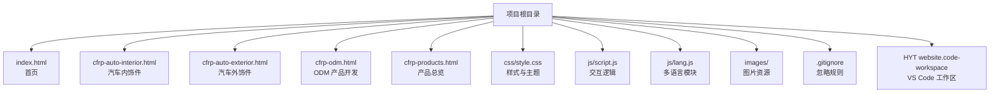
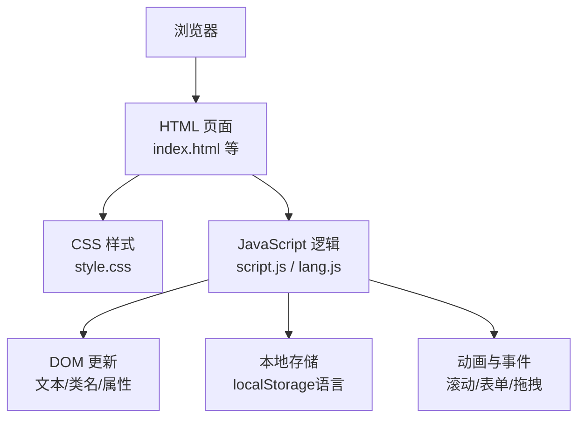
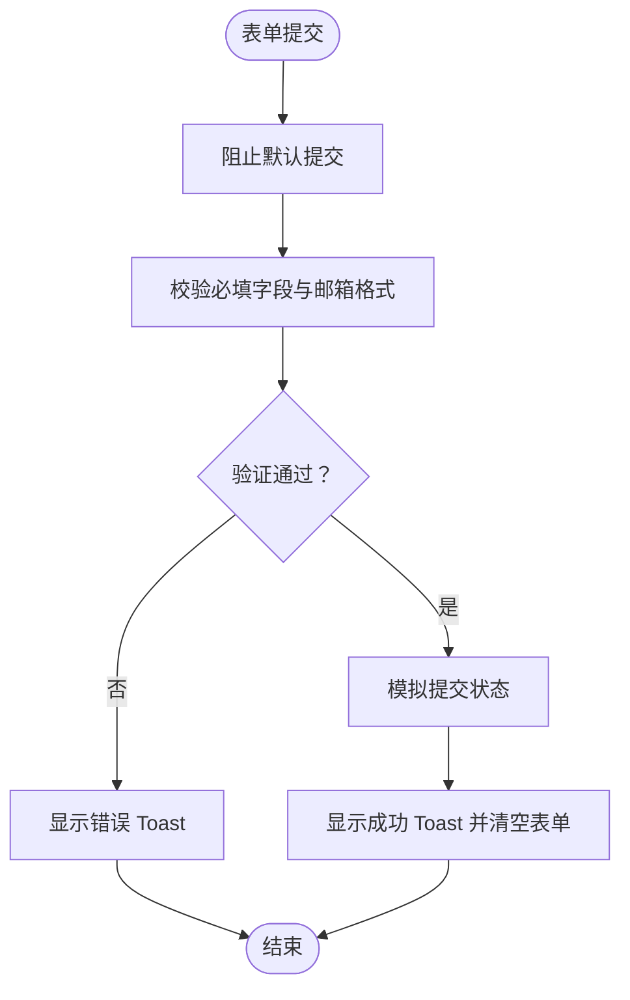
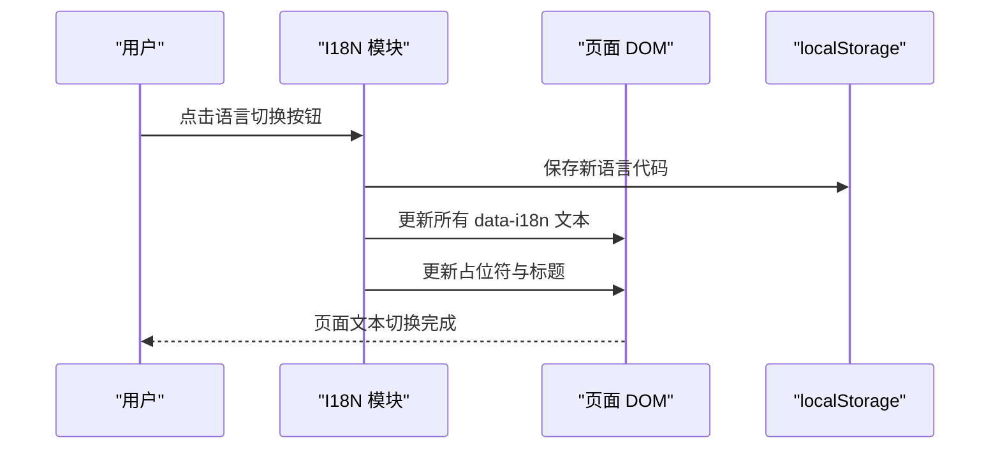
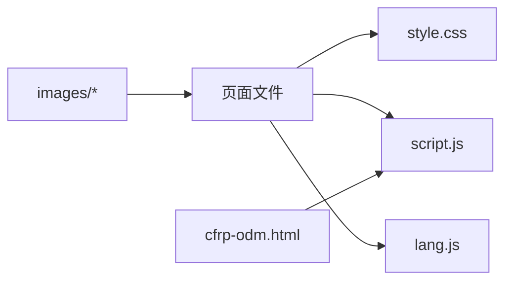

# 快速开始

<cite>
**本文引用的文件列表**
- [index.html](file://index.html)
- [cfrp-auto-interior.html](file://cfrp-auto-interior.html)
- [cfrp-auto-exterior.html](file://cfrp-auto-exterior.html)
- [cfrp-odm.html](file://cfrp-odm.html)
- [cfrp-products.html](file://cfrp-products.html)
- [css/style.css](file://css/style.css)
- [js/script.js](file://js/script.js)
- [js/lang.js](file://js/lang.js)
- [.gitignore](file://.gitignore)
- [HYT website.code-workspace](file://HYT website.code-workspace)
</cite>

## 目录
1. [简介](#简介)
2. [项目结构](#项目结构)
3. [核心组件](#核心组件)
4. [架构总览](#架构总览)
5. [详细组件分析](#详细组件分析)
6. [依赖关系分析](#依赖关系分析)
7. [性能注意事项](#性能注意事项)
8. [故障排除指南](#故障排除指南)
9. [结论](#结论)
10. [附录](#附录)

## 简介
本指南面向新加入 HYT 网站项目的开发者，帮助你从零开始完成环境准备、本地部署与开发配置，快速上手项目并成功运行。项目采用纯静态前端技术栈，包含多语言支持、响应式布局与交互式流程图功能，适合在本地浏览器直接打开即可运行。

## 项目结构
项目采用扁平的静态页面组织方式，核心文件位于根目录，资源按功能分类存放：
- 根目录：入口页面与子页面
  - index.html：首页
  - cfrp-auto-interior.html：汽车内饰件页面
  - cfrp-auto-exterior.html：汽车外饰件页面
  - cfrp-odm.html：ODM 产品开发页面
  - cfrp-products.html：产品总览页面
- 资源目录：
  - css/style.css：全局样式与主题变量
  - js/script.js：交互逻辑（滚动、菜单、表单、动画、拖拽）
  - js/lang.js：多语言国际化模块
  - images/：图片资源目录（用于页面中的图片）
  - .gitignore：Git 忽略规则
  - HYT website.code-workspace：VS Code 工作区配置

图表来源
- [index.html](file://index.html)
- [cfrp-auto-interior.html](file://cfrp-auto-interior.html)
- [cfrp-auto-exterior.html](file://cfrp-auto-exterior.html)
- [cfrp-odm.html](file://cfrp-odm.html)
- [cfrp-products.html](file://cfrp-products.html)
- [css/style.css](file://css/style.css)
- [js/script.js](file://js/script.js)
- [js/lang.js](file://js/lang.js)
- [.gitignore](file://.gitignore)
- [HYT website.code-workspace](file://HYT website.code-workspace)

章节来源
- [index.html](file://index.html)
- [cfrp-auto-interior.html](file://cfrp-auto-interior.html)
- [cfrp-auto-exterior.html](file://cfrp-auto-exterior.html)
- [cfrp-odm.html](file://cfrp-odm.html)
- [cfrp-products.html](file://cfrp-products.html)
- [css/style.css](file://css/style.css)
- [js/script.js](file://js/script.js)
- [js/lang.js](file://js/lang.js)
- [.gitignore](file://.gitignore)
- [HYT website.code-workspace](file://HYT website.code-workspace)

## 核心组件
- 静态页面：index.html 及各子页面，负责内容展示与导航跳转
- 样式系统：css/style.css 提供主题变量、响应式布局与组件样式
- 交互逻辑：js/script.js 实现滚动效果、移动端菜单、数字动画、滚动显示、表单校验与拖拽排序
- 多语言模块：js/lang.js 支持中日双语切换与页面文本动态更新
- 资源管理：images 目录存放页面图片；.gitignore 控制版本管理忽略项

章节来源
- [index.html](file://index.html)
- [css/style.css](file://css/style.css)
- [js/script.js](file://js/script.js)
- [js/lang.js](file://js/lang.js)

## 架构总览
项目为纯静态前端架构，无需后端服务。浏览器直接加载 HTML/CSS/JS 文件即可运行。多语言通过 js/lang.js 动态注入文本与占位符，交互通过 js/script.js 统一处理。

图表来源
- [index.html](file://index.html)
- [css/style.css](file://css/style.css)
- [js/script.js](file://js/script.js)
- [js/lang.js](file://js/lang.js)

## 详细组件分析

### 首页 index.html
- 结构要点
  - 导航栏固定定位，滚动时添加阴影与背景
  - 首屏 Hero 区域包含粒子动画背景与渐显文案
  - 分区内容：关于我们、服务、客户与合作伙伴、应用案例、联系我们
  - 页脚包含品牌信息、快速链接、服务项目与社交图标
- 关键交互
  - 滚动监听：根据当前可视区域自动高亮导航链接
  - 移动端菜单：汉堡菜单展开/收起与点击关闭
  - 表单提交：必填字段校验、邮箱格式校验、提交反馈提示
  - 数字动画：统计数字滚动递增
  - 滚动显示：卡片元素进入视口时触发渐显
- 多语言
  - 使用 data-i18n 属性与 js/lang.js 动态替换文本与占位符

章节来源
- [index.html](file://index.html)
- [js/script.js](file://js/script.js)
- [js/lang.js](file://js/lang.js)

### 子页面（内饰、外饰、产品总览、ODM）
- 页面结构
  - 顶部导航与页脚复用主站点结构，仅页面标题与内容不同
  - 内饰页：产品画廊网格展示，响应式适配
  - 外饰页：当前为空白占位，预留扩展空间
  - 产品总览页：展示产品图片
  - ODM 页：包含三个交互式流程图（开发流程、开发周期、工艺流程），支持拖拽排序与点击查看详情
- 关键交互
  - ODM 页面的拖拽排序：通过 dragstart/dragover/drop 事件实现节点与箭头联动移动
  - 语言切换：页面加载后自动注入语言切换按钮并更新文本

章节来源
- [cfrp-auto-interior.html](file://cfrp-auto-interior.html)
- [cfrp-auto-exterior.html](file://cfrp-auto-exterior.html)
- [cfrp-products.html](file://cfrp-products.html)
- [cfrp-odm.html](file://cfrp-odm.html)
- [js/script.js](file://js/script.js)
- [js/lang.js](file://js/lang.js)

### 样式系统 css/style.css
- 主题变量：定义主色、辅色、文字色、背景色、阴影、圆角、过渡与最大宽度等
- 响应式设计：针对移动端与平板的断点适配
- 组件样式：导航栏、Hero、服务卡片、合作伙伴、案例卡片、联系表单、页脚等
- 动画与过渡：粒子浮动、按钮悬停、卡片悬停、滚动渐显等

章节来源
- [css/style.css](file://css/style.css)

### 交互逻辑 js/script.js
- 滚动效果：滚动超过阈值时导航栏添加“scrolled”类
- 移动端菜单：切换 active 类控制菜单展开与关闭
- 导航高亮：根据当前可视区域更新导航链接 active 状态
- 粒子背景：动态创建粒子元素并设置随机大小、位置与动画
- 数字动画：IntersectionObserver 观察目标元素，使用缓动函数实现递增动画
- 滚动显示：元素进入视口时添加 visible 类
- 表单提交：阻止默认提交、校验必填与邮箱格式、模拟提交并显示 Toast 提示
- 拖拽排序：统一的拖拽逻辑，支持节点与箭头联动移动，兼容不同布局类型

图表来源
- [js/script.js](file://js/script.js)

章节来源
- [js/script.js](file://js/script.js)

### 多语言模块 js/lang.js
- 数据结构：包含 zh-CN 与 ja-JP 两套翻译键值
- 运行机制：初始化时注入语言切换按钮，监听点击切换语言并持久化到 localStorage；遍历带 data-i18n 的元素进行文本替换，同时更新占位符与页面标题
- 语言切换：按钮文本随语言切换而变化，支持移动端固定定位按钮

图表来源
- [js/lang.js](file://js/lang.js)

章节来源
- [js/lang.js](file://js/lang.js)

## 依赖关系分析
- 页面依赖
  - 所有页面均依赖 css/style.css 与 js/script.js、js/lang.js
  - ODM 页面额外依赖交互式流程图逻辑
- 资源依赖
  - images 目录下的图片由各页面引用
- 开发工具
  - VS Code 工作区配置文件用于统一编辑体验

图表来源
- [index.html](file://index.html)
- [cfrp-odm.html](file://cfrp-odm.html)
- [css/style.css](file://css/style.css)
- [js/script.js](file://js/script.js)
- [js/lang.js](file://js/lang.js)

章节来源
- [index.html](file://index.html)
- [cfrp-odm.html](file://cfrp-odm.html)
- [css/style.css](file://css/style.css)
- [js/script.js](file://js/script.js)
- [js/lang.js](file://js/lang.js)

## 性能注意事项
- 静态资源：建议在生产环境启用 Gzip/Brotli 压缩与 CDN 缓存
- 图片优化：使用 WebP 或压缩后的 PNG/JPG，按需懒加载
- JavaScript：避免在主线程执行长任务，已使用 requestAnimationFrame 与 IntersectionObserver
- CSS：减少重绘与重排，使用 transform/opacity 动画
- 多语言：文本替换在页面加载后一次性完成，避免频繁 DOM 查询

## 故障排除指南
- 页面无法显示或样式错乱
  - 检查 css/style.css 是否正确加载
  - 确认浏览器未禁用 JavaScript
- 语言切换无效
  - 确认 localStorage 可用
  - 检查 js/lang.js 是否正常加载
- 表单提交无响应
  - 查看浏览器控制台是否有错误
  - 确认必填字段与邮箱格式是否符合要求
- 拖拽排序异常
  - 确认元素具有正确的 draggable 属性与 data-flow 类名
  - 检查容器是否正确绑定事件监听器

章节来源
- [js/script.js](file://js/script.js)
- [js/lang.js](file://js/lang.js)

## 结论
HYT 网站项目结构清晰、功能完备，适合快速搭建与迭代。通过本指南，你可以顺利完成本地部署与开发配置，理解页面间的协作关系与交互实现细节。建议在开发过程中遵循现有命名规范与注释风格，保持代码一致性。

## 附录

### 环境要求
- 操作系统：Windows/Linux/macOS
- 浏览器：Chrome/Firefox/Safari 最新稳定版
- 本地服务器（可选）：用于模拟真实 HTTP 环境与跨域场景

### 本地部署步骤
- 方式一：直接打开（推荐）
  - 在项目根目录右键选择“在此处打开命令窗口”
  - 输入命令以在默认浏览器中打开首页
    - Windows 示例：start index.html
    - Linux/macOS 示例：open index.html
- 方式二：使用本地服务器
  - 安装任意静态服务器（如 http-server、live-server 等）
  - 在项目根目录启动服务
  - 在浏览器访问本地地址（例如 http://localhost:8080）

### 开发环境配置
- 代码编辑器：VS Code
  - 工作区文件：HYT website.code-workspace
  - 插件建议：Live Server、Prettier、ESLint（按团队规范安装）
- 版本控制：Git
  - 忽略项：.gitignore 已配置常用忽略规则
- 多语言开发
  - 新增翻译键：在 js/lang.js 的 data 对象中添加对应语言键值
  - 页面文本：使用 data-i18n 属性标记可翻译文本
  - 占位符：使用 data-i18n-ph 标记可翻译占位符

### 常见问题解答
- 如何添加新的页面？
  - 复制任一子页面作为模板，修改页面标题与内容区域
  - 在导航中添加链接指向新页面
- 如何新增产品图片？
  - 将图片放入 images 目录，按需在相应页面引用
- 如何优化加载速度？
  - 压缩图片与 CSS/JS
  - 启用浏览器缓存与 CDN
- 如何测试多语言？
  - 切换语言按钮位于导航右侧，点击即可切换中/日文