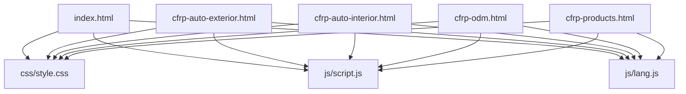
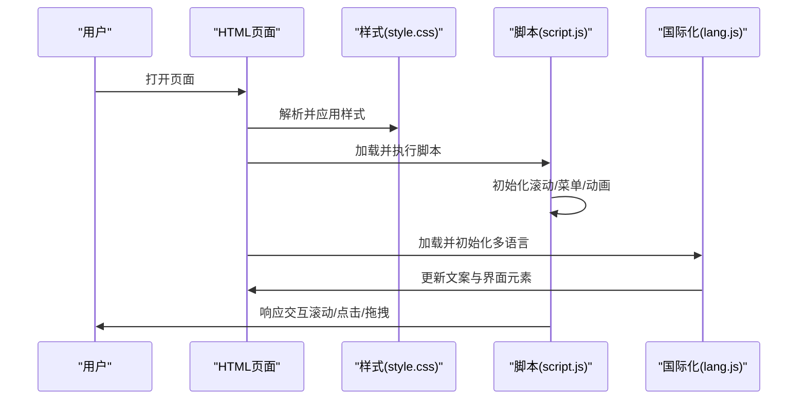
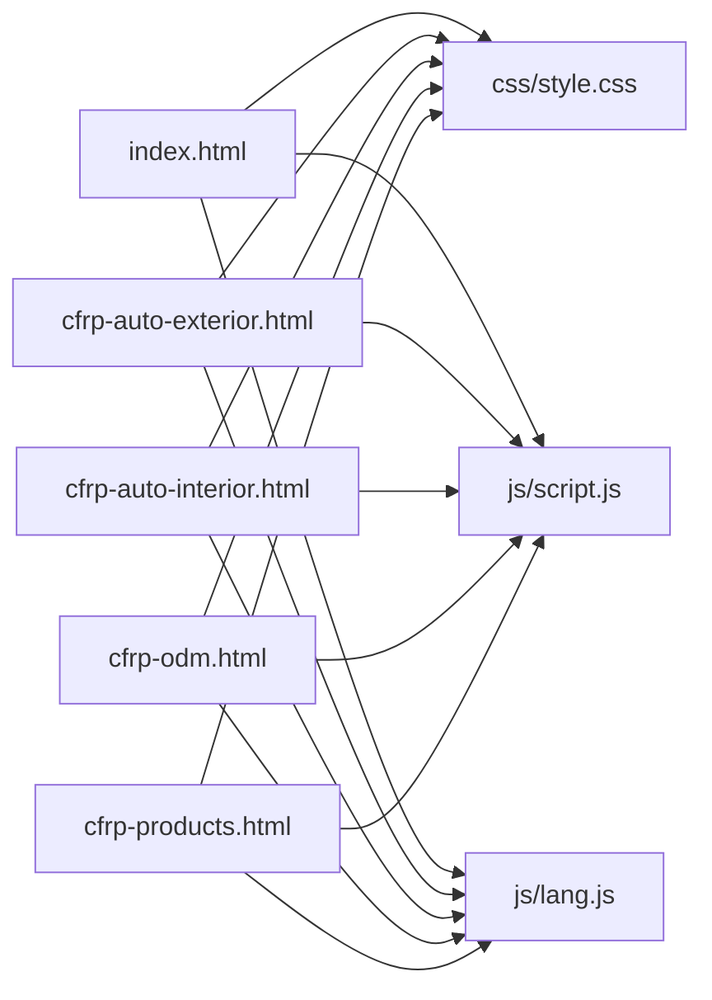

# 性能优化

<cite>
**本文引用的文件列表**
- [index.html](file://index.html)
- [cfrp-auto-exterior.html](file://cfrp-auto-exterior.html)
- [cfrp-auto-interior.html](file://cfrp-auto-interior.html)
- [cfrp-odm.html](file://cfrp-odm.html)
- [cfrp-products.html](file://cfrp-products.html)
- [css/style.css](file://css/style.css)
- [js/script.js](file://js/script.js)
- [js/lang.js](file://js/lang.js)
</cite>

## 目录
1. [简介](#简介)
2. [项目结构](#项目结构)
3. [核心组件](#核心组件)
4. [架构总览](#架构总览)
5. [详细组件分析](#详细组件分析)
6. [依赖关系分析](#依赖关系分析)
7. [性能考量](#性能考量)
8. [故障排查指南](#故障排查指南)
9. [结论](#结论)
10. [附录](#附录)

## 简介
本指南面向HYT网站的性能优化实践，聚焦加载性能、动画性能、图片资源与CDN集成、以及性能监控与测试方法。通过对现有HTML/CSS/JS实现的分析，提出可落地的优化建议，帮助开发者持续改进网站性能与用户体验。

## 项目结构
HYT网站采用多页面静态结构，包含主页与若干专题页，样式集中于单一CSS文件，脚本分为功能逻辑与国际化两部分。页面通过相对路径引入资源，具备基础的响应式布局与交互能力。

图表来源
- [index.html:1-337](file://index.html#L1-L337)
- [css/style.css:1-800](file://css/style.css#L1-L800)
- [js/script.js:1-344](file://js/script.js#L1-L344)
- [js/lang.js:1-472](file://js/lang.js#L1-L472)

章节来源
- [index.html:1-337](file://index.html#L1-L337)
- [css/style.css:1-800](file://css/style.css#L1-L800)
- [js/script.js:1-344](file://js/script.js#L1-L344)
- [js/lang.js:1-472](file://js/lang.js#L1-L472)

## 核心组件
- 导航与滚动效果：固定导航栏随滚动变化，移动端菜单切换，平滑滚动到锚点。
- 动画系统：粒子背景、数字递增动画、滚动渐显、多语言切换按钮。
- 表单与提示：联系表单校验与Toast消息提示。
- 可拖拽流程图：ODM页面的交互式流程图节点拖拽排序。

章节来源
- [js/script.js:1-344](file://js/script.js#L1-L344)
- [js/lang.js:1-472](file://js/lang.js#L1-L472)

## 架构总览
从性能角度，页面渲染链路如下：
- HTML构建DOM树
- CSS计算样式并生成布局
- JS执行脚本，触发DOM变更与事件监听
- 资源加载（CSS/JS/图片），受缓存与网络影响
- 用户交互与动画执行，受帧率与内存占用影响

图表来源
- [index.html:1-337](file://index.html#L1-L337)
- [css/style.css:1-800](file://css/style.css#L1-L800)
- [js/script.js:1-344](file://js/script.js#L1-L344)
- [js/lang.js:1-472](file://js/lang.js#L1-L472)

## 详细组件分析

### 加载性能优化策略
- 资源压缩与合并
  - 将多个CSS/JS文件合并为单一文件，减少HTTP请求；若需保留多文件，启用Gzip/Brotli压缩。
  - 对CSS进行去冗余、合并重复规则，对JS进行Tree Shaking与死代码消除。
- 缓存策略
  - 使用强缓存（Cache-Control/ETag）与协商缓存结合，静态资源设置长缓存，HTML短缓存或不缓存。
  - 为CSS/JS添加版本查询参数（如?v=2）以刷新缓存，但建议采用文件指纹命名策略。
- 懒加载与延迟加载
  - 图片懒加载：对非首屏图片使用loading="lazy"或IntersectionObserver延迟加载。
  - 非关键脚本延迟加载：将非首屏交互脚本推迟到首屏渲染后再执行。
- 预加载与预连接
  - 预连接关键域名（DNS预连接、TCP握手、TLS协商）。
  - 预加载关键字体与图标资源，避免阻塞渲染。

章节来源
- [css/style.css:1-800](file://css/style.css#L1-L800)
- [js/script.js:1-344](file://js/script.js#L1-L344)
- [js/lang.js:1-472](file://js/lang.js#L1-L472)

### 动画性能优化原理
- 硬件加速
  - 利用transform与opacity属性触发布局层合成，避免触发重排与重绘。
  - 在关键路径动画中优先使用will-change或transform3d开启GPU加速。
- 帧率控制
  - 控制动画时长与缓动函数，避免过长动画导致掉帧。
  - 使用requestAnimationFrame替代setInterval/setTimeout，确保每帧更新与屏幕刷新同步。
- 内存管理
  - 及时移除事件监听器与观察器，避免内存泄漏。
  - 对大量DOM节点的动画，采用虚拟滚动或分批渲染策略。

章节来源
- [js/script.js:82-115](file://js/script.js#L82-L115)
- [js/script.js:118-139](file://js/script.js#L118-L139)

### 图片资源优化与CDN集成
- 图片优化
  - 采用现代格式（WebP/AVIF）并提供降级方案（JPEG/PNG）。
  - 使用响应式图片srcset与sizes，按视口密度与尺寸选择合适图片。
  - 对SVG矢量图优先使用内联SVG，减少HTTP请求。
- CDN集成
  - 将静态资源托管至CDN，利用就近节点与边缘缓存降低延迟。
  - 配置合理的缓存策略与压缩，启用HTTP/2/3与Brotli压缩。
  - 使用图片优化服务（如自动裁剪、缩放、质量调节）。

章节来源
- [index.html:73-83](file://index.html#L73-L83)
- [cfrp-auto-interior.html:96-143](file://cfrp-auto-interior.html#L96-L143)
- [cfrp-products.html:43-46](file://cfrp-products.html#L43-L46)

### 性能监控与测试
- 监控指标
  - 关键指标：FCP/LCP/FID/CLS/TBT等Core Web Vitals。
  - 自定义指标：首屏渲染耗时、交互延迟、动画帧率、内存峰值。
- 测试工具
  - Lighthouse：自动化评估与报告生成。
  - Chrome DevTools：Network/Performance/Rendering面板定位瓶颈。
  - WebPageTest/SpeedIndex：跨地区与慢网模拟测试。
- 持续改进
  - 建立性能基线，定期回归测试，对热点问题制定修复计划与验证闭环。

章节来源
- [js/script.js:142-175](file://js/script.js#L142-L175)

## 依赖关系分析
页面与脚本之间的依赖关系如下：

图表来源
- [index.html:1-337](file://index.html#L1-L337)
- [cfrp-auto-exterior.html:1-98](file://cfrp-auto-exterior.html#L1-L98)
- [cfrp-auto-interior.html:1-196](file://cfrp-auto-interior.html#L1-L196)
- [cfrp-odm.html:1-191](file://cfrp-odm.html#L1-L191)
- [cfrp-products.html:1-97](file://cfrp-products.html#L1-L97)
- [css/style.css:1-800](file://css/style.css#L1-L800)
- [js/script.js:1-344](file://js/script.js#L1-L344)
- [js/lang.js:1-472](file://js/lang.js#L1-L472)

章节来源
- [index.html:1-337](file://index.html#L1-L337)
- [css/style.css:1-800](file://css/style.css#L1-L800)
- [js/script.js:1-344](file://js/script.js#L1-L344)
- [js/lang.js:1-472](file://js/lang.js#L1-L472)

## 性能考量
- 加载性能
  - 减少首屏资源体积，优先传输关键CSS与首屏JS。
  - 合理拆分与延迟加载非关键资源，避免阻塞渲染。
- 动画性能
  - 仅对关键路径动画使用硬件加速，避免过度合成。
  - 控制动画数量与时长，确保帧率稳定。
- 图片与CDN
  - 采用现代图片格式与响应式策略，配合CDN边缘优化。
- 监控与测试
  - 建立自动化性能监控与回归测试，持续跟踪关键指标。

## 故障排查指南
- 页面卡顿或掉帧
  - 检查是否存在频繁重排/重绘操作，优先使用transform/opacity。
  - 使用DevTools的Performance面板录制并分析主线程占用。
- 图片加载缓慢
  - 确认是否使用现代格式与合适的尺寸；检查CDN缓存命中与压缩配置。
- 多语言切换异常
  - 检查本地存储语言状态与文案更新逻辑，确认DOM更新时机。
- 表单提交失败
  - 校验前端校验逻辑与提示显示，确保错误信息及时反馈。

章节来源
- [js/script.js:142-175](file://js/script.js#L142-L175)
- [js/lang.js:352-399](file://js/lang.js#L352-L399)

## 结论
通过资源压缩与缓存、懒加载与CDN集成、硬件加速与帧率控制、以及完善的监控与测试体系，HYT网站可在保持良好交互体验的同时显著提升性能表现。建议以Core Web Vitals为核心目标，建立持续优化机制，确保性能在迭代中稳步提升。

## 附录
- 优化清单
  - 启用Gzip/Brotli压缩与HTTP/2/3
  - 设置强缓存与协商缓存策略
  - 使用现代图片格式与响应式图片
  - 合并与最小化CSS/JS
  - 首屏关键资源优先加载
  - 动画使用transform/opacity并限制数量
  - 建立Lighthouse与WebPageTest自动化测试