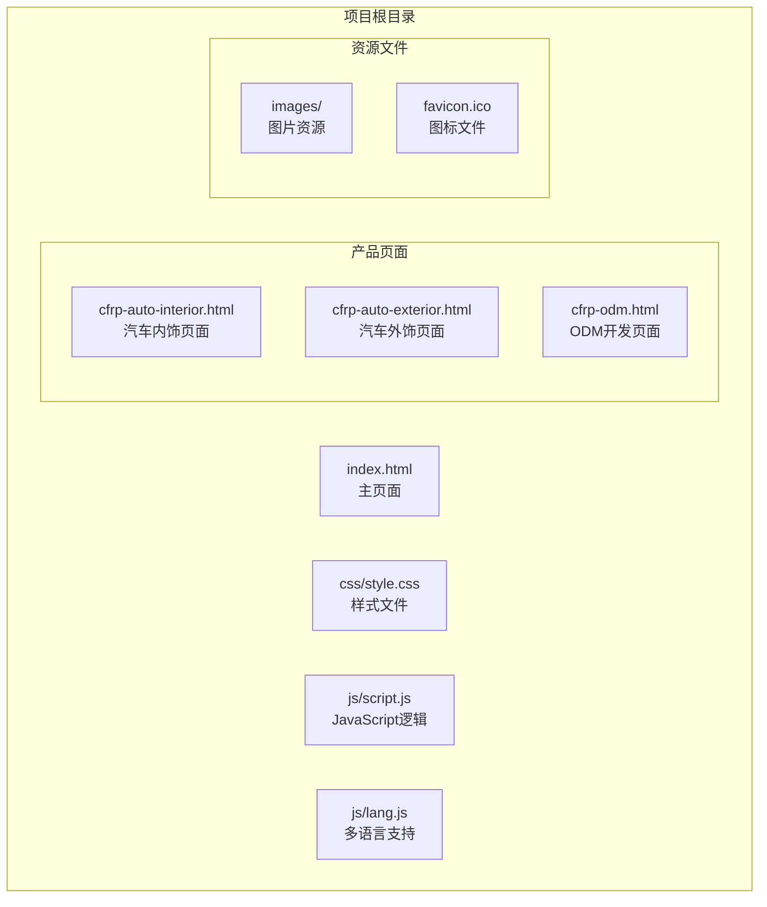
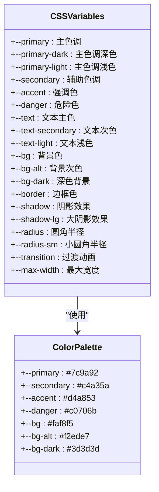
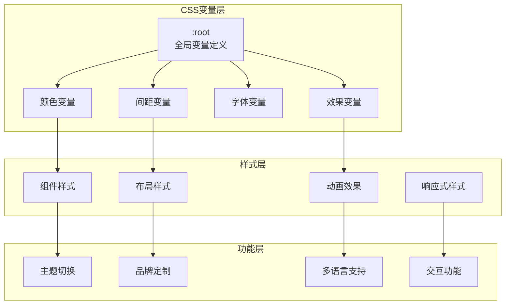
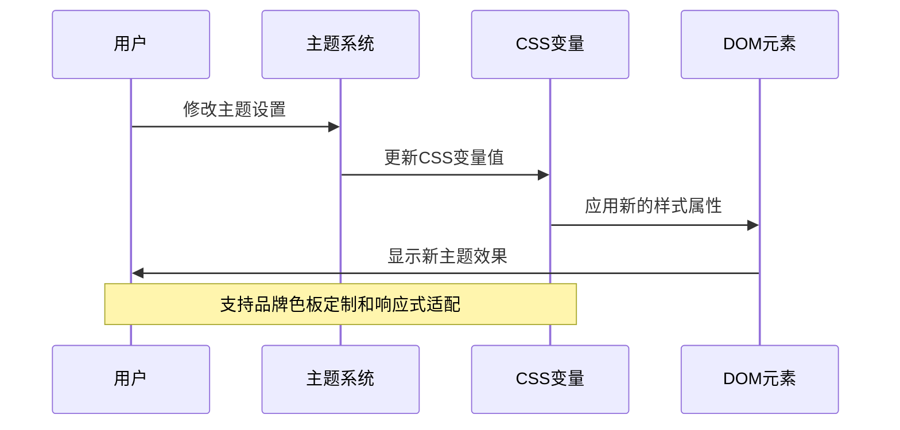
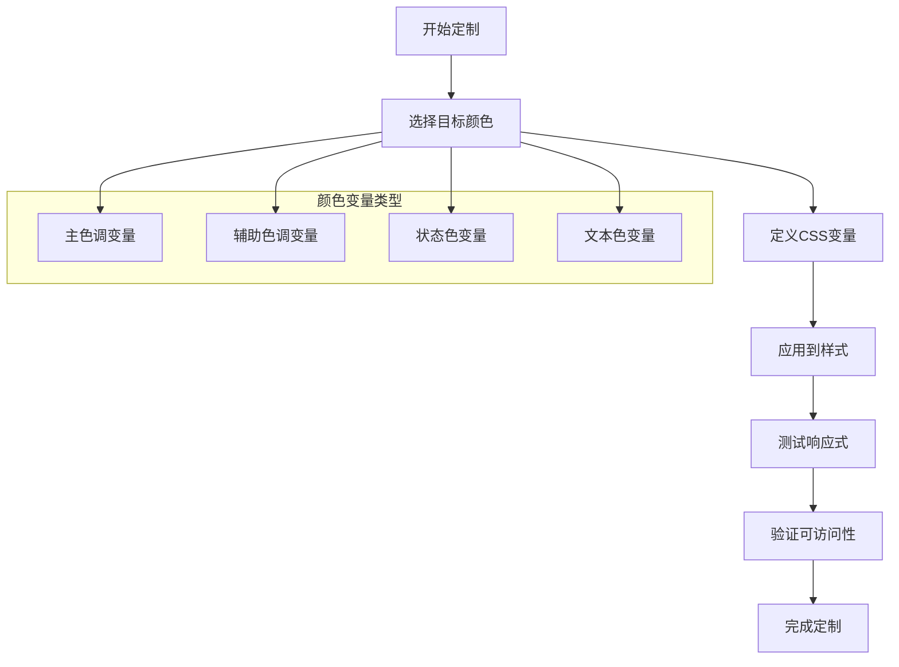
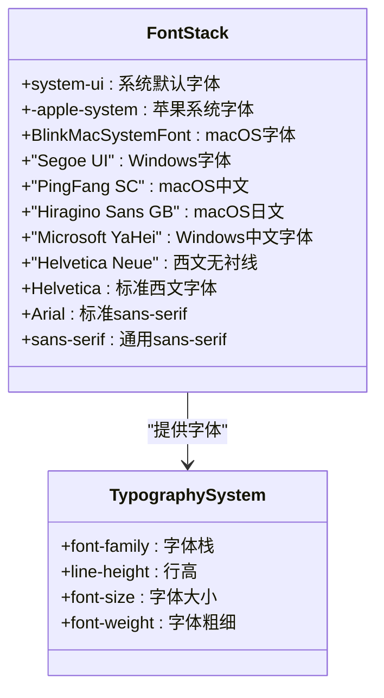
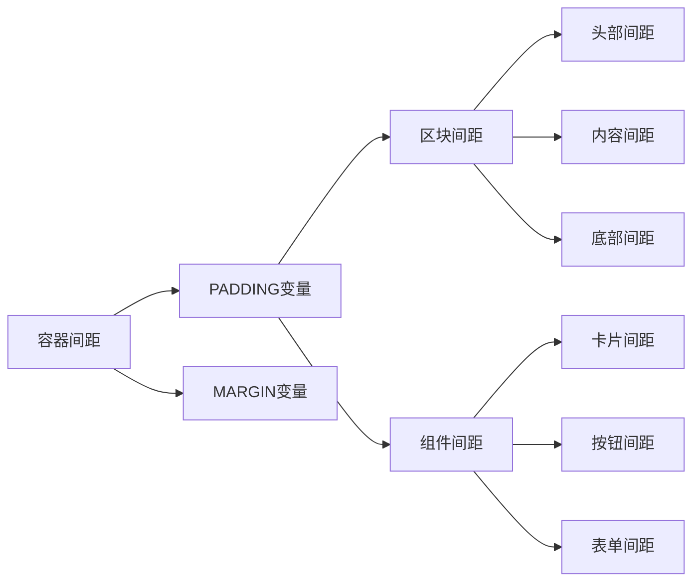
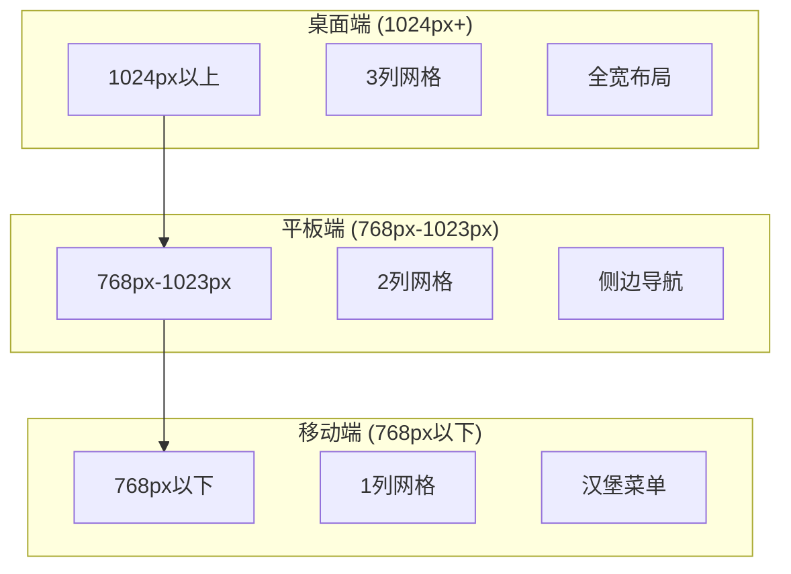
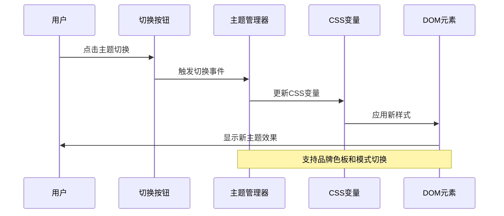
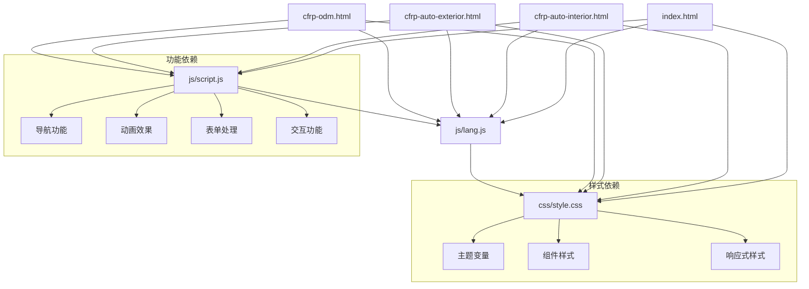

# 主题定制指南

<cite>
**本文档引用的文件**
- [css/style.css](file://css/style.css)
- [index.html](file://index.html)
- [js/script.js](file://js/script.js)
- [js/lang.js](file://js/lang.js)
- [cfrp-auto-interior.html](file://cfrp-auto-interior.html)
- [cfrp-auto-exterior.html](file://cfrp-auto-exterior.html)
- [cfrp-odm.html](file://cfrp-odm.html)
</cite>

## 目录
1. [简介](#简介)
2. [项目结构](#项目结构)
3. [核心组件](#核心组件)
4. [架构概览](#架构概览)
5. [详细组件分析](#详细组件分析)
6. [依赖关系分析](#依赖关系分析)
7. [性能考虑](#性能考虑)
8. [故障排除指南](#故障排除指南)
9. [结论](#结论)

## 简介

HYT网站是一个基于复合材料产品的轻量化解决方案提供商网站。该项目采用了现代的CSS变量系统来实现主题定制和品牌个性化。本文档将深入解析CSS变量系统的使用方法和扩展机制，说明如何通过修改CSS变量来实现主题切换和品牌定制。

该网站使用了完整的CSS变量系统，包括颜色系统、字体系统、间距系统等，为开发者提供了灵活的主题定制能力。通过修改`:root`中的CSS变量，可以轻松实现品牌色板设计和响应式主题适配。

## 项目结构

项目采用模块化结构，主要包含以下核心文件：

**图表来源**
- [index.html:1-337](file://index.html#L1-L337)
- [css/style.css:1-30](file://css/style.css#L1-L30)
- [js/script.js:1-344](file://js/script.js#L1-L344)

**章节来源**
- [index.html:1-337](file://index.html#L1-L337)
- [css/style.css:1-30](file://css/style.css#L1-L30)

## 核心组件

### CSS变量系统

项目的核心是完整的CSS变量系统，定义在`:root`选择器中：

**图表来源**
- [css/style.css:10-30](file://css/style.css#L10-L30)

### 主题定制系统

项目实现了完整的主题定制系统，包括：

1. **颜色系统**: 基于绿色系的品牌色彩
2. **字体系统**: 渐进式字体栈
3. **间距系统**: 基于CSS变量的统一间距
4. **响应式系统**: 移动优先的响应式设计

**章节来源**
- [css/style.css:10-30](file://css/style.css#L10-L30)
- [css/style.css:32-44](file://css/style.css#L32-L44)

## 架构概览

### 主题系统架构

**图表来源**
- [css/style.css:10-30](file://css/style.css#L10-L30)
- [css/style.css:888-993](file://css/style.css#L888-L993)

### 主题定制流程

## 详细组件分析

### 颜色系统定制

#### 基础颜色变量

项目定义了完整的颜色系统，包括主色调、辅助色、强调色和状态色：

**图表来源**
- [css/style.css:10-29](file://css/style.css#L10-L29)

#### 颜色系统实现

颜色系统通过CSS变量实现，支持动态主题切换：

| 颜色类别 | 变量名称 | 默认值 | 使用场景 |
|---------|----------|--------|----------|
| 主色调 | `--primary` | `#7c9a92` | 主要品牌色 |
| 辅助色 | `--secondary` | `#c4a35a` | 次要品牌色 |
| 强调色 | `--accent` | `#d4a853` | 强调和高亮 |
| 危险色 | `--danger` | `#c0706b` | 错误和警告 |
| 文本色 | `--text` | `#3a3a3a` | 主要文本 |
| 背景色 | `--bg` | `#faf8f5` | 页面背景 |

**章节来源**
- [css/style.css:10-29](file://css/style.css#L10-L29)

### 字体系统定制

#### 字体栈配置

字体系统采用渐进式字体栈，确保跨平台兼容性：

**图表来源**
- [css/style.css:38-43](file://css/style.css#L38-L43)

#### 字体系统特性

字体系统具有以下特点：
- **跨平台兼容**: 支持Windows、macOS、iOS、Android
- **渐进增强**: 从系统字体到Web字体的降级策略
- **中文优化**: 特别针对中文显示进行优化
- **性能友好**: 减少字体加载开销

**章节来源**
- [css/style.css:38-43](file://css/style.css#L38-L43)

### 间距系统定制

#### 间距变量体系

间距系统通过CSS变量实现统一管理：

**图表来源**
- [css/style.css:46-50](file://css/style.css#L46-L50)

#### 间距系统实现

间距系统包括：
- **容器间距**: `.container`的最大宽度和内边距
- **区块间距**: `.section`的上下间距
- **组件间距**: 各种组件间的统一间距
- **响应式间距**: 不同屏幕尺寸下的间距调整

**章节来源**
- [css/style.css:46-50](file://css/style.css#L46-L50)

### 响应式主题适配

#### 响应式断点系统

项目实现了完整的响应式系统，支持多种设备：

**图表来源**
- [css/style.css:889-993](file://css/style.css#L889-L993)

#### 响应式特性

响应式系统包括：
- **网格系统**: 根据屏幕尺寸调整网格列数
- **导航系统**: 移动端汉堡菜单和桌面端水平导航
- **字体系统**: 根据屏幕尺寸调整字体大小
- **间距系统**: 移动端减少间距以适应小屏幕

**章节来源**
- [css/style.css:889-993](file://css/style.css#L889-L993)

### 主题切换机制

#### JavaScript主题控制系统

项目通过JavaScript实现动态主题切换：

**图表来源**
- [js/script.js:1-344](file://js/script.js#L1-L344)

#### 主题切换实现

主题切换功能包括：
- **动态样式更新**: 实时更新CSS变量值
- **状态持久化**: 保存用户偏好设置
- **平滑过渡**: 使用CSS过渡动画
- **无障碍支持**: 支持键盘导航和屏幕阅读器

**章节来源**
- [js/script.js:1-344](file://js/script.js#L1-L344)

## 依赖关系分析

### 文件依赖关系

**图表来源**
- [index.html:1-337](file://index.html#L1-L337)
- [css/style.css:1-30](file://css/style.css#L1-L30)

### 组件耦合分析

项目采用松耦合设计，各组件相互独立但通过CSS变量系统连接：

- **样式层**: 通过CSS变量实现解耦
- **功能层**: JavaScript模块化设计
- **内容层**: HTML结构语义化
- **资源层**: 图片和媒体文件分离

**章节来源**
- [css/style.css:1-30](file://css/style.css#L1-L30)
- [js/script.js:1-344](file://js/script.js#L1-L344)

## 性能考虑

### CSS变量性能优势

CSS变量系统相比传统CSS具有以下性能优势：

1. **运行时计算**: 在渲染时计算，避免重复样式
2. **内存效率**: 单一变量定义，多处使用
3. **缓存友好**: 浏览器可以更好地缓存变量值
4. **维护效率**: 集中管理，减少重复代码

### 优化建议

- **变量命名规范**: 使用语义化命名，便于维护
- **变量分组管理**: 按功能分组，提高可读性
- **最小化使用**: 避免过度使用，保持性能
- **浏览器兼容**: 考虑旧版浏览器支持

## 故障排除指南

### 常见问题解决

#### CSS变量不生效

**问题描述**: 修改CSS变量后样式未更新

**解决方案**:
1. 检查CSS变量是否正确声明在`:root`中
2. 确认变量名称拼写正确
3. 验证CSS优先级设置
4. 清除浏览器缓存

#### 响应式样式冲突

**问题描述**: 移动端样式与桌面端冲突

**解决方案**:
1. 检查媒体查询断点设置
2. 验证CSS优先级顺序
3. 确认`!important`使用
4. 测试不同设备分辨率

#### JavaScript主题切换失效

**问题描述**: 主题切换功能无法正常工作

**解决方案**:
1. 检查JavaScript文件加载
2. 验证事件监听器绑定
3. 确认CSS变量更新逻辑
4. 测试浏览器兼容性

**章节来源**
- [css/style.css:1-30](file://css/style.css#L1-L30)
- [js/script.js:1-344](file://js/script.js#L1-L344)

## 结论

HYT网站的主题定制系统展现了现代前端开发的最佳实践。通过完整的CSS变量系统，项目实现了高度灵活的主题定制能力，支持品牌色板设计和响应式主题适配。

### 主要优势

1. **统一管理**: 通过CSS变量实现样式统一管理
2. **灵活定制**: 支持品牌色板和主题切换
3. **响应式适配**: 移动优先的设计理念
4. **性能优化**: CSS变量的运行时计算优势
5. **可维护性**: 模块化设计和清晰的代码结构

### 扩展建议

1. **主题预设系统**: 提供多种预设主题选项
2. **暗色模式**: 增加暗色主题支持
3. **无障碍增强**: 改善键盘导航和屏幕阅读器支持
4. **性能监控**: 添加CSS变量使用情况监控
5. **自动化测试**: 建立主题定制的自动化测试流程

该主题定制系统为类似项目提供了优秀的参考模板，开发者可以根据具体需求进行扩展和定制。