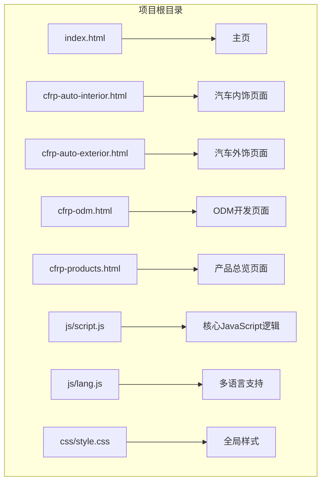
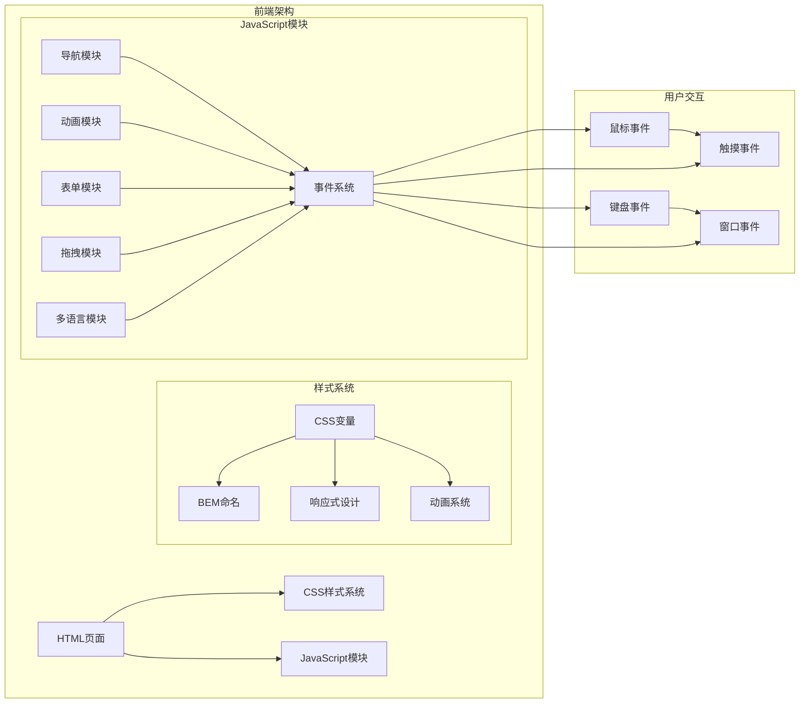
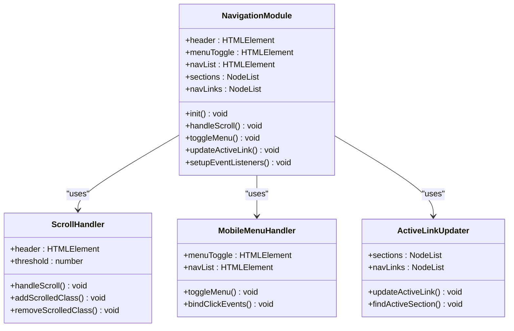
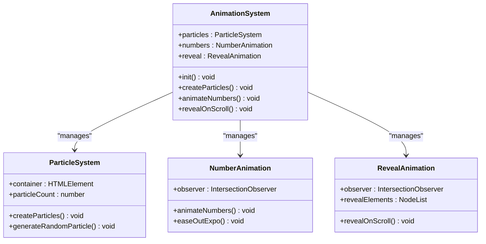
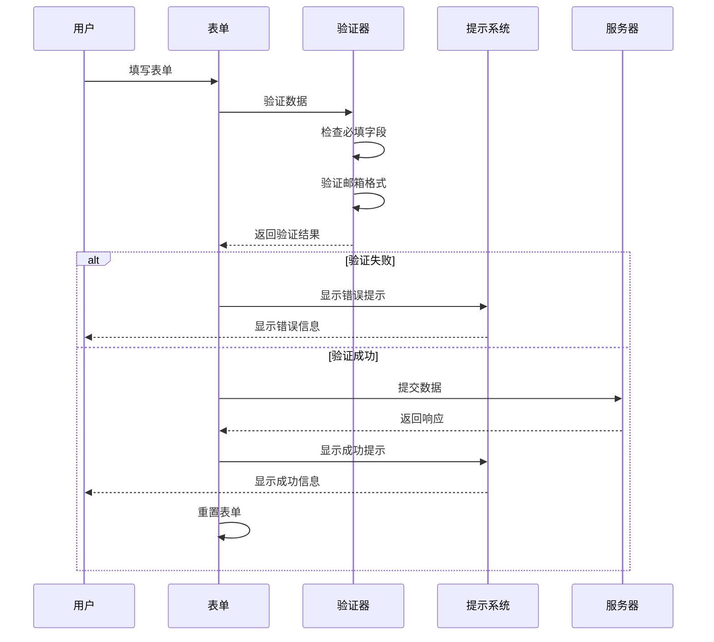
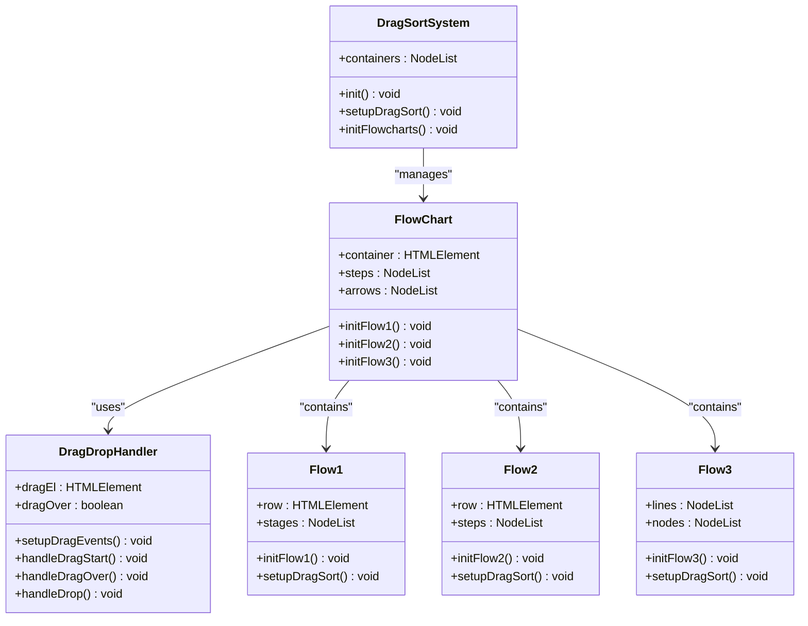
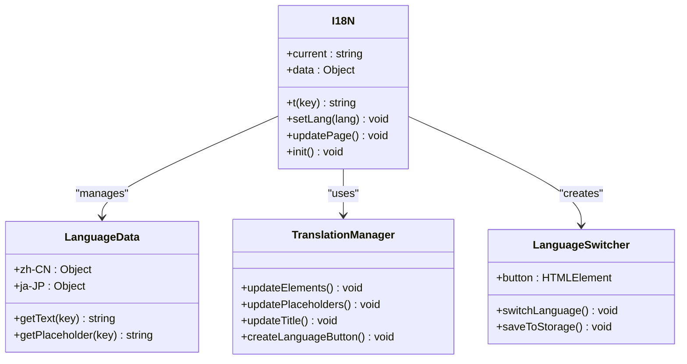
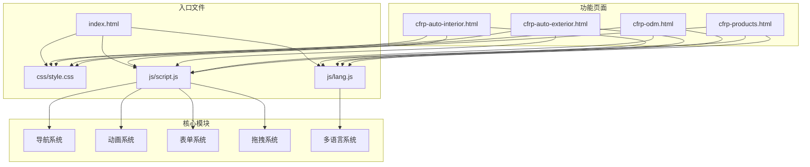

# 功能扩展方法

<cite>
**本文档引用的文件**
- [index.html](file://index.html)
- [cfrp-auto-interior.html](file://cfrp-auto-interior.html)
- [cfrp-auto-exterior.html](file://cfrp-auto-exterior.html)
- [cfrp-odm.html](file://cfrp-odm.html)
- [cfrp-products.html](file://cfrp-products.html)
- [css/style.css](file://css/style.css)
- [js/script.js](file://js/script.js)
- [js/lang.js](file://js/lang.js)
</cite>

## 目录
1. [简介](#简介)
2. [项目结构](#项目结构)
3. [核心组件](#核心组件)
4. [架构概览](#架构概览)
5. [详细组件分析](#详细组件分析)
6. [依赖关系分析](#依赖关系分析)
7. [性能考虑](#性能考虑)
8. [故障排除指南](#故障排除指南)
9. [结论](#结论)

## 简介

HYT网站是一个基于复合材料产品的轻量化解决方案提供商网站，采用现代化的前端技术栈构建。该网站具有以下特点：

- **响应式设计**：完全适配移动设备和桌面端
- **多语言支持**：内置中日双语切换功能
- **交互式动画**：包含粒子背景、数字递增、滚动渐显等动画效果
- **拖拽排序**：ODM页面支持复杂的流程图拖拽排序功能
- **国际化**：完整的i18n支持系统

本指南旨在帮助开发者在现有架构基础上安全地添加新功能模块，包括JavaScript模块扩展、CSS样式继承和覆盖方法，以及利用事件系统和观察者模式来扩展交互功能。

## 项目结构

HYT网站采用模块化的文件组织方式，每个功能页面都有独立的HTML文件，共享相同的CSS样式和JavaScript逻辑。



**图表来源**
- [index.html:1-337](file://index.html#L1-L337)
- [cfrp-odm.html:1-191](file://cfrp-odm.html#L1-L191)
- [js/script.js:1-344](file://js/script.js#L1-L344)
- [css/style.css:1-800](file://css/style.css#L1-L800)

**章节来源**
- [index.html:1-337](file://index.html#L1-L337)
- [cfrp-auto-interior.html:1-196](file://cfrp-auto-interior.html#L1-L196)
- [cfrp-odm.html:1-191](file://cfrp-odm.html#L1-L191)
- [css/style.css:1-800](file://css/style.css#L1-L800)

## 核心组件

### JavaScript模块系统

网站采用模块化的JavaScript架构，主要包含以下核心模块：

1. **导航系统模块**：处理滚动效果、移动端菜单、导航链接高亮
2. **动画系统模块**：包含粒子背景、数字递增、滚动渐显等动画
3. **表单处理模块**：负责联系表单验证和提交
4. **拖拽排序模块**：ODM页面的复杂交互功能
5. **多语言模块**：完整的国际化支持系统

### CSS样式架构

采用CSS变量和BEM命名规范，确保样式的可维护性和扩展性：

- **CSS变量系统**：统一的颜色、字体、间距、过渡效果管理
- **响应式网格系统**：基于CSS Grid和Flexbox的布局系统
- **动画系统**：包含关键帧动画和过渡效果
- **组件化样式**：每个页面区域都有独立的样式类

**章节来源**
- [js/script.js:1-344](file://js/script.js#L1-L344)
- [css/style.css:1-800](file://css/style.css#L1-L800)
- [js/lang.js:1-472](file://js/lang.js#L1-L472)

## 架构概览

HYT网站采用前后端分离的架构模式，前端通过模块化的方式组织代码，后端仅提供静态资源服务。



**图表来源**
- [js/script.js:1-344](file://js/script.js#L1-L344)
- [css/style.css:1-800](file://css/style.css#L1-L800)
- [js/lang.js:1-472](file://js/lang.js#L1-L472)

## 详细组件分析

### 导航系统扩展

导航系统是网站的核心交互组件，提供了完整的滚动效果、移动端适配和链接高亮功能。

#### 导航模块架构



**图表来源**
- [js/script.js:1-52](file://js/script.js#L1-L52)

#### 扩展导航系统的最佳实践

1. **保持DOM结构一致性**：新导航项应遵循现有的HTML结构
2. **事件委托模式**：使用事件委托减少内存占用
3. **性能优化**：滚动事件应使用节流或防抖机制
4. **无障碍访问**：确保新功能支持键盘导航和屏幕阅读器

**章节来源**
- [js/script.js:1-52](file://js/script.js#L1-L52)
- [index.html:11-32](file://index.html#L11-L32)

### 动画效果增强

网站实现了多种动画效果，包括粒子背景、数字递增、滚动渐显等。

#### 动画系统架构



**图表来源**
- [js/script.js:54-139](file://js/script.js#L54-L139)

#### 新动画效果开发模板

```javascript
// 动画效果模板
class NewAnimation {
    constructor(elementSelector, options = {}) {
        this.element = document.querySelector(elementSelector);
        this.options = {
            duration: options.duration || 1000,
            delay: options.delay || 0,
            easing: options.easing || 'ease-out',
            ...options
        };
        this.init();
    }
    
    init() {
        if (!this.element) return;
        this.setupObserver();
        this.bindEvents();
    }
    
    setupObserver() {
        this.observer = new IntersectionObserver((entries) => {
            entries.forEach(entry => {
                if (entry.isIntersecting) {
                    this.animate(entry.target);
                    this.observer.unobserve(entry.target);
                }
            });
        }, { threshold: 0.1 });
        
        this.observer.observe(this.element);
    }
    
    animate(element) {
        // 实现具体的动画逻辑
        element.style.transition = `all ${this.options.duration}ms ${this.options.easing}`;
        element.style.opacity = '1';
        element.style.transform = 'translateY(0)';
    }
    
    bindEvents() {
        // 绑定相关事件
        window.addEventListener('resize', () => this.handleResize());
    }
    
    handleResize() {
        // 处理窗口大小变化
    }
}

// 使用示例
new NewAnimation('.new-animation-element', {
    duration: 1500,
    delay: 200,
    easing: 'cubic-bezier(0.25, 1, 0.5, 1)'
});
```

**章节来源**
- [js/script.js:54-139](file://js/script.js#L54-L139)
- [css/style.css:222-256](file://css/style.css#L222-L256)

### 表单功能扩展

联系表单模块提供了完整的表单验证和提交处理功能。

#### 表单处理架构



**图表来源**
- [js/script.js:141-175](file://js/script.js#L141-L175)

#### 表单扩展开发指南

1. **验证规则扩展**：新增验证规则时，应在现有验证函数中添加
2. **UI状态管理**：使用CSS类名管理表单状态
3. **错误处理**：统一的错误处理和用户反馈机制
4. **性能优化**：避免重复DOM查询，使用事件委托

**章节来源**
- [js/script.js:141-175](file://js/script.js#L141-L175)
- [index.html:264-284](file://index.html#L264-L284)

### 拖拽排序系统

ODM页面实现了复杂的拖拽排序功能，支持多种布局和交互模式。

#### 拖拽系统架构



**图表来源**
- [js/script.js:213-341](file://js/script.js#L213-L341)

#### 拖拽功能扩展模板

```javascript
// 拖拽排序模板
class DragSortExtension {
    constructor(containerSelector, options = {}) {
        this.container = document.querySelector(containerSelector);
        this.options = {
            stepSelector: options.stepSelector || '.step',
            arrowSelector: options.arrowSelector || '.arrow',
            onDrop: options.onDrop || null,
            ...options
        };
        this.init();
    }
    
    init() {
        if (!this.container) return;
        this.setupDragEvents();
        this.bindCustomEvents();
    }
    
    setupDragEvents() {
        this.container.addEventListener('dragstart', (e) => this.handleDragStart(e));
        this.container.addEventListener('dragover', (e) => this.handleDragOver(e));
        this.container.addEventListener('dragenter', (e) => this.handleDragEnter(e));
        this.container.addEventListener('dragleave', (e) => this.handleDragLeave(e));
        this.container.addEventListener('drop', (e) => this.handleDrop(e));
        this.container.addEventListener('dragend', (e) => this.handleDragEnd(e));
    }
    
    handleDragStart(e) {
        const step = e.target.closest(this.options.stepSelector);
        if (!step) return;
        
        this.dragEl = step;
        step.classList.add('dragging');
        e.dataTransfer.effectAllowed = 'move';
        e.dataTransfer.setData('text/plain', '');
    }
    
    handleDragOver(e) {
        e.preventDefault();
        e.dataTransfer.dropEffect = 'move';
        
        const step = e.target.closest(this.options.stepSelector);
        if (!step || step === this.dragEl) return;
        
        this.showDragIndicator(step);
    }
    
    handleDrop(e) {
        e.preventDefault();
        if (!this.dragEl) return;
        
        const step = e.target.closest(this.options.stepSelector);
        if (!step || step === this.dragEl) return;
        
        this.reorderElements(step);
        this.hideDragIndicator();
        
        if (this.options.onDrop) {
            this.options.onDrop(this.dragEl, step);
        }
    }
    
    reorderElements(targetStep) {
        const allSteps = Array.from(this.container.querySelectorAll(this.options.stepSelector));
        const dragIndex = allSteps.indexOf(this.dragEl);
        const dropIndex = allSteps.indexOf(targetStep);
        
        if (dragIndex < dropIndex) {
            this.container.insertBefore(this.dragEl, targetStep.nextElementSibling);
        } else {
            this.container.insertBefore(this.dragEl, targetStep);
        }
    }
    
    showDragIndicator(step) {
        step.classList.add('drag-over');
    }
    
    hideDragIndicator() {
        this.container.querySelectorAll('.drag-over').forEach(el => {
            el.classList.remove('drag-over');
        });
    }
    
    bindCustomEvents() {
        // 绑定自定义事件
        this.container.addEventListener('custom-sort-complete', (e) => {
            console.log('拖拽排序完成:', e.detail);
        });
    }
}

// 使用示例
const dragSort = new DragSortExtension('.custom-flow-row', {
    stepSelector: '.custom-step',
    arrowSelector: '.custom-arrow',
    onDrop: (dragEl, targetEl) => {
        // 自定义拖拽后的回调
        console.log('元素已重新排序');
    }
});
```

**章节来源**
- [js/script.js:213-341](file://js/script.js#L213-L341)
- [cfrp-odm.html:44-175](file://cfrp-odm.html#L44-L175)

### 多语言系统扩展

多语言系统提供了完整的国际化支持，包括文本翻译、占位符替换、动态语言切换等功能。

#### 国际化系统架构



**图表来源**
- [js/lang.js:5-467](file://js/lang.js#L5-L467)

#### 新语言支持添加指南

1. **添加语言数据**：在I18N.data对象中添加新的语言配置
2. **更新语言切换逻辑**：修改语言切换按钮的显示逻辑
3. **测试翻译完整性**：确保所有文本键值都已翻译
4. **样式适配**：考虑不同语言的文本长度对布局的影响

**章节来源**
- [js/lang.js:1-472](file://js/lang.js#L1-L472)

## 依赖关系分析

### 文件依赖关系



**图表来源**
- [index.html:1-337](file://index.html#L1-L337)
- [js/script.js:1-344](file://js/script.js#L1-L344)
- [js/lang.js:1-472](file://js/lang.js#L1-L472)

### 组件耦合分析

网站采用松耦合的设计原则，各模块之间通过事件系统进行通信：

1. **事件驱动架构**：所有交互功能都通过事件系统触发
2. **模块化设计**：每个功能模块都有明确的职责边界
3. **依赖注入**：通过构造函数参数传递依赖关系
4. **接口抽象**：使用抽象接口定义模块间的契约

**章节来源**
- [js/script.js:1-344](file://js/script.js#L1-L344)
- [js/lang.js:1-472](file://js/lang.js#L1-L472)

## 性能考虑

### 加载优化策略

1. **CSS变量缓存**：CSS变量在编译时解析，运行时直接使用
2. **事件委托**：减少事件监听器数量，提高事件处理效率
3. **IntersectionObserver**：使用现代API替代传统的滚动监听
4. **requestAnimationFrame**：确保动画性能优化

### 内存管理

1. **DOM引用管理**：及时清理不再使用的DOM引用
2. **事件监听器清理**：在组件销毁时移除事件监听器
3. **定时器清理**：避免内存泄漏的定时器
4. **模块卸载**：支持模块的动态加载和卸载

## 故障排除指南

### 常见问题诊断

1. **导航不工作**
   - 检查DOM元素是否存在
   - 验证事件监听器是否正确绑定
   - 确认CSS类名拼写正确

2. **动画效果异常**
   - 检查IntersectionObserver兼容性
   - 验证CSS动画属性设置
   - 确认元素可见性检测逻辑

3. **表单验证失败**
   - 检查正则表达式语法
   - 验证必填字段处理逻辑
   - 确认错误提示显示机制

4. **拖拽功能失效**
   - 检查drag事件支持情况
   - 验证元素拖拽属性设置
   - 确认drop目标区域配置

### 调试工具推荐

1. **浏览器开发者工具**：使用Console、Network、Performance面板
2. **事件监听器检查**：查看DOM元素上的事件绑定情况
3. **内存使用监控**：检测内存泄漏和性能瓶颈
4. **网络请求分析**：优化静态资源加载

**章节来源**
- [js/script.js:177-195](file://js/script.js#L177-L195)
- [js/lang.js:401-467](file://js/lang.js#L401-L467)

## 结论

HYT网站提供了一个优秀的前端架构范例，展示了如何在单一代码库中实现多个功能页面的统一管理和扩展。通过模块化的设计、事件驱动的架构和完善的国际化支持，该网站为功能扩展提供了坚实的基础。

### 最佳实践总结

1. **保持架构一致性**：新功能应遵循现有的模块化和组件化模式
2. **重视用户体验**：所有功能扩展都应考虑性能和可用性
3. **文档化变更**：每次功能扩展都应更新相应的文档
4. **测试驱动开发**：新功能应包含完整的测试用例

### 扩展建议

1. **渐进式增强**：优先实现核心功能，再逐步添加高级特性
2. **向后兼容**：确保新功能不影响现有功能的正常运行
3. **性能监控**：建立性能指标监控体系
4. **用户反馈**：收集用户反馈，持续改进功能体验

通过遵循这些指导原则和最佳实践，开发者可以安全有效地在HYT网站上添加新功能模块，同时保持代码质量和用户体验的高标准。