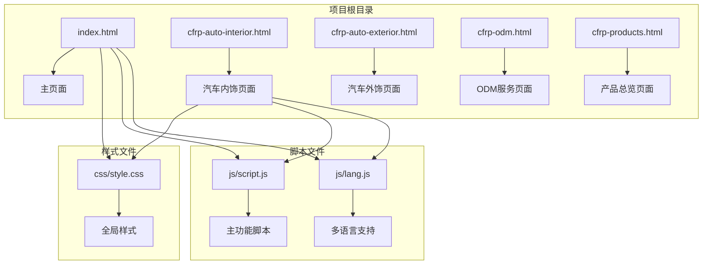
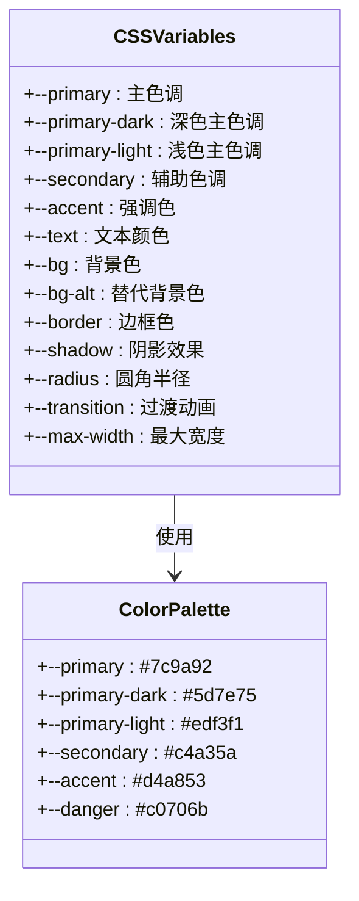
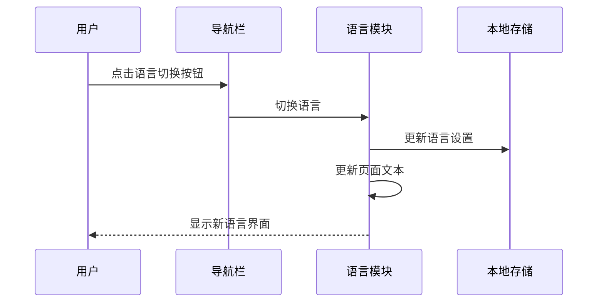
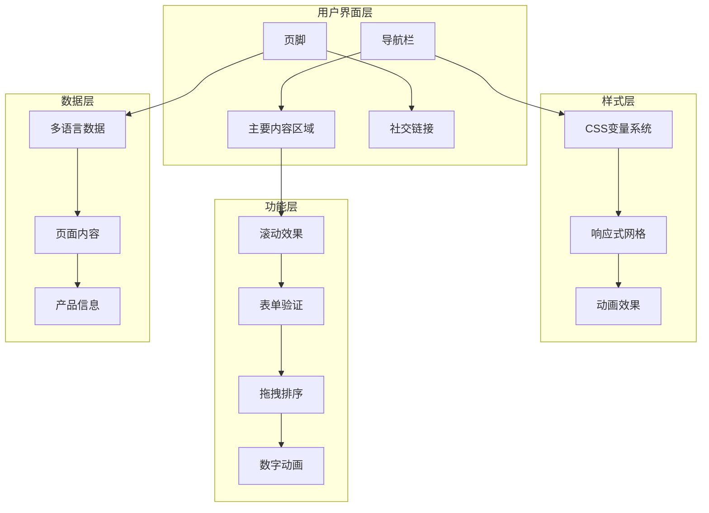
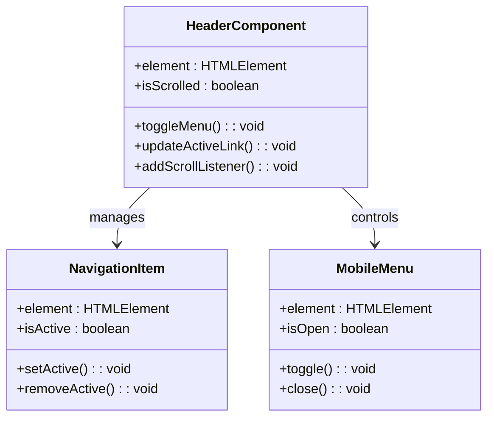
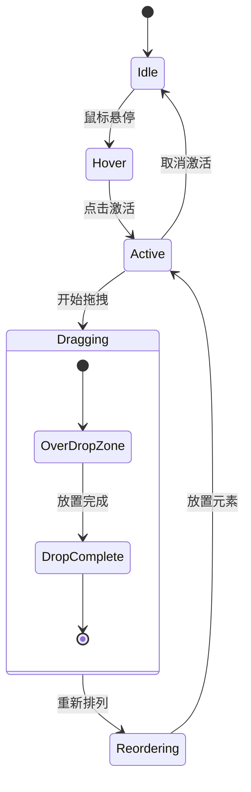
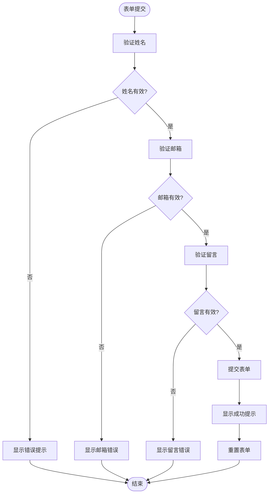
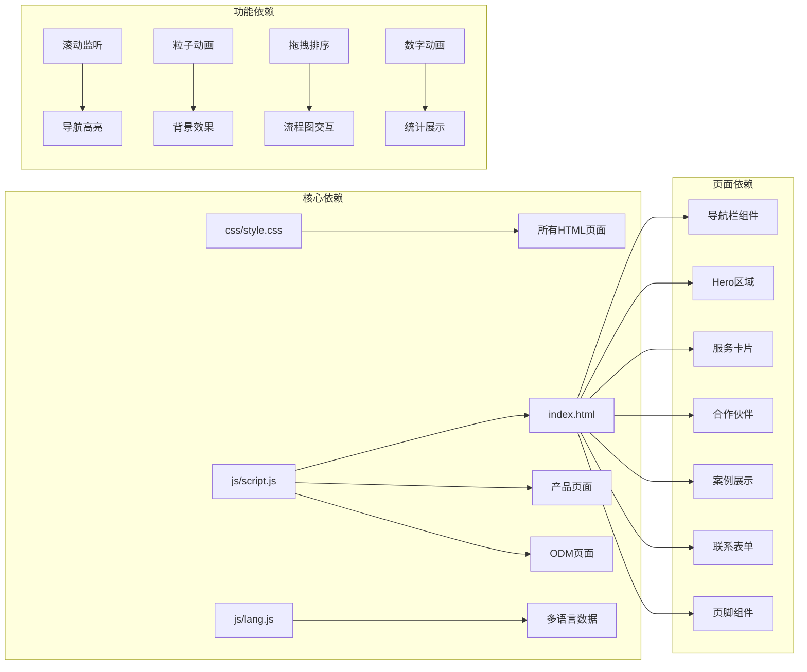

# 扩展开发指南

<cite>
**本文档引用的文件**
- [index.html](file://index.html)
- [cfrp-auto-interior.html](file://cfrp-auto-interior.html)
- [cfrp-auto-exterior.html](file://cfrp-auto-exterior.html)
- [cfrp-odm.html](file://cfrp-odm.html)
- [cfrp-products.html](file://cfrp-products.html)
- [css/style.css](file://css/style.css)
- [js/script.js](file://js/script.js)
- [js/lang.js](file://js/lang.js)
</cite>

## 目录
1. [简介](#简介)
2. [项目结构](#项目结构)
3. [核心组件](#核心组件)
4. [架构概览](#架构概览)
5. [详细组件分析](#详细组件分析)
6. [依赖关系分析](#依赖关系分析)
7. [性能考虑](#性能考虑)
8. [故障排除指南](#故障排除指南)
9. [结论](#结论)
10. [附录](#附录)

## 简介

HYT网站项目是一个基于复合材料技术的B2B企业网站，专注于碳纤维、玻璃纤维等先进复合材料的应用。该项目采用现代化的前端技术栈，实现了响应式设计、多语言支持、交互式动画和拖拽排序等功能。

本指南旨在帮助开发者理解和扩展这个网站项目，涵盖新功能添加方法、开发流程、主题定制、CSS变量系统扩展、第三方服务集成以及API扩展策略等内容。

## 项目结构

项目采用简洁的文件组织结构，主要包含以下核心文件：

**图表来源**
- [index.html:1-337](file://index.html#L1-L337)
- [css/style.css:1-1332](file://css/style.css#L1-L1332)
- [js/script.js:1-344](file://js/script.js#L1-L344)
- [js/lang.js:1-472](file://js/lang.js#L1-L472)

**章节来源**
- [index.html:1-337](file://index.html#L1-L337)
- [css/style.css:1-1332](file://css/style.css#L1-L1332)
- [js/script.js:1-344](file://js/script.js#L1-L344)
- [js/lang.js:1-472](file://js/lang.js#L1-L472)

## 核心组件

### CSS变量系统

项目采用了完整的CSS自定义属性系统，通过`:root`定义了丰富的设计令牌：

**图表来源**
- [css/style.css:10-30](file://css/style.css#L10-L30)

### 多语言支持系统

项目内置了完整的国际化解决方案，支持中日双语切换：

**图表来源**
- [js/lang.js:401-472](file://js/lang.js#L401-L472)

**章节来源**
- [css/style.css:10-30](file://css/style.css#L10-L30)
- [js/lang.js:5-472](file://js/lang.js#L5-L472)

## 架构概览

项目采用模块化架构设计，各页面共享相同的组件和样式系统：

**图表来源**
- [index.html:10-337](file://index.html#L10-L337)
- [css/style.css:67-83](file://css/style.css#L67-L83)
- [js/script.js:1-344](file://js/script.js#L1-L344)
- [js/lang.js:5-472](file://js/lang.js#L5-L472)

## 详细组件分析

### 导航栏组件

导航栏是整个网站的核心组件，实现了响应式设计和滚动效果：

**图表来源**
- [index.html:12-32](file://index.html#L12-L32)
- [js/script.js:1-52](file://js/script.js#L1-L52)

### 交互式流程图组件

ODM页面包含了三个复杂的交互式流程图，支持拖拽排序和状态管理：

**图表来源**
- [js/script.js:213-344](file://js/script.js#L213-L344)
- [cfrp-odm.html:44-175](file://cfrp-odm.html#L44-L175)

### 表单验证系统

联系表单实现了完整的客户端验证和用户体验优化：

**图表来源**
- [js/script.js:142-175](file://js/script.js#L142-L175)

**章节来源**
- [js/script.js:1-344](file://js/script.js#L1-L344)

## 依赖关系分析

项目采用松耦合的设计模式，各组件之间的依赖关系清晰明确：

**图表来源**
- [index.html:1-337](file://index.html#L1-L337)
- [css/style.css:1-1332](file://css/style.css#L1-L1332)
- [js/script.js:1-344](file://js/script.js#L1-L344)
- [js/lang.js:1-472](file://js/lang.js#L1-L472)

**章节来源**
- [index.html:1-337](file://index.html#L1-L337)
- [css/style.css:1-1332](file://css/style.css#L1-L1332)
- [js/script.js:1-344](file://js/script.js#L1-L344)
- [js/lang.js:1-472](file://js/lang.js#L1-L472)

## 性能考虑

项目在性能优化方面采用了多项策略：

### CSS变量优化
- 使用CSS自定义属性减少重复代码
- 通过`:root`统一管理设计令牌
- 支持动态主题切换

### JavaScript优化
- 懒加载非关键资源
- 使用IntersectionObserver优化动画
- 防抖处理滚动事件

### 图像优化
- 使用响应式图像适配不同屏幕
- SVG图标支持缩放不失真

## 故障排除指南

### 常见问题解决

**导航栏不显示滚动效果**
- 检查CSS类名是否正确
- 确认JavaScript事件绑定
- 验证CSS变量值

**多语言切换失效**
- 检查localStorage访问权限
- 验证语言数据完整性
- 确认DOM元素存在

**拖拽排序功能异常**
- 检查拖拽事件监听器
- 验证元素选择器
- 确认CSS拖拽样式

**表单验证错误**
- 检查正则表达式语法
- 验证必填字段
- 确认错误消息显示

**章节来源**
- [js/script.js:177-195](file://js/script.js#L177-L195)
- [js/lang.js:352-400](file://js/lang.js#L352-L400)

## 结论

HYT网站项目展现了现代前端开发的最佳实践，通过模块化设计、响应式布局、多语言支持和丰富的交互功能，为用户提供优质的浏览体验。项目结构清晰，扩展性强，为后续的功能扩展和维护提供了良好的基础。

开发者可以基于现有的架构模式，按照本文档提供的指导原则，安全地添加新功能、定制主题样式、集成第三方服务，并保持代码的可维护性和性能表现。

## 附录

### 新功能添加流程

1. **需求分析** - 确定功能需求和用户场景
2. **架构设计** - 评估现有架构的扩展点
3. **组件开发** - 创建新的HTML/CSS/JS组件
4. **样式集成** - 使用CSS变量系统确保一致性
5. **功能测试** - 在不同设备和浏览器上测试
6. **文档更新** - 更新相关文档和注释

### 主题定制最佳实践

- 使用CSS变量进行主题切换
- 保持颜色对比度符合无障碍标准
- 确保响应式设计在所有设备上正常工作
- 测试不同主题下的视觉效果

### 第三方服务集成建议

- 使用标准化的API接口
- 实现错误处理和降级策略
- 考虑性能影响和加载优化
- 确保数据隐私和安全合规