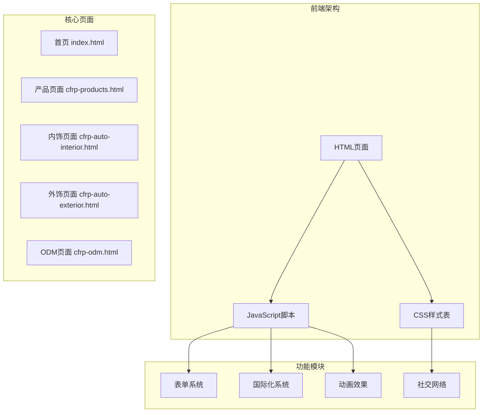
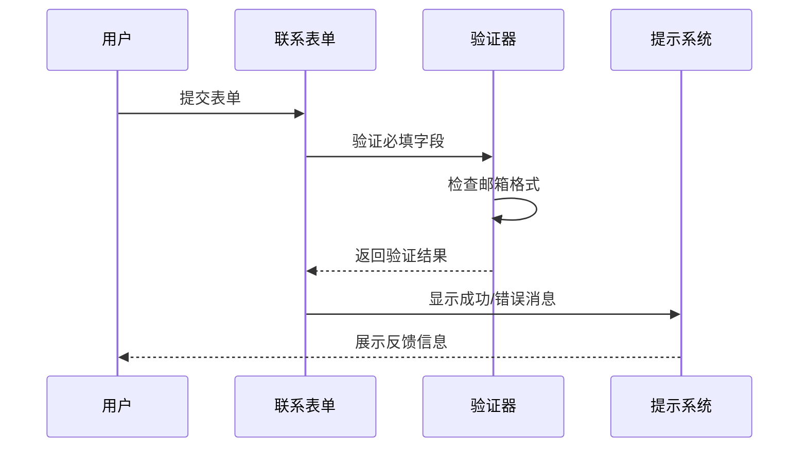
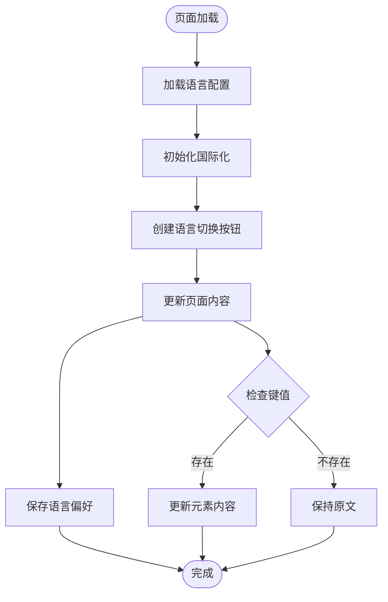
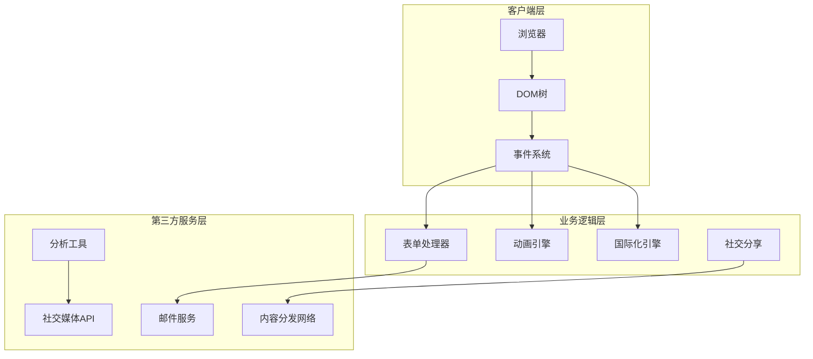
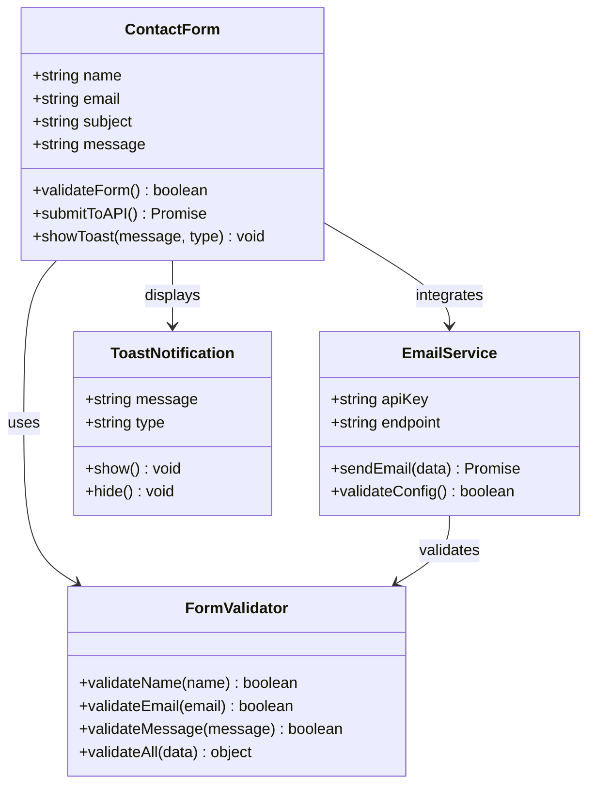
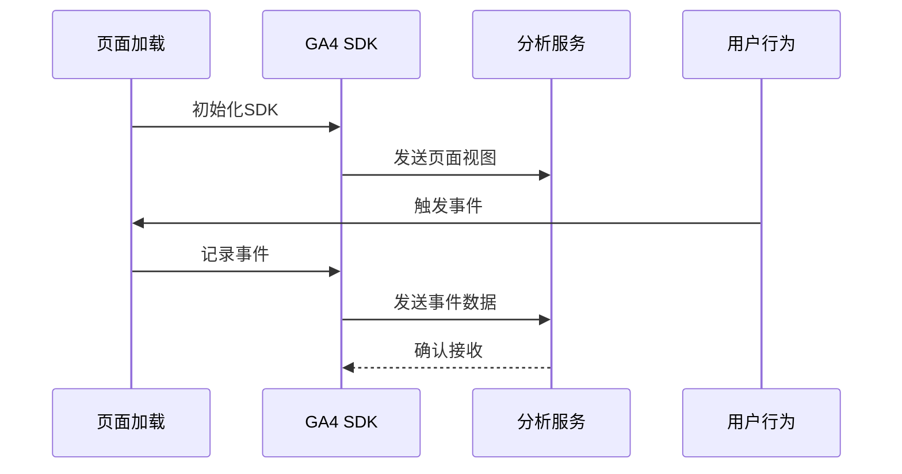
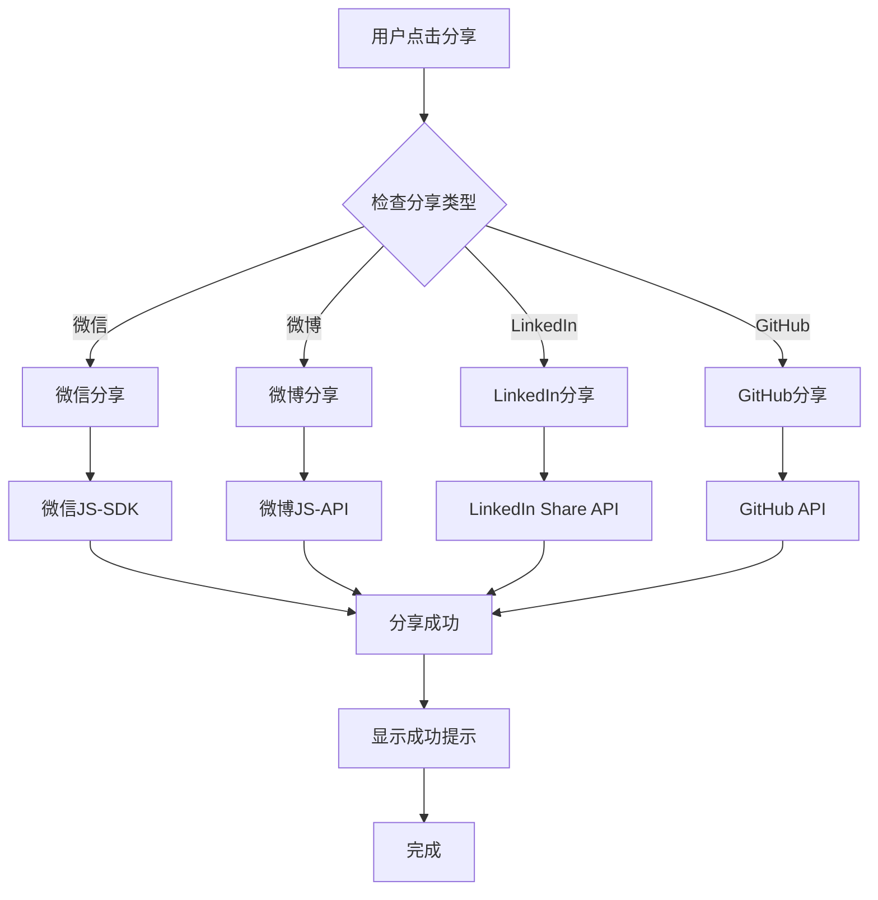
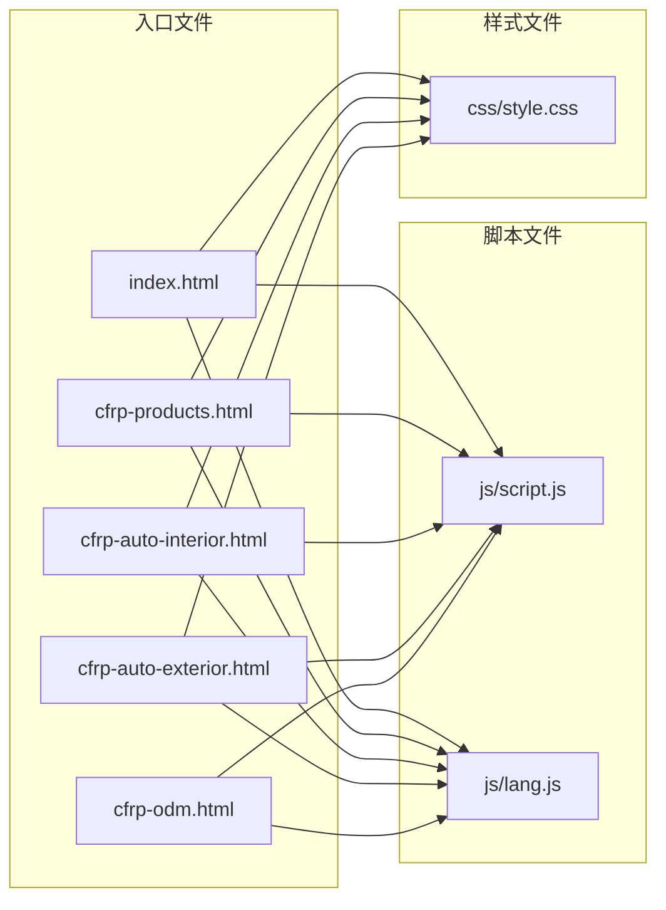

# 第三方服务集成

<cite>
**本文档引用的文件**
- [index.html](file://index.html)
- [script.js](file://js/script.js)
- [style.css](file://css/style.css)
- [lang.js](file://js/lang.js)
- [cfrp-products.html](file://cfrp-products.html)
- [cfrp-auto-interior.html](file://cfrp-auto-interior.html)
- [cfrp-auto-exterior.html](file://cfrp-auto-exterior.html)
- [cfrp-odm.html](file://cfrp-odm.html)
</cite>

## 目录
1. [简介](#简介)
2. [项目结构](#项目结构)
3. [核心组件](#核心组件)
4. [架构概览](#架构概览)
5. [详细组件分析](#详细组件分析)
6. [依赖关系分析](#依赖关系分析)
7. [性能考虑](#性能考虑)
8. [故障排除指南](#故障排除指南)
9. [结论](#结论)

## 简介

HYT网站是一个基于复合材料的轻量化产品解决方案提供商的官方网站。该项目采用纯前端技术栈，包含多语言支持、响应式设计和交互式功能。本文档旨在为开发者提供第三方服务集成的完整实施指南，涵盖邮件服务、分析工具、社交媒体平台等第三方API和服务的集成方案。

## 项目结构

HYT网站采用模块化结构，主要由以下组件构成：

**图表来源**
- [index.html:1-337](file://index.html#L1-L337)
- [script.js:1-344](file://js/script.js#L1-L344)
- [style.css:1-800](file://css/style.css#L1-L800)

**章节来源**
- [index.html:1-337](file://index.html#L1-L337)
- [script.js:1-344](file://js/script.js#L1-L344)
- [style.css:1-800](file://css/style.css#L1-L800)

## 核心组件

### 表单提交系统

当前表单系统实现了基础的客户端验证和用户反馈机制：

**图表来源**
- [script.js:141-175](file://js/script.js#L141-L175)

### 国际化系统

项目内置了完整的多语言支持系统，支持简体中文和日语切换：

**图表来源**
- [lang.js:5-472](file://js/lang.js#L5-L472)

**章节来源**
- [script.js:141-195](file://js/script.js#L141-L195)
- [lang.js:5-472](file://js/lang.js#L5-L472)

## 架构概览

HYT网站采用前后端分离的静态网站架构，所有功能通过纯JavaScript实现：

**图表来源**
- [script.js:1-344](file://js/script.js#L1-L344)
- [lang.js:1-472](file://js/lang.js#L1-L472)

## 详细组件分析

### 表单提交系统扩展

#### 当前实现分析

当前表单系统位于`script.js`文件中，实现了基础的客户端验证和用户体验优化：

**章节来源**
- [script.js:141-175](file://js/script.js#L141-L175)

#### 扩展方案

为了支持第三方邮件服务集成，建议采用以下架构：

**图表来源**
- [script.js:141-195](file://js/script.js#L141-L195)

### Google Analytics集成

#### 实现方案

建议集成Google Analytics 4 (GA4) 以跟踪用户行为和网站性能：

**图表来源**
- [index.html:1-337](file://index.html#L1-L337)

#### 配置要点

- 使用环境变量管理跟踪ID
- 实现事件分类和标签管理
- 配置隐私合规设置
- 设置用户属性和自定义参数

### 社交媒体分享功能

#### 现有社交图标

当前页脚包含基础的社交图标链接，但未实现实际的分享功能：

**章节来源**
- [index.html:317-325](file://index.html#L317-L325)

#### 扩展方案

**图表来源**
- [index.html:317-325](file://index.html#L317-L325)

## 依赖关系分析

### 文件依赖关系

**图表来源**
- [index.html:1-337](file://index.html#L1-L337)
- [script.js:1-344](file://js/script.js#L1-L344)
- [lang.js:1-472](file://js/lang.js#L1-L472)
- [style.css:1-800](file://css/style.css#L1-L800)

### 组件耦合分析

当前项目采用松耦合设计，各页面独立运行，通过共享的JavaScript和CSS文件实现功能复用。

**章节来源**
- [script.js:1-344](file://js/script.js#L1-L344)
- [lang.js:1-472](file://js/lang.js#L1-L472)

## 性能考虑

### 加载优化

1. **资源压缩**: 建议对CSS和JavaScript进行压缩和合并
2. **懒加载**: 对非关键资源实现懒加载机制
3. **缓存策略**: 配置适当的HTTP缓存头
4. **CDN加速**: 使用CDN分发静态资源

### 运行时性能

1. **事件委托**: 使用事件委托减少内存占用
2. **虚拟滚动**: 对大量数据实现虚拟滚动
3. **防抖节流**: 对高频事件使用防抖节流
4. **内存管理**: 及时清理事件监听器和定时器

## 故障排除指南

### 常见问题

#### 表单验证失败

**症状**: 表单提交时出现验证错误提示

**解决方案**:
1. 检查邮箱格式正则表达式
2. 验证必填字段是否为空
3. 确认客户端JavaScript正常运行

#### 国际化文本显示异常

**症状**: 页面文本未按预期显示或显示为键值

**解决方案**:
1. 检查语言文件完整性
2. 验证localStorage访问权限
3. 确认data-i18n属性正确设置

#### 动画效果不生效

**症状**: 页面动画效果无法正常显示

**解决方案**:
1. 检查IntersectionObserver兼容性
2. 验证CSS动画相关样式
3. 确认requestAnimationFrame支持

**章节来源**
- [script.js:177-195](file://js/script.js#L177-L195)
- [lang.js:352-399](file://js/lang.js#L352-L399)

## 结论

HYT网站项目展现了现代前端开发的最佳实践，采用纯JavaScript实现丰富的交互功能，内置完整的国际化支持系统。通过本文档提供的第三方服务集成指南，开发者可以安全有效地扩展网站功能，包括邮件服务集成、分析工具部署和社交媒体平台连接。

建议在实施过程中重点关注：
- 安全性：确保API密钥的安全存储和传输
- 性能：优化第三方服务的加载和执行效率
- 兼容性：确保跨浏览器和移动设备的兼容性
- 可维护性：采用模块化和可测试的代码结构

通过遵循这些指导原则，HYT网站将能够充分利用第三方服务来增强用户体验并实现业务目标。