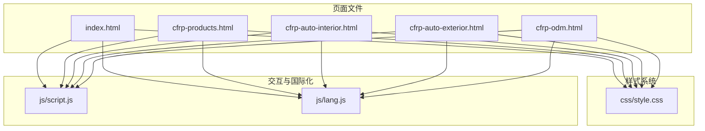
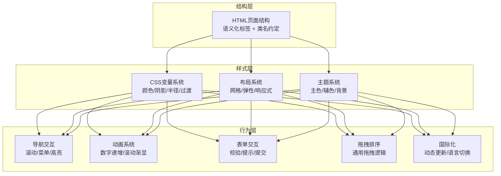
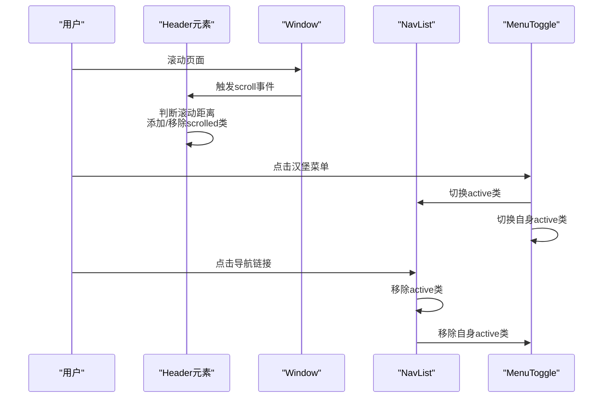
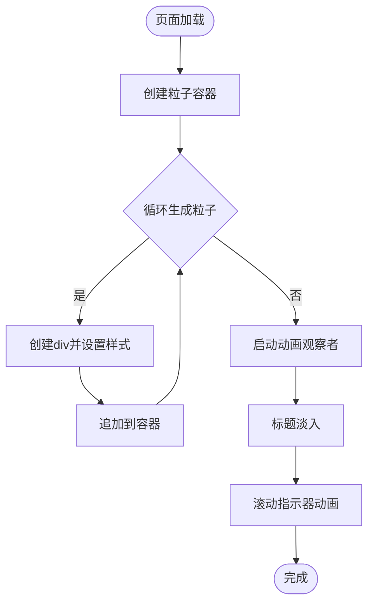
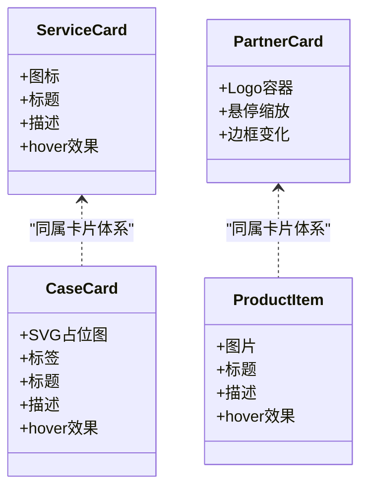
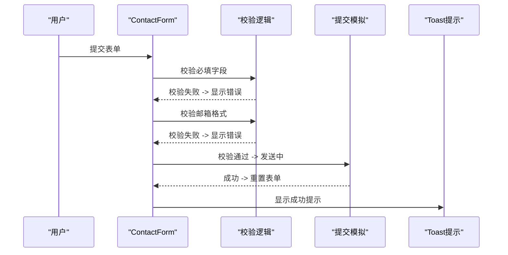
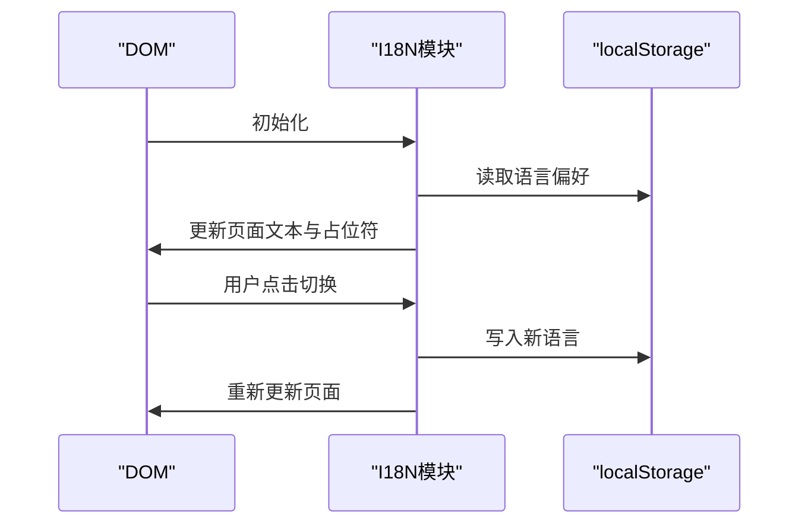
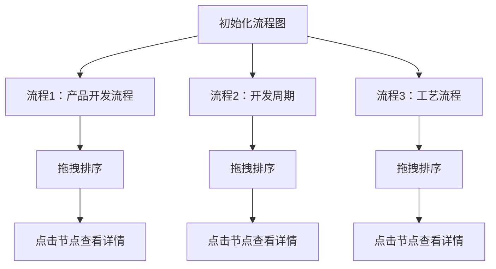
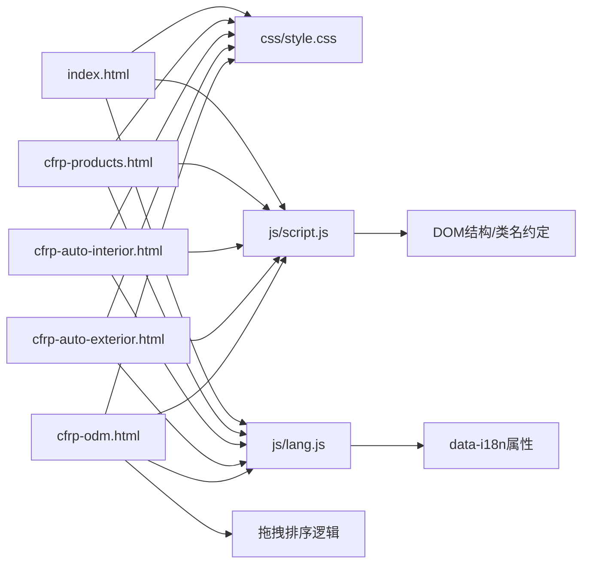

# 页面开发模板

<cite>
**本文引用的文件列表**
- [index.html](file://index.html)
- [cfrp-products.html](file://cfrp-products.html)
- [cfrp-auto-interior.html](file://cfrp-auto-interior.html)
- [cfrp-auto-exterior.html](file://cfrp-auto-exterior.html)
- [cfrp-odm.html](file://cfrp-odm.html)
- [css/style.css](file://css/style.css)
- [js/script.js](file://js/script.js)
- [js/lang.js](file://js/lang.js)
</cite>

## 目录
1. [简介](#简介)
2. [项目结构](#项目结构)
3. [核心组件](#核心组件)
4. [架构总览](#架构总览)
5. [详细组件分析](#详细组件分析)
6. [依赖关系分析](#依赖关系分析)
7. [性能考虑](#性能考虑)
8. [故障排除指南](#故障排除指南)
9. [结论](#结论)
10. [附录](#附录)

## 简介
本指南旨在为HYT网站的新页面开发提供标准化模板与组件复用最佳实践。通过分析现有页面结构与样式系统，总结出统一的HTML骨架、CSS样式规范与JavaScript初始化模式，帮助开发者快速构建一致、可维护且具备响应式与国际化能力的页面。

## 项目结构
项目采用“页面级文件 + 共享样式与脚本”的组织方式：
- 页面文件：index.html（首页）、cfrp-products.html（产品总览）、cfrp-auto-interior.html（汽车内饰）、cfrp-auto-exterior.html（汽车外饰）、cfrp-odm.html（ODM服务）
- 样式系统：css/style.css（全局样式与组件样式）
- 交互与国际化：js/script.js（导航、滚动、表单、动画、拖拽）、js/lang.js（多语言）

**图表来源**
- [index.html:1-337](file://index.html#L1-L337)
- [cfrp-products.html:1-97](file://cfrp-products.html#L1-L97)
- [cfrp-auto-interior.html:1-196](file://cfrp-auto-interior.html#L1-L196)
- [cfrp-auto-exterior.html:1-98](file://cfrp-auto-exterior.html#L1-L98)
- [cfrp-odm.html:1-191](file://cfrp-odm.html#L1-L191)
- [css/style.css:1-800](file://css/style.css#L1-L800)
- [js/script.js:1-344](file://js/script.js#L1-L344)
- [js/lang.js:1-472](file://js/lang.js#L1-L472)

**章节来源**
- [index.html:1-337](file://index.html#L1-L337)
- [cfrp-products.html:1-97](file://cfrp-products.html#L1-L97)
- [cfrp-auto-interior.html:1-196](file://cfrp-auto-interior.html#L1-L196)
- [cfrp-auto-exterior.html:1-98](file://cfrp-auto-exterior.html#L1-L98)
- [cfrp-odm.html:1-191](file://cfrp-odm.html#L1-L191)
- [css/style.css:1-800](file://css/style.css#L1-L800)
- [js/script.js:1-344](file://js/script.js#L1-L344)
- [js/lang.js:1-472](file://js/lang.js#L1-L472)

## 核心组件
- 导航栏组件：固定定位、滚动变色、移动端汉堡菜单、导航高亮联动
- 首页横幅组件：粒子背景、渐显标题、滚动指示器
- 区块组件：section容器、section-header、section-tag/title/desc
- 卡片组件：服务卡片、案例卡片、合作伙伴卡片、产品卡片
- 表单组件：联系表单、验证与提示、平滑滚动
- 页脚组件：网格布局、快速链接、社交图标
- 国际化组件：I18N模块、语言切换按钮、data-i18n属性

**章节来源**
- [index.html:11-331](file://index.html#L11-L331)
- [css/style.css:67-800](file://css/style.css#L67-L800)
- [js/script.js:1-344](file://js/script.js#L1-L344)
- [js/lang.js:1-472](file://js/lang.js#L1-L472)

## 架构总览
页面开发遵循“结构-样式-行为”三层分离：
- 结构层：语义化HTML，使用语义化标签与类名约定
- 样式层：CSS变量、网格/弹性布局、响应式断点
- 行为层：事件监听、IntersectionObserver、拖拽排序、多语言更新

**图表来源**
- [css/style.css:10-30](file://css/style.css#L10-L30)
- [js/script.js:1-344](file://js/script.js#L1-L344)
- [js/lang.js:1-472](file://js/lang.js#L1-L472)

## 详细组件分析

### 导航栏组件
- 功能要点：滚动时添加类名改变样式；移动端汉堡菜单切换；导航链接点击自动关闭菜单；滚动时根据当前section高亮对应导航项
- 组件复用：所有页面均包含相同结构，仅需替换导航链接与活动状态

**图表来源**
- [index.html:11-32](file://index.html#L11-L32)
- [js/script.js:2-29](file://js/script.js#L2-L29)

**章节来源**
- [index.html:11-32](file://index.html#L11-L32)
- [js/script.js:2-29](file://js/script.js#L2-L29)

### 首页横幅组件
- 功能要点：粒子背景生成、标题渐显动画、滚动指示器
- 性能要点：粒子数量可控、动画使用requestAnimationFrame

**图表来源**
- [index.html:34-56](file://index.html#L34-L56)
- [js/script.js:54-79](file://js/script.js#L54-L79)
- [css/style.css:193-256](file://css/style.css#L193-L256)

**章节来源**
- [index.html:34-56](file://index.html#L34-L56)
- [js/script.js:54-79](file://js/script.js#L54-L79)
- [css/style.css:193-256](file://css/style.css#L193-L256)

### 卡片组件体系
- 服务卡片：居中链接、图标、标题、描述
- 案例卡片：SVG占位图、标签、标题、描述
- 合作伙伴卡片：Logo容器、悬停缩放与边框变化
- 产品卡片：网格布局、悬停提升与阴影变化

**图表来源**
- [index.html:98-120](file://index.html#L98-L120)
- [index.html:172-221](file://index.html#L172-L221)
- [index.html:132-160](file://index.html#L132-L160)
- [cfrp-auto-interior.html:95-144](file://cfrp-auto-interior.html#L95-L144)

**章节来源**
- [index.html:98-120](file://index.html#L98-L120)
- [index.html:172-221](file://index.html#L172-L221)
- [index.html:132-160](file://index.html#L132-L160)
- [cfrp-auto-interior.html:95-144](file://cfrp-auto-interior.html#L95-L144)

### 表单与交互组件
- 联系表单：必填字段校验、邮箱格式校验、提交反馈、重置
- Toast提示：消息类型区分、自动消失
- 平滑滚动：兼容旧浏览器的平滑滚动

**图表来源**
- [index.html:264-284](file://index.html#L264-L284)
- [js/script.js:142-175](file://js/script.js#L142-L175)

**章节来源**
- [index.html:264-284](file://index.html#L264-L284)
- [js/script.js:142-175](file://js/script.js#L142-L175)

### 国际化组件
- I18N模块：多语言数据、动态更新、语言切换按钮
- 使用方式：data-i18n/data-i18n-ph属性绑定文本与占位符

**图表来源**
- [js/lang.js:401-471](file://js/lang.js#L401-L471)
- [index.html:6-8](file://index.html#L6-L8)

**章节来源**
- [js/lang.js:1-472](file://js/lang.js#L1-L472)
- [index.html:6-8](file://index.html#L6-L8)

### ODM流程图组件
- 三种流程图：产品开发流程、开发周期、工艺流程
- 支持拖拽排序与节点激活显示详情

**图表来源**
- [cfrp-odm.html:40-175](file://cfrp-odm.html#L40-L175)
- [js/script.js:213-341](file://js/script.js#L213-L341)

**章节来源**
- [cfrp-odm.html:40-175](file://cfrp-odm.html#L40-L175)
- [js/script.js:213-341](file://js/script.js#L213-L341)

## 依赖关系分析
- 页面文件依赖共享样式与脚本
- js/script.js依赖DOM结构与CSS类名
- js/lang.js依赖data-i18n属性与页面结构
- ODM页面依赖通用拖拽逻辑

**图表来源**
- [index.html:1-337](file://index.html#L1-L337)
- [cfrp-products.html:1-97](file://cfrp-products.html#L1-L97)
- [cfrp-auto-interior.html:1-196](file://cfrp-auto-interior.html#L1-L196)
- [cfrp-auto-exterior.html:1-98](file://cfrp-auto-exterior.html#L1-L98)
- [cfrp-odm.html:1-191](file://cfrp-odm.html#L1-L191)
- [css/style.css:1-800](file://css/style.css#L1-L800)
- [js/script.js:1-344](file://js/script.js#L1-L344)
- [js/lang.js:1-472](file://js/lang.js#L1-L472)

**章节来源**
- [index.html:1-337](file://index.html#L1-L337)
- [cfrp-products.html:1-97](file://cfrp-products.html#L1-L97)
- [cfrp-auto-interior.html:1-196](file://cfrp-auto-interior.html#L1-L196)
- [cfrp-auto-exterior.html:1-98](file://cfrp-auto-exterior.html#L1-L98)
- [cfrp-odm.html:1-191](file://cfrp-odm.html#L1-L191)
- [css/style.css:1-800](file://css/style.css#L1-L800)
- [js/script.js:1-344](file://js/script.js#L1-L344)
- [js/lang.js:1-472](file://js/lang.js#L1-L472)

## 性能考虑
- 使用IntersectionObserver进行懒加载与滚动动画，避免频繁计算
- 动画使用requestAnimationFrame与CSS过渡，减少主线程压力
- 粒子背景数量可控，避免过多DOM节点影响渲染
- 表单提交使用防抖与状态恢复，避免重复提交
- 响应式布局使用CSS Grid/Flex与媒体查询，减少JS计算

[本节为通用指导，无需具体文件分析]

## 故障排除指南
- 导航高亮不生效：确认sections与navLinks选择器匹配，检查offset值
- 粒子背景不显示：确认particles容器存在，检查动画样式是否被覆盖
- 表单提交无反馈：检查data-i18n属性是否正确，确认邮箱正则表达式
- 国际化文本未更新：确认data-i18n属性与I18N键一致，检查localStorage写入
- 拖拽排序异常：确认draggable属性与选择器匹配，检查插入顺序逻辑

**章节来源**
- [js/script.js:31-52](file://js/script.js#L31-L52)
- [js/script.js:54-79](file://js/script.js#L54-L79)
- [js/script.js:142-175](file://js/script.js#L142-L175)
- [js/lang.js:364-399](file://js/lang.js#L364-L399)
- [js/script.js:268-341](file://js/script.js#L268-L341)

## 结论
通过统一的页面模板与组件复用策略，HYT网站能够快速构建一致性高、可维护性强的页面。建议在新页面开发中严格遵循本文档的结构、样式与交互规范，确保跨页面体验的一致性与性能表现。

[本节为总结性内容，无需具体文件分析]

## 附录

### 新页面开发模板结构
- HTML骨架
  - 文档声明与语言属性
  - meta标签（字符集、视口、标题）
  - 引入样式与图标
  - 导航栏结构（logo、nav-list、menu-toggle）
  - 页面主体（section/page-hero/内容区/footer）
  - 引入脚本（script.js、lang.js）
- CSS样式规范
  - 使用CSS变量定义主题色与间距
  - 采用Grid/Flex布局，配合媒体查询实现响应式
  - 组件类名遵循命名约定（如.service-card、.case-card）
- JavaScript初始化代码
  - 导航交互：滚动添加类名、移动端菜单切换、导航高亮
  - 动画系统：数字递增、滚动渐显
  - 表单交互：校验、提示、提交
  - 国际化：I18N初始化与动态更新
  - 可选：拖拽排序（如ODM流程图）

**章节来源**
- [index.html:1-337](file://index.html#L1-L337)
- [css/style.css:10-800](file://css/style.css#L10-L800)
- [js/script.js:1-344](file://js/script.js#L1-L344)
- [js/lang.js:1-472](file://js/lang.js#L1-L472)

### 组件复用最佳实践
- 导航栏：统一结构，按需修改链接与活动状态
- 卡片组件：复用服务/案例/合作伙伴卡片类名与样式
- 表单组件：复用联系表单结构与校验逻辑
- 国际化：统一使用data-i18n与data-i18n-ph属性
- 响应式：优先使用CSS Grid/Flex与媒体查询

**章节来源**
- [index.html:11-331](file://index.html#L11-L331)
- [css/style.css:360-800](file://css/style.css#L360-L800)
- [js/script.js:142-175](file://js/script.js#L142-L175)
- [js/lang.js:364-399](file://js/lang.js#L364-L399)

### SEO优化与响应式适配规范
- SEO优化
  - 使用语义化标签与合理的标题层级
  - 正确设置meta描述与关键词
  - 图片添加alt属性，SVG使用viewBox
  - 使用data-i18n属性便于搜索引擎识别
- 响应式适配
  - 使用CSS Grid/Flex实现自适应布局
  - 媒体查询断点：768px、900px、1200px
  - 图片与视频使用max-width: 100%与height: auto

**章节来源**
- [index.html:1-337](file://index.html#L1-L337)
- [css/style.css:32-64](file://css/style.css#L32-L64)
- [cfrp-auto-interior.html:46-56](file://cfrp-auto-interior.html#L46-L56)