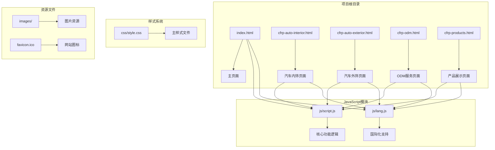
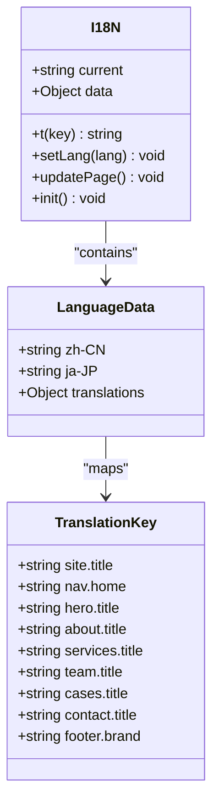
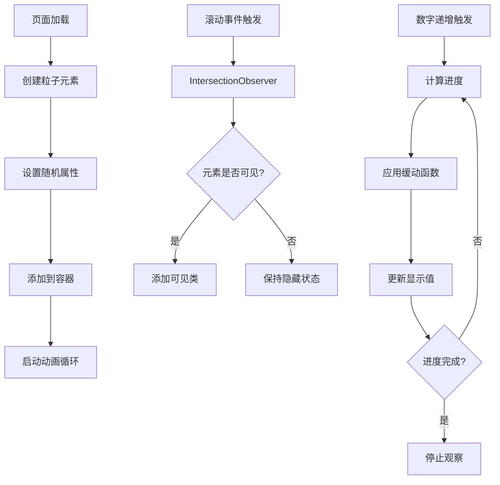
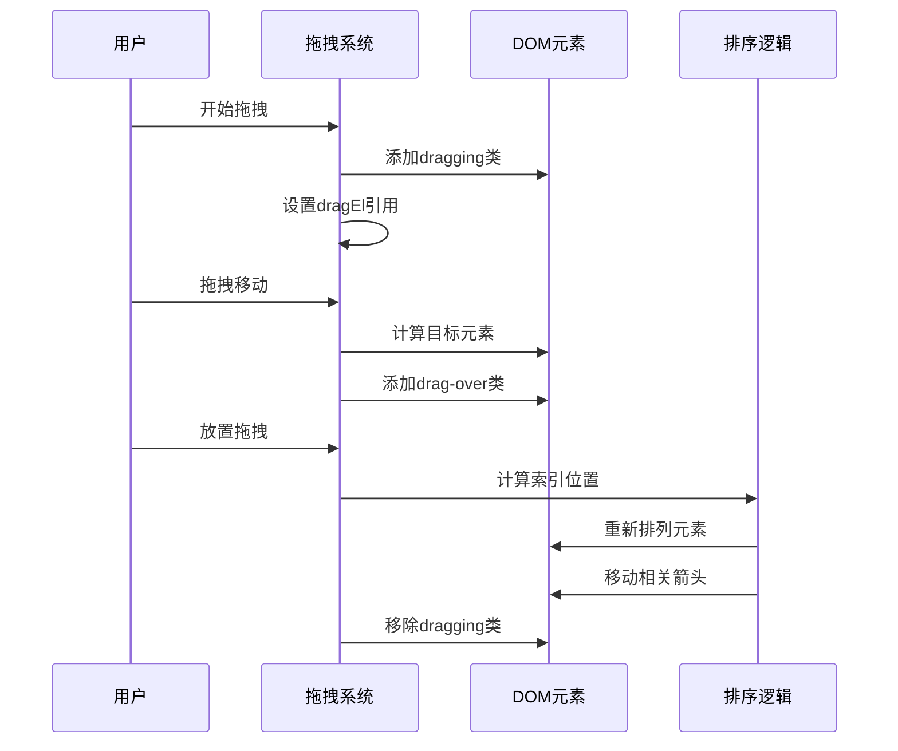
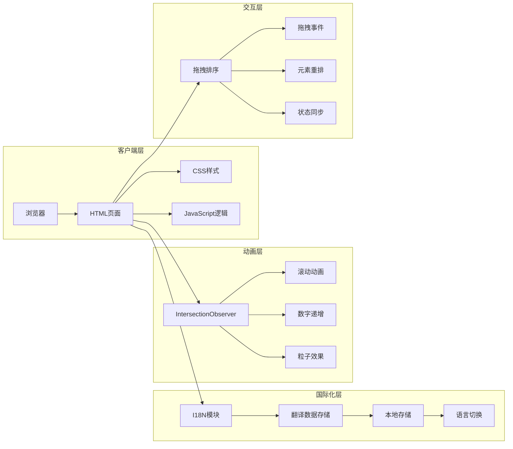
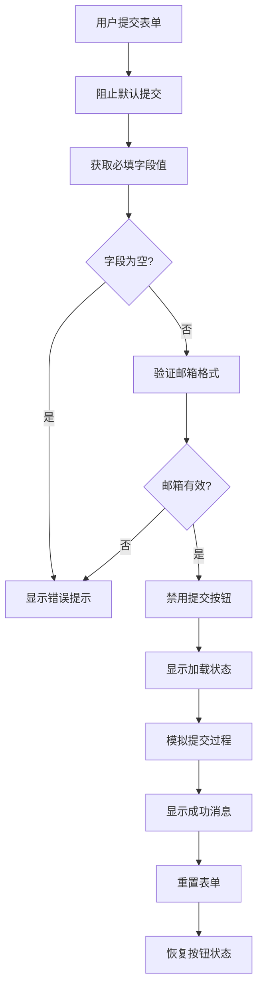
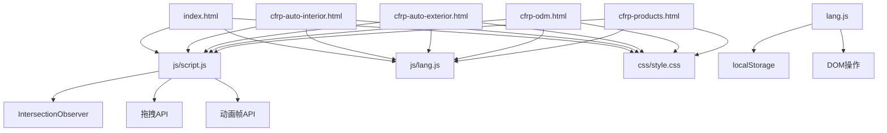

# 故障排除指南

<cite>
**本文档引用的文件**
- [index.html](file://index.html)
- [script.js](file://js/script.js)
- [lang.js](file://js/lang.js)
- [style.css](file://css/style.css)
- [cfrp-auto-interior.html](file://cfrp-auto-interior.html)
- [cfrp-auto-exterior.html](file://cfrp-auto-exterior.html)
- [cfrp-odm.html](file://cfrp-odm.html)
- [cfrp-products.html](file://cfrp-products.html)
</cite>

## 目录
1. [简介](#简介)
2. [项目结构](#项目结构)
3. [核心组件](#核心组件)
4. [架构概览](#架构概览)
5. [详细组件分析](#详细组件分析)
6. [依赖关系分析](#依赖关系分析)
7. [性能考虑](#性能考虑)
8. [故障排除指南](#故障排除指南)
9. [结论](#结论)

## 简介

HYT网站项目是一个基于复合材料技术的展示型网站，采用现代化的前端技术栈构建。该项目实现了多语言支持、响应式设计、交互式动画效果和拖拽排序功能。本文档旨在为开发者和维护人员提供全面的故障排除指南，涵盖国际化切换异常、动画效果失效、表单验证错误等常见问题的诊断和解决方案。

## 项目结构

项目采用模块化组织方式，包含以下主要组成部分：



**图表来源**
- [index.html:1-337](file://index.html#L1-L337)
- [script.js:1-344](file://js/script.js#L1-L344)
- [lang.js:1-472](file://js/lang.js#L1-L472)

**章节来源**
- [index.html:1-337](file://index.html#L1-L337)
- [script.js:1-344](file://js/script.js#L1-L344)
- [lang.js:1-472](file://js/lang.js#L1-L472)
- [style.css:1-1332](file://css/style.css#L1-L1332)

## 核心组件

### 国际化系统 (I18N)

国际化系统通过独立的模块实现，支持中日两种语言的无缝切换：



**图表来源**
- [lang.js:5-472](file://js/lang.js#L5-L472)

### 动画系统

项目实现了多种动画效果，包括粒子背景、数字递增、滚动显示等：



**图表来源**
- [script.js:55-115](file://js/script.js#L55-L115)

### 交互式流程图

ODM页面实现了复杂的拖拽排序功能：



**图表来源**
- [script.js:269-341](file://js/script.js#L269-L341)

**章节来源**
- [lang.js:1-472](file://js/lang.js#L1-L472)
- [script.js:1-344](file://js/script.js#L1-L344)
- [style.css:995-1332](file://css/style.css#L995-L1332)

## 架构概览

项目采用前后端分离的架构模式，前端使用纯静态文件部署：



**图表来源**
- [index.html:1-337](file://index.html#L1-L337)
- [script.js:1-344](file://js/script.js#L1-L344)
- [lang.js:1-472](file://js/lang.js#L1-L472)

## 详细组件分析

### 导航栏系统

导航栏实现了响应式设计和滚动效果：

| 组件 | 功能 | 关键特性 |
|------|------|----------|
| Logo区域 | 显示公司标识 | 脉冲动画效果 |
| 导航链接 | 页面跳转 | 活跃状态指示 |
| 移动菜单 | 响应式菜单 | 折叠动画 |
| 滚动效果 | 固定定位 | 背景模糊 |

**章节来源**
- [index.html:12-32](file://index.html#L12-L32)
- [style.css:67-191](file://css/style.css#L67-L191)

### 首页横幅

首页横幅包含粒子背景和动态文本效果：

```mermaid
flowchart TD
A[初始化横幅] --> B[创建粒子容器]
B --> C[生成50个粒子元素]
C --> D[设置随机大小(2-6px)]
D --> E[设置随机位置(0-100%)]
E --> F[设置随机动画(8-18秒)]
F --> G[设置随机延迟(0-10秒)]
G --> H[启动无限循环动画]
I[滚动检测] --> J{滚动距离>50px?}
J --> |是| K[添加scrolled类]
J --> |否| L[移除scrolled类]
```

**图表来源**
- [script.js:55-79](file://js/script.js#L55-L79)
- [script.js:4-10](file://js/script.js#L4-L10)

**章节来源**
- [index.html:35-56](file://index.html#L35-L56)
- [script.js:55-79](file://js/script.js#L55-L79)
- [style.css:193-256](file://css/style.css#L193-L256)

### 服务卡片系统

服务卡片采用网格布局，支持悬停效果：

| 卡片类型 | 内容特点 | 交互效果 |
|----------|----------|----------|
| 产品展示 | 图标+标题+描述 | 缩放+阴影变化 |
| 合作伙伴 | Logo展示 | 放大+边框变化 |
| 应用案例 | SVG图形+文字 | 悬停动画 |

**章节来源**
- [index.html:90-122](file://index.html#L90-L122)
- [style.css:484-652](file://css/style.css#L484-L652)

### 联系表单

表单包含完整的验证逻辑和用户反馈：



**图表来源**
- [script.js:144-175](file://js/script.js#L144-L175)

**章节来源**
- [index.html:225-287](file://index.html#L225-L287)
- [script.js:144-195](file://js/script.js#L144-L195)

## 依赖关系分析

项目的主要依赖关系如下：



**图表来源**
- [index.html:333-334](file://index.html#L333-L334)
- [cfrp-odm.html:187-188](file://cfrp-odm.html#L187-L188)

**章节来源**
- [index.html:1-337](file://index.html#L1-L337)
- [cfrp-odm.html:1-191](file://cfrp-odm.html#L1-L191)
- [lang.js:1-472](file://js/lang.js#L1-L472)
- [script.js:1-344](file://js/script.js#L1-L344)

## 性能考虑

### 加载优化

项目采用了多种性能优化策略：

1. **懒加载机制**: 使用IntersectionObserver实现元素的延迟加载
2. **CSS变量**: 统一管理颜色和间距，减少重复定义
3. **响应式设计**: 移动端优先的布局策略
4. **动画优化**: 使用transform和opacity属性进行硬件加速

### 内存管理

- Toast消息组件会在3秒后自动清理DOM节点
- IntersectionObserver在元素可见后会停止观察
- 拖拽排序完成后会清理临时样式类

## 故障排除指南

### 国际化切换异常

#### 问题症状
- 语言切换按钮无法正常工作
- 切换后页面内容未更新
- 本地存储的语言设置丢失

#### 诊断步骤
1. **检查localStorage访问权限**
   ```javascript
   try {
       localStorage.setItem('test', 'test');
       localStorage.removeItem('test');
   } catch(e) {
       console.error('localStorage不可用:', e);
   }
   ```

2. **验证语言数据完整性**
   ```javascript
   console.log('当前语言:', I18N.current);
   console.log('可用语言:', Object.keys(I18N.data));
   console.log('翻译键数量:', Object.keys(I18N.data.zh-CN).length);
   ```

3. **检查DOM元素绑定**
   ```javascript
   const langButton = document.getElementById('langSwitch');
   const i18nElements = document.querySelectorAll('[data-i18n]');
   console.log('语言切换按钮:', langButton);
   console.log('国际化元素数量:', i18nElements.length);
   ```

#### 解决方案
1. **清除浏览器缓存和localStorage**
   ```
   清空浏览器缓存
   删除localStorage中的'lang'键
   ```

2. **检查网络连接**
   - 确认lang.js文件可以正常加载
   - 验证CDN连接稳定性

3. **验证HTML结构**
   - 确保[data-i18n]属性正确设置
   - 检查data-i18n-ph占位符的使用

**章节来源**
- [lang.js:358-400](file://js/lang.js#L358-L400)
- [index.html:6-7](file://index.html#L6-L7)

### 动画效果失效

#### 问题症状
- 粒子动画不显示或闪烁
- 数字递增动画不执行
- 滚动触发的元素不显示
- 拖拽排序功能异常

#### 诊断步骤
1. **检查IntersectionObserver支持**
   ```javascript
   if ('IntersectionObserver' in window) {
       console.log('IntersectionObserver支持正常');
   } else {
       console.log('IntersectionObserver不支持');
   }
   ```

2. **验证动画元素存在性**
   ```javascript
   const particles = document.getElementById('particles');
   const statNumbers = document.querySelectorAll('.stat-number');
   const revealElements = document.querySelectorAll('.reveal');
   
   console.log('粒子容器:', particles ? '存在' : '不存在');
   console.log('统计数字:', statNumbers.length);
   console.log('可揭示元素:', revealElements.length);
   ```

3. **检查CSS动画定义**
   ```css
   /* 验证关键帧定义 */
   @keyframes floatUp {
       /* 检查动画关键帧 */
   }
   
   @keyframes fadeInUp {
       /* 检查淡入动画 */
   }
   ```

#### 解决方案
1. **修复粒子动画问题**
   - 确保#particles容器存在且可见
   - 检查CSS中.particle类的样式定义
   - 验证动画持续时间和延迟设置

2. **解决数字递增动画**
   - 确认.stat-number元素包含data-target属性
   - 检查IntersectionObserver配置参数
   - 验证缓动函数的数学计算

3. **修复滚动动画**
   - 检查.reveal和.visible类的CSS定义
   - 验证rootMargin和threshold参数
   - 确认元素的offsetTop计算

4. **解决拖拽排序问题**
   - 检查draggable属性设置
   - 验证事件监听器绑定
   - 确认元素重排逻辑

**章节来源**
- [script.js:55-139](file://js/script.js#L55-L139)
- [style.css:995-1035](file://css/style.css#L995-L1035)

### 表单验证错误

#### 问题症状
- 表单提交时出现JavaScript错误
- 邮箱验证规则不生效
- 提交按钮状态异常
- Toast消息显示问题

#### 诊断步骤
1. **检查表单元素引用**
   ```javascript
   const contactForm = document.getElementById('contactForm');
   const nameInput = document.getElementById('name');
   const emailInput = document.getElementById('email');
   const messageInput = document.getElementById('message');
   
   console.log('表单元素:', contactForm);
   console.log('姓名输入:', nameInput);
   console.log('邮箱输入:', emailInput);
   console.log('消息输入:', messageInput);
   ```

2. **验证邮箱正则表达式**
   ```javascript
   const emailRegex = /^[^\s@]+@[^\s@]+\.[^\s@]+$/;
   const testEmails = ['valid@email.com', 'invalid.email', '@invalid.com'];
   
   testEmails.forEach(email => {
       console.log(`${email}: ${emailRegex.test(email)}`);
   });
   ```

3. **检查事件监听器**
   ```javascript
   const form = document.getElementById('contactForm');
   const listeners = getEventListeners(form);
   console.log('表单事件监听器:', listeners);
   ```

#### 解决方案
1. **修复表单提交逻辑**
   - 确保preventDefault()正确调用
   - 检查必填字段验证逻辑
   - 验证邮箱格式正则表达式

2. **解决提交按钮状态问题**
   - 确认按钮禁用和启用逻辑
   - 检查文本内容恢复机制
   - 验证异步操作的完成回调

3. **修复Toast消息**
   - 确保唯一性检查逻辑
   - 验证CSS过渡动画
   - 检查定时器清理机制

**章节来源**
- [script.js:144-195](file://js/script.js#L144-L195)
- [index.html:264-284](file://index.html#L264-L284)

### 响应式设计问题

#### 问题症状
- 移动端菜单不显示
- 栅格布局错乱
- 字体大小异常
- 触摸交互问题

#### 诊断步骤
1. **检查媒体查询**
   ```css
   @media (max-width: 768px) {
       /* 检查移动端样式 */
   }
   ```

2. **验证视口设置**
   ```html
   <meta name="viewport" content="width=device-width, initial-scale=1.0">
   ```

3. **测试触摸事件**
   ```javascript
   const menuToggle = document.getElementById('menuToggle');
   console.log('触摸事件支持:', 'ontouchstart' in window);
   ```

#### 解决方案
1. **修复移动端菜单**
   - 检查CSS中.menu-toggle的display属性
   - 验证.nav-list.active类的样式
   - 确认JavaScript事件绑定

2. **解决栅格布局问题**
   - 检查CSS Grid属性设置
   - 验证响应式断点配置
   - 确认元素的flex属性

3. **优化触摸体验**
   - 添加触摸友好的点击区域
   - 验证CSS :active伪类
   - 检查JavaScript触摸事件

**章节来源**
- [style.css:889-993](file://css/style.css#L889-L993)
- [script.js:13-29](file://js/script.js#L13-L29)

### 性能问题诊断

#### 问题症状
- 页面加载缓慢
- 动画卡顿
- 内存泄漏
- CPU占用过高

#### 诊断工具
1. **浏览器开发者工具**
   - Performance面板监控CPU使用
   - Memory面板检测内存泄漏
   - Network面板分析资源加载

2. **JavaScript性能监控**
   ```javascript
   // 性能计时
   const start = performance.now();
   // 执行代码
   const end = performance.now();
   console.log(`执行时间: ${end - start}毫秒`);
   ```

3. **内存使用分析**
   ```javascript
   // 检查DOM节点数量
   console.log('DOM节点总数:', document.querySelectorAll('*').length);
   
   // 检查事件监听器数量
   const form = document.getElementById('contactForm');
   const listeners = getEventListeners(form);
   console.log('事件监听器:', listeners);
   ```

#### 优化建议
1. **减少DOM操作**
   - 批量更新DOM元素
   - 使用DocumentFragment
   - 避免频繁的重排重绘

2. **优化动画性能**
   - 使用transform和opacity属性
   - 避免使用top/left属性
   - 启用硬件加速

3. **内存管理**
   - 及时清理事件监听器
   - 移除不需要的DOM元素
   - 释放大对象引用

**章节来源**
- [script.js:85-113](file://js/script.js#L85-L113)
- [style.css:10-30](file://css/style.css#L10-L30)

## 结论

HYT网站项目展现了现代前端开发的最佳实践，通过模块化设计、响应式布局和丰富的交互效果，为用户提供了优质的浏览体验。本文档提供的故障排除指南涵盖了项目的主要功能模块，包括国际化系统、动画效果、表单验证和响应式设计等方面的问题诊断和解决方案。

建议在日常维护中：
1. 定期检查浏览器兼容性
2. 监控性能指标变化
3. 及时更新第三方依赖
4. 建立完善的测试流程

通过遵循本文档的指导原则和最佳实践，可以有效预防和解决大部分技术问题，确保网站的稳定运行和良好用户体验。