# 响应式架构设计

<cite>
**本文档引用的文件**
- [index.html](file://index.html)
- [style.css](file://css/style.css)
- [script.js](file://js/script.js)
- [lang.js](file://js/lang.js)
</cite>

## 目录
1. [项目概述](#项目概述)
2. [响应式设计理念](#响应式设计理念)
3. [架构概览](#架构概览)
4. [核心组件分析](#核心组件分析)
5. [媒体查询与断点设计](#媒体查询与断点设计)
6. [移动端适配策略](#移动端适配策略)
7. [现代布局技术应用](#现代布局技术应用)
8. [JavaScript响应式交互](#javascript响应式交互)
9. [触摸设备优化](#触摸设备优化)
10. [跨设备兼容性](#跨设备兼容性)
11. [性能优化考虑](#性能优化考虑)
12. [故障排除指南](#故障排除指南)
13. [总结](#总结)

## 项目概述

HYT网站项目是一个基于复合材料产品的轻量化解决方案提供商的官方网站。该项目采用了现代化的响应式设计架构，确保在各种设备和屏幕尺寸上都能提供优秀的用户体验。

项目的核心特点包括：
- 移动优先的设计理念
- 现代CSS Grid和Flexbox布局
- 原生JavaScript交互功能
- 多语言国际化支持
- 触摸友好的界面设计

## 响应式设计理念

### 移动优先策略

项目严格遵循移动优先的设计原则，从最小的屏幕尺寸开始构建，然后逐步增强到更大的屏幕。

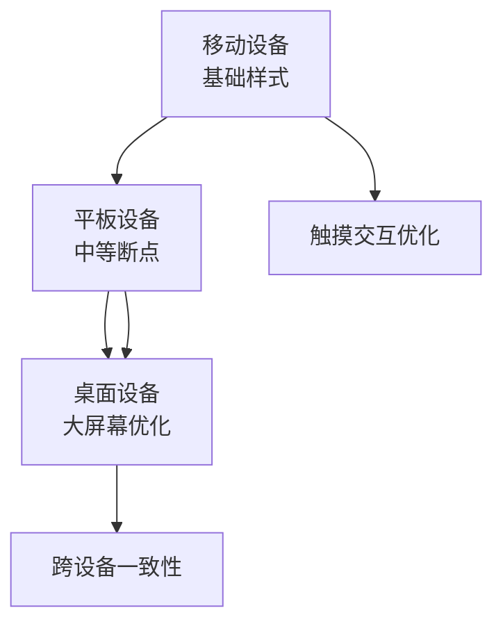

**章节来源**
- [style.css:888-993](file://css/style.css#L888-L993)

### 渐进增强方法

系统采用渐进增强的方法，确保在不同设备上都能提供基本功能，同时在支持的设备上提供增强体验。

## 架构概览

### 整体架构设计

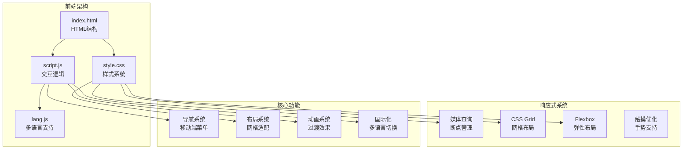

**图表来源**
- [index.html:1-337](file://index.html#L1-L337)
- [style.css:1-1345](file://css/style.css#L1-L1345)
- [script.js:1-344](file://js/script.js#L1-L344)
- [lang.js:1-472](file://js/lang.js#L1-L472)

## 核心组件分析

### 导航系统架构

导航系统是响应式架构的核心组件，实现了移动优先的设计理念。

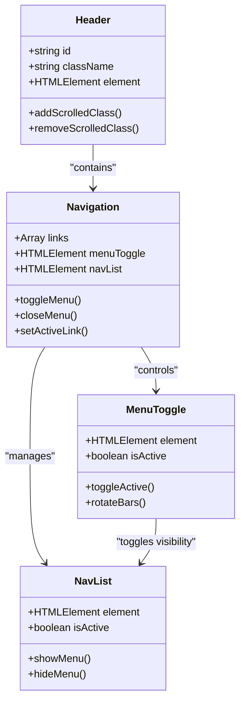

**图表来源**
- [index.html:12-32](file://index.html#L12-L32)
- [script.js:12-29](file://js/script.js#L12-L29)

**章节来源**
- [index.html:12-32](file://index.html#L12-L32)
- [script.js:12-29](file://js/script.js#L12-L29)

### 内容布局系统

项目使用了多种现代布局技术来实现灵活的响应式设计。

```mermaid
graph LR
subgraph "布局系统"
CONTAINER[容器系统<br/>.container]
GRID[网格系统<br/>CSS Grid]
FLEX[弹性系统<br/>Flexbox]
CLAMP[流式字体<br/>clamp()]
end
subgraph "内容区域"
ABOUT[关于我们<br/>.about-grid]
SERVICES[服务展示<br/>.services-grid]
PARTNERS[合作伙伴<br/>.partners-grid]
CASES[应用案例<br/>.cases-grid]
CONTACT[联系方式<br/>.contact-grid]
end
CONTAINER --> GRID
CONTAINER --> FLEX
GRID --> ABOUT
GRID --> SERVICES
GRID --> PARTNERS
GRID --> CASES
FLEX --> CONTACT
CLAMP --> ABOUT
CLAMP --> SERVICES
```

**图表来源**
- [style.css:46-50](file://css/style.css#L46-L50)
- [style.css:398-496](file://css/style.css#L398-L496)
- [style.css:556-664](file://css/style.css#L556-L664)

**章节来源**
- [style.css:398-664](file://css/style.css#L398-L664)

## 媒体查询与断点设计

### 断点策略

项目采用了精心设计的断点系统，确保在各种设备上都有最佳的用户体验。

| 断点范围 | 设备类型 | 主要变化 |
|---------|----------|----------|
| 1024px以下 | 桌面端小屏 | 服务卡片从3列变为2列 |
| 768px以下 | 平板端 | 移动端菜单激活，网格重新排列 |
| 480px以下 | 手机端 | 表单布局调整，按钮垂直排列 |

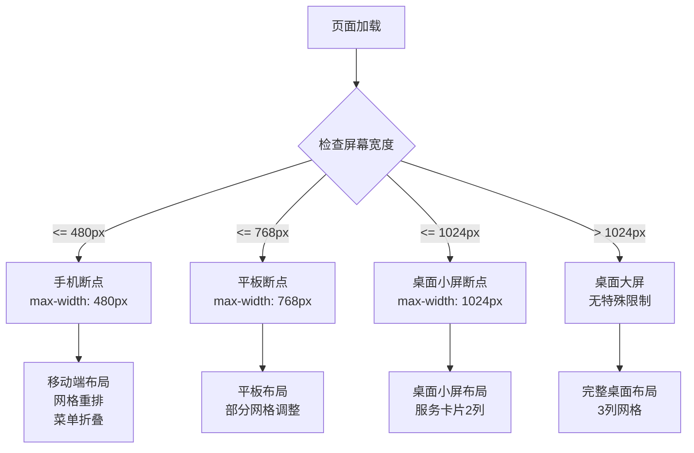

**图表来源**
- [style.css:888-993](file://css/style.css#L888-L993)

**章节来源**
- [style.css:888-993](file://css/style.css#L888-L993)

### 响应式网格系统

项目使用了CSS Grid和Flexbox的组合来实现响应式网格布局。

```mermaid
graph TB
subgraph "网格系统"
ServicesGrid[服务网格<br/>repeat(3, 1fr)]
AboutGrid[关于网格<br/>1fr 1fr]
PartnersGrid[合作伙伴网格<br/>repeat(3, 1fr)]
CasesGrid[案例网格<br/>repeat(3, 1fr)]
end
subgraph "断点变化"
Break1024["1024px以下<br/>2列网格"]
Break768["768px以下<br/>1列网格"]
Break480["480px以下<br/>表单调整"]
end
ServicesGrid --> Break1024
ServicesGrid --> Break768
AboutGrid --> Break768
PartnersGrid --> Break768
CasesGrid --> Break768
```

**图表来源**
- [style.css:889-993](file://css/style.css#L889-L993)

**章节来源**
- [style.css:889-993](file://css/style.css#L889-L993)

## 移动端适配策略

### 移动端菜单设计

移动端菜单是响应式设计的关键组件，采用了汉堡菜单模式。

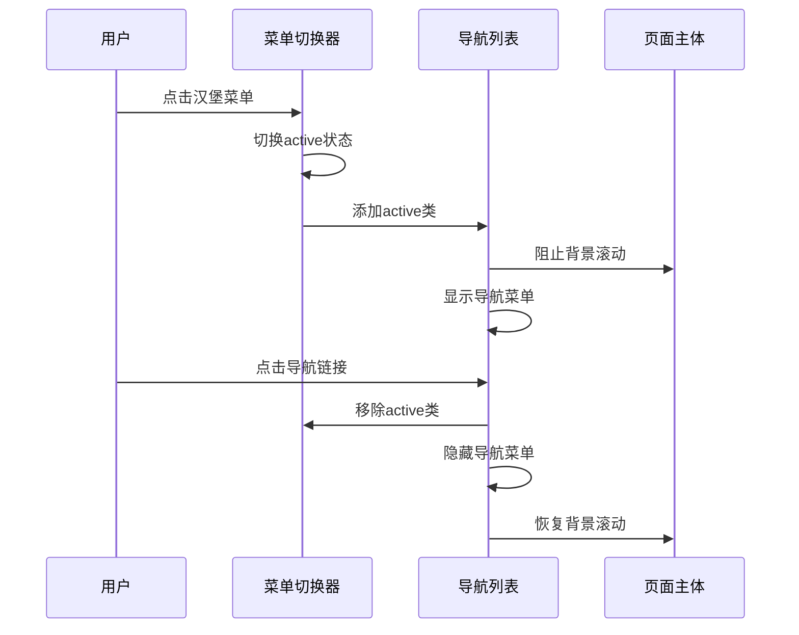

**图表来源**
- [script.js:12-29](file://js/script.js#L12-L29)
- [style.css:901-968](file://css/style.css#L901-L968)

### 移动端导航行为

导航系统在移动端提供了流畅的用户体验：

1. **固定定位**：导航栏在滚动时保持固定
2. **背景模糊**：滚动时显示模糊效果
3. **颜色对比**：确保在不同背景下都有良好的可读性
4. **动画过渡**：平滑的颜色和阴影变化

**章节来源**
- [script.js:12-29](file://js/script.js#L12-L29)
- [style.css:67-83](file://css/style.css#L67-L83)

## 现代布局技术应用

### CSS Grid的应用

项目广泛使用了CSS Grid来实现复杂的响应式布局。

```mermaid
graph LR
subgraph "Grid布局示例"
HeroGrid[Hero网格<br/>1fr]
AboutGrid[About网格<br/>1fr 1fr]
ServicesGrid[Services网格<br/>repeat(3, 1fr)]
PartnersGrid[Partners网格<br/>repeat(3, 1fr)]
CasesGrid[Cases网格<br/>repeat(3, 1fr)]
ContactGrid[Contact网格<br/>1fr 1.2fr]
end
subgraph "响应式变化"
MobileGrid["移动端<br/>1列网格"]
TabletGrid["平板端<br/>2列网格"]
DesktopGrid["桌面端<br/>3列网格"]
end
HeroGrid --> MobileGrid
AboutGrid --> MobileGrid
ServicesGrid --> DesktopGrid
ServicesGrid --> TabletGrid
ServicesGrid --> MobileGrid
```

**图表来源**
- [style.css:398-664](file://css/style.css#L398-L664)

**章节来源**
- [style.css:398-664](file://css/style.css#L398-L664)

### Flexbox的使用

Flexbox主要用于实现元素的居中对齐和空间分配。

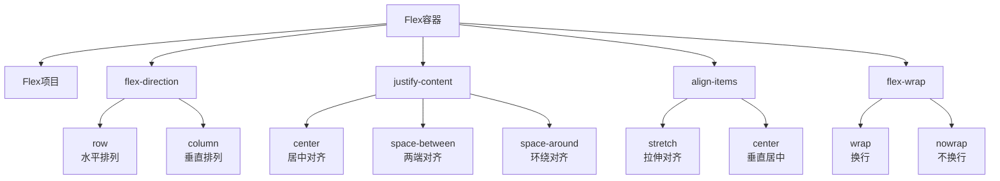

**图表来源**
- [style.css:86-89](file://css/style.css#L86-L89)
- [style.css:289-293](file://css/style.css#L289-L293)

**章节来源**
- [style.css:86-89](file://css/style.css#L86-L89)
- [style.css:289-293](file://css/style.css#L289-L293)

### 流式字体系统

项目使用了`clamp()`函数来实现流式字体大小，确保在不同屏幕尺寸下都有最佳的阅读体验。

**章节来源**
- [style.css:267](file://css/style.css#L267)
- [style.css:380](file://css/style.css#L380)

## JavaScript响应式交互

### 导航栏滚动效果

JavaScript实现了导航栏的动态效果，增强了用户体验。

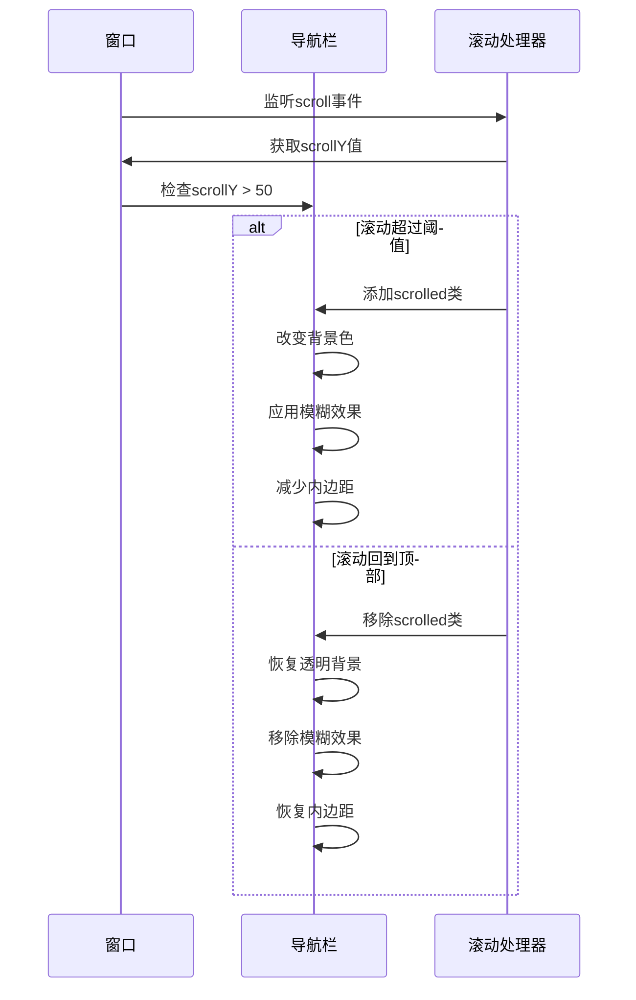

**图表来源**
- [script.js:1-10](file://js/script.js#L1-L10)
- [style.css:78-83](file://css/style.css#L78-L83)

### 导航链接高亮系统

JavaScript实现了智能的导航链接高亮功能，基于当前滚动位置自动更新活动状态。

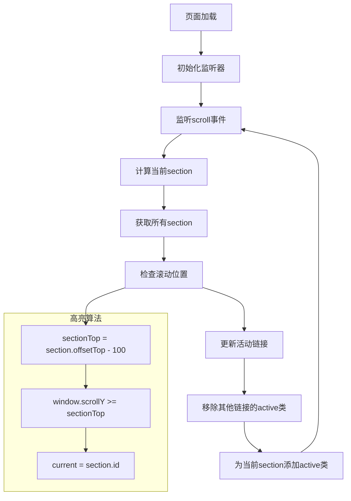

**图表来源**
- [script.js:31-52](file://js/script.js#L31-L52)

**章节来源**
- [script.js:1-10](file://js/script.js#L1-L10)
- [script.js:31-52](file://js/script.js#L31-L52)

### 动画系统

项目实现了多种动画效果，包括数字递增动画和滚动显示动画。

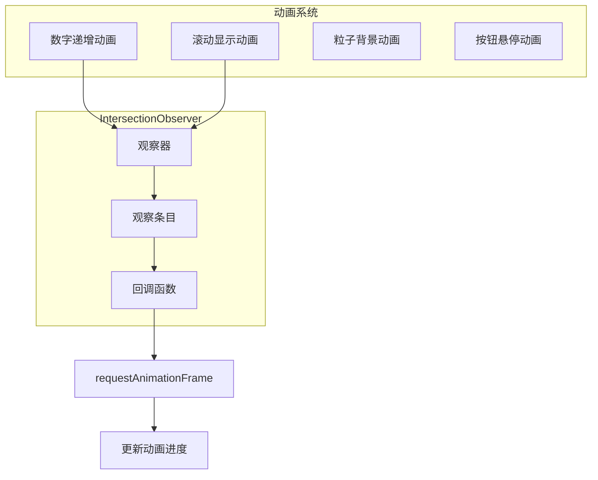

**图表来源**
- [script.js:82-115](file://js/script.js#L82-L115)
- [script.js:118-139](file://js/script.js#L118-L139)

**章节来源**
- [script.js:82-115](file://js/script.js#L82-L115)
- [script.js:118-139](file://js/script.js#L118-L139)

## 触摸设备优化

### 触摸交互设计

项目针对触摸设备进行了专门的优化，确保在移动设备上的良好体验。

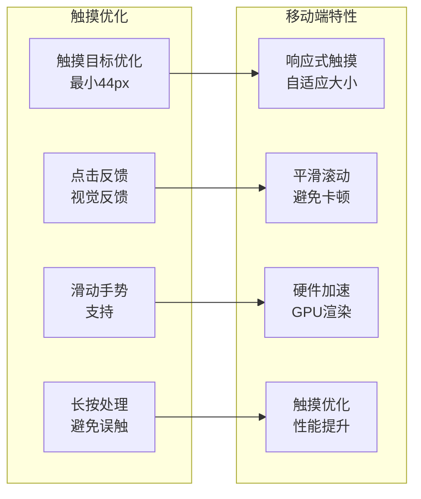

**章节来源**
- [style.css:901-968](file://css/style.css#L901-L968)
- [script.js:12-29](file://js/script.js#L12-L29)

### 移动端菜单交互

移动端菜单系统经过精心设计，提供了直观的用户交互体验。

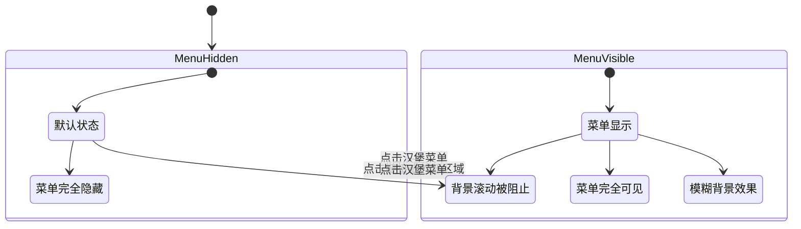

**图表来源**
- [script.js:12-29](file://js/script.js#L12-L29)
- [style.css:901-968](file://css/style.css#L901-L968)

**章节来源**
- [script.js:12-29](file://js/script.js#L12-L29)
- [style.css:901-968](file://css/style.css#L901-L968)

## 跨设备兼容性

### 浏览器兼容性

项目在设计时考虑了不同浏览器的兼容性问题。

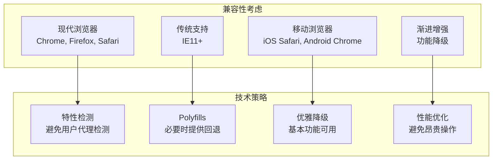

### 性能优化策略

项目采用了多种性能优化技术来确保在各种设备上的流畅运行。

**章节来源**
- [style.css:888-993](file://css/style.css#L888-L993)
- [script.js:82-115](file://js/script.js#L82-L115)

## 性能优化考虑

### 加载性能

项目在设计时充分考虑了加载性能，采用了多种优化策略。

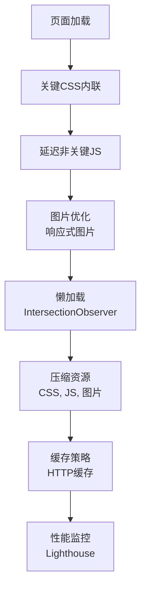

### 运行时性能

项目在运行时也采用了性能优化技术。

**章节来源**
- [script.js:82-115](file://js/script.js#L82-L115)
- [script.js:118-139](file://js/script.js#L118-L139)

## 故障排除指南

### 常见问题诊断

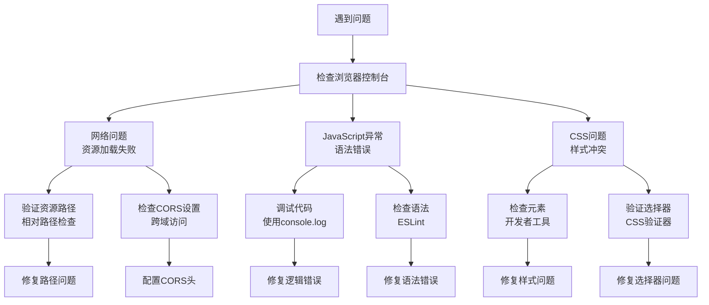

### 响应式问题排查

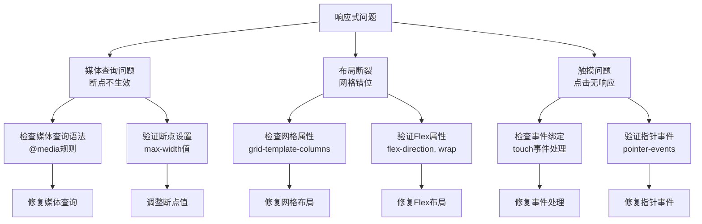

## 总结

HYT网站项目展现了现代响应式设计的最佳实践，通过移动优先的理念、精心设计的断点系统、以及现代化的布局技术，为用户提供了优秀的跨设备体验。

### 核心优势

1. **移动优先设计**：从最小屏幕开始构建，确保移动端体验优秀
2. **灵活的断点系统**：三个主要断点覆盖了大部分设备场景
3. **现代布局技术**：CSS Grid和Flexbox的有机结合
4. **流畅的交互体验**：JavaScript提供的丰富交互功能
5. **性能优化**：多种技术手段确保页面加载和运行性能

### 技术亮点

- 使用`clamp()`函数实现流式字体大小
- 通过`IntersectionObserver`实现高效的动画和加载优化
- 移动端汉堡菜单的优雅实现
- 多语言支持的国际化架构
- 触摸友好的交互设计

### 未来改进方向

1. **进一步的性能优化**：考虑使用Web Workers处理复杂计算
2. **增强的可访问性**：添加ARIA标签和键盘导航支持
3. **现代CSS特性**：利用CSS Container Queries等新特性
4. **PWA功能**：考虑添加离线支持和应用安装功能

这个响应式架构设计为类似的企业官网项目提供了很好的参考模板，展示了如何在保持设计美观的同时，确保在各种设备上的良好用户体验。