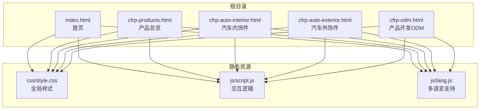
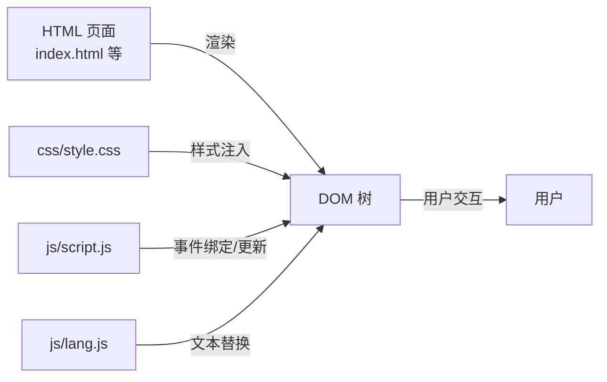
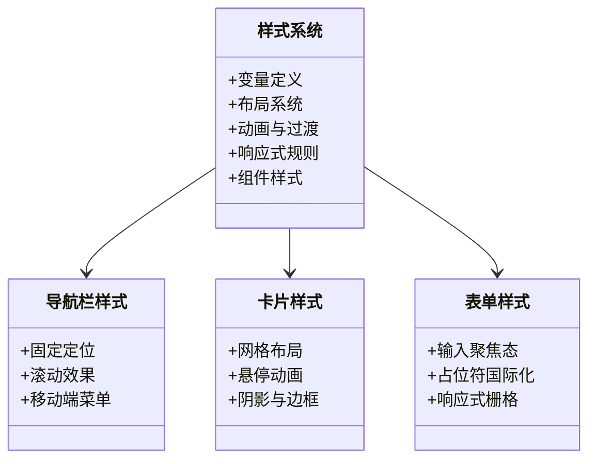
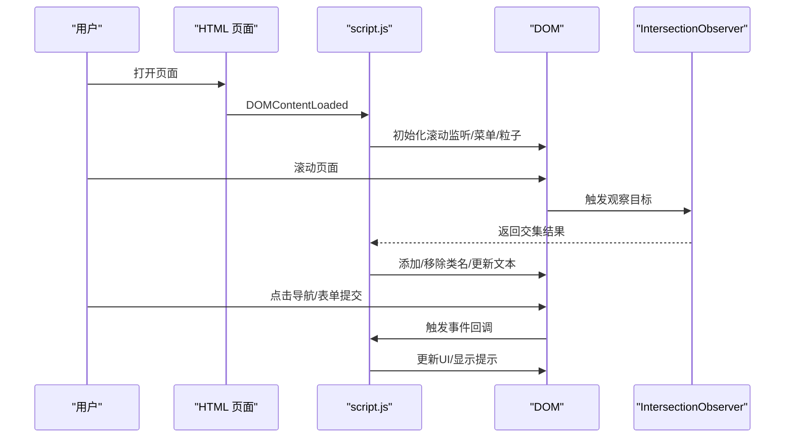
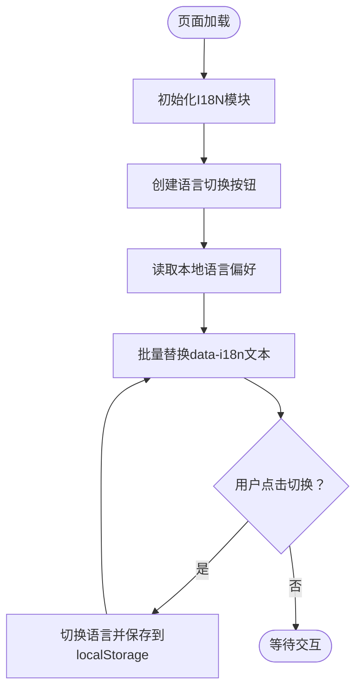
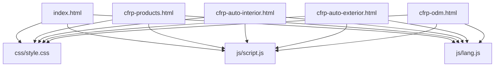
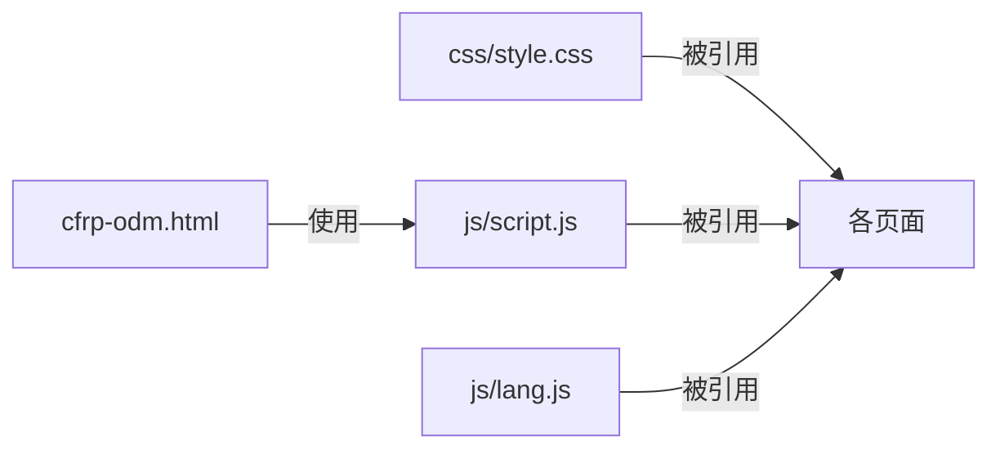

# 技术栈架构

<cite>
**本文档引用的文件**
- [index.html](file://index.html)
- [cfrp-products.html](file://cfrp-products.html)
- [cfrp-auto-interior.html](file://cfrp-auto-interior.html)
- [cfrp-auto-exterior.html](file://cfrp-auto-exterior.html)
- [cfrp-odm.html](file://cfrp-odm.html)
- [css/style.css](file://css/style.css)
- [js/script.js](file://js/script.js)
- [js/lang.js](file://js/lang.js)
</cite>

## 目录
1. [引言](#引言)
2. [项目结构](#项目结构)
3. [核心组件](#核心组件)
4. [架构总览](#架构总览)
5. [详细组件分析](#详细组件分析)
6. [依赖关系分析](#依赖关系分析)
7. [性能考量](#性能考量)
8. [故障排查指南](#故障排查指南)
9. [结论](#结论)

## 引言
本项目采用纯原生技术栈（HTML5、CSS3、JavaScript），构建一个轻量化、高性能、可扩展的企业官网。该技术组合具备以下优势：
- 无外部依赖：仅使用浏览器内置能力，无需构建工具或第三方库
- 直接编译部署：HTML/CSS/JS 文件可直接部署到任意静态服务器
- 本地资源托管：所有资源均通过本地路径加载，便于离线访问与CDN缓存
- 可维护性强：代码结构清晰，易于迭代与二次开发

## 项目结构
项目采用“多页面单页化”结构，每个业务页面独立成页，共享统一的样式与脚本资源。核心目录与文件如下：
- 根目录包含多个业务页面（首页与三大产品页）
- 样式集中于 css/style.css，采用CSS变量与现代布局技术
- 逻辑集中在 js/script.js 与 js/lang.js，分别负责交互与国际化

**图表来源**
- [index.html:1-337](file://index.html#L1-L337)
- [cfrp-products.html:1-97](file://cfrp-products.html#L1-L97)
- [cfrp-auto-interior.html:1-196](file://cfrp-auto-interior.html#L1-L196)
- [cfrp-auto-exterior.html:1-98](file://cfrp-auto-exterior.html#L1-L98)
- [cfrp-odm.html:1-191](file://cfrp-odm.html#L1-L191)
- [css/style.css:1-800](file://css/style.css#L1-L800)
- [js/script.js:1-344](file://js/script.js#L1-L344)
- [js/lang.js:1-472](file://js/lang.js#L1-L472)

**章节来源**
- [index.html:1-337](file://index.html#L1-L337)
- [cfrp-products.html:1-97](file://cfrp-products.html#L1-L97)
- [cfrp-auto-interior.html:1-196](file://cfrp-auto-interior.html#L1-L196)
- [cfrp-auto-exterior.html:1-98](file://cfrp-auto-exterior.html#L1-L98)
- [cfrp-odm.html:1-191](file://cfrp-odm.html#L1-L191)

## 核心组件
- HTML5 结构层：语义化标签组织页面内容，data-i18n 属性承载国际化文本键值
- CSS3 样式层：CSS变量、Flex/Grid、动画与媒体查询实现响应式与高性能动画
- JavaScript 逻辑层：DOM操作、事件监听、IntersectionObserver、拖拽排序与多语言切换

**章节来源**
- [css/style.css:1-800](file://css/style.css#L1-L800)
- [js/script.js:1-344](file://js/script.js#L1-L344)
- [js/lang.js:1-472](file://js/lang.js#L1-L472)

## 架构总览
纯原生技术栈的协作关系如下：
- 页面通过 link/script 标签引入样式与脚本
- CSS 使用变量与现代布局，确保跨设备一致性
- JS 在 DOMContentLoaded 后初始化交互与国际化
- 数据流从静态 HTML 文本到动态 DOM 更新，再到用户交互反馈

**图表来源**
- [index.html:1-337](file://index.html#L1-L337)
- [css/style.css:1-800](file://css/style.css#L1-L800)
- [js/script.js:1-344](file://js/script.js#L1-L344)
- [js/lang.js:1-472](file://js/lang.js#L1-L472)

## 详细组件分析

### 样式系统（CSS3）
- 设计理念
  - 使用 CSS 变量统一管理色彩与间距，便于主题切换与维护
  - Flex/Grid 布局实现响应式网格与卡片展示
  - 动画与过渡增强用户体验，如粒子背景、滚动渐显、按钮悬停效果
- 关键特性
  - 响应式断点：移动端优先，配合媒体查询适配不同屏幕
  - 组件化样式：导航、卡片、表单、页脚等模块化封装
  - 性能优化：避免复杂滤镜与重绘，使用 transform/opacity 控制动画

**图表来源**
- [css/style.css:66-191](file://css/style.css#L66-L191)
- [css/style.css:483-550](file://css/style.css#L483-L550)
- [css/style.css:654-750](file://css/style.css#L654-L750)

**章节来源**
- [css/style.css:1-800](file://css/style.css#L1-L800)

### 交互系统（JavaScript）
- 核心功能
  - 导航栏滚动效果与移动端菜单切换
  - 滚动时导航链接高亮与平滑滚动
  - 粒子背景生成与数字递增动画
  - 滚动触发的渐显动画
  - 表单校验与提示反馈
  - 交互式流程图（拖拽排序与详情展示）
- 性能策略
  - 使用 IntersectionObserver 减少滚动事件开销
  - requestAnimationFrame 实现流畅动画
  - 事件委托与条件判断降低不必要的计算

**图表来源**
- [js/script.js:1-344](file://js/script.js#L1-L344)

**章节来源**
- [js/script.js:1-344](file://js/script.js#L1-L344)

### 国际化系统（多语言）
- 设计要点
  - 以 data-i18n 属性标记可翻译文本
  - 语言数据集中存储，支持中日双语
  - 运行时动态替换页面文本与占位符
  - 本地存储记录语言偏好，刷新后保持
- 交互流程
  - 页面加载后创建语言切换按钮
  - 切换语言时更新页面文本与标题
  - 支持占位符国际化与HTML片段渲染

**图表来源**
- [js/lang.js:1-472](file://js/lang.js#L1-L472)

**章节来源**
- [js/lang.js:1-472](file://js/lang.js#L1-L472)

### 页面协作与数据流向
- 页面间协作
  - 所有页面共享同一套样式与脚本，减少重复与维护成本
  - 导航链接在各页面间跳转，保持一致的交互体验
- 数据流向
  - 静态文本由 HTML 提供，运行时由 JS/I18N 动态更新
  - 用户输入（表单）经 JS 校验后反馈提示
  - 交互状态（菜单展开、导航高亮、动画）通过 DOM 类名与属性变化体现

**图表来源**
- [index.html:1-337](file://index.html#L1-L337)
- [cfrp-products.html:1-97](file://cfrp-products.html#L1-L97)
- [cfrp-auto-interior.html:1-196](file://cfrp-auto-interior.html#L1-L196)
- [cfrp-auto-exterior.html:1-98](file://cfrp-auto-exterior.html#L1-L98)
- [cfrp-odm.html:1-191](file://cfrp-odm.html#L1-L191)

## 依赖关系分析
- 内部依赖
  - 所有页面依赖 css/style.css 与 js/script.js/js/lang.js
  - ODM 页面额外使用交互式流程图逻辑
- 外部依赖
  - 无第三方库或框架，完全基于浏览器原生API
- 耦合与内聚
  - 样式与脚本解耦，通过类名与属性进行交互
  - 国际化模块独立，便于扩展更多语言

**图表来源**
- [css/style.css:1-800](file://css/style.css#L1-L800)
- [js/script.js:1-344](file://js/script.js#L1-L344)
- [js/lang.js:1-472](file://js/lang.js#L1-L472)
- [cfrp-odm.html:1-191](file://cfrp-odm.html#L1-L191)

**章节来源**
- [css/style.css:1-800](file://css/style.css#L1-L800)
- [js/script.js:1-344](file://js/script.js#L1-L344)
- [js/lang.js:1-472](file://js/lang.js#L1-L472)
- [cfrp-odm.html:1-191](file://cfrp-odm.html#L1-L191)

## 性能考量
- 渲染性能
  - 使用 transform/opacity 控制动画，避免强制同步布局
  - IntersectionObserver 替代频繁滚动事件监听
- 资源加载
  - 静态资源直连，减少HTTP请求与构建开销
  - CSS/JS 按需加载，避免不必要的解析与执行
- 可维护性
  - 模块化脚本与样式，便于按需裁剪与扩展
  - 语义化HTML与结构化CSS，降低重构成本

## 故障排查指南
- 常见问题
  - 国际化文本未更新：检查 data-i18n 键是否正确，确认 I18N.updatePage 是否调用
  - 动画不生效：检查浏览器兼容性与 IntersectionObserver 支持
  - 表单提交失败：确认必填字段校验与邮箱格式验证逻辑
- 排查步骤
  - 打开浏览器开发者工具，查看 Console 与 Network
  - 确认脚本加载顺序与版本参数（如 ?v=2）
  - 检查 DOM 结构与类名是否与脚本预期一致

**章节来源**
- [js/lang.js:364-466](file://js/lang.js#L364-L466)
- [js/script.js:141-175](file://js/script.js#L141-L175)

## 结论
本项目通过纯原生技术栈实现了高性能、低耦合、易维护的企业官网。HTML5、CSS3、JavaScript 三剑客在无外部依赖的前提下，提供了完整的页面结构、样式与交互能力。该架构适合中小规模企业官网、产品展示页与知识型站点，具备良好的可扩展性与部署灵活性。建议后续在保持纯原生的基础上，逐步引入模块化与测试体系，进一步提升可维护性与质量保障。