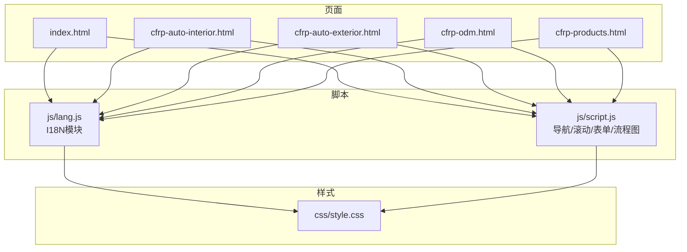
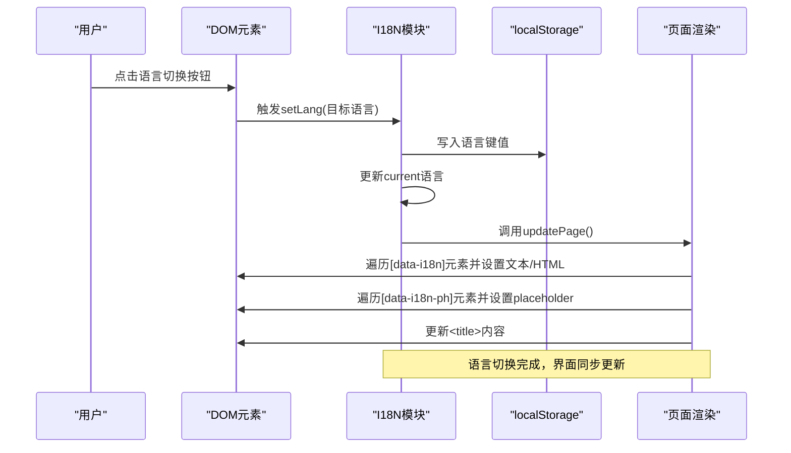
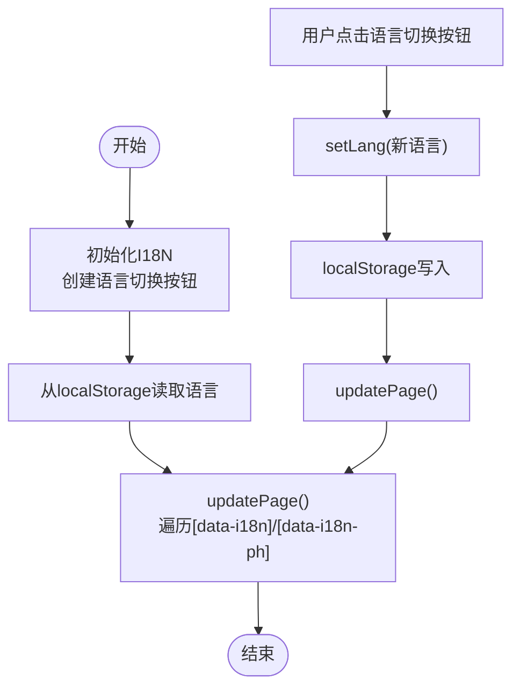
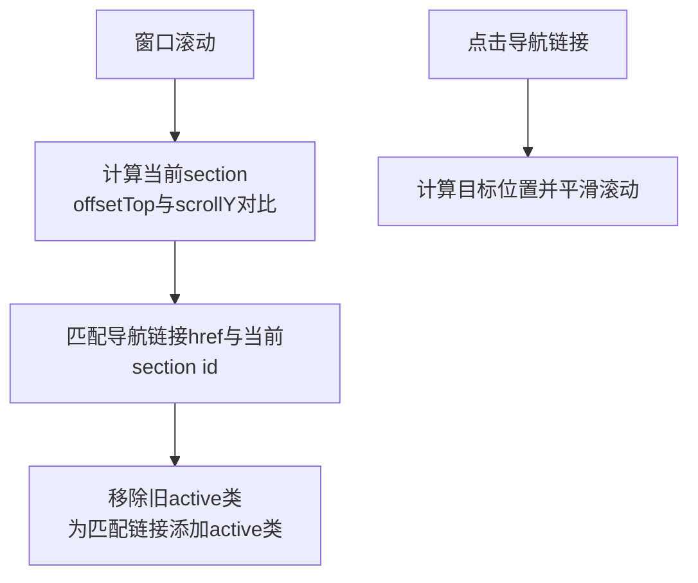
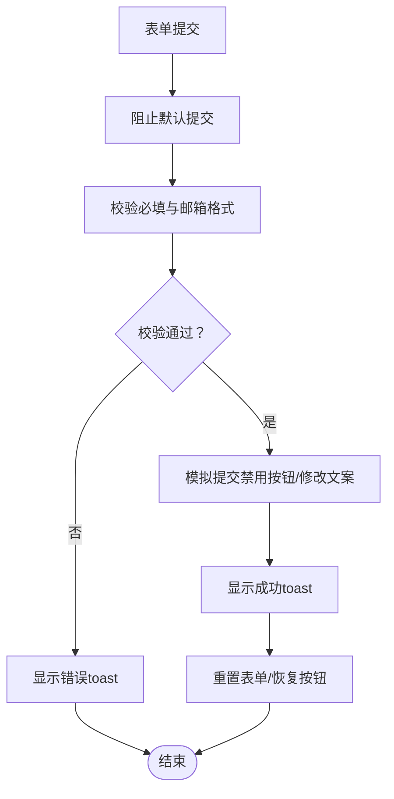
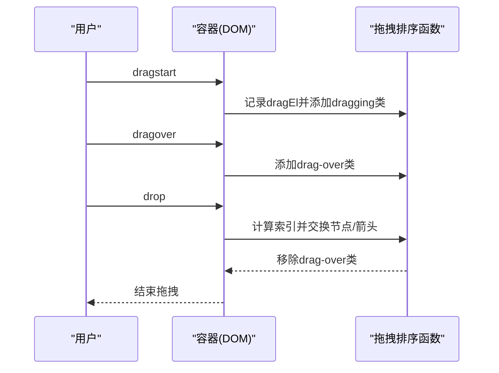
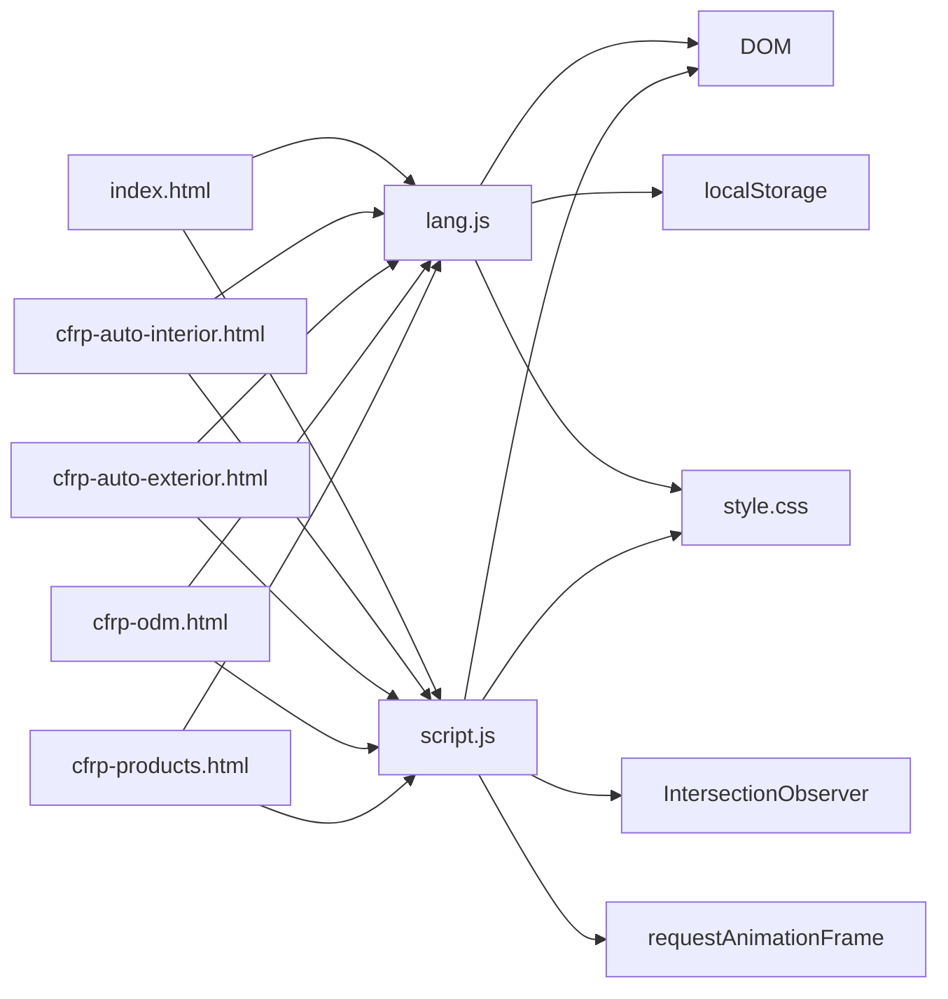

# 数据流设计

<cite>
**本文引用的文件**
- [lang.js](file://js/lang.js)
- [script.js](file://js/script.js)
- [index.html](file://index.html)
- [cfrp-auto-interior.html](file://cfrp-auto-interior.html)
- [cfrp-auto-exterior.html](file://cfrp-auto-exterior.html)
- [cfrp-odm.html](file://cfrp-odm.html)
- [cfrp-products.html](file://cfrp-products.html)
- [style.css](file://css/style.css)
</cite>

## 目录
1. [简介](#简介)
2. [项目结构](#项目结构)
3. [核心组件](#核心组件)
4. [架构总览](#架构总览)
5. [详细组件分析](#详细组件分析)
6. [依赖关系分析](#依赖关系分析)
7. [性能考量](#性能考量)
8. [故障排查指南](#故障排查指南)
9. [结论](#结论)

## 简介
本文件为HYT网站项目的“数据流设计”文档，聚焦页面数据的流向与处理机制，涵盖以下方面：
- 语言切换数据流：从用户操作到语言状态变更再到界面文本与占位符更新的完整链路
- 导航状态数据流：滚动触发的导航高亮与平滑跳转
- 表单数据流：从用户输入到校验再到提交反馈的处理流程
- 本地存储与持久化：语言偏好在localStorage中的读写与初始化
- 事件驱动与状态管理：通过DOM事件驱动的状态更新与模块间解耦
- 数据绑定与渲染：基于data-i18n属性的声明式数据绑定与动态渲染

## 项目结构
项目采用静态HTML+JavaScript+CSS的前端架构，页面通过data-i18n属性声明式绑定多语言文本，JavaScript负责：
- 初始化语言模块与界面元素
- 维护导航状态（滚动高度、激活链接）
- 处理表单提交与验证
- 实现交互式流程图的拖拽排序

图表来源
- [index.html](file://index.html)
- [cfrp-auto-interior.html](file://cfrp-auto-interior.html)
- [cfrp-auto-exterior.html](file://cfrp-auto-exterior.html)
- [cfrp-odm.html](file://cfrp-odm.html)
- [cfrp-products.html](file://cfrp-products.html)
- [lang.js](file://js/lang.js)
- [script.js](file://js/script.js)
- [style.css](file://css/style.css)

章节来源
- [index.html](file://index.html)
- [cfrp-auto-interior.html](file://cfrp-auto-interior.html)
- [cfrp-auto-exterior.html](file://cfrp-auto-exterior.html)
- [cfrp-odm.html](file://cfrp-odm.html)
- [cfrp-products.html](file://cfrp-products.html)
- [lang.js](file://js/lang.js)
- [script.js](file://js/script.js)
- [style.css](file://css/style.css)

## 核心组件
- 语言模块（I18N）
  - 负责当前语言状态、多语言数据集、翻译函数、语言切换与页面更新
  - 通过data-i18n与data-i18n-ph属性实现声明式文本绑定
  - 使用localStorage持久化语言偏好
- 导航与滚动模块
  - 处理滚动高度以切换头部样式
  - 计算当前可视section并更新导航链接高亮
  - 提供平滑跳转与移动端菜单交互
- 表单模块
  - 校验必填项与邮箱格式
  - 提交时显示toast反馈并重置表单
- 交互式流程图模块
  - 支持拖拽排序，维护节点与箭头的相对位置

章节来源
- [lang.js](file://js/lang.js)
- [script.js](file://js/script.js)

## 架构总览
下图展示了数据在各模块之间的流动与处理路径，强调事件驱动与模块解耦。

图表来源
- [lang.js](file://js/lang.js)
- [index.html](file://index.html)

## 详细组件分析

### 语言切换数据流（I18N）
- 数据源：多语言数据集（包含简体中文与日语）
- 状态：当前语言（current），默认从localStorage读取
- 关键流程：
  - 初始化：创建语言切换按钮，注入样式；遍历所有header的导航列表插入按钮
  - 切换：点击按钮切换语言，调用setLang并持久化
  - 渲染：updatePage遍历带data-i18n与data-i18n-ph的元素，分别设置textContent或innerHTML；同时更新<title>标签
- 数据绑定：
  - 文本绑定：元素通过data-i18n属性指向键值，I18N.t(key)解析
  - 占位符绑定：元素通过data-i18n-ph属性指向占位符键值
- 本地存储：
  - 读取：初始化时从localStorage读取语言键值
  - 写入：setLang时写入localStorage

图表来源
- [lang.js](file://js/lang.js)
- [index.html](file://index.html)

章节来源
- [lang.js](file://js/lang.js)
- [index.html](file://index.html)

### 导航状态数据流（滚动与高亮）
- 数据源：页面sections与导航链接
- 状态：当前激活的导航链接（active类）
- 处理逻辑：
  - 滚动监听：根据滚动高度切换header样式
  - 高亮计算：遍历section，比较offsetTop与scrollY，确定当前section并匹配对应导航链接
  - 平滑跳转：点击锚点链接时计算目标位置并平滑滚动

图表来源
- [script.js](file://js/script.js)
- [index.html](file://index.html)

章节来源
- [script.js](file://js/script.js)
- [index.html](file://index.html)

### 表单数据流（联系表单）
- 数据源：表单字段（姓名、邮箱、主题、留言）
- 校验规则：
  - 必填字段：任一为空则提示错误
  - 邮箱格式：正则校验
- 处理流程：
  - 阻止默认提交
  - 校验通过后模拟提交（禁用按钮、修改文案）
  - 成功回调：显示成功toast、重置表单、恢复按钮状态

图表来源
- [script.js](file://js/script.js)
- [index.html](file://index.html)

章节来源
- [script.js](file://js/script.js)
- [index.html](file://index.html)

### 交互式流程图数据流（拖拽排序）
- 数据源：流程图节点与箭头（flow1/flow2/flow3）
- 状态：拖拽状态（dragging）、悬停状态（drag-over）、激活状态（active）
- 处理逻辑：
  - dragstart/dragend：标记拖拽元素与移除状态类
  - dragover/dragleave：切换悬停样式
  - drop：根据索引交换节点与箭头位置，保持布局一致性

图表来源
- [script.js](file://js/script.js)
- [cfrp-odm.html](file://cfrp-odm.html)

章节来源
- [script.js](file://js/script.js)
- [cfrp-odm.html](file://cfrp-odm.html)

### 本地存储与持久化机制
- 语言偏好持久化：I18N在setLang时写入localStorage；初始化时读取
- 作用范围：跨页面、跨会话保持用户语言选择
- 初始化时机：DOMContentLoaded事件触发时执行I18N.init()

章节来源
- [lang.js](file://js/lang.js)
- [index.html](file://index.html)

### 事件驱动与状态管理
- 事件驱动：
  - DOM事件：点击、滚动、拖拽、提交、焦点等
  - 事件回调：在script.js中集中处理，避免全局状态污染
- 状态管理：
  - 局部状态：语言、导航高亮、表单状态、拖拽状态
  - 解耦策略：每个模块独立维护自身状态，通过DOM作为共享接口
- 数据绑定：
  - 声明式绑定：通过data-i18n与data-i18n-ph减少样板代码
  - 动态更新：updatePage统一刷新界面文本与占位符

章节来源
- [lang.js](file://js/lang.js)
- [script.js](file://js/script.js)

## 依赖关系分析
- 页面与脚本：
  - index.html与其他页面均引入script.js与lang.js
  - lang.js依赖DOM与localStorage，负责国际化
  - script.js依赖DOM与IntersectionObserver/requestAnimationFrame，负责交互与动画
- 样式依赖：
  - style.css定义主题变量与组件样式，被所有页面共享
- 事件依赖：
  - I18N依赖DOMContentLoaded事件
  - 导航高亮依赖scroll事件
  - 表单依赖submit与input事件
  - 拖拽排序依赖HTML5 Drag-and-Drop API

图表来源
- [lang.js](file://js/lang.js)
- [script.js](file://js/script.js)
- [index.html](file://index.html)
- [cfrp-auto-interior.html](file://cfrp-auto-interior.html)
- [cfrp-auto-exterior.html](file://cfrp-auto-exterior.html)
- [cfrp-odm.html](file://cfrp-odm.html)
- [cfrp-products.html](file://cfrp-products.html)
- [style.css](file://css/style.css)

章节来源
- [lang.js](file://js/lang.js)
- [script.js](file://js/script.js)
- [index.html](file://index.html)
- [cfrp-auto-interior.html](file://cfrp-auto-interior.html)
- [cfrp-auto-exterior.html](file://cfrp-auto-exterior.html)
- [cfrp-odm.html](file://cfrp-odm.html)
- [cfrp-products.html](file://cfrp-products.html)
- [style.css](file://css/style.css)

## 性能考量
- 滚动与高亮：使用节流/去抖可进一步优化（当前直接监听scroll事件）
- 动画与观察：IntersectionObserver与requestAnimationFrame已用于数字递增与滚动渐显，避免强制同步布局
- 拖拽排序：仅在交互时进行DOM重排，保持流畅体验
- 样式与资源：CSS变量统一主题，减少重复样式定义

## 故障排查指南
- 语言切换无效
  - 检查localStorage是否可用
  - 确认data-i18n键值是否存在
  - 查看updatePage是否被调用
- 导航高亮不更新
  - 检查scroll事件是否绑定
  - 确认section与导航链接的id/href匹配
- 表单提交无反馈
  - 检查表单字段是否必填
  - 确认邮箱格式正则
  - 查看toast是否被覆盖或移除过快
- 拖拽排序异常
  - 确认节点与箭头的相对位置逻辑
  - 检查dragover/leave事件是否正确移除样式

章节来源
- [lang.js](file://js/lang.js)
- [script.js](file://js/script.js)

## 结论
本项目通过声明式数据绑定与事件驱动的方式，实现了清晰、低耦合的数据流设计：
- 语言模块以I18N为核心，通过localStorage持久化语言偏好，配合updatePage实现界面统一刷新
- 导航模块以滚动事件为驱动，计算当前section并更新导航高亮
- 表单模块以校验与模拟提交为核心，结合toast提供即时反馈
- 交互式流程图通过拖拽排序保持布局一致性
该设计在保持简单性的同时，具备良好的扩展性与可维护性。