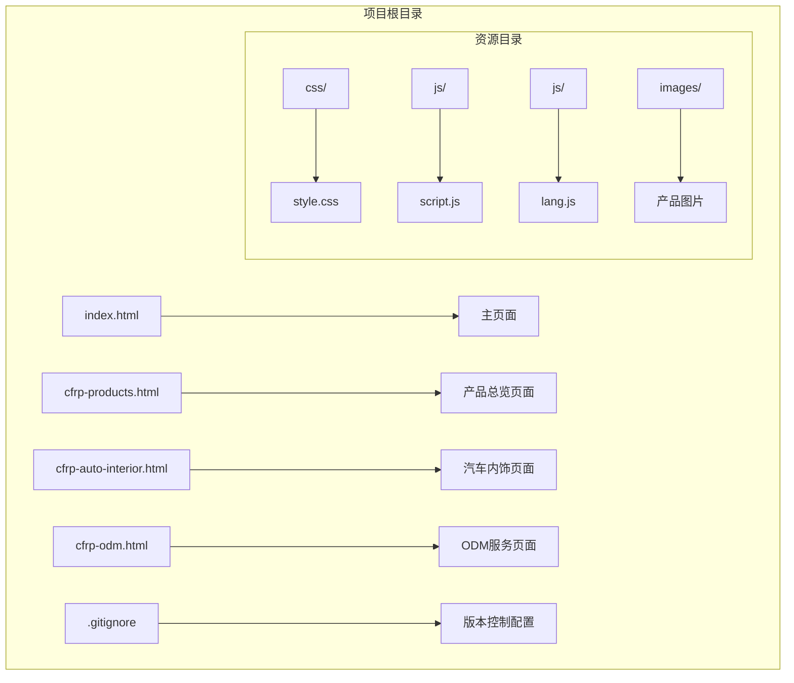
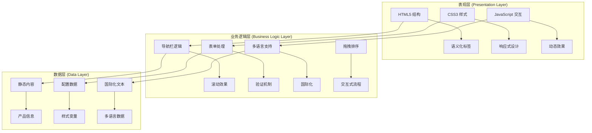
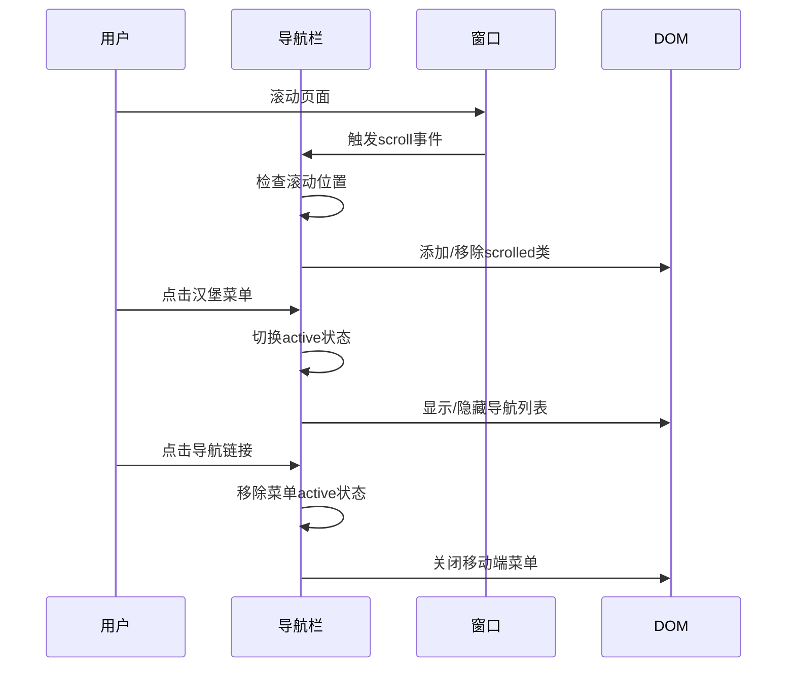
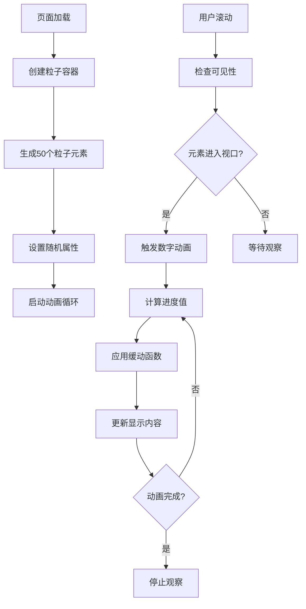
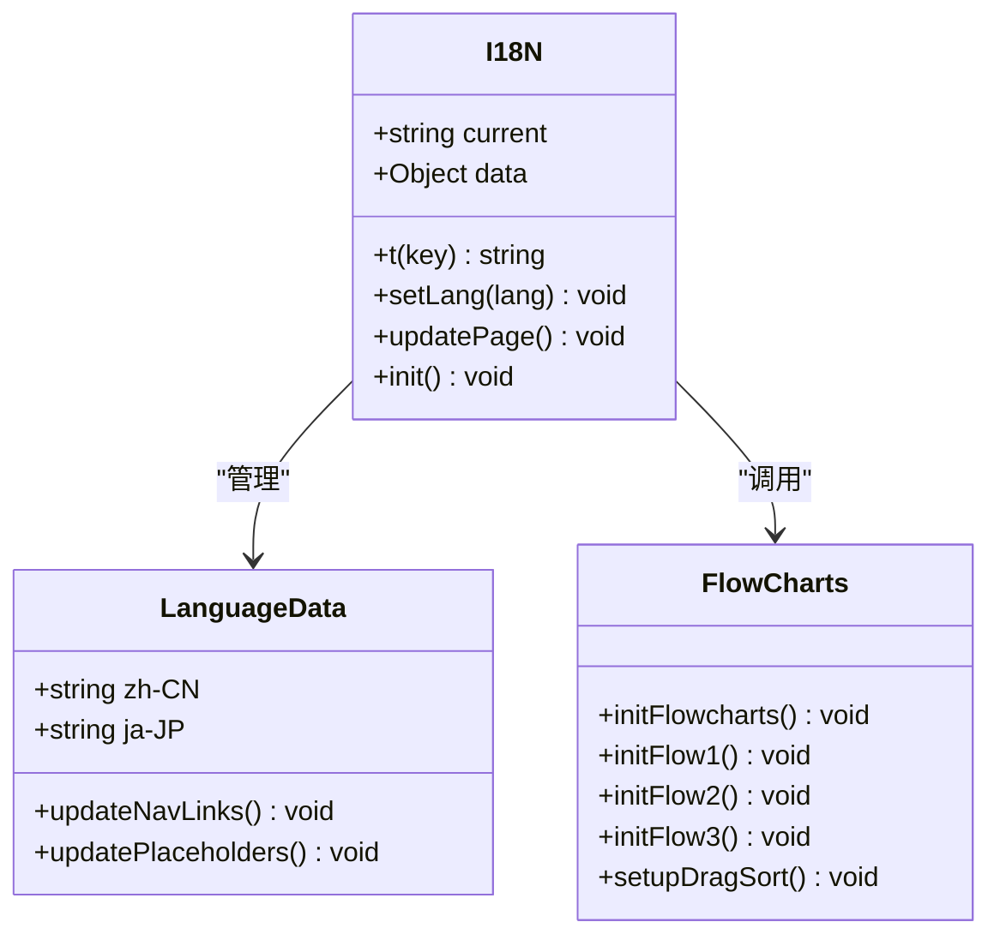
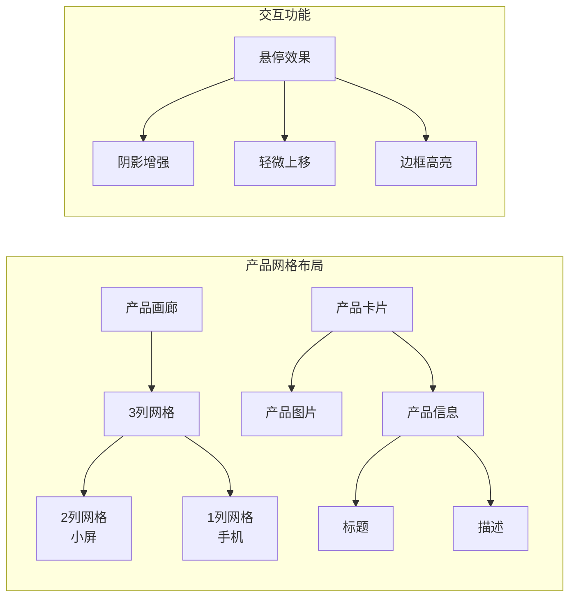
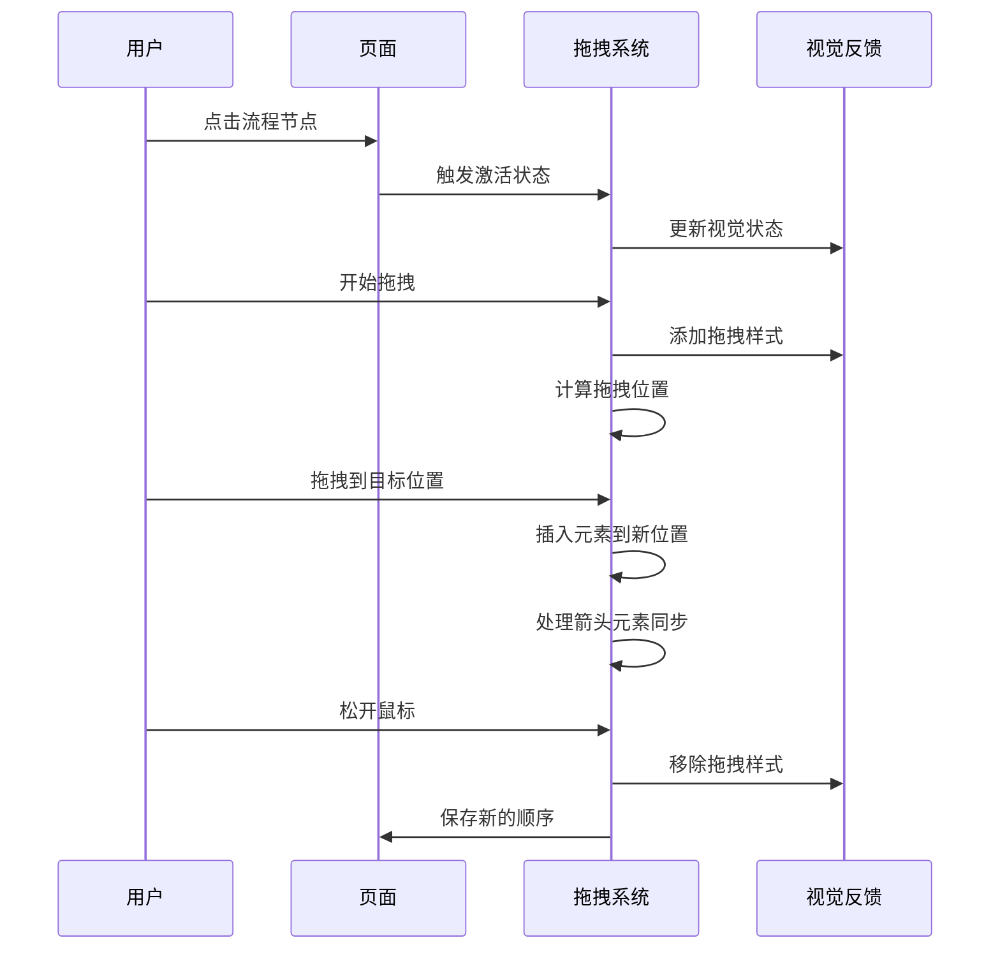
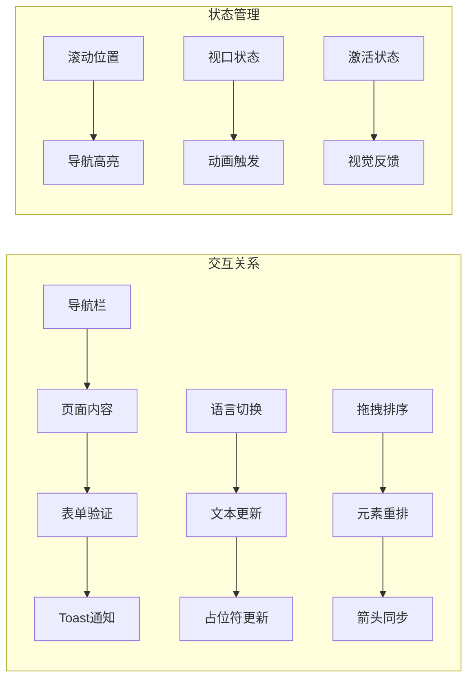
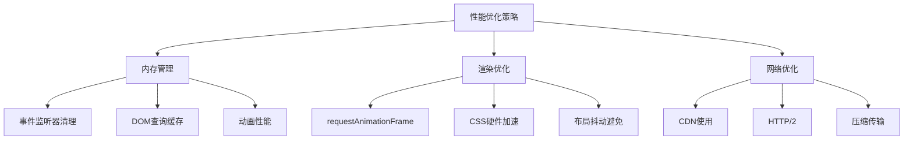

# 架构设计

<cite>
**本文档引用的文件**
- [index.html](file://index.html)
- [cfrp-products.html](file://cfrp-products.html)
- [cfrp-auto-interior.html](file://cfrp-auto-interior.html)
- [cfrp-odm.html](file://cfrp-odm.html)
- [css/style.css](file://css/style.css)
- [js/script.js](file://js/script.js)
- [js/lang.js](file://js/lang.js)
- [.gitignore](file://.gitignore)
</cite>

## 目录
1. [项目概述](#项目概述)
2. [项目结构](#项目结构)
3. [核心组件](#核心组件)
4. [架构概览](#架构概览)
5. [详细组件分析](#详细组件分析)
6. [依赖关系分析](#依赖关系分析)
7. [性能考虑](#性能考虑)
8. [故障排除指南](#故障排除指南)
9. [结论](#结论)

## 项目概述

HYT网站项目是一个基于复合材料产品轻量化解决方案的专业企业网站。该项目采用传统的HTML5、CSS3、JavaScript三剑客技术栈，构建了一个功能完整的企业官网，涵盖产品展示、服务介绍、案例展示和多语言支持等功能模块。

项目的核心目标是通过现代Web技术展现和野贸易（广州）有限公司在碳纤维复合材料领域的专业能力，为潜在客户和合作伙伴提供直观、专业的在线展示平台。

## 项目结构

项目采用扁平化的文件组织结构，所有静态资源按功能模块进行分类管理：



**图表来源**
- [index.html:1-337](file://index.html#L1-L337)
- [css/style.css:1-800](file://css/style.css#L1-L800)
- [js/script.js:1-344](file://js/script.js#L1-L344)
- [js/lang.js:1-472](file://js/lang.js#L1-L472)

**章节来源**
- [index.html:1-337](file://index.html#L1-L337)
- [.gitignore:1-3](file://.gitignore#L1-L3)

## 核心组件

### HTML5 结构设计

项目采用语义化的HTML5结构，每个页面都遵循统一的模板模式：

- **头部导航**：固定定位的响应式导航栏，支持移动端菜单切换
- **内容区块**：采用section元素划分不同功能区域
- **页脚**：包含品牌信息、快速链接和社交媒体图标
- **国际化支持**：通过data-i18n属性实现多语言文本动态更新

### CSS3 样式架构

采用现代化的CSS3技术实现：
- **CSS变量系统**：定义完整的色彩和间距变量
- **响应式网格布局**：使用CSS Grid和Flexbox实现自适应布局
- **动画效果**：包含粒子动画、过渡动画和交互动画
- **现代视觉效果**：模糊滤镜、阴影和渐变背景

### JavaScript 交互系统

实现了完整的前端交互逻辑：
- **导航栏滚动效果**：根据滚动位置动态调整样式
- **移动端菜单**：汉堡菜单的展开收起逻辑
- **视口观察器**：实现元素进入视口时的动画效果
- **表单验证**：客户端表单验证和用户反馈
- **拖拽排序**：复杂的交互式流程图功能

**章节来源**
- [css/style.css:1-800](file://css/style.css#L1-L800)
- [js/script.js:1-344](file://js/script.js#L1-L344)
- [js/lang.js:1-472](file://js/lang.js#L1-L472)

## 架构概览

项目采用经典的三层架构模式，通过HTML5、CSS3、JavaScript的协同工作实现完整的Web应用：



**图表来源**
- [index.html:10-337](file://index.html#L10-L337)
- [css/style.css:10-30](file://css/style.css#L10-L30)
- [js/script.js:1-344](file://js/script.js#L1-L344)
- [js/lang.js:5-350](file://js/lang.js#L5-L350)

### 技术栈选择理由

**HTML5 选择理由：**
- 提供语义化标签，改善SEO和可访问性
- 支持本地存储，便于状态管理
- 原生API丰富，减少第三方依赖

**CSS3 选择理由：**
- CSS变量简化主题管理
- Grid和Flexbox提供强大的布局能力
- 原生动画支持，无需额外库
- 响应式设计原生支持

**JavaScript 选择理由：**
- 原生DOM操作，性能优异
- 现代ES6+语法，代码可维护性强
- 丰富的Web API，功能完整
- 生态系统成熟，问题解决便利

## 详细组件分析

### 导航栏系统

导航栏是整个网站的核心交互组件，实现了多种复杂功能：



**图表来源**
- [js/script.js:2-29](file://js/script.js#L2-L29)

导航栏的主要特性：
- **滚动检测**：根据滚动位置动态调整透明度和阴影
- **移动端适配**：汉堡菜单响应触摸交互
- **链接高亮**：根据当前可视区域自动高亮对应导航项
- **平滑滚动**：支持锚点链接的平滑跳转

**章节来源**
- [js/script.js:1-53](file://js/script.js#L1-L53)
- [css/style.css:67-191](file://css/style.css#L67-L191)

### 主页横幅系统

主页横幅采用了复杂的视觉效果和动画：



**图表来源**
- [js/script.js:54-115](file://js/script.js#L54-L115)

横幅系统的创新特性：
- **动态粒子背景**：50个随机生成的粒子元素，具有不同的大小、速度和延迟
- **数字递增动画**：使用requestAnimationFrame实现流畅的数字变化效果
- **交互动画**：元素进入视口时触发的渐显动画
- **响应式设计**：支持不同屏幕尺寸的自适应布局

**章节来源**
- [js/script.js:54-139](file://js/script.js#L54-L139)
- [css/style.css:193-359](file://css/style.css#L193-L359)

### 多语言国际化系统

I18N系统提供了完整的多语言支持：



**图表来源**
- [js/lang.js:5-472](file://js/lang.js#L5-L472)

国际化系统的关键特性：
- **双语言支持**：简体中文和日语的完整翻译
- **动态切换**：运行时切换语言而无需刷新页面
- **本地存储**：记住用户的语言偏好
- **全面覆盖**：从导航到产品详情的完整文本替换

**章节来源**
- [js/lang.js:1-472](file://js/lang.js#L1-L472)

### 产品展示页面

产品展示页面采用了网格布局和响应式设计：



**图表来源**
- [cfrp-auto-interior.html:95-146](file://cfrp-auto-interior.html#L95-L146)

产品展示页面的特色：
- **响应式网格**：根据屏幕尺寸自动调整列数
- **悬停动画**：提供流畅的交互反馈
- **产品信息**：每种产品都有详细的文字描述
- **图片优化**：使用aspect-ratio保持图片比例

**章节来源**
- [cfrp-auto-interior.html:1-196](file://cfrp-auto-interior.html#L1-L196)

### ODM服务交互系统

ODM页面实现了复杂的拖拽排序功能：



**图表来源**
- [js/script.js:213-344](file://js/script.js#L213-L344)

ODM交互系统的核心功能：
- **三种流程类型**：产品开发流程、开发周期、工艺流程
- **拖拽排序**：支持节点的重新排列
- **箭头同步**：拖拽节点时同步移动连接箭头
- **状态管理**：维护激活状态和拖拽状态

**章节来源**
- [js/script.js:213-344](file://js/script.js#L213-L344)
- [cfrp-odm.html:40-176](file://cfrp-odm.html#L40-L176)

## 依赖关系分析

项目采用松耦合的设计模式，各组件之间的依赖关系清晰明确：

```mermaid
graph TB
subgraph "核心依赖关系"
A[index.html] --> B[css/style.css]
A --> C[js/script.js]
A --> D[js/lang.js]
E[cfrp-products.html] --> B
E --> C
E --> D
F[cfrp-auto-interior.html] --> B
F --> C
F --> D
G[cfrp-odm.html] --> B
G --> C
G --> D
end
subgraph "内部依赖"
C --> D : "语言切换依赖"
C --> E : "流程图功能"
B --> F : "样式共享"
end
subgraph "外部依赖"
H[浏览器API] --> C
I[CSS变量] --> B
J[DOM元素] --> C
end
```

**图表来源**
- [index.html:7-8](file://index.html#L7-L8)
- [cfrp-products.html:7-8](file://cfrp-products.html#L7-L8)
- [cfrp-auto-interior.html:7-8](file://cfrp-auto-interior.html#L7-L8)
- [cfrp-odm.html:7](file://cfrp-odm.html#L7)

### 模块化设计思路

项目采用了高度模块化的架构设计：

1. **页面模块化**：每个功能页面独立存在，共享相同的头部和底部结构
2. **功能模块化**：JavaScript代码按功能拆分为独立的模块
3. **样式模块化**：CSS采用BEM命名约定，支持组件复用
4. **数据模块化**：国际化数据集中管理，便于维护

### 组件间交互关系



**图表来源**
- [js/script.js:141-195](file://js/script.js#L141-L195)
- [js/lang.js:364-399](file://js/lang.js#L364-L399)

**章节来源**
- [js/script.js:1-344](file://js/script.js#L1-L344)
- [js/lang.js:1-472](file://js/lang.js#L1-L472)

## 性能考虑

### 加载性能优化

项目在性能方面采用了多项优化策略：

1. **资源压缩**：所有CSS和JavaScript文件均为压缩版本
2. **懒加载策略**：非关键资源按需加载
3. **缓存策略**：使用版本参数避免缓存问题
4. **图片优化**：响应式图片和适当的格式选择

### 运行时性能优化



### 可扩展性设计

项目具备良好的可扩展性：

1. **模块化架构**：易于添加新功能模块
2. **配置驱动**：通过CSS变量和数据对象进行配置
3. **接口抽象**：JavaScript功能通过清晰的接口暴露
4. **主题系统**：支持颜色和样式的灵活调整

## 故障排除指南

### 常见问题诊断

**导航栏不响应问题：**
- 检查JavaScript文件是否正确加载
- 验证DOM元素是否存在
- 确认事件监听器绑定成功

**动画效果异常：**
- 检查CSS变量定义
- 验证requestAnimationFrame兼容性
- 确认IntersectionObserver支持

**多语言切换失效：**
- 检查localStorage访问权限
- 验证翻译数据完整性
- 确认DOM更新逻辑执行

### 调试工具建议

1. **浏览器开发者工具**：监控网络请求和JavaScript错误
2. **性能面板**：分析动画帧率和内存使用
3. **网络面板**：检查资源加载状态
4. **控制台**：查看JavaScript执行日志

**章节来源**
- [js/script.js:141-195](file://js/script.js#L141-L195)
- [js/lang.js:364-399](file://js/lang.js#L364-L399)

## 结论

HYT网站项目展现了传统Web技术的强大能力和优雅设计。通过HTML5、CSS3、JavaScript的有机结合，项目实现了：

**技术优势：**
- 纯原生技术栈，无第三方依赖
- 现代化设计理念，注重用户体验
- 完整的功能覆盖，满足企业展示需求
- 良好的可维护性和可扩展性

**架构特点：**
- 模块化设计，职责分离清晰
- 响应式布局，跨设备兼容
- 国际化支持，面向全球化市场
- 性能优化，加载速度快

**未来发展建议：**
1. 考虑引入构建工具链，提升开发效率
2. 添加自动化测试，确保代码质量
3. 实施渐进式Web应用(PWA)特性
4. 建立持续集成和部署流程

该项目为类似的企业网站提供了一个优秀的参考模板，展示了如何通过精心设计的架构和实现，创造出既美观又实用的Web应用。