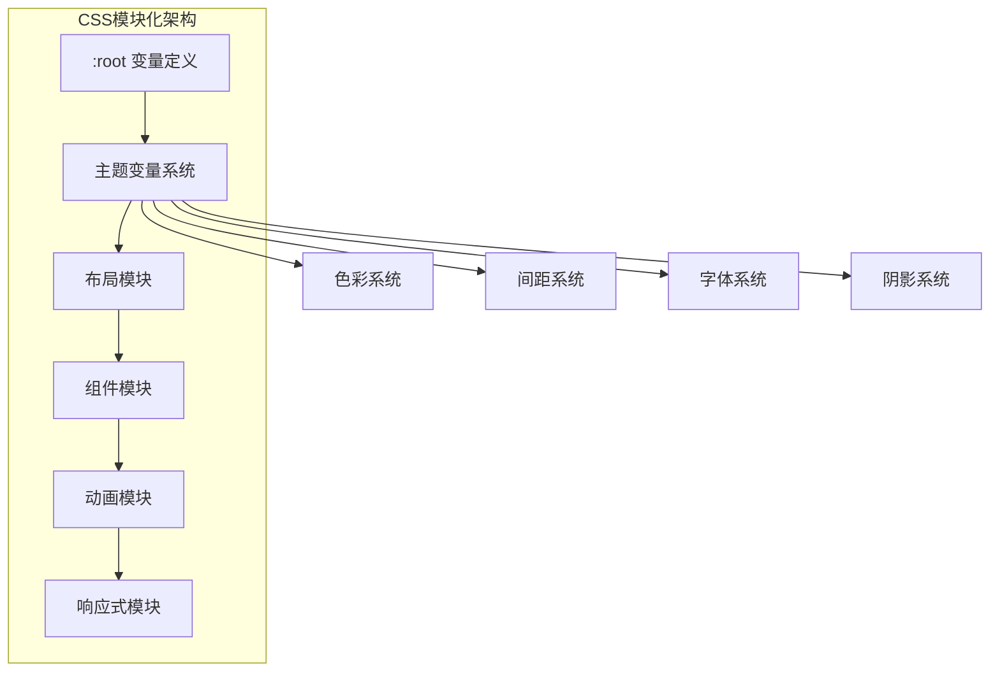
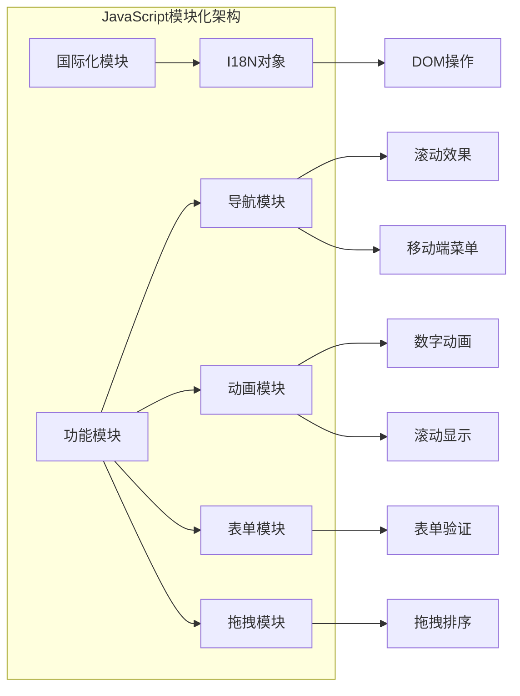
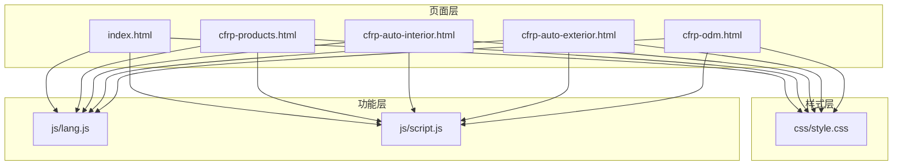
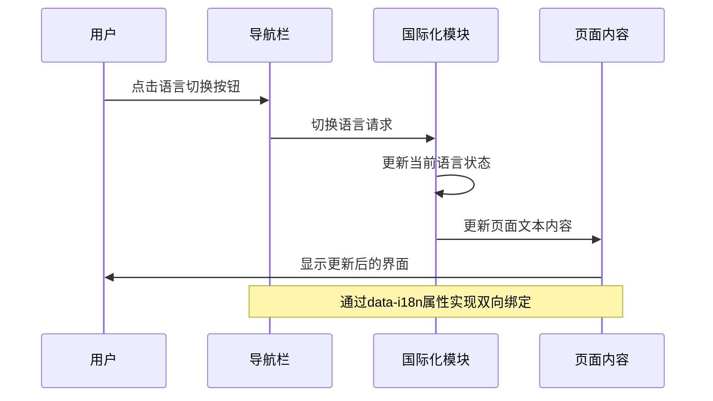
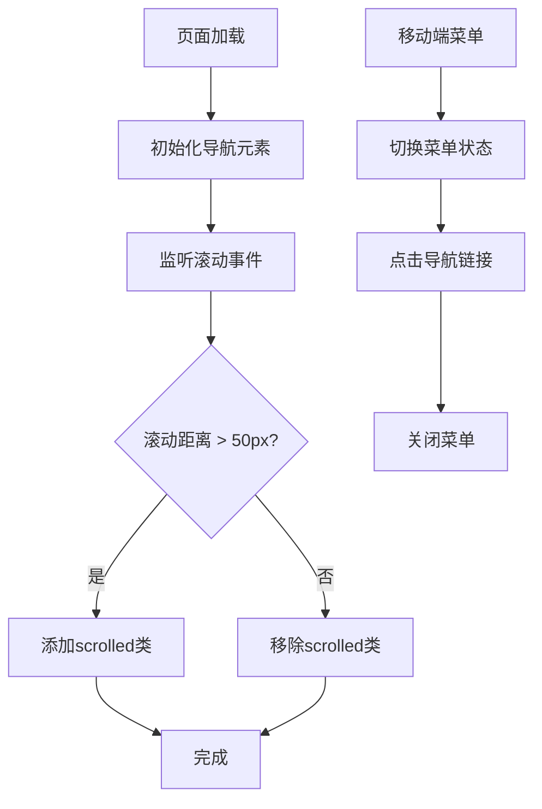
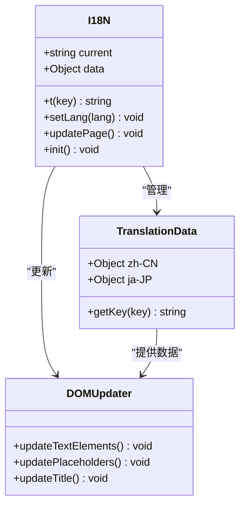
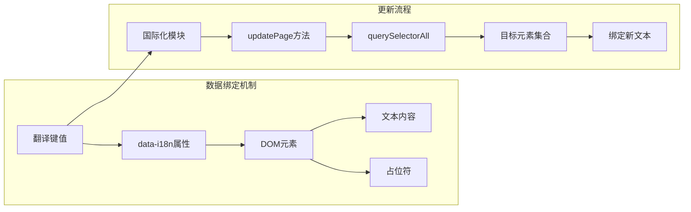

# 模块化架构

<cite>
**本文档引用的文件**
- [css/style.css](file://css/style.css)
- [js/script.js](file://js/script.js)
- [js/lang.js](file://js/lang.js)
- [index.html](file://index.html)
- [cfrp-auto-interior.html](file://cfrp-auto-interior.html)
- [cfrp-auto-exterior.html](file://cfrp-auto-exterior.html)
- [cfrp-odm.html](file://cfrp-odm.html)
- [cfrp-products.html](file://cfrp-products.html)
</cite>

## 目录
1. [项目概述](#项目概述)
2. [CSS样式模块化架构](#css样式模块化架构)
3. [JavaScript功能模块化架构](#javascript功能模块化架构)
4. [模块间依赖关系](#模块间依赖关系)
5. [样式系统模块详解](#样式系统模块详解)
6. [JavaScript模块详解](#javascript模块详解)
7. [模块通信机制](#模块通信机制)
8. [代码复用与维护性提升](#代码复用与维护性提升)
9. [性能优化策略](#性能优化策略)
10. [故障排除指南](#故障排除指南)
11. [总结](#总结)

## 项目概述

HYT网站项目是一个基于复合材料技术的B2B企业官网，采用模块化设计理念构建。项目包含一个统一的CSS样式系统和多个功能模块化的JavaScript组件，实现了高度的代码复用性和维护性。

项目采用响应式设计，支持中日双语切换，包含主页、产品展示、服务介绍、ODM开发流程等多个页面模块。

## CSS样式模块化架构

### 核心设计原则

项目采用CSS变量系统作为样式模块化的基础，通过`:root`定义全局变量，确保样式的统一管理和灵活配置。

**图表来源**
- [css/style.css:10-30](file://css/style.css#L10-L30)

### 样式变量系统

CSS变量系统是整个样式模块化的核心，定义了完整的色彩、间距、字体、阴影等设计令牌：

**色彩变量系统**
- 主色调：`--primary` (#7c9a92) 及其变体
- 辅助色调：`--secondary` (#c4a35a)、`--accent` (#d4a853)
- 文本色彩：`--text` (#3a3a3a)、`--text-secondary` (#6b6b6b)
- 背景色：`--bg` (#faf8f5)、`--bg-alt` (#f2ede7)
- 边框色：`--border` (#e5ddd4)

**布局变量系统**
- 圆角半径：`--radius` (12px)、`--radius-sm` (8px)
- 最大宽度：`--max-width` (1200px)
- 过渡动画：`--transition` (0.3s cubic-bezier)

**章节来源**
- [css/style.css:10-30](file://css/style.css#L10-L30)

## JavaScript功能模块化架构

### 模块化设计模式

项目采用模块化JavaScript架构，将不同功能划分为独立的模块，每个模块负责特定的功能领域：

**图表来源**
- [js/script.js:1-344](file://js/script.js#L1-L344)
- [js/lang.js:5-472](file://js/lang.js#L5-L472)

### 模块职责分离

每个JavaScript模块都有明确的职责边界：

**国际化模块 (I18N)**
- 负责多语言文本管理
- 支持中日双语切换
- 统一的翻译键值管理系统

**导航模块**
- 处理页面滚动效果
- 实现移动端菜单切换
- 导航链接高亮状态管理

**动画模块**
- 数字递增动画
- 滚动触发的元素显示动画
- 平滑滚动实现

**表单模块**
- 联系表单验证
- 提交处理
- 用户反馈提示

**拖拽模块**
- 交互式流程图功能
- 节点拖拽排序
- 动态布局调整

**章节来源**
- [js/script.js:1-344](file://js/script.js#L1-L344)
- [js/lang.js:5-472](file://js/lang.js#L5-L472)

## 模块间依赖关系

### 依赖层次结构

**图表来源**
- [index.html:1-337](file://index.html#L1-L337)
- [css/style.css:1-800](file://css/style.css#L1-L800)
- [js/lang.js:1-472](file://js/lang.js#L1-L472)
- [js/script.js:1-344](file://js/script.js#L1-L344)

### 数据流传递

模块间通过DOM属性和事件进行通信，形成松耦合的架构：

**图表来源**
- [js/lang.js:401-472](file://js/lang.js#L401-L472)
- [index.html:40-50](file://index.html#L40-L50)

## 样式系统模块详解

### 响应式模块设计

项目采用移动优先的设计理念，通过CSS媒体查询实现响应式布局：

**网格系统模块**
- 主容器：`.container` 使用CSS变量控制最大宽度
- 卡片网格：`.services-grid`、`.cases-grid`、`.partners-grid`
- 响应式断点：900px、768px、580px

**动画模块系统**
- 按钮悬停动画：`transform`、`box-shadow`过渡效果
- 导航栏滚动动画：`backdrop-filter`模糊效果
- 元素显示动画：`fadeInUp`、`bounce`关键帧动画

**组件模块分类**
- 导航组件：`.header`、`.nav-list`、`.nav-link`
- 按钮组件：`.btn`、`.btn-primary`、`.btn-outline`
- 卡片组件：`.service-card`、`.case-card`、`.team-card`
- 表单组件：`.contact-form`、`.form-group`、`.form-row`

**章节来源**
- [css/style.css:46-50](file://css/style.css#L46-L50)
- [css/style.css:488-550](file://css/style.css#L488-L550)
- [css/style.css:654-750](file://css/style.css#L654-L750)

## JavaScript模块详解

### 导航模块实现

导航模块负责处理页面的导航逻辑，包括滚动效果、移动端菜单和链接高亮：

**图表来源**
- [js/script.js:1-10](file://js/script.js#L1-L10)
- [js/script.js:12-29](file://js/script.js#L12-L29)

### 动画模块实现

动画模块包含多种类型的动画效果，通过IntersectionObserver实现性能优化：

**数字递增动画**
- 使用`requestAnimationFrame`实现流畅动画
- 缓动函数：`easeOutExpo`提供自然的加速效果
- 观察器：`IntersectionObserver`确保元素进入视口时才执行

**滚动显示动画**
- 多种元素类型：`.service-card`、`.team-card`、`.case-card`
- 不同的触发阈值和偏移量
- 动画完成后自动取消观察

**章节来源**
- [js/script.js:82-115](file://js/script.js#L82-L115)
- [js/script.js:118-139](file://js/script.js#L118-L139)

### 国际化模块实现

国际化模块采用模块化设计，提供完整的多语言支持：

**图表来源**
- [js/lang.js:5-472](file://js/lang.js#L5-L472)

**国际化流程**
1. 初始化：从localStorage读取语言设置
2. 创建语言切换按钮：动态插入到DOM中
3. 文本更新：遍历所有带`data-i18n`属性的元素
4. 本地存储：保存用户选择的语言偏好

**章节来源**
- [js/lang.js:401-472](file://js/lang.js#L401-L472)

### 表单模块实现

表单模块提供完整的表单验证和用户体验优化：

**验证规则**
- 必填字段验证：姓名、邮箱、留言
- 邮箱格式验证：使用正则表达式
- 实时反馈：通过toast消息提示

**提交流程**
1. 阻止默认提交行为
2. 收集并清理表单数据
3. 执行验证检查
4. 模拟提交过程
5. 成功反馈和表单重置

**章节来源**
- [js/script.js:142-175](file://js/script.js#L142-L175)

## 模块通信机制

### DOM属性驱动的数据绑定

项目采用`data-i18n`和`data-i18n-ph`属性实现声明式的国际化绑定：

**图表来源**
- [js/lang.js:364-399](file://js/lang.js#L364-L399)

### 事件驱动的模块协作

各模块通过标准DOM事件实现松耦合通信：

**事件类型列表**
- `DOMContentLoaded`：页面加载完成事件
- `scroll`：滚动事件
- `click`：点击事件
- `dragstart/dragend`：拖拽事件
- `submit`：表单提交事件

**事件处理流程**
1. 模块注册事件监听器
2. 事件触发时执行相应回调
3. 通过DOM操作更新UI状态
4. 必要时与其他模块交换数据

**章节来源**
- [js/script.js:4-10](file://js/script.js#L4-L10)
- [js/lang.js:469-472](file://js/lang.js#L469-L472)

## 代码复用与维护性提升

### 模块化带来的优势

**CSS变量复用**
- 全局色彩系统：统一的品牌色彩管理
- 响应式断点：集中管理的媒体查询
- 动画参数：统一的过渡效果配置

**JavaScript模块复用**
- 导航功能：可在所有页面复用
- 动画效果：可应用于任何需要的元素
- 国际化：可扩展到更多语言

**维护性改进**
- 单一职责：每个模块只负责特定功能
- 松耦合：模块间依赖关系清晰
- 易测试：模块功能相对独立

### 代码组织最佳实践

**CSS组织结构**
- 按功能分组：导航、卡片、表单等
- 变量优先：优先使用CSS变量而非硬编码值
- 响应式设计：移动优先的断点策略

**JavaScript组织结构**
- 模块导出：使用立即执行函数表达式
- 事件解绑：避免内存泄漏
- 错误处理：健壮的异常处理机制

## 性能优化策略

### 加载优化

**资源加载顺序**
1. CSS样式文件优先加载
2. JavaScript文件延迟加载
3. 图片资源懒加载

**缓存策略**
- CSS文件版本控制：`?v=3`参数
- JavaScript文件缓存：浏览器自动缓存
- 图片资源CDN加速

### 运行时优化

**动画性能**
- 使用`transform`和`opacity`属性
- 避免强制同步布局
- 使用`requestAnimationFrame`

**内存管理**
- 及时清理事件监听器
- 避免全局变量污染
- 合理使用闭包

## 故障排除指南

### 常见问题诊断

**国际化失效**
- 检查`data-i18n`属性是否正确
- 验证翻译键值是否存在
- 确认语言切换按钮是否正常

**动画不生效**
- 检查`IntersectionObserver`支持情况
- 验证CSS动画关键帧定义
- 确认元素可见性状态

**表单验证错误**
- 检查HTML5验证属性
- 验证JavaScript正则表达式
- 确认事件监听器绑定

### 调试技巧

**开发者工具使用**
- Network面板检查资源加载
- Console面板查看JavaScript错误
- Elements面板验证DOM结构

**性能监控**
- Performance面板分析动画性能
- Memory面板检测内存泄漏
- Lighthouse面板评估SEO指标

## 总结

HYT网站项目通过模块化架构实现了高度的代码复用性和维护性。CSS样式系统采用变量驱动的设计，JavaScript功能模块实现了职责分离和松耦合通信。

**核心成果**
- 统一的样式变量系统，便于主题定制
- 模块化的JavaScript架构，支持功能扩展
- 响应式设计，适配多终端设备
- 国际化支持，满足多语言需求

**未来改进建议**
- 引入构建工具优化资源加载
- 添加单元测试提升代码质量
- 实现更完善的错误处理机制
- 考虑引入现代前端框架增强功能

这个模块化架构为后续的功能扩展和维护提供了坚实的基础，能够有效支持项目的长期发展需求。