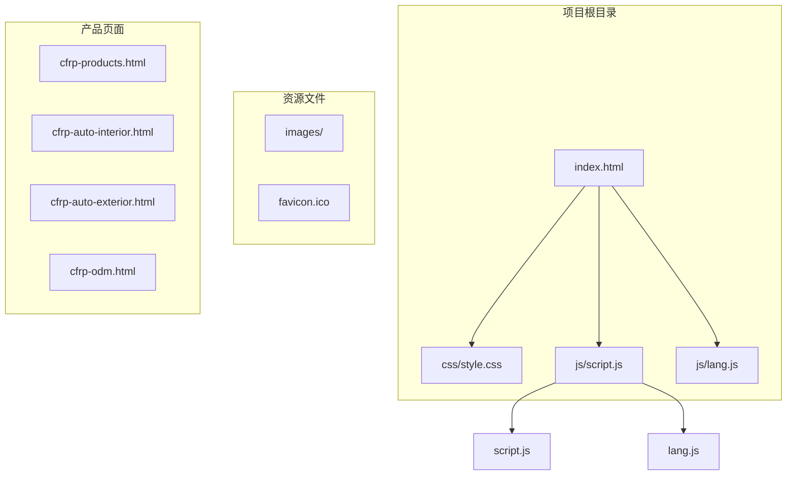
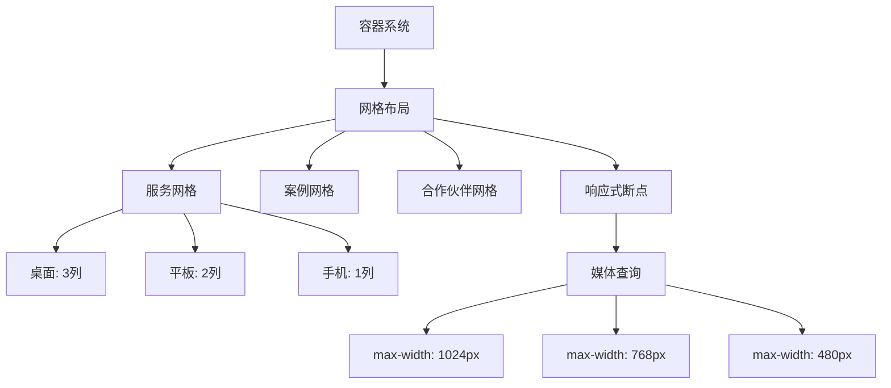
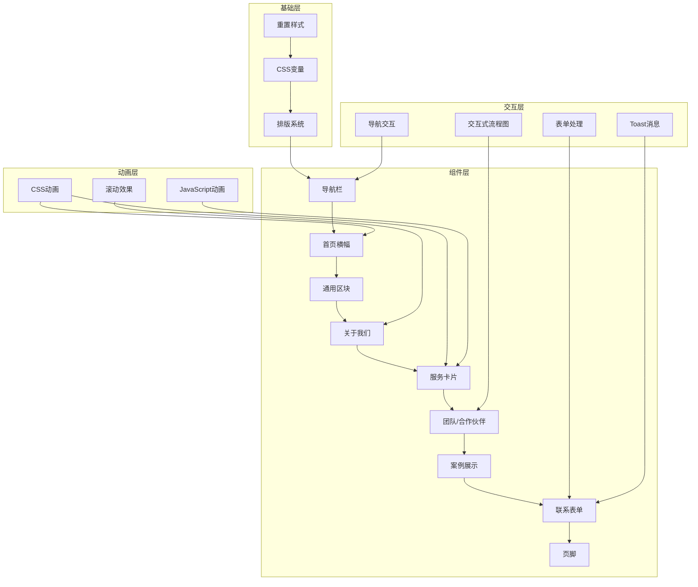
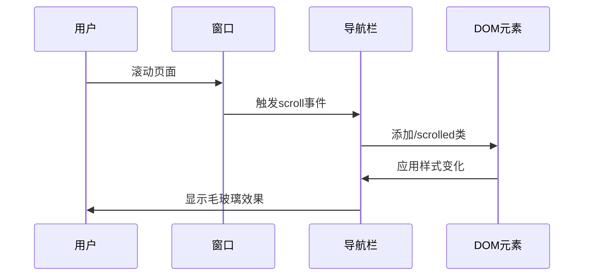
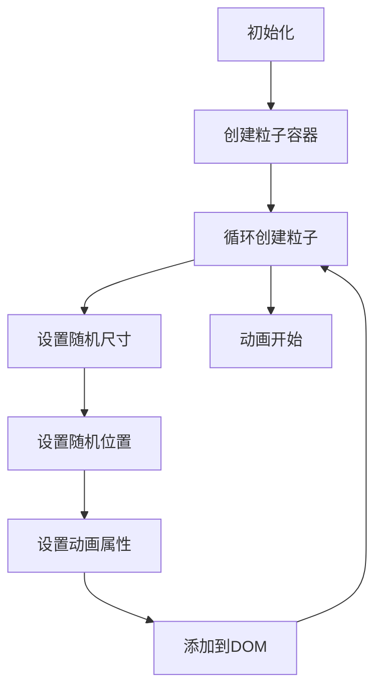
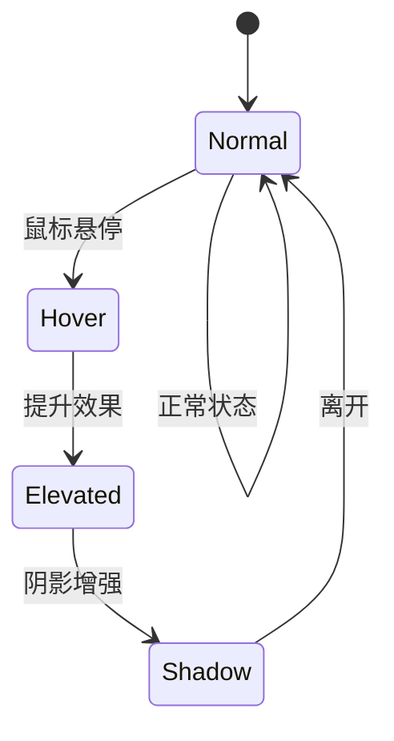
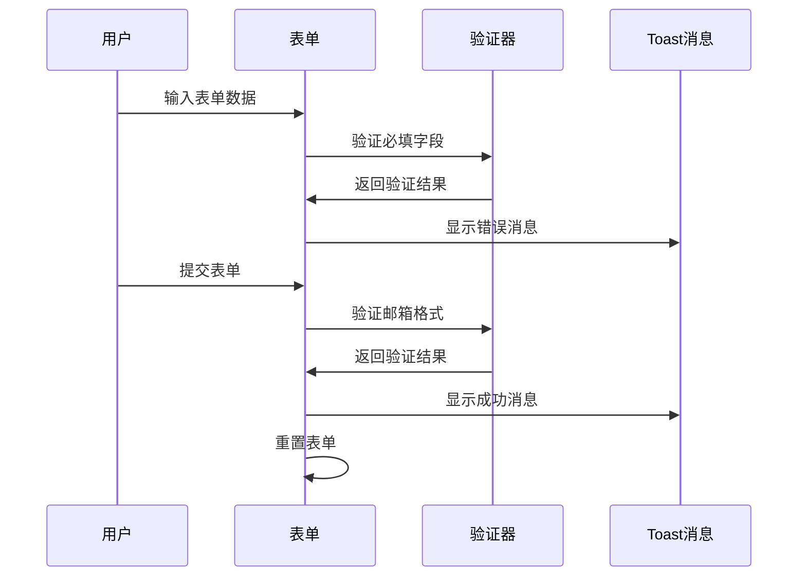
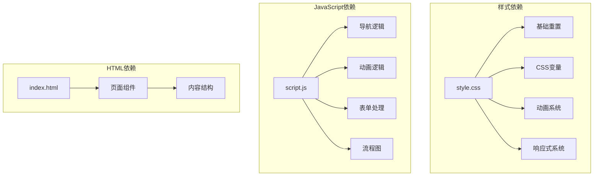

# 样式系统

<cite>
**本文档引用的文件**
- [css/style.css](file://css/style.css)
- [index.html](file://index.html)
- [js/script.js](file://js/script.js)
- [js/lang.js](file://js/lang.js)
</cite>

## 目录
1. [简介](#简介)
2. [项目结构](#项目结构)
3. [核心组件](#核心组件)
4. [架构概览](#架构概览)
5. [详细组件分析](#详细组件分析)
6. [依赖关系分析](#依赖关系分析)
7. [性能考虑](#性能考虑)
8. [故障排除指南](#故障排除指南)
9. [结论](#结论)

## 简介

HYT网站样式系统是一个基于现代CSS技术和JavaScript交互的完整前端解决方案。该系统采用了CSS变量驱动的设计方法，实现了统一的颜色、字体和间距管理系统，结合响应式设计理念和丰富的动画效果，为用户提供流畅的视觉体验。

本样式系统的核心特点包括：
- 基于CSS变量的统一设计系统
- 移动优先的响应式布局
- 多种动画效果实现
- 国际化支持集成
- 交互式流程图组件

## 项目结构

该项目采用简洁的文件组织结构，主要包含以下核心文件：

**图表来源**
- [index.html:1-337](file://index.html#L1-L337)
- [css/style.css:1-1332](file://css/style.css#L1-L1332)
- [js/script.js:1-344](file://js/script.js#L1-L344)
- [js/lang.js:1-472](file://js/lang.js#L1-L472)

**章节来源**
- [index.html:1-337](file://index.html#L1-L337)
- [css/style.css:1-1332](file://css/style.css#L1-L1332)

## 核心组件

### CSS变量系统

样式系统的核心是基于`:root`伪类定义的CSS变量，这些变量提供了统一的设计令牌：

#### 颜色系统
- **主色调系列**: `--primary` (#7c9a92) 及其变体 (`--primary-dark`, `--primary-light`)
- **辅助色调**: `--secondary` (#c4a35a), `--accent` (#d4a853)
- **文本色彩**: `--text` (#3a3a3a), `--text-secondary` (#6b6b6b), `--text-light` (#a0a0a0)
- **背景色彩**: `--bg` (#faf8f5), `--bg-alt` (#f2ede7), `--bg-dark` (#3d3d3d)
- **边框与阴影**: `--border` (#e5ddd4), `--shadow`, `--shadow-lg`

#### 排版系统
- **字体家族**: `-apple-system, BlinkMacSystemFont, 'Segoe UI', 'PingFang SC', 'Hiragino Sans GB', 'Microsoft YaHei', 'Helvetica Neue', Helvetica, Arial, sans-serif`
- **字号基准**: `16px` 根字体大小
- **行高**: `1.6`

#### 间距与圆角
- **间距单位**: `24px` 基准间距
- **圆角半径**: `--radius` (12px), `--radius-sm` (8px)
- **最大宽度**: `--max-width` (1200px)

#### 动画与过渡
- **过渡时长**: `--transition` (0.3s cubic-bezier)
- **阴影系统**: `--shadow`, `--shadow-lg`

**章节来源**
- [css/style.css:10-30](file://css/style.css#L10-L30)
- [css/style.css:32-44](file://css/style.css#L32-L44)

### 响应式设计架构

系统采用移动优先的设计理念，通过多级媒体查询实现不同屏幕尺寸的适配：

#### 断点策略
- **桌面端**: `1024px+` (默认布局)
- **平板端**: `768px` (中等断点)
- **手机端**: `480px` (小屏断点)

#### 栅格系统
系统使用CSS Grid和Flexbox实现灵活的布局系统：

**图表来源**
- [css/style.css:888-993](file://css/style.css#L888-L993)

**章节来源**
- [css/style.css:888-993](file://css/style.css#L888-L993)

### 动画系统

系统集成了多种动画效果，包括CSS动画、JavaScript动画和Intersection Observer API：

#### CSS动画
- **脉冲动画**: `pulse` - Logo图标的心跳效果
- **浮动动画**: `floatUp` - 粒子背景的上升效果
- **淡入动画**: `fadeInUp` - 主标题的渐显效果
- **弹跳动画**: `bounce` - 滚动指示器的动画
- **滑入动画**: `slideInRight` - Toast消息的滑入效果

#### JavaScript动画
- **数字递增动画**: 使用`requestAnimationFrame`实现平滑的数字增长效果
- **滚动渐显动画**: 通过Intersection Observer API实现元素的渐显效果
- **粒子动画**: 动态生成的背景粒子效果

**章节来源**
- [css/style.css:104-107](file://css/style.css#L104-L107)
- [css/style.css:222-237](file://css/style.css#L222-L237)
- [css/style.css:247-256](file://css/style.css#L247-L256)
- [css/style.css:355-358](file://css/style.css#L355-L358)
- [css/style.css:1026-1035](file://css/style.css#L1026-L1035)

## 架构概览

样式系统采用模块化架构，将不同的UI组件和功能模块分离：

**图表来源**
- [css/style.css:1-1332](file://css/style.css#L1-L1332)
- [js/script.js:1-344](file://js/script.js#L1-L344)

## 详细组件分析

### 导航栏系统

导航栏是用户界面的重要组成部分，采用了固定定位和动态样式切换机制：

#### 核心特性
- **固定定位**: `position: fixed` 确保导航栏始终可见
- **滚动检测**: 通过JavaScript监听滚动事件实现样式切换
- **模糊背景**: 使用`backdrop-filter: blur(12px)`实现毛玻璃效果
- **过渡动画**: 所有样式变化都带有`var(--transition)`过渡效果

#### 动态行为

**图表来源**
- [js/script.js:4-10](file://js/script.js#L4-L10)
- [css/style.css:78-83](file://css/style.css#L78-L83)

**章节来源**
- [css/style.css:67-190](file://css/style.css#L67-L190)
- [js/script.js:4-10](file://js/script.js#L4-L10)

### 首页横幅系统

首页横幅是整个网站的视觉焦点，包含了多层次的视觉效果：

#### 视觉层次
- **背景渐变**: 使用四色渐变创建丰富的视觉效果
- **粒子系统**: 动态生成的粒子背景增加视觉动感
- **内容居中**: 使用Flexbox实现完美的居中布局
- **渐显动画**: 标题内容使用`fadeInUp`动画效果

#### 粒子动画实现

**图表来源**
- [js/script.js:55-77](file://js/script.js#L55-L77)
- [css/style.css:210-237](file://css/style.css#L210-L237)

**章节来源**
- [css/style.css:193-358](file://css/style.css#L193-L358)
- [js/script.js:55-77](file://js/script.js#L55-L77)

### 服务卡片系统

服务卡片采用网格布局，展示了公司的核心业务领域：

#### 设计特点
- **悬停效果**: 卡片悬停时产生位移和阴影变化
- **图标系统**: 使用emoji作为图标，保持一致性
- **响应式布局**: 在不同屏幕尺寸下自动调整列数
- **渐变背景**: 使用`var(--primary-light)`创建柔和的背景

#### 交互行为

**图表来源**
- [css/style.css:498-550](file://css/style.css#L498-L550)

**章节来源**
- [css/style.css:484-550](file://css/style.css#L484-L550)

### 案例展示系统

案例展示系统使用网格布局展示公司的成功案例：

#### 展示特性
- **SVG占位符**: 使用SVG创建一致的视觉风格
- **标签系统**: 每个案例都有对应的行业标签
- **信息层次**: 清晰的信息层级结构
- **响应式图片**: 图片在不同设备上自适应

**章节来源**
- [css/style.css:598-653](file://css/style.css#L598-L653)

### 联系表单系统

联系表单系统提供了完整的用户反馈收集功能：

#### 表单特性
- **响应式布局**: 使用CSS Grid实现自适应布局
- **验证系统**: 前端表单验证确保数据质量
- **提交反馈**: 使用Toast消息提供即时反馈
- **无障碍设计**: 包含适当的标签和占位符

#### 表单处理流程

**图表来源**
- [js/script.js:142-175](file://js/script.js#L142-L175)

**章节来源**
- [css/style.css:654-750](file://css/style.css#L654-L750)
- [js/script.js:142-175](file://js/script.js#L142-L175)

### 页脚系统

页脚系统采用了四列布局，提供了完整的站点信息：

#### 结构特点
- **网格布局**: 使用CSS Grid实现复杂的多列布局
- **品牌标识**: 包含完整的品牌信息
- **链接导航**: 提供快速访问的导航链接
- **社交媒体**: 集成多个社交平台链接

**章节来源**
- [css/style.css:751-827](file://css/style.css#L751-L827)

## 依赖关系分析

样式系统中的组件依赖关系体现了清晰的模块化设计：

**图表来源**
- [css/style.css:1-1332](file://css/style.css#L1-L1332)
- [js/script.js:1-344](file://js/script.js#L1-L344)
- [index.html:1-337](file://index.html#L1-L337)

**章节来源**
- [css/style.css:1-1332](file://css/style.css#L1-L1332)
- [js/script.js:1-344](file://js/script.js#L1-L344)
- [index.html:1-337](file://index.html#L1-L337)

## 性能考虑

样式系统在设计时充分考虑了性能优化：

### CSS变量优化
- **集中管理**: 所有设计令牌集中在`:root`中，便于维护和修改
- **避免重复**: 减少CSS代码重复，提高维护效率
- **运行时修改**: 支持动态修改CSS变量实现主题切换

### 动画性能
- **硬件加速**: 使用`transform`和`opacity`属性触发GPU加速
- **优化动画**: 采用`will-change`属性提示浏览器优化
- **节流处理**: Intersection Observer API减少重绘频率

### 响应式性能
- **媒体查询优化**: 使用`max-width`断点减少计算复杂度
- **弹性布局**: Flexbox和Grid提供更好的性能表现
- **图片优化**: 使用`max-width: 100%`确保图片自适应

## 故障排除指南

### 常见问题解决

#### 导航栏不显示
**症状**: 导航栏在滚动时没有变化
**解决方案**: 
1. 检查JavaScript是否正确加载
2. 确认CSS类名拼写正确
3. 验证`var(--transition)`变量定义

#### 粒子动画不工作
**症状**: 粒子背景没有显示或动画异常
**解决方案**:
1. 检查`#particles`容器是否存在
2. 验证CSS动画定义
3. 确认JavaScript初始化函数调用

#### 响应式布局异常
**症状**: 在移动设备上布局错乱
**解决方案**:
1. 检查`meta viewport`标签
2. 验证媒体查询断点设置
3. 确认CSS Grid和Flexbox兼容性

#### 表单验证失败
**症状**: 表单提交时出现验证错误
**解决方案**:
1. 检查必填字段标记
2. 验证邮箱格式正则表达式
3. 确认Toast消息样式

**章节来源**
- [js/script.js:178-195](file://js/script.js#L178-L195)

## 结论

HYT网站样式系统展现了现代前端开发的最佳实践，通过CSS变量驱动的设计方法、移动优先的响应式架构和丰富的动画效果，为用户提供了优秀的视觉体验。

### 系统优势
- **统一设计语言**: CSS变量确保了设计的一致性
- **良好的可维护性**: 模块化的组件结构便于维护和扩展
- **优秀的用户体验**: 流畅的动画效果和响应式设计
- **国际化支持**: 完整的多语言支持系统

### 扩展建议
1. **主题系统**: 可以基于现有的CSS变量系统扩展更多主题
2. **组件库**: 将常用组件抽象为可复用的组件库
3. **性能监控**: 集成性能监控工具跟踪页面性能
4. **无障碍支持**: 进一步完善无障碍访问功能

这个样式系统为类似的企业网站提供了一个完整的参考实现，展示了如何将现代CSS技术和JavaScript功能有机结合，创造出既美观又实用的用户界面。