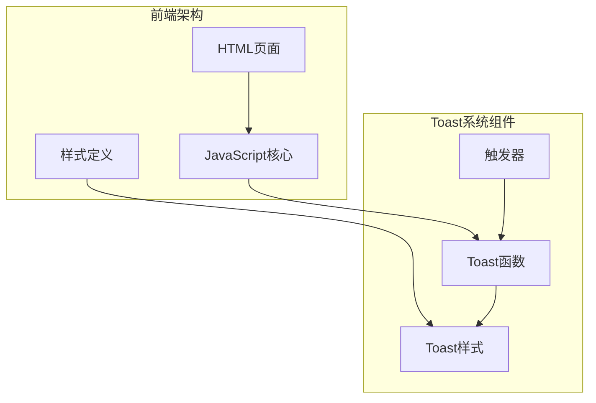
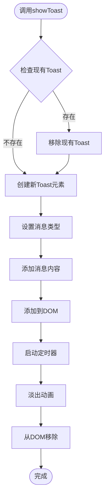
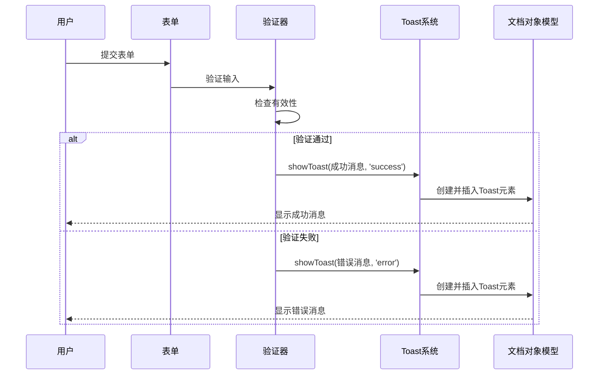
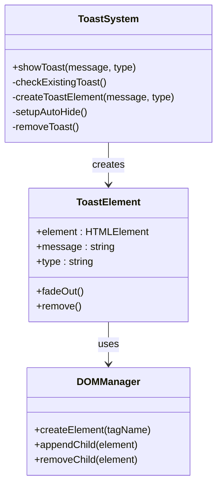
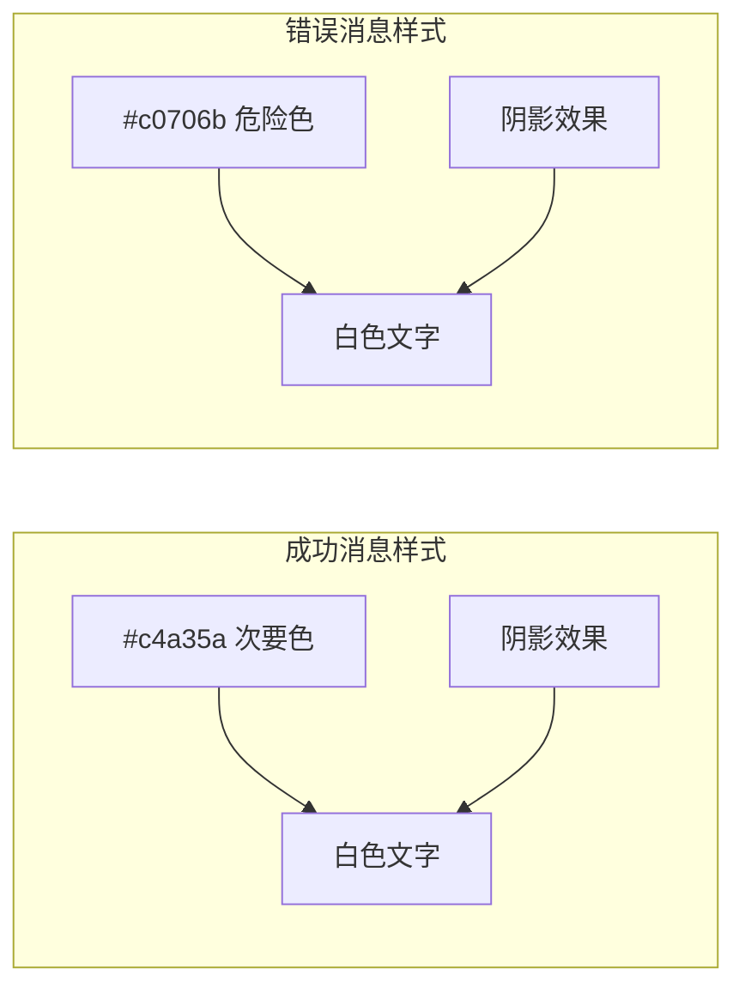
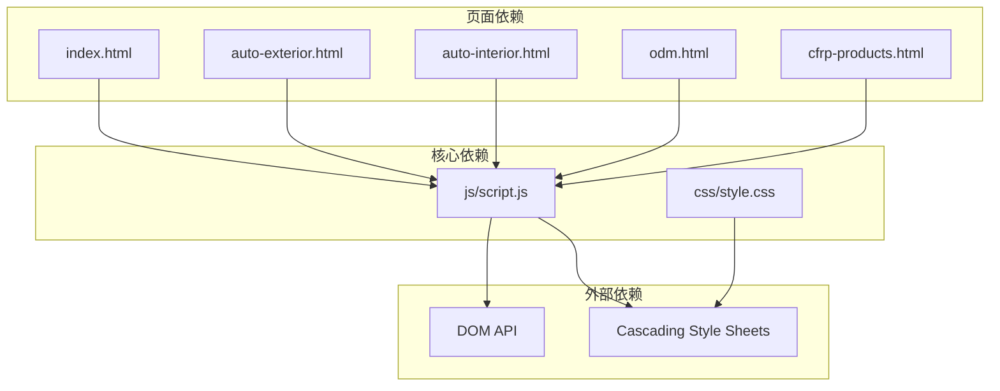

# Toast消息系统

<cite>
**本文档引用的文件**
- [script.js](file://js/script.js)
- [style.css](file://css/style.css)
- [index.html](file://index.html)
- [cfrp-auto-exterior.html](file://cfrp-auto-exterior.html)
- [cfrp-auto-interior.html](file://cfrp-auto-interior.html)
- [cfrp-odm.html](file://cfrp-odm.html)
- [cfrp-products.html](file://cfrp-products.html)
</cite>

## 目录
1. [简介](#简介)
2. [项目结构](#项目结构)
3. [核心组件](#核心组件)
4. [架构概览](#架构概览)
5. [详细组件分析](#详细组件分析)
6. [依赖关系分析](#依赖关系分析)
7. [性能考量](#性能考量)
8. [故障排除指南](#故障排除指南)
9. [结论](#结论)

## 简介

HYT网站的Toast消息系统是一个轻量级的用户反馈组件，用于在页面右上角显示临时性的状态提示信息。该系统实现了消息的创建、显示、自动隐藏和移除的完整生命周期管理，支持成功和错误两种类型的消息样式。

Toast消息系统采用纯JavaScript实现，无需额外的第三方库依赖，通过CSS动画提供流畅的用户体验。系统设计简洁高效，能够在各种页面场景中提供一致的用户反馈体验。

## 项目结构

Toast消息系统在HYT网站中采用模块化设计，分布在多个文件中：

**图表来源**
- [script.js:177-195](file://js/script.js#L177-L195)
- [style.css:1007-1035](file://css/style.css#L1007-L1035)

**章节来源**
- [script.js:1-344](file://js/script.js#L1-L344)
- [style.css:1-1345](file://css/style.css#L1-L1345)

## 核心组件

### Toast消息函数

Toast消息系统的核心是一个名为`showToast`的JavaScript函数，负责整个消息的生命周期管理：

**图表来源**
- [script.js:177-195](file://js/script.js#L177-L195)

### 消息类型系统

系统支持两种消息类型，通过CSS类名进行区分：

| 类型 | CSS类名 | 颜色主题 | 使用场景 |
|------|---------|----------|----------|
| 成功消息 | `.toast.success` | 次要颜色（#c4a35a） | 操作成功、确认信息 |
| 错误消息 | `.toast.error` | 危险颜色（#c0706b） | 表单验证失败、操作错误 |

**章节来源**
- [script.js:177-195](file://js/script.js#L177-L195)
- [style.css:1007-1035](file://css/style.css#L1007-L1035)

## 架构概览

Toast消息系统采用事件驱动的架构模式，通过DOM事件触发消息显示：

**图表来源**
- [script.js:141-175](file://js/script.js#L141-L175)
- [script.js:177-195](file://js/script.js#L177-L195)

## 详细组件分析

### DOM操作策略

Toast系统采用最小化的DOM操作策略，确保性能最优：

#### 元素创建与管理
- 使用`document.createElement`动态创建Toast元素
- 通过`className`属性设置样式类名
- 使用`textContent`设置消息内容
- 通过`appendChild`将元素添加到body末尾

#### 内存管理机制
- 在创建新Toast前检查并移除现有Toast
- 使用`setTimeout`设置自动隐藏定时器
- 通过CSS过渡动画完成后执行DOM移除
- 避免内存泄漏，确保元素被完全清理

**图表来源**
- [script.js:177-195](file://js/script.js#L177-L195)

**章节来源**
- [script.js:177-195](file://js/script.js#L177-L195)

### 样式设计与用户体验

Toast消息的样式设计遵循现代UI设计原则，注重可用性和美观性：

#### 视觉设计特征
- **定位策略**：固定定位，右上角显示，不影响页面布局
- **尺寸规格**：内边距适中，字体大小清晰可读
- **圆角设计**：使用12px圆角，符合整体设计语言
- **阴影效果**：12px阴影增强立体感
- **动画过渡**：0.3秒平滑进入，3秒后淡出

#### 颜色语义系统
- **成功状态**：使用品牌次要色(#c4a35a)，传达积极信息
- **错误状态**：使用危险色(#c0706b)，引起用户注意
- **文本对比**：白色文字确保在各种背景下都有良好对比度

**图表来源**
- [style.css:1007-1035](file://css/style.css#L1007-L1035)

**章节来源**
- [style.css:1007-1035](file://css/style.css#L1007-L1035)

### 自动隐藏机制

Toast系统实现了智能的自动隐藏机制，确保用户体验的流畅性：

#### 时间控制策略
- **显示时长**：消息创建后立即显示，等待3秒
- **隐藏时长**：淡出动画持续0.3秒
- **总生命周期**：约3.3秒，避免干扰用户操作

#### 动画实现细节
- 使用CSS `transform: translateX(100px)` 实现滑入效果
- 通过`opacity`变化实现淡出效果
- 结合`transition`属性确保动画平滑

**章节来源**
- [script.js:189-194](file://js/script.js#L189-L194)
- [style.css:1026-1035](file://css/style.css#L1026-L1035)

## 依赖关系分析

Toast消息系统在整个HYT网站架构中的依赖关系如下：

**图表来源**
- [script.js:1-344](file://js/script.js#L1-L344)
- [style.css:1-1345](file://css/style.css#L1-L1345)

### 触发器分布

Toast消息在不同页面中的触发器分布：

| 页面 | 触发器位置 | 触发条件 |
|------|------------|----------|
| 主页 | 表单提交验证 | 邮箱格式验证失败 |
| 主页 | 表单提交成功 | 数据提交完成 |
| 所有页面 | 任意业务逻辑 | 操作结果反馈 |

**章节来源**
- [script.js:141-175](file://js/script.js#L141-L175)
- [script.js:177-195](file://js/script.js#L177-L195)

## 性能考量

### 内存管理优化

Toast系统采用了多项内存管理策略：

1. **元素复用检查**：每次创建前检查并移除现有Toast
2. **定时器清理**：使用一次性定时器避免内存泄漏
3. **事件监听器管理**：避免为Toast元素绑定不必要的事件监听器
4. **DOM树优化**：仅在必要时修改DOM结构

### 渲染性能优化

- **CSS硬件加速**：使用transform和opacity属性利用GPU加速
- **最小化重绘**：通过CSS动画减少JavaScript计算
- **批量DOM操作**：避免频繁的DOM查询和修改

## 故障排除指南

### 常见问题诊断

#### Toast不显示
1. 检查JavaScript文件是否正确加载
2. 验证CSS样式是否生效
3. 确认DOM中是否存在重复的Toast元素

#### 样式异常
1. 检查CSS变量定义是否正确
2. 验证响应式样式是否按预期工作
3. 确认动画关键帧定义完整

#### 功能失效
1. 检查`showToast`函数是否被正确调用
2. 验证参数传递是否正确
3. 确认定时器是否正常执行

**章节来源**
- [script.js:177-195](file://js/script.js#L177-L195)
- [style.css:1007-1035](file://css/style.css#L1007-L1035)

## 结论

HYT网站的Toast消息系统展现了优秀的前端工程实践，通过简洁高效的代码实现了完整的用户反馈机制。系统具有以下优势：

1. **轻量级设计**：纯JavaScript实现，无第三方依赖
2. **良好的用户体验**：流畅的动画效果和合理的显示时长
3. **可维护性**：清晰的代码结构和注释
4. **可扩展性**：易于添加新的消息类型和样式

该系统为HYT网站提供了统一的用户反馈体验，增强了用户与网站的交互质量。通过合理的架构设计和性能优化，Toast消息系统能够稳定地支持网站的各种业务场景。