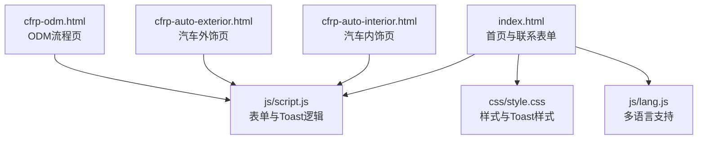
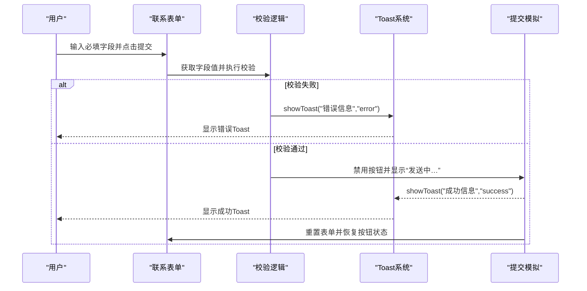
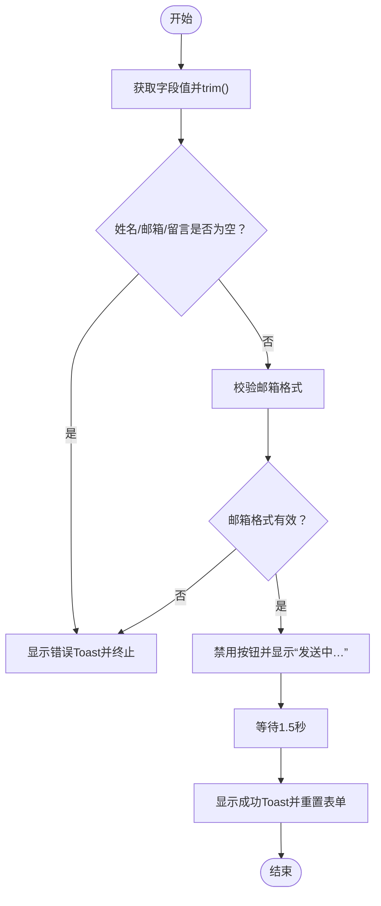
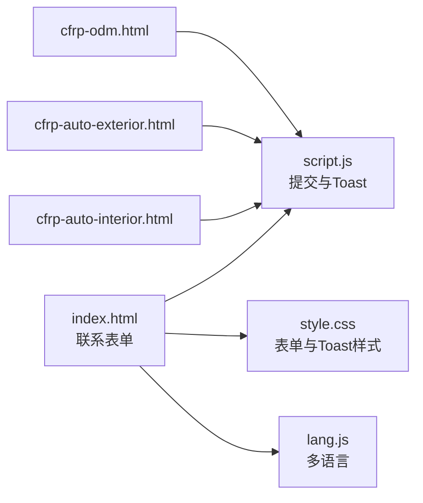

# 表单交互

<cite>
**本文引用的文件列表**
- [index.html](file://index.html)
- [script.js](file://js/script.js)
- [style.css](file://css/style.css)
- [lang.js](file://js/lang.js)
- [cfrp-auto-interior.html](file://cfrp-auto-interior.html)
- [cfrp-auto-exterior.html](file://cfrp-auto-exterior.html)
- [cfrp-odm.html](file://cfrp-odm.html)
</cite>

## 目录
1. [简介](#简介)
2. [项目结构](#项目结构)
3. [核心组件](#核心组件)
4. [架构总览](#架构总览)
5. [详细组件分析](#详细组件分析)
6. [依赖关系分析](#依赖关系分析)
7. [性能考量](#性能考量)
8. [故障排查指南](#故障排查指南)
9. [结论](#结论)
10. [附录](#附录)

## 简介
本文件聚焦于 HYT 网站的“表单交互系统”，围绕联系表单的数据验证与用户输入处理、Toast 消息系统实现与用户体验设计、表单提交处理流程（含验证、错误提示与成功反馈）、以及表单定制与第三方服务集成方案进行系统化技术说明。文档既适合前端开发者，也便于非技术读者理解表单交互的实现与扩展路径。

## 项目结构
该站点采用静态 HTML/CSS/JS 架构，核心交互集中在首页 index.html 的联系表单与全局脚本 js/script.js；多语言支持由 js/lang.js 提供；样式统一由 css/style.css 管理；产品与服务页面作为导航入口与内容承载。

图表来源
- [index.html](file://index.html)
- [script.js](file://js/script.js)
- [style.css](file://css/style.css)
- [lang.js](file://js/lang.js)
- [cfrp-auto-interior.html](file://cfrp-auto-interior.html)
- [cfrp-auto-exterior.html](file://cfrp-auto-exterior.html)
- [cfrp-odm.html](file://cfrp-odm.html)

章节来源
- [index.html](file://index.html)
- [script.js](file://js/script.js)
- [style.css](file://css/style.css)
- [lang.js](file://js/lang.js)

## 核心组件
- 联系表单：位于首页“联系我们”区块，包含姓名、邮箱、主题、留言四个字段，其中姓名、邮箱、留言为必填。
- 表单提交处理器：阻止默认提交，执行客户端校验，模拟提交过程，显示 Toast 反馈。
- Toast 消息系统：动态创建并自动移除的消息提示，支持成功与错误两类样式。
- 多语言支持：通过 I18N 模块更新表单标签、占位符与按钮文案，确保国际化体验一致。

章节来源
- [index.html](file://index.html)
- [script.js](file://js/script.js)
- [style.css](file://css/style.css)
- [lang.js](file://js/lang.js)

## 架构总览
从用户交互到反馈的完整链路如下：

图表来源
- [script.js](file://js/script.js)
- [style.css](file://css/style.css)

## 详细组件分析

### 联系表单设计与实现
- 字段与必填规则
  - 姓名：必填，空格清理后校验。
  - 邮箱：必填，需符合基础邮箱格式。
  - 主题：非必填，允许为空。
  - 留言：必填，空格清理后校验。
- 表单结构
  - 使用语义化表单元素，配合 data-i18n 属性实现国际化文案与占位符。
  - 响应式布局：移动端适配网格与单列排列，保证输入体验。
- 提交处理
  - 阻止默认提交，避免页面刷新。
  - 校验通过后，按钮文本切换为“发送中…”，禁用按钮，模拟异步提交，1.5 秒后恢复并清空表单。

章节来源
- [index.html](file://index.html)
- [script.js](file://js/script.js)
- [style.css](file://css/style.css)

### 数据验证逻辑
- 必填字段校验：对姓名、邮箱、留言进行非空判断（去除首尾空格）。
- 邮箱格式校验：使用基础正则表达式进行格式验证。
- 错误提示策略：
  - 若任一必填字段缺失，立即显示错误 Toast 并中断提交。
  - 若邮箱格式不合法，显示错误 Toast 并中断提交。
- 成功反馈策略：
  - 校验通过后，显示成功 Toast 并清空表单，恢复按钮状态。

图表来源
- [script.js](file://js/script.js)

章节来源
- [script.js](file://js/script.js)

### Toast 消息系统实现与用户体验设计
- 实现原理
  - 动态创建 div 元素，添加类型类名（success/error），插入到 body 尾部。
  - 自动移除：3 秒后触发淡出与平移过渡，300ms 后彻底删除 DOM 节点。
- 样式与定位
  - 固定定位右上角，带阴影与圆角，成功为暖色系，错误为警示色。
  - 进场动画：从右侧滑入，提升可视反馈。
- 用户体验
  - 无侵入：同一时刻仅保留一个 Toast，避免叠加。
  - 即时反馈：错误与成功分别对应不同颜色与延迟，强化感知。
  - 不打断操作：Toast 自动消失，无需手动关闭。

章节来源
- [script.js](file://js/script.js)
- [style.css](file://css/style.css)

### 表单提交处理流程详解
- 触发时机：监听表单 submit 事件。
- 处理步骤：
  1) 阻止默认提交。
  2) 读取并清洗字段值。
  3) 执行必填与邮箱格式校验。
  4) 校验失败：显示错误 Toast，终止流程。
  5) 校验通过：按钮状态切换为“发送中…”，禁用按钮。
  6) 模拟提交：1.5 秒后显示成功 Toast，重置表单，恢复按钮状态。
- 与多语言的协作
  - 表单标签与占位符由 I18N 模块统一管理，提交逻辑不直接依赖文案，保证一致性。

章节来源
- [script.js](file://js/script.js)
- [lang.js](file://js/lang.js)

### 多语言支持与表单文案联动
- I18N 模块职责
  - 维护当前语言与翻译键值映射。
  - 更新页面中带有 data-i18n 与 data-i18n-ph 的元素。
  - 提供语言切换按钮与本地存储持久化。
- 与表单的关联
  - 联系表单的标签与占位符均通过 data-i18n 与 data-i18n-ph 注入，提交逻辑不直接读取文案，降低耦合。
- 切换机制
  - 点击语言切换按钮，切换 zh-CN 与 ja-JP，自动更新页面文案与按钮文本。

章节来源
- [lang.js](file://js/lang.js)
- [index.html](file://index.html)

### 交互式流程图与表单的关系
- 交互式流程图存在于产品与服务页面（如 ODM 页），用于展示业务流程与工艺流程，与联系表单无直接交互。
- 但其拖拽排序与激活态样式可借鉴到表单定制场景（例如将“主题”字段拖拽到更显眼位置）。

章节来源
- [cfrp-odm.html](file://cfrp-odm.html)
- [script.js](file://js/script.js)

## 依赖关系分析
- 联系表单依赖
  - HTML 结构：表单元素与容器。
  - JS：表单提交监听、校验逻辑、Toast 调用。
  - CSS：表单样式与 Toast 样式。
  - I18N：表单标签与占位符国际化。
- 间接依赖
  - 产品与服务页面引入相同脚本与样式，保持一致的交互体验。

图表来源
- [index.html](file://index.html)
- [script.js](file://js/script.js)
- [style.css](file://css/style.css)
- [lang.js](file://js/lang.js)
- [cfrp-auto-interior.html](file://cfrp-auto-interior.html)
- [cfrp-auto-exterior.html](file://cfrp-auto-exterior.html)
- [cfrp-odm.html](file://cfrp-odm.html)

章节来源
- [index.html](file://index.html)
- [script.js](file://js/script.js)
- [style.css](file://css/style.css)
- [lang.js](file://js/lang.js)

## 性能考量
- 客户端校验
  - 使用基础正则与字符串方法，复杂度低，开销极小。
- DOM 操作
  - Toast 创建与移除均为一次性操作，避免频繁重排。
- 动画与过渡
  - 采用 CSS 动画与过渡，由浏览器硬件加速渲染，性能稳定。
- 响应式与交互
  - 表单与 Toast 在移动端表现良好，无额外脚本开销。

## 故障排查指南
- 表单无法提交
  - 检查浏览器控制台是否存在脚本报错。
  - 确认表单元素 ID 与脚本中的选择器一致。
- 邮箱校验失败
  - 确认邮箱格式符合基础正则要求（不含空格与非法字符）。
- Toast 不显示或不消失
  - 检查样式中 Toast 类是否被覆盖。
  - 确认未在同一时间创建多个 Toast（脚本会自动移除旧的，但样式冲突可能导致视觉异常）。
- 多语言文案未更新
  - 检查 I18N 初始化是否执行（DOM 加载完成后）。
  - 确认 data-i18n 与 data-i18n-ph 属性是否正确设置。

章节来源
- [script.js](file://js/script.js)
- [style.css](file://css/style.css)
- [lang.js](file://js/lang.js)

## 结论
HYT 网站的表单交互系统以简洁稳健的方式实现了“必填校验 + 邮箱格式校验 + Toast 反馈”的闭环，结合多语言模块与响应式样式，提供了良好的跨语言与跨设备体验。通过本文档的分析与建议，开发者可在不破坏现有架构的前提下，安全地扩展表单字段、增强校验规则、接入第三方服务或替换反馈方式。

## 附录

### 表单定制指南
- 新增字段
  - 在 HTML 中添加新的 input/textarea，并设置 required（如需）与 data-i18n 与 data-i18n-ph。
  - 在脚本中读取新字段值并加入校验逻辑。
- 修改校验规则
  - 在校验分支中增加条件判断，如长度限制、正则匹配等。
- 改变反馈样式
  - 通过 Toast 类型（success/error）或自定义类名扩展样式。
- 交互优化
  - 可在提交前增加输入提示（如实时字数统计），提升用户体验。

章节来源
- [index.html](file://index.html)
- [script.js](file://js/script.js)
- [style.css](file://css/style.css)

### 第三方服务集成方案
- 服务端对接
  - 将模拟提交替换为实际 AJAX 请求，将清洗后的字段值作为 payload 发送到后端接口。
  - 在请求成功回调中显示成功 Toast，在失败回调中显示错误 Toast。
- 验证服务
  - 可接入邮箱验证服务（如验证域名校验、防垃圾邮件检测）。
- 分析与监控
  - 在提交成功后上报事件，记录来源、字段摘要与时间戳，便于后续分析。
- 安全加固
  - 增加 CSRF Token、内容安全策略（CSP）与速率限制，防止滥用。

章节来源
- [script.js](file://js/script.js)