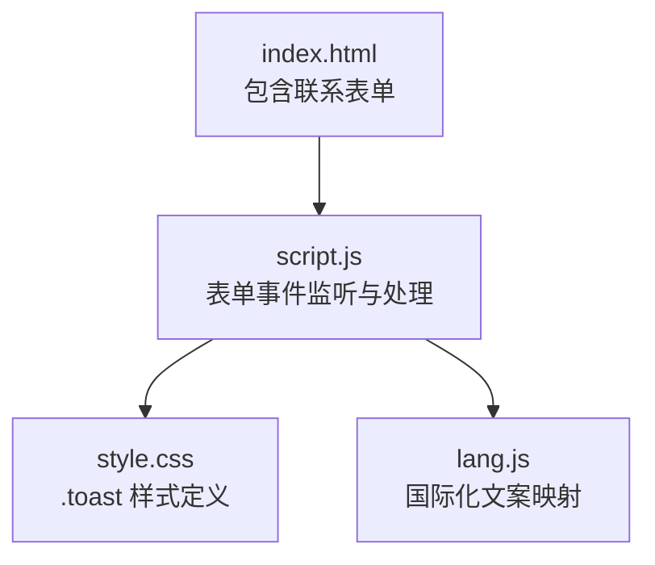
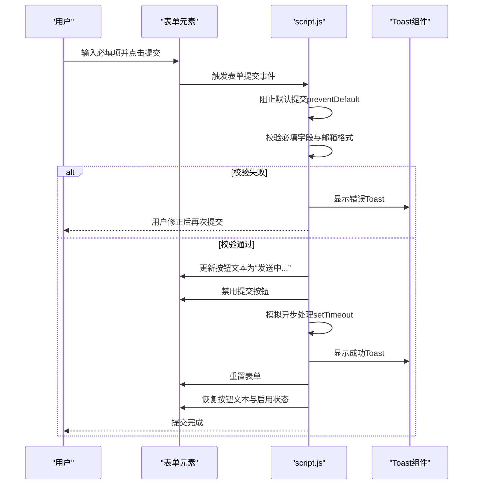
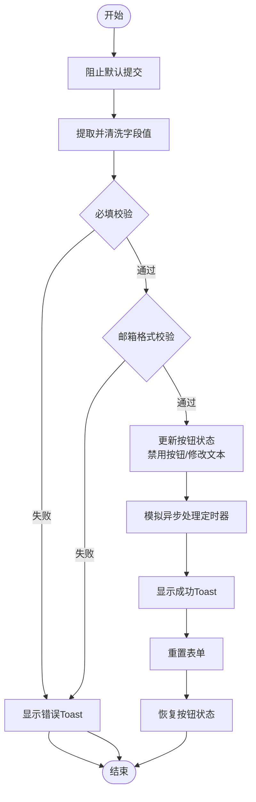
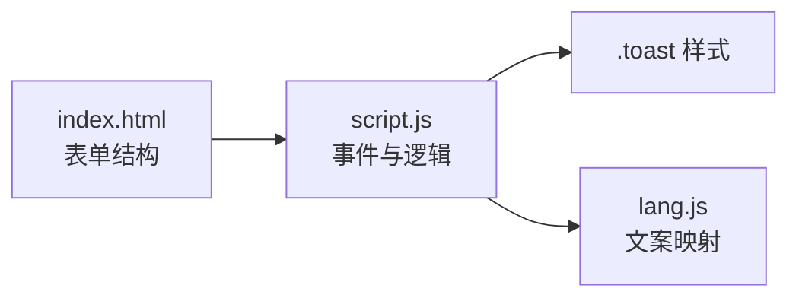

# 表单提交处理

<cite>
**本文引用的文件列表**
- [index.html](file://index.html)
- [script.js](file://js/script.js)
- [style.css](file://css/style.css)
- [lang.js](file://js/lang.js)
</cite>

## 目录
1. [简介](#简介)
2. [项目结构](#项目结构)
3. [核心组件](#核心组件)
4. [架构总览](#架构总览)
5. [组件详解](#组件详解)
6. [依赖关系分析](#依赖关系分析)
7. [性能考量](#性能考量)
8. [故障排查指南](#故障排查指南)
9. [结论](#结论)

## 简介
本文件聚焦 HYT 网站“联系我们”表单的前端提交处理系统，围绕以下目标展开：
- 解析表单提交的完整流程：从用户输入到验证、模拟提交、加载状态管理、成功反馈与表单重置。
- 说明当前实现中的防重复提交策略、异步模拟处理与用户体验优化。
- 给出可扩展到真实后端的实现建议，包括状态管理、错误恢复与可访问性增强。

## 项目结构
该网站采用静态 HTML + JavaScript + CSS 架构，表单位于首页的“联系我们”区块，提交处理逻辑集中在单页脚本中，UI 反馈通过 Toast 组件实现。

图表来源
- [index.html](file://index.html)
- [script.js](file://js/script.js)
- [style.css](file://css/style.css)
- [lang.js](file://js/lang.js)

章节来源
- [index.html](file://index.html)
- [script.js](file://js/script.js)
- [style.css](file://css/style.css)
- [lang.js](file://js/lang.js)

## 核心组件
- 表单容器与字段：位于“联系我们”区块，包含姓名、邮箱、主题、留言与提交按钮。
- 提交处理器：监听表单提交事件，执行本地校验、模拟提交、状态更新与反馈提示。
- Toast 通知：动态创建并展示成功或错误信息，自动隐藏。
- 样式与交互：通过 CSS 控制 Toast 动画与布局；通过 JS 控制按钮文本与禁用状态。

章节来源
- [index.html](file://index.html)
- [script.js](file://js/script.js)
- [style.css](file://css/style.css)

## 架构总览
表单提交处理的前端架构由“视图层（HTML/CSS）+ 业务逻辑层（JavaScript）+ 交互反馈层（Toast）”构成，整体流程如下：

图表来源
- [script.js](file://js/script.js)
- [style.css](file://css/style.css)

## 组件详解

### 表单提交处理流程
- 事件绑定：为“contactForm”注册提交事件监听器。
- 阻止默认行为：调用事件阻止默认提交，避免页面刷新。
- 字段提取与清洗：获取姓名、邮箱、留言并去除首尾空格。
- 必填校验：任一必填字段为空则弹出错误提示并终止提交。
- 邮箱格式校验：使用正则表达式验证邮箱格式。
- 加载状态管理：记录原始按钮文本，替换为“发送中...”，并将按钮设为禁用。
- 模拟异步处理：使用定时器模拟后台处理耗时。
- 成功反馈与重置：显示成功 Toast，重置表单，恢复按钮文本与可用状态。

图表来源
- [script.js](file://js/script.js)

章节来源
- [script.js](file://js/script.js)

### 防重复提交策略
- 当前实现通过“禁用提交按钮”防止重复点击，按钮被禁用期间无法再次触发提交。
- 优点：简单可靠，无需额外状态锁。
- 局限：未对多标签页或跨窗口场景做全局去重；若用户刷新页面，仍可重新提交。

章节来源
- [script.js](file://js/script.js)

### 加载状态管理
- 文本切换：在提交过程中将按钮文本替换为“发送中...”，直观提示用户。
- 禁用交互：按钮禁用避免二次提交。
- 恢复机制：异步完成后恢复按钮文本与可用状态，确保后续操作可用。

章节来源
- [script.js](file://js/script.js)

### 成功反馈与表单重置
- 成功提示：通过 Toast 组件显示成功消息，自动隐藏。
- 表单重置：提交成功后调用表单重置方法清空输入。
- 状态恢复：恢复按钮文本与可用状态，保证用户体验连贯。

章节来源
- [script.js](file://js/script.js)
- [style.css](file://css/style.css)

### 异步处理与模拟提交
- 当前采用定时器模拟异步处理，便于演示与测试。
- 实际部署建议替换为真正的异步请求（如 fetch 或 XMLHttpRequest），并在请求前后分别管理加载状态与结果反馈。

章节来源
- [script.js](file://js/script.js)

### 错误恢复与可访问性
- 错误提示：通过 Toast 展示错误信息，用户可立即感知问题并修正。
- 可访问性：当前未见 ARIA 属性或键盘快捷键支持；建议增加 aria-live、aria-invalid 等属性以提升可访问性。

章节来源
- [script.js](file://js/script.js)
- [style.css](file://css/style.css)

## 依赖关系分析
- 表单依赖：表单元素 ID 与字段名称在 HTML 中定义，JS 通过 ID 获取并进行校验与处理。
- 样式依赖：Toast 的显示与动画由 CSS 控制，JS 仅负责插入 DOM 与移除。
- 国际化依赖：文案通过语言模块映射，JS 在 Toast 中直接使用对应键值。

图表来源
- [index.html](file://index.html)
- [script.js](file://js/script.js)
- [style.css](file://css/style.css)
- [lang.js](file://js/lang.js)

章节来源
- [index.html](file://index.html)
- [script.js](file://js/script.js)
- [style.css](file://css/style.css)
- [lang.js](file://js/lang.js)

## 性能考量
- 事件绑定：仅在表单存在时绑定监听器，避免不必要的开销。
- DOM 查询：通过 ID 获取元素，查询成本低；建议缓存常用节点以减少重复查询。
- 动画与过渡：Toast 使用 CSS 过渡，性能良好；注意避免在同一帧内大量 DOM 插入/删除。
- 校验复杂度：正则与字符串比较均为 O(n)，对小规模输入影响可忽略。

## 故障排查指南
- 表单未响应提交
  - 检查是否存在“contactForm”元素；确认脚本已正确加载。
  - 章节来源
    - [index.html](file://index.html)
    - [script.js](file://js/script.js)
- 校验总是失败
  - 确认必填字段是否为空；检查邮箱格式正则是否符合预期。
  - 章节来源
    - [script.js](file://js/script.js)
- Toast 不显示或不消失
  - 检查样式类名与动画定义；确认未被其他样式覆盖。
  - 章节来源
    - [style.css](file://css/style.css)
- 按钮状态异常
  - 确认按钮文本与禁用状态在异步完成后被正确恢复。
  - 章节来源
    - [script.js](file://js/script.js)

## 结论
当前表单提交处理实现了基本的前端校验、加载状态管理与成功反馈，具备良好的用户体验与可维护性。为进一步增强可靠性与可扩展性，建议：
- 替换模拟异步为真实后端请求，统一状态管理与错误处理。
- 增加全局防重复提交策略（如令牌或去重队列）。
- 引入可访问性增强（ARIA、键盘导航）。
- 将 Toast 抽象为可复用组件，支持多类型提示与自定义配置。