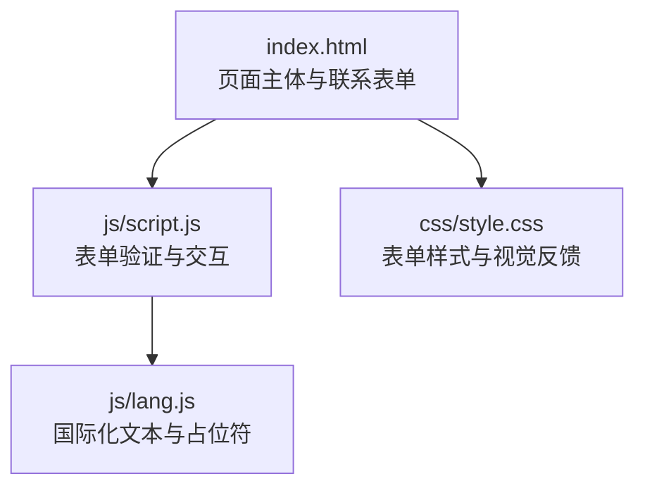
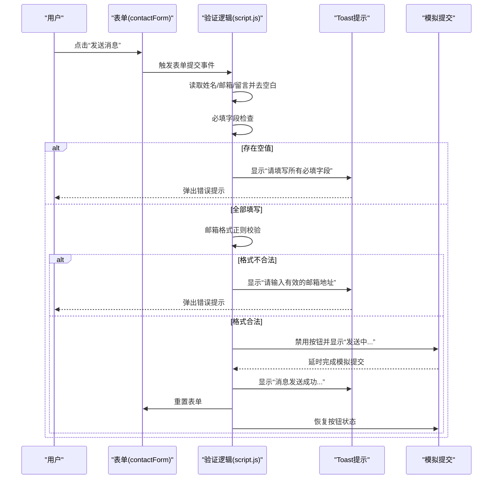
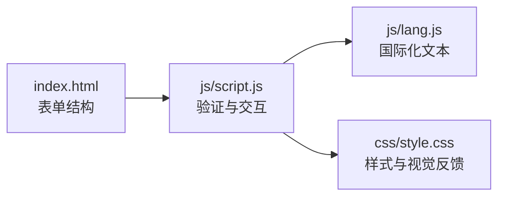

# 表单验证逻辑

<cite>
**本文引用的文件列表**
- [index.html](file://index.html)
- [script.js](file://js/script.js)
- [style.css](file://css/style.css)
- [lang.js](file://js/lang.js)
</cite>

## 目录
1. [简介](#简介)
2. [项目结构](#项目结构)
3. [核心组件](#核心组件)
4. [架构总览](#架构总览)
5. [详细组件分析](#详细组件分析)
6. [依赖关系分析](#依赖关系分析)
7. [性能考量](#性能考量)
8. [故障排查指南](#故障排查指南)
9. [结论](#结论)

## 简介
本文件聚焦于HYT网站“联系我们”区域的表单验证系统，围绕联系表单的数据验证实现进行深入解析，包括必填字段检查、邮箱格式验证等核心验证逻辑；详细说明验证规则的设计原理与实现细节，解释正则表达式的使用与验证时机；并提供验证失败的错误处理机制与用户反馈策略，帮助开发者理解与扩展该表单验证功能。

## 项目结构
该项目采用静态站点结构，前端由HTML、CSS与JavaScript组成：
- 页面主体：index.html
- 样式：css/style.css
- 功能脚本：js/script.js（包含表单验证、提示消息等）
- 国际化：js/lang.js（多语言支持）

图表来源
- [index.html](file://index.html)
- [script.js](file://js/script.js)
- [style.css](file://css/style.css)
- [lang.js](file://js/lang.js)

章节来源
- [index.html](file://index.html)
- [script.js](file://js/script.js)
- [style.css](file://css/style.css)
- [lang.js](file://js/lang.js)

## 核心组件
- 联系表单元素：包含姓名、邮箱、主题、留言四个输入项，其中姓名、邮箱、留言为必填字段。
- 表单提交处理器：监听表单提交事件，执行客户端验证与模拟提交。
- 验证规则：
  - 必填字段检查：对姓名、邮箱、留言进行非空校验。
  - 邮箱格式验证：使用正则表达式进行基础格式校验。
- 错误处理与用户反馈：通过Toast消息提示错误或成功信息，并在提交过程中禁用按钮与更新文案。

章节来源
- [index.html](file://index.html)
- [script.js](file://js/script.js)

## 架构总览
下图展示了从用户提交到验证与反馈的整体流程：

图表来源
- [script.js](file://js/script.js)
- [index.html](file://index.html)

## 详细组件分析

### 联系表单结构与必填字段
- 表单容器与布局：表单位于“联系我们”区块内，采用网格布局组织输入项。
- 必填字段：
  - 姓名：文本输入框，标记为必填。
  - 邮箱：email类型输入框，标记为必填。
  - 留言：多行文本域，标记为必填。
- 主题字段：非必填，可为空。

章节来源
- [index.html](file://index.html)

### 验证规则与实现细节
- 必填字段检查：
  - 在提交事件中读取各字段值并去除首尾空白后判断是否为空。
  - 若任一必填字段为空，则调用Toast提示错误并中断提交。
- 邮箱格式验证：
  - 使用正则表达式对邮箱字符串进行基础格式校验，确保包含“@”与“.”且不含空白字符。
  - 若格式不合法，则提示错误并中断提交。
- 提交过程与用户体验：
  - 成功通过验证后，按钮文案切换为“发送中...”，并禁用按钮防止重复提交。
  - 模拟提交完成后，显示成功提示，重置表单并恢复按钮状态。

章节来源
- [script.js](file://js/script.js)

### 正则表达式设计原理与使用
- 正则模式：用于匹配基本邮箱格式，要求用户名与域名部分均不包含空白字符，且包含一个“.”作为分隔。
- 设计权衡：
  - 优点：实现简洁、性能开销低、覆盖常见非法字符场景。
  - 局限性：无法覆盖复杂的RFC标准邮箱格式，如特殊字符、国际化域名等。
- 建议扩展：
  - 对于严格场景，可考虑更严格的正则或引入专用邮箱验证库。
  - 或在服务端补充二次校验，以兼顾性能与准确性。

章节来源
- [script.js](file://js/script.js)

### 用户反馈与错误处理机制
- Toast提示：
  - 统一的消息展示组件，支持成功与错误两类提示。
  - 自动移除上一条提示，避免叠加。
  - 自动隐藏：显示一段时间后淡出并移除DOM节点。
- 表单状态管理：
  - 提交中禁用按钮并变更文案，提升交互明确性。
  - 成功后自动清空表单，便于再次提交。

章节来源
- [script.js](file://js/script.js)

### 样式与视觉反馈
- 表单输入框在获得焦点时具有高亮边框与阴影，增强可用性。
- 联系表单区域具备背景、阴影与边框，保证在页面中的突出度。

章节来源
- [style.css](file://css/style.css)

### 国际化与本地化
- 多语言支持：通过lang.js维护键值映射，动态更新页面文本与占位符。
- 表单标签与占位符：使用data-i18n与data-i18n-ph属性，结合lang.js在运行时注入对应语言文本。
- 语言切换：提供语言切换按钮，保存用户选择并刷新页面文本。

章节来源
- [lang.js](file://js/lang.js)
- [index.html](file://index.html)

## 依赖关系分析
- 表单验证依赖于：
  - DOM元素：表单与输入控件的ID与类名。
  - 样式：表单与输入框的视觉状态（如焦点态）。
  - 国际化：lang.js提供的文本与占位符数据。
- 交互链路：
  - 用户操作触发事件 -> 事件处理器读取输入 -> 执行验证 -> 条件分支处理 -> 更新UI与提示 -> 恢复状态。

图表来源
- [index.html](file://index.html)
- [script.js](file://js/script.js)
- [style.css](file://css/style.css)
- [lang.js](file://js/lang.js)

章节来源
- [index.html](file://index.html)
- [script.js](file://js/script.js)
- [style.css](file://css/style.css)
- [lang.js](file://js/lang.js)

## 性能考量
- 验证复杂度：均为O(1)，仅做字符串长度与正则匹配，性能开销极小。
- DOM访问频率：仅在提交时读取必要字段，避免高频查询。
- 用户体验：按钮禁用与文案切换减少无效点击，降低服务端压力。
- 建议优化：
  - 可在输入框失焦时进行即时校验，减少重复提交。
  - 将正则编译为常量，避免重复构造。

## 故障排查指南
- 常见问题与定位：
  - 提交按钮无响应：检查表单ID与事件绑定是否存在；确认script.js已加载。
  - 邮箱提示持续出现：确认输入中未包含空白字符或特殊字符；尝试简化邮箱地址。
  - 文本未按预期显示：检查lang.js的语言键值与data-i18n属性是否匹配。
- 排查步骤：
  - 打开浏览器开发者工具，查看控制台是否有错误。
  - 在Network面板确认无资源加载失败。
  - 在Elements面板确认表单元素存在且ID正确。
- 修复建议：
  - 如需更严格的邮箱校验，可在现有基础上增加更严格的正则或引入第三方库。
  - 如需实时校验，可在输入事件中添加轻量校验逻辑并在UI上即时反馈。

章节来源
- [script.js](file://js/script.js)
- [index.html](file://index.html)
- [lang.js](file://js/lang.js)

## 结论
本表单验证系统以简洁高效的客户端逻辑为核心，实现了必填字段与邮箱格式的基础校验，并通过Toast提示与按钮状态变化提供了良好的用户体验。其设计遵循“先本地、再服务端”的验证理念，既保证了性能，又为后续扩展（如更严格的邮箱校验、实时校验与国际化）预留了空间。建议在保持现有优势的基础上，逐步引入更完善的校验策略与交互细节，以进一步提升可靠性与易用性。