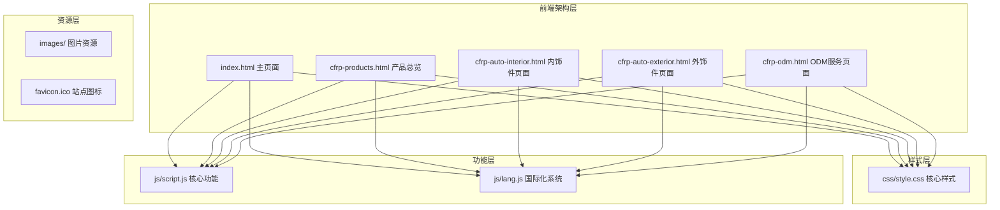
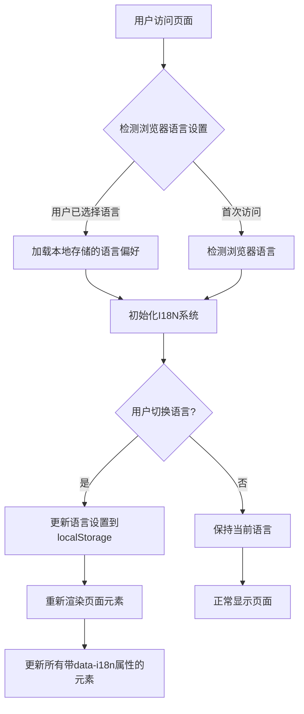
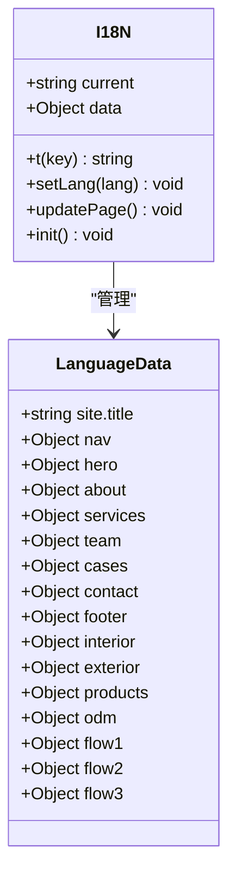
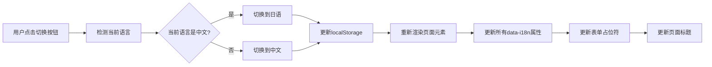
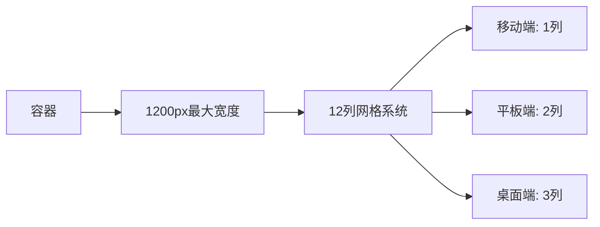
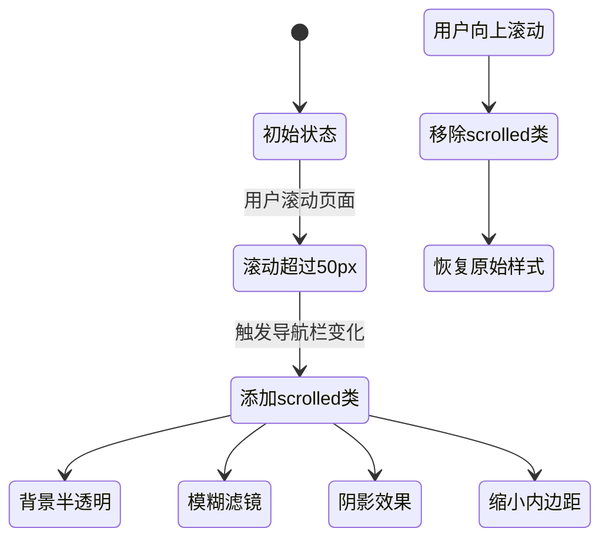

# 项目概述

<cite>
**本文档引用的文件**
- [index.html](file://index.html)
- [cfrp-products.html](file://cfrp-products.html)
- [cfrp-auto-interior.html](file://cfrp-auto-interior.html)
- [cfrp-auto-exterior.html](file://cfrp-auto-exterior.html)
- [cfrp-odm.html](file://cfrp-odm.html)
- [css/style.css](file://css/style.css)
- [js/script.js](file://js/script.js)
- [js/lang.js](file://js/lang.js)
</cite>

## 目录
1. [项目简介](#项目简介)
2. [项目架构](#项目架构)
3. [核心功能特性](#核心功能特性)
4. [技术实现亮点](#技术实现亮点)
5. [国际化支持](#国际化支持)
6. [响应式设计](#响应式设计)
7. [现代化动画效果](#现代化动画效果)
8. [业务价值分析](#业务价值分析)
9. [使用场景示例](#使用场景示例)
10. [总结](#总结)

## 项目简介

HYT复合材料轻量化解决方案网站项目是一个专为和野贸易（广州）有限公司打造的专业企业官网。该项目专注于展示基于碳纤维（CFRP）和玻璃纤维（GFRP）等先进复合材料的轻量化产品与解决方案，服务于汽车、航空航天、交通轨道、医疗器械等多个高科技行业领域。

项目的核心使命是通过创新的复合材料技术，为各行业提供轻量化整体解决方案，帮助客户实现产品性能提升、成本优化和可持续发展。项目自2022年4月启动CFRP/GFRP产品事业，于2025年1月正式成立公司，现已发展成为该领域的专业服务商。

## 项目架构

### 整体架构设计

该项目采用纯原生前端架构，完全基于HTML5、CSS3和JavaScript构建，无需任何后端依赖或第三方框架。整个项目结构简洁明了，包含以下核心组件：



**图表来源**
- [index.html:1-337](file://index.html#L1-L337)
- [css/style.css:1-800](file://css/style.css#L1-L800)
- [js/script.js:1-344](file://js/script.js#L1-L344)
- [js/lang.js:1-472](file://js/lang.js#L1-L472)

### 页面组织结构

项目采用多页面架构，每个功能模块都有独立的页面：

- **主页** (`index.html`): 展示公司概况、服务介绍、合作伙伴和联系方式
- **产品总览** (`cfrp-products.html`): 展示碳纤维制品的整体产品线
- **汽车内饰件** (`cfrp-auto-interior.html`): 详细展示碳纤维内饰件产品
- **汽车外饰件** (`cfrp-auto-exterior.html`): 展示碳纤维外饰件产品
- **ODM服务** (`cfrp-odm.html`): 展示产品开发ODM服务流程

**章节来源**
- [index.html:1-337](file://index.html#L1-L337)
- [cfrp-products.html:1-97](file://cfrp-products.html#L1-L97)
- [cfrp-auto-interior.html:1-196](file://cfrp-auto-interior.html#L1-L196)
- [cfrp-auto-exterior.html:1-98](file://cfrp-auto-exterior.html#L1-L98)
- [cfrp-odm.html:1-191](file://cfrp-odm.html#L1-L191)

## 核心功能特性

### 1. 多语言国际化支持

项目实现了完整的双语支持系统，支持简体中文（zh-CN）和日语（ja-JP）两种语言：



**图表来源**
- [js/lang.js:401-472](file://js/lang.js#L401-L472)

### 2. 响应式布局设计

项目采用移动优先的设计理念，支持从手机到桌面电脑的完整响应式体验：

- **移动端优化**: 使用媒体查询适配不同屏幕尺寸
- **触摸友好**: 导航菜单支持移动端手势操作
- **图片自适应**: 所有图片自动适配容器宽度

### 3. 交互式用户体验

项目提供了丰富的交互功能：

- **平滑滚动**: 支持页面内平滑跳转
- **动态导航**: 滚动时自动高亮当前导航项
- **表单验证**: 完整的客户端表单验证
- **Toast通知**: 友好的用户反馈系统

**章节来源**
- [js/script.js:197-211](file://js/script.js#L197-L211)
- [js/script.js:141-175](file://js/script.js#L141-L175)
- [js/script.js:177-195](file://js/script.js#L177-L195)

## 技术实现亮点

### 1. 纯原生前端技术栈

项目完全基于原生Web技术构建，具有以下优势：

- **零依赖**: 不依赖任何第三方框架或库
- **高性能**: 减少不必要的包体积和加载时间
- **稳定性**: 避免框架版本升级带来的兼容性问题
- **可控性强**: 完全掌握代码逻辑和性能优化

### 2. 创新的动画系统

项目实现了多种现代化动画效果：

```mermaid
sequenceDiagram
participant P as 页面加载
participant N as 导航栏
participant H as 首页横幅
participant A as 内容区域
P->>N : 初始化导航栏
P->>H : 创建粒子背景
P->>A : 设置滚动监听
P->>A : 初始化数字动画
P->>A : 设置滚动触发动画
Note over N,H,A : 所有动画均使用原生CSS和JavaScript实现
```

**图表来源**
- [js/script.js:54-79](file://js/script.js#L54-L79)
- [js/script.js:81-115](file://js/script.js#L81-L115)
- [js/script.js:117-139](file://js/script.js#L117-L139)

### 3. 模块化代码组织

项目采用模块化设计，将不同功能分离到独立的JavaScript函数中：

- **导航管理**: 处理导航栏的滚动效果和移动端菜单
- **动画系统**: 管理各种页面动画效果
- **表单处理**: 处理联系表单的验证和提交
- **国际化**: 管理多语言切换和文本渲染

**章节来源**
- [js/script.js:1-344](file://js/script.js#L1-L344)
- [js/lang.js:1-472](file://js/lang.js#L1-L472)

## 国际化支持

### 语言数据结构

项目采用键值对的形式管理多语言内容，支持动态切换：



**图表来源**
- [js/lang.js:5-472](file://js/lang.js#L5-L472)

### 支持的语言版本

项目目前支持两种语言版本：

- **简体中文 (zh-CN)**: 默认语言，覆盖所有功能模块
- **日语 (ja-JP)**: 完整翻译版本，适用于日本市场

### 动态语言切换机制



**图表来源**
- [js/lang.js:456-462](file://js/lang.js#L456-L462)
- [js/lang.js:364-399](file://js/lang.js#L364-L399)

**章节来源**
- [js/lang.js:1-472](file://js/lang.js#L1-L472)

## 响应式设计

### 设计原则

项目遵循移动优先的设计原则，确保在各种设备上都能提供优秀的用户体验：

- **弹性布局**: 使用CSS Grid和Flexbox实现灵活的布局
- **媒体查询**: 针对不同断点提供专门的样式
- **触摸优化**: 为移动设备优化交互元素大小和间距

### 响应式断点

项目采用以下主要断点：

- **移动端**: 最大宽度768px
- **平板端**: 769px - 1024px  
- **桌面端**: 最小宽度1025px

### 栅格系统

项目使用CSS Grid实现响应式网格布局：



**图表来源**
- [css/style.css:46-50](file://css/style.css#L46-L50)
- [css/style.css:489-496](file://css/style.css#L489-L496)

**章节来源**
- [css/style.css:1-800](file://css/style.css#L1-L800)

## 现代化动画效果

### 粒子背景系统

项目实现了动态粒子背景效果，增强视觉吸引力：

```mermaid
flowchart TD
A[页面加载] --> B[创建粒子容器]
B --> C[生成50个随机粒子]
C --> D[设置随机大小 (2-6px)]
D --> E[设置随机位置 (0-100%)]
E --> F[设置随机动画时长 (8-18秒)]
F --> G[设置随机延迟 (0-10秒)]
G --> H[启动无限循环动画]
H --> I[粒子从底部上升到顶部]
I --> J[透明度从0到1再到0]
```

**图表来源**
- [js/script.js:55-79](file://js/script.js#L55-L79)

### 滚动触发动画

项目实现了智能的滚动触发动画系统：

- **数字递增动画**: 使用requestAnimationFrame实现流畅的数字变化
- **渐显动画**: 元素进入视口时触发淡入效果
- **卡片悬停效果**: 提供丰富的交互反馈

### 导航栏动画



**图表来源**
- [js/script.js:4-10](file://js/script.js#L4-L10)
- [css/style.css:78-83](file://css/style.css#L78-L83)

**章节来源**
- [js/script.js:1-344](file://js/script.js#L1-L344)
- [css/style.css:1-800](file://css/style.css#L1-L800)

## 业务价值分析

### 目标受众定位

项目主要服务于以下目标群体：

- **B2B客户**: 汽车制造商、航空航天企业、轨道交通公司
- **OEM厂商**: 需要轻量化解决方案的原始设备制造商
- **设计工程师**: 寻求创新材料解决方案的工程师团队
- **采购决策者**: 负责材料采购的技术负责人

### 解决的核心问题

1. **产品轻量化**: 通过复合材料技术实现产品减重
2. **性能提升**: 在保持强度的同时提高性能表现
3. **成本优化**: 通过标准化和规模化生产降低成本
4. **交付周期**: 提供快速的样品制作和批量生产能力

### 技术差异化优势

- **材料专长**: 专注于CFRP和GFRP等高性能复合材料
- **工艺成熟**: 拥有热压罐成型、模压成型等成熟工艺
- **定制能力**: 支持复杂形状和特殊要求的定制化生产
- **质量保证**: 建立完善的质量管理体系和检测标准

## 使用场景示例

### 场景一：汽车轻量化应用

**应用场景**: 新能源汽车电池包外壳


**预期效果**:
- 电池包外壳减重40%
- 提升防护等级和安全性能
- 降低整体车辆重量，提升续航里程

### 场景二：航空航天部件

**应用场景**: 无人机机身结构件

**技术参数**:
- 材料: 全碳纤维复合材料
- 减重效果: 35%以上
- 性能提升: 续航时间增加25%
- 成本控制: 通过标准化生产实现规模效应

### 场景三：体育器材应用

**应用场景**: 高端自行车车架

**产品特点**:
- 整车重量控制在6.8kg以内
- 采用一体式全碳纤维设计
- 极致轻量化与优异性能的平衡
- 满足赛道和日常使用的双重需求

## 总结

HYT复合材料轻量化解决方案网站项目是一个技术精湛、设计优秀的纯原生前端项目。项目通过创新的技术架构和设计理念，成功地为复合材料行业提供了一个专业、现代且功能完备的数字化展示平台。

### 主要成就

1. **技术创新**: 采用纯原生技术栈，展现了现代Web开发的最佳实践
2. **用户体验**: 实现了丰富的交互效果和流畅的用户体验
3. **国际化能力**: 提供完整的多语言支持，具备全球化扩展潜力
4. **响应式设计**: 在各种设备上都能提供优质的浏览体验
5. **业务价值**: 有效支撑了公司的业务推广和技术展示需求

### 技术特色

- **无框架依赖**: 完全基于原生Web技术，确保稳定性和可控性
- **现代化动画**: 运用CSS3和JavaScript实现流畅的视觉效果
- **智能交互**: 通过JavaScript实现丰富的用户交互功能
- **性能优化**: 注重加载速度和运行效率的优化
- **可维护性**: 清晰的代码结构和模块化设计便于后续维护

该项目不仅为和野贸易提供了专业的数字化形象，也为复合材料行业的网站开发树立了技术标杆，展示了纯原生前端技术的强大能力和无限可能。